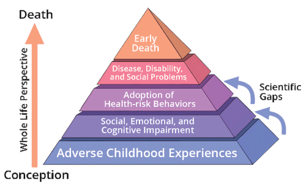
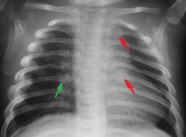

# VIOLÊNCIA E ABUSO INFANTIL

Abordar a violência contra crianças e adolescentes exige que você, futuro residente, tire o "filtro da normalidade". Na prática pediátrica, tendemos a acreditar no relato dos pais, mas em provas de residência e na vida real, a discrepância entre a história contada e a lesão observada é o seu maior sinal de alerta. Segundo a Sociedade Brasileira de Pediatria (SBP), a violência não é apenas o ato físico, mas qualquer ação ou omissão que prejudique o desenvolvimento biopsicossocial do menor.

## Classificação e Tipos de Violência

Para fins de prova, você precisa dominar as quatro formas clássicas de violência. A banca vai tentar te confundir com definições sutis, então preste atenção aos detalhes.

### Negligência

É a forma mais comum de maus-tratos e, paradoxalmente, a mais subnotificada. Caracteriza-se pela omissão dos responsáveis em prover as necessidades básicas: alimentação, higiene, vestuário, cuidados médicos e supervisão.

Por que isso cai tanto? Porque a negligência muitas vezes se apresenta como um "acidente". Uma criança de 2 anos que ingere soda cáustica porque o produto estava em uma garrafa de refrigerante no chão não sofreu apenas um acidente, ela foi vítima de negligência por falta de supervisão. Outro exemplo clássico de MedEvo: a criança com atraso vacinal persistente ou que falta a consultas de acompanhamento de doenças crônicas (como asma grave) sem justificativa.

### Violência Física

Aqui o dano é corporal. O examinador vai te dar pistas sobre o mecanismo do trauma. Lembre-se: crianças que não andam, não se "auto-machucam" em locais protegidos. Se um lactente de 4 meses aparece com um hematoma na bochecha, a história de que "ele bateu o brinquedo" é tecnicamente improvável.

### Violência Sexual

É o uso da criança para satisfação sexual de um adulto ou adolescente mais velho. O ponto crucial aqui é: na maioria das vezes, o agressor é conhecido da família e o exame físico genital é normal. Guarde isso: a ausência de lesão física NÃO exclui abuso sexual.

### Violência Psicológica

É a mais difícil de diagnosticar, mas a SBP a define como qualquer conduta que cause dano à autoestima, à identidade ou ao desenvolvimento. Inclui humilhação, isolamento, ameaças e cobranças desproporcionais à idade.

## Abuso Físico: O Olhar Clínico do Pediatra

Quando falamos de abuso físico, a banca quer saber se você sabe diferenciar uma lesão acidental de uma intencional. O Dr. Will sempre reforça nas discussões de caso: o segredo está na localização e no estágio das lesões.

### Lesões Cutâneas (Hematomas e Equimoses)

Hematomas em superfícies ósseas (testa, joelhos, canelas) costumam ser acidentais. Já hematomas em tecidos moles (nádegas, bochechas, orelhas, pescoço e genitais) são altamente suspeitos.

Um conceito fundamental é a cronometria das equimoses. Se você encontra uma criança com hematomas de cores diferentes (roxo, verde, amarelo), isso indica eventos traumáticos em tempos distintos. Isso derruba a história de "ele caiu ontem".

| Cor da Equimose | Idade Estimada (Aproximada) |
| --- | --- |
| Vermelho / Azulado | 0 a 2 dias |
| Roxo / Enegrecido | 2 a 5 dias |
| Esverdeado | 5 a 7 dias |
| Amarelado / Castanho | 7 a 10 dias |
| Resolução | 10 a 14 dias |

*Nota: A datação exata por cor é controversa na literatura forense, mas para provas, a presença de múltiplas cores confirma a cronicidade do abuso.*

### Queimaduras

As queimaduras por abuso costumam ter padrões geométricos (marca de cigarro, ferro de passar) ou o padrão de "luva ou bota". Este último ocorre quando a criança é imersa em água quente. A ausência de marcas de respingos e a linha de demarcação nítida sugerem que a extremidade foi segurada à força na água.

### Fraturas Suspeitas

Nem toda fratura é abuso, mas algumas são "assinaturas" de maus-tratos. As fraturas metafisárias em "alça de balde" ou "em lasca" (corner fractures) ocorrem quando a extremidade é tracionada ou torcida violentamente.

Outra queridinha das provas: fraturas de arcos costais posteriores. Por que elas são tão específicas? Porque para quebrar a costela ali, perto da coluna, é necessário um mecanismo de compressão anteroposterior do tórax, algo que acontece quando um adulto segura a criança e a sacode ou aperta com extrema força. Quedas da própria altura raramente causam isso.

## Síndrome do Bebê Sacudido (SBS)

Também chamada de Traumatismo Cranioencefálico Não Acidental (TCNA), a SBS é uma emergência médica. O mecanismo é a aceleração e desaceleração brusca da cabeça do lactente, cujo pescoço ainda é fraco e o cérebro é muito hidratado e "solto" na calota craniana.

A tríade clássica que você deve procurar no enunciado:

- Hematoma Subdural (geralmente bilateral e em diferentes estágios).

- Hemorragia Retiniana (presente em até 80% dos casos, muitas vezes bilateral e extensa).

- Edema Cerebral / Encefalopatia.

Cuidado: a criança pode chegar ao pronto-socorro apenas com sintomas inespecíficos como irritabilidade, vômitos (confundidos com gastroenterite) ou convulsões sem febre. Se o lactente está hipocontactuante, com fontanela abaulada e sem história de trauma grave (como acidente automobilístico), você DEVE solicitar um fundo de olho e uma TC de crânio. A hemorragia retiniana é considerada patognomônica em contextos de trauma não explicado.

## Abuso Sexual na Infância

Este é um tema sensível onde o erro comum é focar apenas no hímen. Lembre-se: o hímen infantil é complacente. A penetração pode ocorrer sem rotura himenal óbvia.

### Sinais de Alerta e Diagnóstico

A suspeita geralmente vem de mudanças comportamentais súbitas: regressão de marcos do desenvolvimento (voltar a fazer xixi na cama), comportamento sexualizado inadequado para a idade, medo de ficar sozinho com determinada pessoa ou distúrbios do sono.

No exame físico, procure por:

- Lacerações ou cicatrizes na região perianal ou vulvar.

- DSTs em crianças pré-púberes (Sífilis, Gonorreia, HIV, Tricomoníase).

- Atenção: a presença de HPV em crianças pequenas pode ser por transmissão vertical ou fômites, mas SEMPRE exige investigação de abuso. Já a Tricomoníase em uma criança de 5 anos é abuso sexual até que se prove o contrário.

### Diagnóstico Diferencial em Ginecologia Pediátrica

Muitas vezes, a mãe traz a criança por "corrimento" ou "sangramento". Antes de afirmar que é abuso, considere:

- Vulvovaginites inespecíficas (por higiene precária ou contaminação fecal).

- Sinéquia labial (aderência dos pequenos lábios), comum por hipoestrogenismo da infância. O tratamento é com creme de estrogênio ou apenas observação, não é sinal de abuso.

- Corpo estranho (papel higiênico é o campeão). Causa corrimento fétido e sanguinolento.

- O teste de KOH (hidróxido de potássio) pode ser usado para identificar fungos ou Gardnerella, ajudando a diferenciar infecções comuns de ISTs.

### Conduta na Violência Sexual Aguda

Se o abuso ocorreu nas últimas 72 horas, a prioridade é a profilaxia:

- Profilaxia de ISTs não virais (Penicilina benzatina, Azitromicina, Ceftriaxona).

- Profilaxia de HIV (conforme protocolo do Ministério da Saúde, idealmente nas primeiras 2 horas, até 72 horas).

- Profilaxia de Hepatite B (vacina + imunoglobulina, se não vacinado).

- Contracepção de emergência (se a vítima for adolescente pós-menarca).

A notificação é compulsória e IMEDIATA. Não precisa de autorização judicial para realizar o atendimento médico de urgência.

## Transtornos Comportamentais e Saúde Mental

O tema violência também engloba como a criança manifesta o sofrimento. O Transtorno de Oposição Desafiante (TOD) é frequentemente cobrado.

### Transtorno de Oposição Desafiante (TOD)

Diferente de uma "birra" normal, o TOD é um padrão persistente (pelo menos 6 meses) de humor irritável, comportamento desafiador e vingatividade. A criança desafia figuras de autoridade ativamente.
Importante: No TOD, a criança não viola direitos básicos de terceiros (como roubar ou agredir fisicamente com crueldade), o que o diferencia do Transtorno de Conduta.

### TDAH e Violência

Crianças com TDAH têm maior risco de sofrer violência física devido à impulsividade, que pode esgotar a paciência de cuidadores com baixo repertório emocional. Para o diagnóstico de TDAH, os sintomas (desatenção, hiperatividade, impulsividade) devem estar presentes em DOIS ou mais ambientes (casa e escola, por exemplo). Se o comportamento é ruim apenas em casa, investigue a dinâmica familiar e possíveis maus-tratos.

## Aspectos Éticos e Legais: O ECA e a Notificação

Aqui é onde muitos alunos perdem pontos por desconhecimento da lei. No Brasil, o Estatuto da Criança e do Adolescente (ECA) é a regra de ouro.

### Notificação Compulsória

A suspeita (não precisa de confirmação!) de maus-tratos obriga a notificação.

- Para quem? Conselho Tutelar da localidade. Na falta deste, ao Ministério Público ou Vara da Infância e Juventude.

- Quem notifica? O profissional de saúde que prestou o atendimento.

- E o sigilo médico? O dever legal de proteção à criança se sobrepõe ao sigilo profissional neste caso. Ocultar uma suspeita de crime contra criança é infração ética e legal.

### Autonomia e Confidencialidade do Adolescente

O adolescente tem direito ao sigilo e à privacidade na consulta (momento a sós com o médico). O médico pode prescrever métodos contraceptivos ou tratar ISTs sem o consentimento dos pais, desde que o adolescente tenha capacidade de discernimento.
Exceção ao sigilo: Quando há risco de vida para o paciente ou para terceiros (ex: ideação suicida estruturada, abuso sexual sofrido ou risco de dano grave).

### Síndrome de Munchausen por Procuração

Atualmente chamada de Transtorno Factício Imposto a Outro. É uma forma gravíssima de abuso onde o cuidador (geralmente a mãe) inventa ou provoca sintomas na criança para que ela seja submetida a exames e tratamentos desnecessários. O "ganho" do agressor é a atenção da equipe médica e o papel de "mãe dedicada". Suspeite quando os sintomas só ocorrem na presença da mãe ou quando os exames nunca confirmam a clínica relatada.

## Diagnóstico Diferencial: O que NÃO é Abuso

Para não cometer injustiças, você deve conhecer as condições que mimetizam maus-tratos.

| Condição | Características | Diferencial com Abuso |
| --- | --- | --- |
| Mancha Mongólica | Mancha azulada/acinzentada em região sacral, presente desde o nascimento. | Pode ser confundida com hematoma (equimose). |
| Osteogênese Imperfeita | Fragilidade óssea extrema, escleras azuladas, história familiar. | Múltiplas fraturas em diferentes estágios. |
| Púrpura de Henoch-Schönlein | Púrpura palpável em membros inferiores, dor abdominal, artralgia. | Confundida com hematomas por agressão física. |
| Fitofotodermatose | Lesões eritematosas/bolhosas após contato com limão e sol. | Pode parecer queimadura de cigarro ou marcas de dedos. |

## Manejo e Fluxo de Atendimento

Ao suspeitar de violência, sua prioridade é a SEGURANÇA da vítima. Se você suspeita que a criança corre risco de vida ao voltar para casa, a conduta é a INTERNAÇÃO HOSPITALAR social. O hospital é o local mais seguro enquanto o Conselho Tutelar e a rede de proteção (CRAS/CREAS) organizam o afastamento do agressor ou o acolhimento da criança.

No prontuário, seja descritivo e objetivo. Não escreva "mãe agressiva". Escreva "mãe relata ter batido na criança com cinto após esta ter quebrado um prato". Use o genograma familiar para entender quem mora na casa e quem é o provável agressor (estatisticamente, o pai ou o padrasto na violência física/sexual, e a mãe na negligência).

## Pontos-Chave para Prova

- Suspeita de abuso infantil (hematomas em locais atípicos, história inconsistente) exige notificação compulsória IMEDIATA ao Conselho Tutelar.

- A Síndrome do Bebê Sacudido apresenta a tríade: hematoma subdural, hemorragia retiniana e edema cerebral. O fundo de olho é obrigatório na investigação.

- Fraturas de arcos costais posteriores e fraturas metafisárias em lactentes são altamente específicas para maus-tratos.

- Negligência é a forma mais comum de violência e inclui a falta de supervisão que leva a intoxicações e acidentes domésticos.

- No abuso sexual, o exame físico genital é NORMAL na maioria dos casos. A ausência de lesão não exclui o diagnóstico.

- A profilaxia para ISTs e HIV na violência sexual deve ser feita idealmente nas primeiras horas (janela máxima de 72h).

- O Transtorno de Oposição Desafiante (TOD) envolve desafio a autoridades por mais de 6 meses, sem violação grave de direitos alheios.

- O diagnóstico de TDAH exige sintomas em pelo menos dois ambientes diferentes.

- O médico pode manter sigilo no atendimento ao adolescente, exceto em situações de risco de vida ou abuso.

- A Síndrome de Munchausen por Procuração é um transtorno factício onde o cuidador inventa doenças na criança.

- Mancha mongólica e osteogênese imperfeita são os principais diagnósticos diferenciais de abuso físico.

- A internação hospitalar é uma medida de proteção quando há risco de reiteração da violência no domicílio.

- O genograma é uma ferramenta essencial para mapear a rede de apoio e os riscos intrafamiliares.

- Erro clássico: achar que precisa de prova cabal para notificar. A lei exige notificação da SUSPEITA.

- Pegadinha: a banca dirá que a notificação deve ser feita em até 24h. Na verdade, em casos de violência sexual ou risco iminente, ela deve ser IMEDIATA. 🛡️

 Cópia offline para consulta pessoal.
 Fonte original:
 [https://www.medevo.com.br/material-apoio/ler/6921577a-74f8-4b8c-b276-21ce8cddb011](https://www.medevo.com.br/material-apoio/ler/6921577a-74f8-4b8c-b276-21ce8cddb011)
