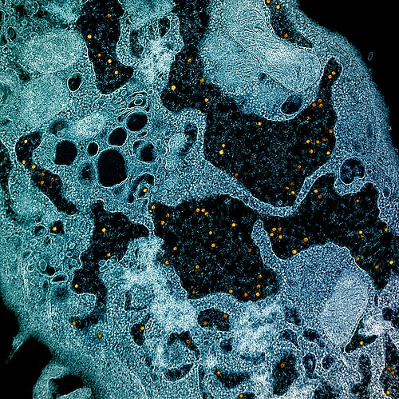

# ZOONOSES E CONTROLE VETORIAL: ARBOVIROSES, FEBRE AMARELA E MANEJO TERRITORIAL

Para entender as zoonoses e as arboviroses em provas de residência, você precisa parar de decorar nomes de vírus e começar a entender como eles se movem no território. As bancas brasileiras, como a USP, a UNICAMP e o Enare, não querem apenas que você saiba o tratamento, elas querem que você entenda o papel do médico como um agente de vigilância. Se você não souber o que fazer com um macaco morto ou como interpretar um índice de infestação predial, você vai perder pontos preciosos.

## Arboviroses: O Desafio do Aedes aegypti

As arboviroses (Arthropod-Borne Viruses) são doenças transmitidas por artrópodes. No Brasil, o protagonista absoluto é o *Aedes aegypti*. Um erro comum de aluno é achar que o mosquito é apenas um "meio de transporte". Na verdade, ele é um vetor biológico. Isso significa que o vírus se replica dentro do mosquito antes de ser transmitido.

### Dengue: A Fisiopatologia do Extravasamento

Por que a dengue mata? Se você responder "hemorragia", você caiu na pegadinha da banca. A principal causa de morte na dengue é o choque hipovolêmico decorrente do extravasamento plasmático. O vírus da dengue causa uma disfunção endotelial temporária que faz o plasma sair do vaso e ir para o terceiro espaço (pleura, peritônio).

Aqui entra o conceito de ADE (Antibody-Dependent Enhancement) ou Facilitação Dependente de Anticorpos. Quando um paciente tem uma segunda infecção por um sorotipo diferente, os anticorpos IgG da primeira infecção não neutralizam o novo vírus, mas se ligam a ele e facilitam sua entrada nos macrófagos. Isso gera uma resposta inflamatória muito mais intensa, aumentando o risco de dengue grave. É por isso que a reinfecção é um fator de risco clássico.

### Classificação e Manejo Clínico da Dengue

O Ministério da Saúde divide os pacientes em grupos (A, B, C e D). Você deve saber isso de cor, pois a conduta depende exclusivamente dessa estratificação.

| Grupo | Perfil Clínico | Conduta Inicial |
| --- | --- | --- |
| **A** | Dengue suspeita, sem sinais de alarme, sem comorbidades. | Hidratação oral (60ml/kg/dia), sintomáticos, repouso. |
| **B** | Sem sinais de alarme, mas com risco social ou comorbidades (gestantes, idosos). | Hidratação oral supervisionada, aguardar hematócrito. |
| **C** | Presença de **Sinais de Alarme**. | Hidratação IV imediata (10ml/kg na 1ª hora), internação. |
| **D** | **Dengue Grave** (choque, disfunção de órgãos). | Hidratação IV vigorosa (20ml/kg em 20 min), leito de UTI. |

**Dica de Ouro do Dr. Will:** Os sinais de alarme aparecem geralmente na fase de defervescência (quando a febre vai embora). É aqui que o aluno se engana: o paciente melhora da febre e a família acha que ele está curado, mas é justamente quando ele pode chocar.

**Sinais de Alarme (Memorize):** Dor abdominal intensa e contínua, vômitos persistentes, acúmulo de líquidos (ascite, derrame pleural), hipotensão postural, hepatomegalia > 2cm, sangramento de mucosa e aumento súbito do hematócrito.

### Chikungunya e Zika: O Diagnóstico Diferencial

A Chikungunya é a "doença da dor". O vírus CHIK V causa uma artralgia simétrica e intensa, que pode cronificar em mais de 50% dos casos, especialmente em mulheres acima de 45 anos ou pessoas com lesões articulares prévias. Na fase aguda, a febre é alta (>38,5°C) e súbita.

Já o Zika é o "primo silencioso". A febre é baixa ou ausente. O que marca o Zika é o exantema maculopapular pruriginoso que surge nas primeiras 24 horas, acompanhado de hiperemia conjuntival (olho vermelho sem pus). Lembre-se: o Zika tem transmissão vertical (causando microcefalia e a Síndrome Congênita do Zika) e transmissão SEXUAL. Isso cai muito! Se o paciente teve Zika, ele deve usar preservativo por meses para evitar a transmissão para a parceira.

## Febre Amarela: O Ciclo e a Vigilância de Epizootias

A Febre Amarela (FA) é uma doença de notificação compulsória IMEDIATA. No Brasil, vivemos o ciclo silvestre, onde os vetores são os mosquitos *Haemagogus* e *Sabethes*. O ciclo urbano (transmitido pelo *Aedes aegypti*) não é registrado no Brasil desde 1942, mas o risco de reurbanização é o que guia as políticas de vacinação.

### O Macaco como Sentinela

O primata não humano (macaco) não transmite a febre amarela para o homem. Ele é uma vítima tanto quanto nós. Quando um macaco morre (epizootia), ele serve como um evento sentinela. Isso indica que o vírus está circulando naquela área. A conduta diante de um macaco morto é: notificação em até 24 horas e coleta de material para exame. A partir daí, desencadeia-se a vacinação de bloqueio na região.

### Quadro Clínico e Sinal de Faget

A forma grave da FA apresenta a clássica tríade: icterícia (geralmente verdínica), oligúria (insuficiência renal) e hemorragias (hematêmese é comum). Um sinal semiológico muito cobrado é o **Sinal de Faget**: a dissociação pulso-temperatura. O paciente está com febre alta, mas a frequência cardíaca está baixa (bradicardia relativa).

**Cuidado com a Vacina:** A vacina da FA é de vírus vivo atenuado. Ela é contraindicada para gestantes (salvo alto risco epidemiológico), lactantes de bebês menores de 6 meses e imunossuprimidos graves. Se uma lactante precisar vacinar, ela deve suspender o aleitamento por 10 dias.

## Zoonoses Bacterianas: Leptospirose e Febre Maculosa

### Leptospirose: A Doença da Lama

A leptospirose é causada pela bactéria *Leptospira interrogans*, eliminada na urina de ratos (principalmente o *Rattus norvegicus*). O cenário de prova é sempre o mesmo: enchente, limpeza de bueiro ou contato com água de chuva.

O quadro clínico inicial é inespecífico (febre, mialgia, cefaleia), mas a mialgia da panturrilha é muito característica. A forma grave é a Síndrome de Weil, caracterizada por:

- Icterícia rubínica (alaranjada).

- Insuficiência renal aguda (tipicamente hipocalêmica, o que a diferencia de outras IRAs).

- Hemorragia alveolar (causa de morte rápida).

**Tratamento:** Para casos leves, Doxiciclina ou Amoxicilina. Para casos graves, Penicilina G Cristalina ou Ceftriaxona. A profilaxia pós-exposição em situações de alto risco (ex: socorristas em enchentes) pode ser feita com Doxiciclina (dose única ou semanal).

### Febre Maculosa: O Perigo do Carrapato

Causada pela *Rickettsia rickettsii* e transmitida pelo carrapato-estrela (*Amblyomma sculptum*). O hospedeiro costuma ser a capivara ou cavalos. O quadro é de febre alta súbita e um exantema que começa nos punhos e tornozelos e migra para o tronco (centrípeto).

**Dica MedEvo:** Se você suspeitar de Febre Maculosa, trate IMEDIATAMENTE com Doxiciclina. Não espere o resultado de exames, pois a letalidade é altíssima. A Doxiciclina é a droga de escolha inclusive para crianças, apesar dos riscos teóricos aos dentes, devido à gravidade da doença.

## Raiva Humana: Profilaxia e Manejo de Mordeduras

A raiva é uma encefalite viral com letalidade próxima de 100%. O manejo pós-exposição é o que cai na prova. A primeira medida, antes de qualquer vacina, é lavar o ferimento com água e sabão abundantemente. Isso reduz a carga viral mecanicamente.

### Conduta Pós-Exposição

A decisão de vacinar ou usar soro (imunoglobulina) depende de dois fatores: o tipo de ferimento e o animal.

- **Animal Observável (Cão ou Gato sadio):** Se o animal puder ser observado por 10 dias, você pode iniciar a vacina (d0 e d3) e observar. Se o animal permanecer sadio, interrompe o esquema.

- **Animal Desconhecido, Fugiu ou Animal Silvestre (Morcego, Macaco):** Considerar sempre como risco grave. Iniciar vacina + soro (se indicado pelo tipo de ferimento).

- **Ferimentos Leves:** Superficiais, em tronco ou membros (exceto mãos e pés).

- **Ferimentos Graves:** Cabeça, face, pescoço, mãos, pés, genitália; ou ferimentos profundos/múltiplos.

**Lembre-se:** Morcego é sempre acidente grave. Mesmo que o paciente diga que "só acordou com o morcego no quarto", deve-se fazer o esquema completo (vacina + soro).

## Acidentes por Animais Peçonhentos

O escorpionismo é o acidente peçonhento mais comum no Brasil (Tityus serrulatus). No entanto, o ofidismo (serpentes) é o que gera mais dúvidas diagnósticas.

| Gênero | Nome Popular | Clínica Principal | Ação do Veneno |
| --- | --- | --- | --- |
| **Bothrops** | Jararaca | Dor, edema, equimose, sangramentos. | Proteolítica, Coagulante, Hemorrágica. |
| **Crotalus** | Cascavel | Fácies miastênica (ptose), urina escura. | Neurotóxica, Miotóxica. |
| **Lachesis** | Surucucu | Semelhante à Jararaca + sintomas vagais (diarreia). | Proteolítica, Coagulante, Neurotóxica (vagal). |
| **Micrurus** | Coral | Ptose palpebral, insuficiência respiratória rápida. | Neurotóxica pura. |

**Erro comum:** Achar que deve-se fazer torniquete ou sugar o veneno. Isso é proibido! A conduta é: lavar o local, manter o membro elevado e soroterapia específica o mais rápido possível.

## Manejo Territorial e Vigilância Ambiental

O controle vetorial não se faz apenas com "fumacê" (nebulização espacial). O fumacê é uma medida de controle de surto (elimina o mosquito adulto), mas não resolve o problema. O foco principal deve ser a eliminação de criadouros (prevenção primária).

### LIRAa (Levantamento Rápido de Índices para Aedes aegypti)

O LIRAa é uma metodologia que permite identificar onde estão os focos do mosquito na cidade. O índice mais importante é o IIP (Índice de Infestação Predial).

- **Abaixo de 1%:** Satisfatório.

- **1% a 3,9%:** Situação de Alerta.

- **Acima de 4%:** Risco iminente de surto.

As bancas adoram perguntar sobre o manejo integrado de pragas. Isso envolve saneamento básico, coleta de lixo regular e educação em saúde. O médico deve saber que o saneamento domiciliar e peridomiciliar é a ferramenta mais eficaz a longo prazo.

### Vigilância Ativa e Notificação

A vigilância ativa consiste na busca de casos antes que eles cheguem ao sistema de saúde de forma passiva. Um exemplo é a vigilância de epizootias que discutimos. Outro conceito importante é o de **Evento Sentinela**: um caso único que indica a falha de um sistema de controle (ex: um caso de raiva humana indica falha na vacinação animal).

## Diagnóstico Diferencial das Síndromes Febris

Imagine o cenário: Paciente de 30 anos, febre há 3 dias, cefaleia e mialgia. Como diferenciar?

- Se tiver **dor retro-orbitária** e prova do laço positiva: Pense em Dengue.

- Se tiver **artralgia incapacitante** e edema articular: Pense em Chikungunya.

- Se tiver **conjuntivite não purulenta** e prurido: Pense em Zika.

- Se tiver **mialgia de panturrilha** e sufusão conjuntival: Pense em Leptospirose.

- Se tiver **sinal de Faget** e icterícia: Pense em Febre Amarela.

## Pontos-Chave para Prova

- **Dengue Grave:** A causa principal é o extravasamento plasmático por aumento da permeabilidade capilar, não a hemorragia isolada.

- **Sinais de Alarme:** Devem ser monitorados na fase de remissão da febre. O aumento do hematócrito é o sinal laboratorial mais precoce de extravasamento.

- **Prova do Laço:** Obrigatória em casos suspeitos de dengue sem sangramento espontâneo. Positiva se ≥ 20 petéquias em adultos ou ≥ 10 em crianças (num quadrado de 2,5cm).

- **Chikungunya:** O AAS é contraindicado pelo risco de Síndrome de Reye e sangramentos. A fase crônica é marcada por artrite persistente.

- **Zika:** Única arbovirose comum com transmissão sexual e forte associação com microcefalia.

- **Febre Amarela:** Notificação compulsória imediata. O macaco é sentinela, não transmissor.

- **Leptospirose:** A tríade de Weil inclui icterícia rubínica, IRA hipocalêmica e hemorragia alveolar.

- **Raiva:** Cão e gato devem ser observados por 10 dias. Se o animal morrer, desaparecer ou for silvestre, o tratamento é imediato.

- **Acidente Botrópico:** É o mais comum no Brasil. Causa necrose local e distúrbios de coagulação.

- **Acidente Crotálico:** Causa a "fácies miastênica" e pode levar à insuficiência renal por rabdomiólise (miotoxina).

- **LIRAa:** Índice ≥ 4% significa risco de surto. É uma ferramenta de planejamento territorial.

- **Manejo de Vetores:** A eliminação de criadouros é prevenção primária. O uso de inseticidas (fumacê) é medida de controle de emergência.

- **Monkeypox (Mpox):** Transmissão predominante por contato direto (incluindo sexual). As lesões cutâneas são umbilicadas e podem estar em diferentes estágios de evolução.

- **Febre Maculosa:** Trate com Doxiciclina na suspeita clínica. A letalidade é alta e o diagnóstico laboratorial demora.

- **Esquistossomose:** O Praziquantel é o tratamento de escolha. O controle envolve saneamento e combate ao caramujo *Biomphalaria*. 🦟

 Cópia offline para consulta pessoal.
 Fonte original:
 [https://www.medevo.com.br/material-apoio/ler/b1d06635-11d0-4ee1-b17c-3586fb9e5592](https://www.medevo.com.br/material-apoio/ler/b1d06635-11d0-4ee1-b17c-3586fb9e5592)
