# Espondiloartrites

<!-- page:1 -->

## Espondiloartrites

- Grupo de doenças inflamatórias com achados em comum
- Idade menor do que 45 anos é comum, com manifestações extra-articulares
- Inflamação axial (espondilite e sacroiliíte)
- Artrite oligoarticular
- Dactilite
- Entesite

**Manifestações extra-articulares**

- Doença inflamatória intestinal (DII)
- Psoríase
- Uveíte

> ⚠️ Quadro-resumo (critérios diagnósticos) reconstruído a partir de OCR de duas colunas intercaladas — confira contra a fonte original.

**Critérios diagnósticos resumidos**

- Sacroiliíte + 1 característica compatível com EpA
- HLA-B27 + 2 características compatíveis com EpA
- Características: dor lombar inflamatória / boa resposta a AINEs, artrite, uveíte, psoríase, história familiar, entesite, dactilite, Crohn ou colite, PCR elevado

**Tratamento (geral)**

- Anti-inflamatórios
- Imunobiológicos: anti-TNF, anti-IL17
- Alvos específicos: inibidores da JAK
- Sulfassalazina, se quadro periférico

## Espondiloartrites São Classificadas de Acordo com o Acometimento Articular Predominante

- **Espondiloartrites axiais**: não radiográfica ou radiográfica
- **Espondiloartrites periféricas**: artrite psoriásica, artrite enteropática, artrite reativa, indiferenciadas

### Espondiloartrites Axiais

- Artrite inflamatória do esqueleto axial
- Idade < 40 anos
- Se radiográfica, predomínio em homens (3:1)
- Associada ao HLA-B27
- Lombalgia inflamatória é o sintoma mais comum
- Tratamento: AINEs, DMARDs sintéticos e biológicos, se necessário

### Espondiloartrites Periféricas

- Sem predomínio entre os sexos
- Padrão mais comum: oligoarticular assimétrico
- Radiografia: pencil-in-cup
- Tratamento: AINEs, DMARDs sintéticos e biológicos, se necessário

### Artrite Psoriásica

- A pele vem antes em 75% dos casos
- Tratamento: evitar anti-IL17

### Artrite Enteropática

- Manifestação extraintestinal mais comum
- Tipo 1: em geral oligoarticular e relacionada à atividade da doença
- Sacroiliíte: mais comum no Crohn

### Artrite Reativa

- 1–8 semanas após infecção
- HLA-B27 em 60% dos pacientes
- Tratamento: AINE, corticoide, DMARDs sintéticos e anti-TNF
- Antibiótico: só se quadro infeccioso recente
- Manifestação extra-articular mais comum: uveíte anterior (20–30%), ou infecção por clamídia
  - Dor ocular, eritema e fotofobia
  - Padrão recorrente, alternante e unilateral

**Lombalgia inflamatória**

- Evolução por mais de 3 meses, início com < 40 anos, rigidez matinal prolongada, piora com o repouso, melhora com o movimento, acorda o paciente à noite, melhora com AINE

## Introdução

**Espondiloartrites (EpA)** são um grupo de doenças inflamatórias que incluem os seguintes achados em comum:

- Inflamação axial, caracterizada por espondilite (inflamação na coluna vertebral) e sacroiliíte (inflamação da articulação sacroilíaca)
- Artrite em articulações não axiais ou periféricas
- Dactilite (dedo "em salsicha", caracterizado por hiperemia e aumento do volume de quirodáctilos ou pododáctilos)
- Entesite (inflamação da êntese, que é o local onde um tendão, ligamento ou cápsula articular se insere no osso)
- Manifestações extra-articulares: doença inflamatória intestinal (DII), psoríase, uveíte anterior aguda

As espondiloartrites podem ser classificadas em duas categorias principais, de acordo com o acometimento articular predominante:

- **Axiais**: predomínio do acometimento nas articulações sacroilíacas e coluna
  - EpA axial não radiográfica (EpA-axnR)
  - EpA axial radiográfica (EpA-axR)
- **Periféricas**: predomínio do acometimento das articulações não axiais ou periféricas
  - Artrite psoriásica
  - Artrite enteropática
  - Artrite reativa
  - Artrite indiferenciada

---

<!-- page:2 -->

Nas EpA axiais, a artrite periférica geralmente se apresenta como uma monoartrite ou oligoartrite assimétrica, acometendo predominantemente os membros inferiores. As articulações do quadril e do ombro são acometidas em 50% e 30% das vezes, respectivamente.

## Espondiloartrite Axial

### Definição

A **espondiloartrite axial (EpA axial)** é uma forma de artrite inflamatória que acomete predominantemente o esqueleto axial, com envolvimento típico das articulações sacroilíacas e da coluna vertebral. Ela é subdividida com base nos achados de imagem de radiografia das sacroilíacas:

- **EpA axial radiográfica (EpA-axR)**: quando há dano estrutural visível na radiografia, como erosões, esclerose ou diminuição do espaço articular. Essa forma corresponde ao que anteriormente era chamado de espondilite anquilosante
- **EpA axial não radiográfica (EpA-axnR)**: quando o quadro clínico é compatível com EpA axial, mas as radiografias são normais ou apresentam apenas achados inespecíficos. Nesses casos, a ressonância magnética pode evidenciar inflamação ativa

A distinção entre formas radiográfica e não radiográfica é sobretudo relevante em contextos de pesquisa. No dia a dia clínico, o termo espondiloartrite axial é utilizado de maneira abrangente para se referir à doença como um todo.

### Epidemiologia

- Afeta cerca de **1%** da população geral
- A EpA axial radiográfica predomina em homens (proporção 3 homens : 1 mulher)
- A EpA axial não radiográfica é igualmente distribuída entre homens e mulheres
- Associada ao **HLA-B27** em mais de 88% dos casos
- A média de idade dos pacientes é de 30–40 anos

Figura 1: Articulações periféricas mais comumente acometidas na EpA axial.

A entesite está presente em cerca de 30% dos pacientes com EpA axial, sendo mais comum nos membros inferiores, especialmente no calcâneo, nos pontos de inserção do tendão de Aquiles e da fáscia plantar.

### Quadro Clínico

**Manifestações musculoesqueléticas**

A lombalgia é o sintoma mais comum na EpA axial. Pode ser referida como dor na região lombar e também na região glútea. Classicamente é inflamatória e apresenta as seguintes características:

- Início antes dos 40 anos
- Evolução por mais de 3 meses
- Associada à rigidez matinal prolongada
- Piora com o repouso e melhora com o movimento
- Desperta o paciente à noite
- Melhora com anti-inflamatórios não esteroidais

Além da lombalgia inflamatória, os pacientes com espondiloartrite axial também podem apresentar outras manifestações musculoesqueléticas, sendo comuns a artrite periférica e a entesite. A dactilite é incomum.

Figura 2: Entesite de calcâneo esquerdo.

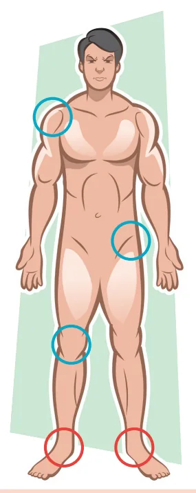

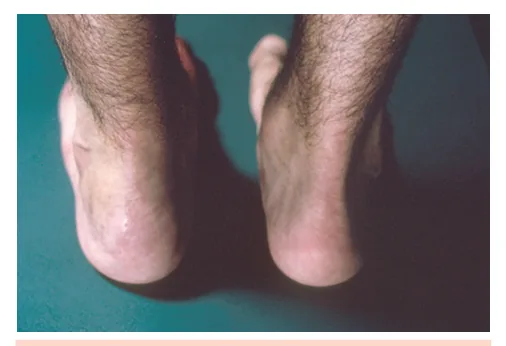

---

<!-- page:3 -->

Note o abaulamento na inserção do tendão de Aquiles no osso calcâneo esquerdo.

**Manifestações extramusculoesqueléticas**

- Uveíte anterior aguda (20 a 30%)
- Psoríase (10%)
- Insuficiência aórtica (2 a 6%)
- Fibrose dos ápices pulmonares (rara)
- Nefropatia por IgA (rara)

A uveíte anterior aguda é a manifestação extramusculoesquelética mais comum. Apresenta-se com dor ocular, eritema ocular e fotofobia. Costuma ser recorrente, unilateral e alternante. Pode ser tratada com colírios de corticoide.

**Exame físico**

As alterações iniciais incluem a positividade em manobras específicas que produzem estresse nas articulações sacroilíacas inflamadas, como o teste de Patrick ou FABERE.

**Teste de Patrick ou FABERE**

- Alta especificidade para sacroiliíte
- Paciente estará em decúbito dorsal, com o quadril testado em flexão (F), abdução (AB) e rotação externa (RE), formando um "4" com as pernas (tornozelo sobre o joelho oposto)
- O examinador então pressiona o joelho do lado testado e a pelve contralateral, estressando a articulação sacroilíaca contralateral

O teste será positivo para sacroiliíte quando o paciente referir dor na sacroilíaca contralateral ao quadril testado.

Figura 3: Teste de Patrick ou FABERE.

Com a progressão da doença e a ocorrência de anquilose, surgem a diminuição da expansibilidade torácica, a acentuação da cifose torácica e a limitação à flexão e à extensão da coluna. A limitação da flexão do segmento lombar da coluna é avaliada pelo teste de Schöber.

**Teste de Schöber**

- Palpam-se as espinhas ilíacas posterossuperiores e marca-se no centro da coluna (geralmente a nível do processo espinhoso de L5) a primeira marcação. Em seguida, faz-se uma segunda marcação 10 cm acima da primeira
- Pede-se para o paciente, com os joelhos próximos e sem flexioná-los, realizar uma flexão máxima da coluna lombar
- Mede-se a nova distância entre a primeira e a segunda marcação. O teste é normal quando a distância entre as duas marcações com a coluna fletida é superior a 15 cm

Figura 4: Teste de Schöber.

### Exames Complementares

**HLA-B27**

- Presente em 88% dos casos
- Positivo em 9% da população geral mundial e em 4,25% dos brasileiros
- Apenas 2–6% dos positivos na população geral desenvolvem espondilite anquilosante
- VPP (valor preditivo positivo) baixo, mas VPN (valor preditivo negativo) alto

**Reagentes de fase aguda**

- Aumento de PCR e VHS pode ajudar na suspeita diagnóstica, mas podem ser normais em até 60% dos pacientes

**Radiografia de sacroilíacas**

Pode ser normal ou apresentar os seguintes achados:

- Esclerose
- Limites indefinidos
- Erosões
- Anquilose (sacro e ilíaco "fundem-se")

Figura 5: Sacroiliíte grau IV (anquilose com fusão completa do sacro e ilíaco) bilateral.

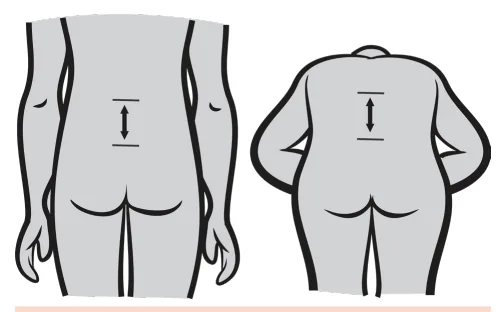

---

<!-- page:4 -->

Note o acometimento simétrico de ambas as sacroilíacas, característico das EpA axiais.

**Radiografia da coluna**

- **Lesão de Romanus**: caracterizada por pontos brilhantes nos "cantos" dos corpos vertebrais. Decorre da inflamação em ênteses e pode evoluir com erosão
- **Sindesmófitos**: resultado da calcificação do ligamento longitudinal anterior
- Retificação dos corpos vertebrais, com aspecto de vértebras em quadratura
- **Coluna "em bambu"**: resultado da anquilose da coluna

Figura 6: Coluna em bambu. Calcificação dos ligamentos longitudinais anterior e posterior, conferindo o aspecto de "bambu" à coluna vertebral.

Figura 7: Espondiloartrite axial. Sindesmofitose anterior (pontes ósseas entre os corpos vertebrais) e sinal de Romanus (esclerose/erosão da margem anterior do corpo vertebral). O sinal de Romanus é um dos sinais mais precoces de espondilite anquilosante.

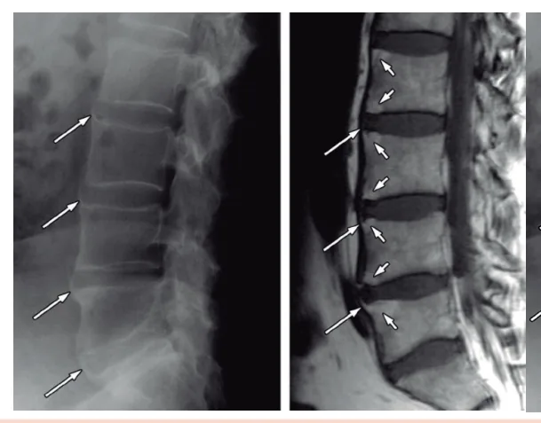

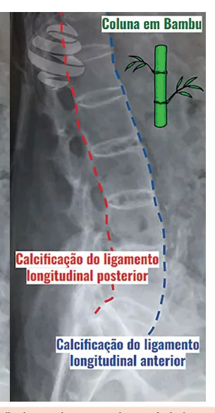

---

<!-- page:5 -->

Figura 8: Ressonância magnética de sacroilíaca em paciente com EpA axial.

**Tomografia computadorizada de sacroilíacas**

Mostra apenas o dano estrutural e se faz útil para identificar erosões na articulação sacroilíaca. A presença dessas erosões é altamente sugestiva de EpA axial.

**Ressonância magnética de sacroilíacas**

- É útil para identificar inflamação ativa (sacroiliíte ativa), representada por edema na medula óssea do sacro e do ilíaco na sequência STIR
- O edema na medula óssea ocorre precocemente, antes das alterações estruturais visíveis à radiografia e à tomografia
- A ressonância também identifica sequelas da inflamação crônica das sacroilíacas, melhor vistas na sequência T1

O edema na medula óssea é visualizado nas sequências STIR e se apresenta como focos hiperintensos (cor branca à ressonância). A hiperintensidade decorre da presença de líquido secundário à inflamação no local.

A sequência T1 mostra lesões sequelares não ativas, como a substituição gordurosa (focos brancos à imagem), esclerose subcondral (focos pretos à imagem) e erosões.

À esquerda, focos de edema ósseo em STIR. À direita, em sequência T1, focos de esclerose óssea e de deposição de gordura em medula óssea.

### Diagnóstico

**Critérios classificatórios**

Necessários os dois critérios obrigatórios:

- Lombalgia e rigidez articular por mais de 3 meses
- Idade menor do que 45 anos (ao início dos sintomas)

E, além dos critérios obrigatórios, é necessário preencher um dos seguintes:

- **Sacroiliíte na imagem** (radiografia ou ressonância) + 1 característica compatível com EpA
- **HLA-B27** + 2 características compatíveis com EpA

Características compatíveis com EpA:

- Dor lombar inflamatória; boa resposta a AINEs
- Artrite
- Uveíte
- Psoríase
- História familiar de EpA
- Entesite
- Dactilite
- PCR elevado
- Crohn ou colite

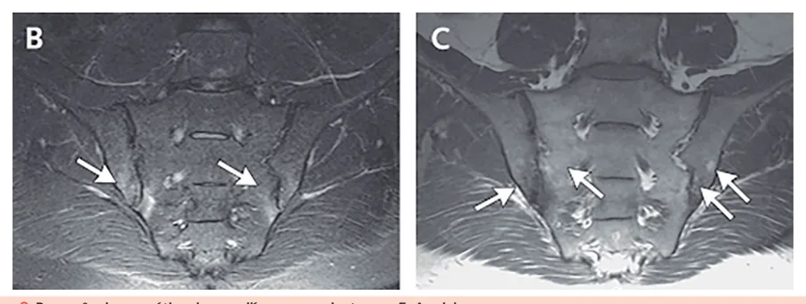

### Tratamento

**AINEs**

- São a primeira linha de tratamento para as EpA axiais
- Se não houver melhora com 2 semanas de uso contínuo de um primeiro AINE, pode-se trocar por um segundo AINE diferente
- Sugere-se o uso contínuo e em dose otimizada por ao menos 4 semanas antes de determinar falha terapêutica

**Anti-TNF**

- São a segunda linha de tratamento, utilizada em casos de falha ao uso de AINEs
- Grupo dos 5: infliximabe, etanercept, adalimumabe, golimumabe e certolizumabe (o anti-TNF preferível na gestação)
- Contraindicações:
  - Tuberculose ativa
  - Infecções ativas
  - Neoplasia recente, especialmente nos últimos 5 anos
  - Insuficiência cardíaca NYHA III e IV
  - Doença desmielinizante (esclerose múltipla, neuromielite óptica, etc.)

**Outros imunobiológicos**

Também podem ser usados como segunda linha, após a falha aos AINEs:

- Anti-IL-17: secuquinumabe e ixequizumabe
- Inibidores de JAK: tofacitinibe e upadacitinibe

**DMARDs**

- Sulfassalazina: pouco benefício na EpA axial, com maior benefício na atividade periférica e uveíte anterior aguda recorrente associadas à EpA axial
- Metotrexato: maior benefício na atividade articular periférica e também na uveíte

---

<!-- page:6 -->

**Corticoide**

Pode ser usado na forma de infiltrações intra-articulares ou periarticulares para quadros de mono ou oligoartrite e entesite.

> Anti-IL17 e etanercept devem ser evitados na artrite enteropática e nas DII, pois não demonstraram eficácia nos estudos e podem piorar o quadro gastrointestinal.

## Artrite Enteropática

Quadro de espondiloartrite (axial ou periférica) + doença inflamatória intestinal (DII).

**Clínica**

Cerca de 50% dos pacientes portadores de DII possuem algum sintoma extra-intestinal, sendo artrite e artralgia periférica as queixas mais frequentes. Menos frequentemente, esses pacientes também podem apresentar sacroiliíte.

A artrite periférica associada às DII:

**Tipo 1**

- É a forma de acometimento mais comum nas DII
- Não erosiva
- Oligoarticular
- Assimétrica
- Membros inferiores
- Ocorre mais na retocolite ulcerativa
- Demonstra relação com atividade de doença

**Tipo 2**

- Poliarticular
- Simétrica
- Membros superiores
- Não tem relação com atividade de doença

A sacroiliíte associada às DII:

- Ocorre mais na doença de Crohn
- Precede o quadro gastrointestinal
- Sem relação com atividade

### Tratamento

**AINEs**

- Evitar em pacientes com histórico de DII grave e/ou com DII ativa
- Podem ser usados em pacientes com DII inativa

**Corticoide**

Pode ser usado temporariamente para melhora inicial nos sintomas articulares periféricos, especialmente em pacientes com contraindicação aos AINEs.

**DMARDs**

- Sulfassalazina: apresenta efeito articular periférico e intestinal
- Metotrexato: apresenta efeito articular periférico e intestinal
- Anti-TNF (exceto etanercept): apresenta efeito na doença inflamatória intestinal e no quadro articular periférico e axial
- Inibidores da JAK: apresentam efeito na doença inflamatória intestinal e no quadro articular periférico e axial
- Anti-IL-23: apresenta efeito na doença inflamatória intestinal e no quadro articular periférico

## Artrite Psoriásica (APs)

- Principal espondiloartrite periférica
- Mais comum entre 20–45 anos de idade
- Sem predomínio entre sexos
- O acometimento cutâneo precede as queixas articulares em 75% dos casos
- Cerca de 15% dos pacientes apresentam manifestações articulares sem o acometimento da pele

> Atentar-se para o histórico familiar de psoríase nos casos em que o quadro de artrite se apresenta antes das alterações da pele.

### Quadro Clínico

**Acometimento cutâneo e ungueal**

A psoríase cutânea caracteriza-se por lesões eritemato-descamativas em cotovelos, joelhos e/ou couro cabeludo, nádegas, umbigo e região posterior da orelha. Pode haver também acometimento ungueal, caracterizado por pequenas depressões (pitting ungueal), onicólise, leuconíquia, manchas "em óleo", etc.

Figura 9: Lesão eritemato-descamativa em face extensora, compatível com psoríase.

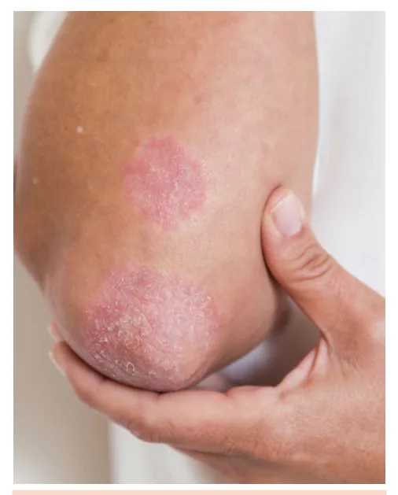

---

<!-- page:7 -->

**Comorbidades**

São muito comuns na artrite psoriásica. As mais frequentes são obesidade, depressão, dislipidemia, hipertensão arterial e risco cardiovascular elevado.

Figura 10: Pitting ungueal.

**Acometimento musculoesquelético**

O acometimento articular pode ser dividido em 5 subtipos:

- **Oligoartrite assimétrica**: apresentação inicial mais comum, predomina nos membros inferiores e nas pequenas articulações das mãos
- **Poliartrite simétrica**: poliarticular, simétrica. É semelhante à artrite reumatoide, mas com acometimento também de interfalangeanas distais
- **Artrite com envolvimento predominante das interfalangeanas distais**: envolve principalmente as interfalangianas distais, muitas vezes com psoríase ungueal
- **Artrite mutilante**: destrutiva, com reabsorção óssea e dedos "em telescópio". Rara
- **Doença axial predominante**: acomete sacroilíacas e coluna, pode ou não ter HLA-B27 positivo. Pode ocorrer com ou sem artrite periférica

A **dactilite** é manifestação musculoesquelética comum na artrite psoriásica (30–40%) e pode acometer os dedos das mãos e dos pés.

Figura 11: Dactilite do 3º e 4º pododáctilos.

### Radiografia

- Erosões assimétricas
- Neoformação óssea
- Acrosteólise (reabsorção das falanges distais)
- Pencil-in-cup

Figura 12: Radiografia mostrando alterações típicas da artrite psoriásica. Forma mutilante no 1º quirodáctilo (observe as "dobras" das partes moles ao redor do polegar). Acrosteólise de 2º quirodáctilo. Neoformação óssea lateral de falange distal com erosão da falange média de 1º e 3º quirodáctilos (pencil-in-cup).

Figura 13: Artrite psoriásica mutilante, com dedos em "telescópio".

### Diagnóstico

**Critérios classificatórios**

- Critérios CASPAR
- Doença inflamatória confirmada (artrite ou entesite ou sacroiliíte) + 3 pontos dos seguintes:
  - História prévia (1 ponto) ou evidência atual de psoríase cutânea (2 pontos)
  - Acometimento de unhas (1 ponto)
  - Fator reumatoide negativo (1 ponto)
  - Dactilite ativa ou prévia (1 ponto)
  - Evidência radiográfica de neoformação óssea (1 ponto)

### Tratamento

- **AINEs**: em casos leves ou na sacroiliíte; boa opção inicial para o quadro articular

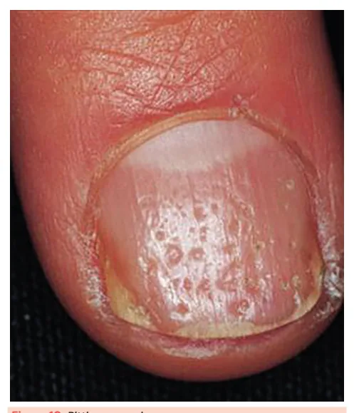

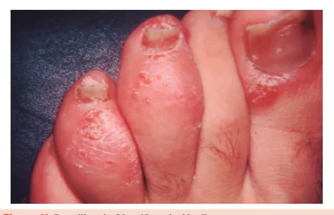

---

<!-- page:8 -->

- **DMARDs**: o mais utilizado é o metotrexato, com cobertura para quadros periféricos, dactilite e pele
- **Corticoide**: também é opção inicial; pode ser utilizado de forma injetável intra-articular ou periarticular. Também pode ser empregado por via oral para quadros poliarticulares
- **Imunobiológicos**: indicados na falha aos AINEs ou ao metotrexato. Incluem anti-TNF, anti-IL 17 (secuquinumabe, ixequizumabe), anti-IL 12/23 (ustequinumabe), anti-IL 23 (guselcumabe) e inibidores da JAK (tofacitinibe, upadacitinibe)

## Artrite Reativa

### Definição e Epidemiologia

- É um quadro de oligoartrite periférica, assimétrica, após infecções urogenitais e intestinais
- HLA-B27 em 60% dos pacientes (menos do que na EpA axial)
- Típica dos 18–40 anos
- Prevalência igual entre homens e mulheres

### Germes Mais Implicados

- *Chlamydia trachomatis*: é o mais comum (50%)
- *Campylobacter jejuni*
- *Shigella flexneri* e *Shigella sonnei*
- *Yersinia enterocolitica* e *Y. pseudotuberculosis*

### Quadro Clínico

- Início dos sintomas 1–8 semanas após a infecção
- Artrite com padrão oligoarticular (com preferência por grandes articulações de membros inferiores, especialmente joelhos), podendo estar associada a algum grau de dactilite e entesite
- **Balanite circinada**: acometimento inflamatório e asséptico da glande
- **Ceratoderma blenorrágico**: lesões eritemato-descamativas em planta dos pés ou palma das mãos
- **Conjuntivite** é a manifestação ocular mais comum

Figura 14: Balanite circinada em paciente com artrite reativa.

Figura 15: Ceratoderma blenorrágico em paciente com artrite reativa.

### Tratamento

- 50% dos pacientes melhoram em 3–4 meses apenas com AINEs ou corticoide; também pode ser empregado corticoide por via oral para quadros poliarticulares
- **DMARDs**: indicados nos pacientes que mantêm sintomas apesar de AINEs ou corticoide
  - Sulfassalazina mostrou benefício na artrite e na prevenção de uveíte
  - Metotrexato também pode ser usado, especialmente se houver intolerância ou contraindicação à sulfassalazina
- **Anti-TNF**: para quadros refratários a DMARDs sintéticos, contudo, tem baixa evidência

**E quanto ao uso de antibiótico?**

- É indicado, se os sintomas tiverem início recente
- Após o quadro clínico estabelecido, não há benefício

No caso de artrite reativa secundária a *Chlamydia trachomatis*, a antibioticoterapia também está indicada. Lembrar de tratar o parceiro!

## Referências

Figura 2: Entesite de calcâneo esquerdo. AMERICAN COLLEGE OF RHEUMATOLOGY. Biblioteca de Imagens da Reumatologia. Atlanta, GA: ACR, c2025. Disponível em: https://rheumatology.org/image-library. Acesso em: 26 maio 2025.

Figura 3: Teste de Patrick ou FABERE. PHYSIOTUTORS. Teste de Patrick / Teste de Faber / Teste da Figura Quatro para OA da anca e dor nas articulações do joelho. 2023. Disponível em: https://www.physiotutors.com/pt/wiki/patricks-test/. Acesso em: 26 maio 2025.

Figura 5: Sacroiliíte grau IV (fusão completa do sacro e ilíaco). RADIOPAEDIA. Sacroiliitis. Revisado por Sonam Vadera em 23 abr. 2025. Disponível em: https://radiopaedia.org/articles/sacroiliitis. Acesso em: 26 maio 2025.

Figura 6: Coluna em bambu. LECTURIO. Espondilite anquilosante. Última atualização: 7 maio 2025. Disponível em: https://www.lecturio.com/pt/concepts/espondilite-anquilosante/. Acesso em: 26 maio 2025.

Figura 7: Espondiloartrite axial. RADIOPAEDIA. Romanus lesion (vertebral bodies). Disponível em: https://radiopaedia.org/articles/romanus-lesion-vertebral-bodies. Acesso em: 26 maio 2025.

Figura 8: Ressonância magnética de sacroilíaca em paciente com EpA axial. RADIOPAEDIA. Sacroiliitis. Disponível em: https://radiopaedia.org/articles/sacroiliitis. Acesso em: 26 maio 2025.

Figura 9: Lesão eritemato-descamativa em face extensora compatível com psoríase. PSORIASIS.COM. What is psoriasis? Disponível em: https://www.psoriasis.com/about-psoriasis/what-is-psoriasis. Acesso em: 26 maio 2025.

Figura 10: Pitting ungueal. MEDICAL ZONE. Differential diagnosis of nail pitting. Disponível em: https://www.medicalzone.net/differential-diagnosis-of-nail-pitting.html. Acesso em: 26 maio 2025.

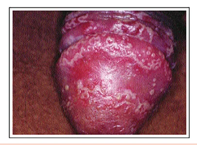

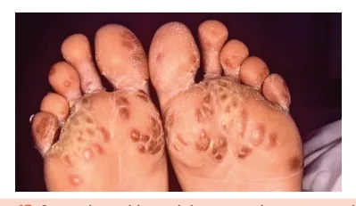

---

<!-- page:9 -->

Figura 11: Dactilite do 3º e 4º pododáctilos. ENTHESIS.INFO. Dactylitis and Enthesitis. Disponível em: https://enthesis.info/spondyloarthritis/dactylitis_and_enthesitis.html. Acesso em: 26 maio 2025.

Figura 12: Radiografia mostrando alterações típicas da artrite psoriásica. RADIOPAEDIA. Psoriatic arthritis. Revisado por Evangeline Collins em 30 ago. 2024. Disponível em: https://radiopaedia.org/articles/psoriatic-arthritis. Acesso em: 26 maio 2025.

Figura 13: Artrite psoriásica mutilante, com dedos em "telescópio". AMERICAN COLLEGE OF RHEUMATOLOGY. Biblioteca de Imagens da Reumatologia. Atlanta, GA: ACR, c2025. Disponível em: https://rheumatology.org/image-library. Acesso em: 26 maio 2025.

Figura 14: Balanite circinada. SOUSA, A. E. S. de; GURGEL, A.; SOUSA, J. A. de; ALENCAR, E.; COSTA, M. M. R.; FRANÇA, E. R. de. Síndrome de Reiter: relato de caso. Anais Brasileiros de Dermatologia, Rio de Janeiro, v. 78, n. 3, p. 335–338, jun. 2003. DOI: 10.1590/S0365-05962003000300009. Disponível em: https://www.scielo.br/j/abd/a/prN869rsFRzkvtSCdwSQ9Lp/. Acesso em: 26 maio 2025.

Figura 15: Ceratoderma blenorrágico. KERATODERMA blennorrhagicum. In: WIKIPÉDIA: a enciclopédia livre. [São Francisco, CA: Fundação Wikimedia], 2025. Disponível em: https://en.wikipedia.org/wiki/Keratoderma_blennorrhagicum. Acesso em: 26 maio 2025.
