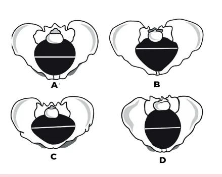
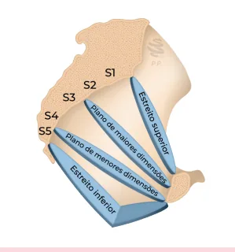
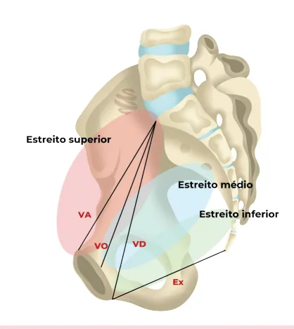
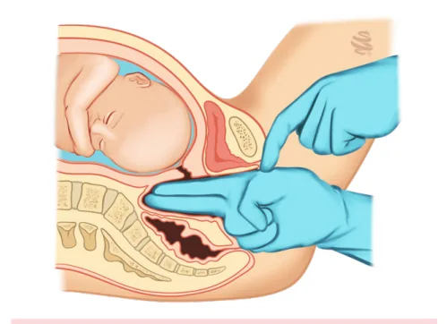
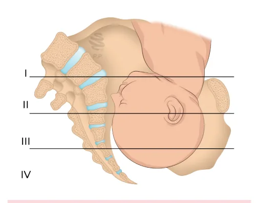
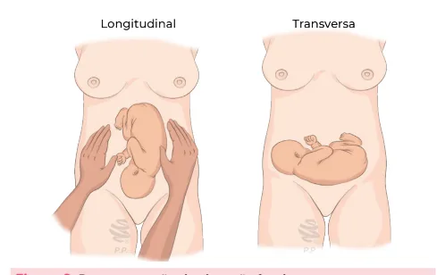
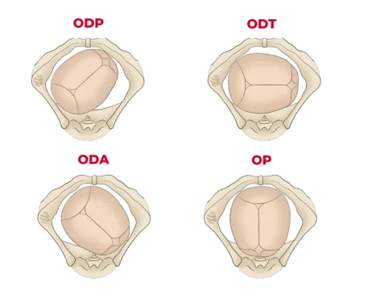
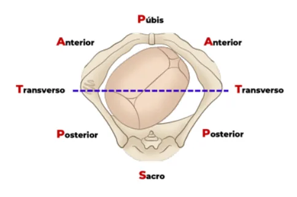
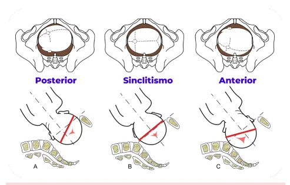

# Estática Fetal

<!-- page:1 -->

## Bacia Obstétrica

- **Tipos de bacia obstétrica:** ginecoide (mais comum), antropoide, androide (pior prognóstico) e platipeloide
- As conjugatas de maior interesse são:
  - **Vera anatômica:** borda superior da sínfise púbica até o promontório; mede cerca de 11 cm
  - **Vera diagonalis:** vai da borda inferior da sínfise púbica até o promontório; mede cerca de 12 cm
  - **Vera obstétrica:** vai da face interna da sínfise púbica até o promontório. É estimada pelo cálculo: diagonalis – 1,5 cm; mede cerca de 10,5 cm
  - **Exitus:** vai da borda inferior da sínfise púbica até o cóccix; mede cerca de 9,5 a 11 cm
- **Vícios pélvicos:**
  - Conjugata vera obstétrica < 10 cm
  - Diâmetro bi-isquiático < 9,5 cm
  - Diâmetro bituberoso < 8 cm

## Estudo do Trajeto

### Tipos de Bacia Obstétrica

- A **ginecoide** é a mais comum entre as mulheres, tendo o melhor prognóstico para parto vaginal
- A **androide** tem o pior prognóstico quanto ao parto vaginal, tendo distócia crescente com a descida
- A **platipeloide** favorece variedades transversas
- A **antropoide** é típica de gorilas e, caso haja insinuação, tem bom prognóstico

### Tabela 1: Características Clínicas das Bacias Obstétricas

> ⚠️ Tabela reconstruída a partir de OCR — confira contra a fonte original.

| Bacia Obstétrica | Estreito Superior | Ângulo Subpúbico |
|---|---|---|
| **Ginecoide** | Médio | Arredondado |
| **Androide** | Muito estreito | Losango/triângulo |
| **Antropoide** | Estreito | Elíptico |
| **Platipeloide** | Amplo | Ovalado |

Figura 1: Estreito superior das bacias obstétricas. A: ginecoide; B: androide; C: platipeloide; D: antropoide.

- **Estática fetal** corresponde à relação entre o organismo materno e o fetal:
  - **Atitude:** relação das partes fetais entre si
  - **Situação:** pode ser longitudinal, transversal ou oblíqua
  - **Posição** (dorso fetal): direita, esquerda, anterior ou posterior
  - **Apresentação:** cefálica, pélvica, córmica ou composta
- A **variedade de posição** representa a correlação entre um ponto de referência da apresentação fetal com um ponto de referência da bacia obstétrica. A nomenclatura é feita por 3 letras que indicam a apresentação, posição e variedade de posição fetais

Figura 2: Ângulo subpúbico das bacias obstétricas. A: ginecoide; B: androide; C: platipeloide; D: antropoide.

## Estreitos da Bacia Obstétrica

**Estreito Superior:**
- Promontório até a borda superior da sínfise púbica

**Estreito Médio:**
- Plano das espinhas isquiáticas — plano 0 de De Lee
- Aqui se encontra o plano de menores dimensões da bacia obstétrica

**Estreito Inferior:**
- Ponta do cóccix, face interna da tuberosidade isquiática e borda inferior da sínfise púbica

Figura 3: Estreitos da bacia obstétrica.

---

<!-- page:2 -->

- Entre o estreito médio e o estreito superior está o plano com as maiores dimensões da bacia obstétrica

### Diâmetro Bi-isquiático

- Distância entre as espinhas isquiáticas
- Corresponde ao diâmetro mais estreito da bacia (plano 0 de De Lee)

## Diâmetros e Conjugatas

**Vera Anatômica:**
- Vai da borda superior da sínfise púbica até o promontório
- Mede cerca de 11 cm

**Vera Diagonalis:**
- Vai da borda inferior da sínfise púbica até o promontório
- Avaliação feita pelo exame de toque vaginal — ver Figura 5
- Mede cerca de 12 cm
- Útil para estimar a conjugata vera obstétrica

**Vera Obstétrica:**
- Vai da face interna da sínfise púbica até o promontório
- Deve ser estimada pelo cálculo: diagonalis – 1,5 cm
- Mede cerca de 10,5 cm

**Exitus:**
- Vai da borda inferior da sínfise púbica até o cóccix
- Mede cerca de 9,5 a 11 cm

Figura 4: Conjugatas obstétricas. VA: conjugata vera anatômica; VO: conjugata vera obstétrica; VD: conjugata vera diagonalis; Ex: conjugata exitus.

Figura 5: Avaliação de conjugata diagonalis. P: promontório; S: sínfise púbica.

### Diâmetro Bituberoso

- Aferido externamente com a paciente em posição ginecológica
- Corresponde à distância entre as tuberosidades isquiáticas
- Mede cerca de 11 cm

Figura 6: Aferição do diâmetro bituberoso.

### Vícios Pélvicos

- Historicamente, a pelvimetria obstétrica tem sido utilizada como método para avaliar, anatomicamente, o prognóstico do trabalho de parto
- **Valores que indicam mau prognóstico:**
  - Conjugata vera obstétrica < 10 cm
  - Diâmetro bi-isquiático < 9,5 cm
  - Diâmetro bituberoso < 8 cm
- Somente a prova de trabalho de parto definirá se um parto poderá ou não ocorrer por via vaginal

## Planos da Bacia

- São sistemas de referência obstétrica usados para descrever a descida da apresentação fetal

### Plano de De Lee

- É o plano mais utilizado na prática da assistência ao trabalho de parto
- Os pontos de referência são as espinhas isquiáticas, que determinam o plano 0
- Quando o ponto de referência fetal está acima do plano zero, é considerado "negativo" (ex: -1 de De Lee); abaixo do plano zero, "positivo"

Figura 7: Planos de De Lee.

---

<!-- page:3 -->

### Planos de Hodge

- Menos utilizado na prática obstétrica brasileira
- Divide a pelve materna em quatro planos imaginários, numerados de cima para baixo, com base em pontos de referência ósseos:
  - **Plano I:** vai da borda superior da sínfise púbica ao promontório do sacro
  - **Plano II:** vai da borda inferior da sínfise púbica até o meio de S2
  - **Plano III:** delimitado pelas espinhas isquiáticas
  - **Plano IV:** delimitado pela ponta do cóccix (na parte de trás)

Figura 8: Planos de Hodge.

## Posição

- Refere-se à posição do dorso fetal em relação ao materno
- Corresponde às relações espaciais entre o organismo materno e o fetal

## Atitude

- Relação das partes fetais entre si ("como o bebê gosta de ficar na barriga")
- Atitude mais comum é a de flexão generalizada
- Atitude de extensão pode levar à deflexão do polo cefálico

## Situação

- Relação entre o maior eixo do útero em relação ao maior eixo do feto
- Pode ser longitudinal (mais comum), transversal ou oblíqua (geralmente são transitórias)

Figura 9: Representação da situação fetal.

- Direita, esquerda, anterior ou posterior

## Apresentação

- Corresponde à região do feto que ocupa o estreito superior da pelve e que vai se insinuar
- Pode ser: cefálica, pélvica, córmica ou composta:
  - **Pélvica completa:** coxas fletidas junto ao abdome fetal
  - **Pélvica incompleta:** quando apenas parte do polo pélvico está no estreito superior da bacia (modo nádegas, modo pés, modo joelhos etc.)

Figura 10: Tipos de apresentação pélvica. Pélvica completa à esquerda e pélvica incompleta modo nádegas à direita.

Figura 11: Apresentação pélvica incompleta modo pés.

## Variedade de Posição

- Correlação entre um ponto de referência da apresentação fetal com um ponto de referência da bacia obstétrica
- A nomenclatura é feita por 3 letras que indicam a apresentação, posição e variedade de posição fetais

### 1º — Ponto de Referência Fetal

- **Cefálica fletida:** occipício (lambda)
- **Defletida 1º grau:** bregma
- **Defletida 2º grau:** naso
- **Defletida 3º grau:** mento

---

<!-- page:4 -->

- **Pélvica:** sacro
- **Córmica:** acrômio

Figura 12: Pontos de referência fetal na apresentação cefálica. A: cefálica fletida (occipício); B: cefálica defletida de 1º grau (bregma); C: cefálica defletida de 2º grau (naso); D: cefálica defletida de 3º grau (mento).

### Tabela 1: Ponto de Referência Fetal, Conforme a Estática Fetal

> ⚠️ Tabela reconstruída a partir de OCR — confira contra a fonte original.

| Situação | Apresentação | Ponto de referência |
|---|---|---|
| Longitudinal | Cefálica fletida | Occipício |
| Longitudinal | Cefálica defletida 1º grau | Bregma |
| Longitudinal | Cefálica defletida 2º grau | Naso |
| Longitudinal | Cefálica defletida 3º grau | Mento (face) |
| Longitudinal | Pélvica | Sacro |
| Transversal | Córmica | Acrômio |

### 2º — Lado Materno

- Esquerda
- Direita

### 3º — Ponto de Referência da Bacia

- A determinação é feita com a paciente em posição ginecológica
- **Púbis:** sínfise púbica
- **Anterior:** eminência iliopectínea
- **Transversa:** extremidade do diâmetro transverso
- **Posterior:** sinostose sacroilíaca

Figura 13: Pontos de referência nas apresentações não cefálicas. A: pélvica (sacro); B: córmica (acrômio).

Figura 14: Pontos de referência da bacia obstétrica.

### Referências dos Pontos e Linhas de Orientação

> ⚠️ Tabela reconstruída a partir de OCR — confira contra a fonte original.

| Apresentação | Ponto de referência | Linha de orientação | Símbolo |
|---|---|---|---|
| Cefálica fletida | Lambda (occipício) | Sutura sagital | O |
| Defletida 1º grau | Bregma | Sutura sagitometópica | B |
| Defletida 2º grau | Naso/glabela | Linha metópica | N |
| Defletida 3º grau | Mento | Linha facial | M |
| Pélvica | Sacro | Sulco interglúteo | S |
| Córmica | Acrômio | Dorso | A |

Figura 15: Exemplos de variedade de posição. ODP: occípito-direita-posterior; ODT: occípito-direita-transverso; ODA: occípito-direita-anterior; OP: occípito-púbica.

## Assinclitismo

- Refere-se ao desalinhamento da cabeça fetal em relação ao canal de parto
- Quando há assinclitismo acentuado, pode haver dificuldade para rotação fetal

### Sinclitismo

- Quando a sutura sagital está à mesma distância entre o púbis e o promontório

---

<!-- page:5 -->

> ⚠️ As descrições de assinclitismo anterior e posterior abaixo saíram idênticas no material original (provável erro de digitação/OCR da fonte) — confira contra a fonte original antes de estudar por este trecho.

### Assinclitismo Posterior

- Quando a sutura sagital está mais próxima da púbis em relação ao promontório

### Assinclitismo Anterior

- Quando a sutura sagital está mais próxima da púbis em relação ao promontório

Figura 16: Alinhamento da cabeça fetal em relação ao canal de parto. A: assinclitismo posterior; B: sinclitismo; C: assinclitismo anterior.

