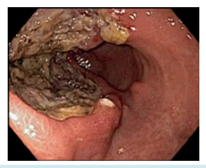
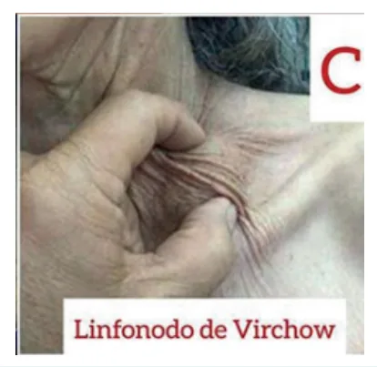
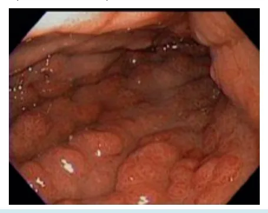
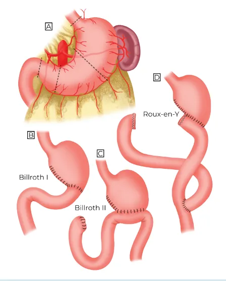
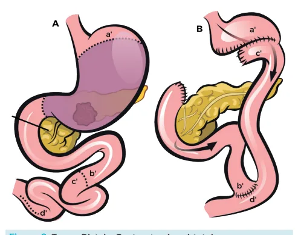
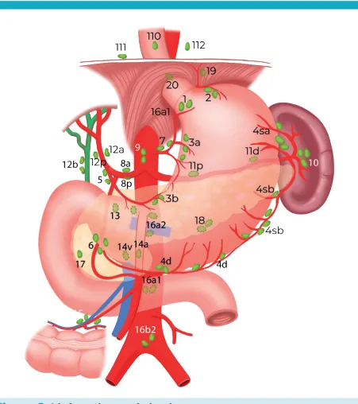

# Estômago Adenocarcinoma Gástrico

<!-- page:1 -->

## Estômago: Adenocarcinoma Gástrico

### Fatores de Risco

- Sua incidência vem diminuindo, pois o tratamento do **H. pylori** e a conservação de alimentos evoluíram através dos anos.
- **H. pylori** (adenocarcinoma e linfoma)
- Tabagismo
- Etilismo
- Gastrite atrófica
- Cirurgia gástrica prévia (**B2**)
- Alimentos com nitritos (defumados)
- Adenomas gástricos (**PAF**)
- Genético (mutação da **E-caderina/CDH1**) – gastrectomia profilática (por risco aumentado de câncer gástrico difuso)

### Classificação Histológica de Lauren

- Diferenciar subtipos **intestinal** e **difuso/células em anel de sinete**.

> ⚠️ Dados de tabela ambíguos no OCR original — não foi possível reconstruir com segurança; conteúdo listado em texto corrido.

- **Tipo intestinal**: bem diferenciado; mais comum em homens; disseminação hematogênica; tumores distais; fatores de risco: **H. pylori**, gastrite atrófica, metaplasia intestinal, tipo sanguíneo A, mutação de **p53**.
- **Tipo difuso**: indiferenciado (células em anel de sinete); mais comum em mulheres; disseminação linfática e por contiguidade; tumores proximais; associado à mutação de **E-caderina**.

**Estadiamento**: TC de tórax, abdome e pelve (TC TAP).

- Laparoscopia: indicada se **T3/T4** ou **N+** (pré-neoadjuvância).

**Tratamento**:

- Gastrectomia + linfadenectomia **D2**.
- **Total**: lesões de corpo e cárdia.
- **Subtotal**: lesões de antro e piloro.

### Câncer Gástrico Precoce

- **Definição**: até **T1bNx**.
- Tumores que invadem até a submucosa, independentemente do status linfonodal.
- Paciente possui melhor prognóstico.
- **Diferente dos critérios de ressecção endoscópica!**

### Critérios Clássicos para Ressecção Endoscópica

- Tumores restritos à mucosa (**T1a**).
- Menor que **2 cm**.
- Tumor bem diferenciado.
- Não ulcerado.
- Sem invasão linfovascular.
- Sem linfonodo acometido.

### Câncer Gástrico Avançado

- Todos aqueles que não são precoces.

### Classificação de Borrmann

- **Tipo 1** – lesão polipoide.
- **Tipo 2** – lesão ulcerada.

Figura 1: Ca Estômago - Borrmann II

---

<!-- page:2 -->

- **Tipo 3**: úlcero-infiltrativa.

Figura 2: Ca Estômago - Úlcero Infiltrativa (mais comum) Borrmann III

- **Tipo 4**: difuso (linite plástica).

Figura 3: Ca Estômago - Difuso (linite plástica) - Borrmann IV: muito relacionado com pior prognóstico.

### Sintomas

- Dor epigástrica.
- Emagrecimento.
- **HDA**.
- Plenitude pós-prandial.
- Náuseas e vômitos.
- Disfagia.

Ou pode ser assintomático e ser diagnosticado através da **EDA**.

### Sinais de Doença Avançada

- **Linfonodo de Virchow** – supraclavicular esquerdo.
- **Nódulo de Sister Mary Joseph** – implante periumbilical: lembrar que não se trata de linfonodo, é implante de carcinomatose periumbilical, considerado metástase à distância (**M1**).
- **Prateleira de Blumer** – invasão do fundo de saco.
- **Tumor de Krukenberg** – metástase no ovário.
- **Ascite** – normalmente associada a carcinomatose peritoneal.

Figura 4: nódulo de Irmã Maria José e Linfonodo de Virchow

### Estadiamento

- Principais sítios de metástases: linfonodos, fígado, peritônio e pulmão.
- Exames: endoscopia + tomografia de tórax, abdome e pelve.
- **Ecoendoscopia**: se câncer gástrico precoce (estuda se a lesão é passível de ressecção endoscópica; permite **PAAF** endoscópica de linfonodo suspeito).
- **PET-CT**: principalmente para tumores de transição; avalia metástase a distância e mediastinal.
- **Laparoscopia diagnóstica**: principalmente antes de indicar neoadjuvância (**T3/T4** ou **N+**). Possui boa acurácia para identificação de carcinomatose.
  - Se não for visualizada carcinomatose durante a laparoscopia → proceder com citologia oncótica.

### Critérios Prognósticos

- Verificar Tabela 2 na próxima página.
- **T** – grau de invasão da parede.
- **N** – acometimento linfonodal.
- **M** – metástases a distância.
- Até **T2N0** ou **T1N1** → estádio I.
- **>T2N0** ou **N+** → estádio II ou III.
- **M1** → estádio IV.

---

<!-- page:3 -->

### Tabela 2: Estadiamento do Câncer Gástrico

> ⚠️ Dados de tabela ambíguos no OCR original — não foi possível reconstruir com segurança; conteúdo listado em texto corrido.

- **T1a**: invade a mucosa.
- **T1b**: invade a submucosa.
- **T2**: invade a muscular própria.
- **T3**: invade a subserosa.
- **T4a**: invade a serosa (peritônio visceral).
- **T4b**: invade estruturas adjacentes.
- **N1**: 1 ou 2 linfonodos acometidos.
- **N2**: 3 a 6 linfonodos acometidos.
- **N3**: mais de 6 linfonodos acometidos.
- **M0**: metástases ausentes.
- **M1**: metástases presentes.

### Tratamento

- Preenche critérios para ressecção endoscópica = endoscopia.
- Tratamento neoadjuvante – **T2/T3/T4** ou **N+** (**T2N0** é controverso).
- Margem: livre!
  - Intestinal: se possível, > **5 cm**.
  - Difuso: se possível, **6 a 10 cm**.
- Antes de indicar neoadjuvância = laparoscopia.
- Quimioterapia: **FLOT** (fluorouracil, leucovorin, oxaliplatina e taxano) e **mFLOX** (oxaliplatina + fluoracil).
- Cirurgia indicada = gastrectomia total ou subtotal (Ca de antro ou piloro).
  - **Tumor distal** = gastrectomia subtotal + linfadenectomia **D2** + anastomose gastrojejunal em Y de Roux (Figura 6).
  - **Tumor proximal** = gastrectomia total + linfadenectomia **D2** + anastomose esofagojejunal em Y de Roux (Figura 5).
- Reconstrução pós-gastrectomia subtotal: normalmente é em Y de Roux; evita refluxo alcalino → complicação frequente da reconstrução a **B1** e **B2**.
  - O refluxo alcalino na reconstrução a **B2** aumenta o risco de câncer de coto gástrico, o que limita a indicação deste tipo de reconstrução.
- Gastrectomia + linfadenectomia **D2** – padrão ouro!
- Tratamento adjuvante – **T3/T4** ou **N+**, apenas se não realizou quimioterapia neoadjuvante.
- Quimioterapia de conversão – lembrar: paciente com tumor localmente avançado ou pouca carcinomatose peritoneal, mas com boa performance status, pode receber quimioterapia de conversão com o intuito de fazer a metástase desaparecer/regredir e operar o paciente de modo curativo (converte o paciente com tumor avançado inoperável em operável).
- Ressecção multivisceral: recomendada se o paciente tiver bom status de performance e for possível **R0** (margens microscópicas livres). Indicada em caso de invasão direta de estruturas adjacentes.
- Esplenectomia: principalmente para tumores de grande curvatura do estômago proximal com suspeita de invasão; indicada caso haja invasão direta do baço ou evidente acometimento linfonodal do hilo esplênico. Nunca parcial.

Figura 5: Tumor proximal = gastrectomia total + linfadenectomia D2 + anastomose esofagojejunal em Y de Roux

Figura 6: Tumor distal = gastrectomia subtotal + linfadenectomia D2 + anastomose gastrojejunal em Y de Roux

Figura 7: Reconstruções possíveis das gastrectomias

---

<!-- page:4 -->

### Linfadenectomia

Figura 8: Linfonodos perigástricos

- O objetivo é retirar o primeiro sítio de metástase do câncer gástrico, que seriam os linfonodos.
- Pode ser **D1, D2, D3**.
- Linfadenectomia padrão é a **D2**.
- Retirar pelo menos **15 linfonodos** para estadiamento.
- Linfadenectomia na gastrectomia total: **D1** – cadeias 1 a 7; **D2** – D1 + 8a + 9 + 11p + 11d + 12a.
- Linfadenectomia na gastrectomia subtotal: **D1** – mantém cadeias 2, 4sa; **D2** – mantém cadeias 2, 4sa e 11d.
- Linfadenectomia **D1** está indicada em dois casos: pacientes com tumores precoces que não obedecem aos critérios de ressecção endoscópica, ou pacientes sem performance status para linfadenectomia **D2** (KPS e ECOG limítrofes, como em desnutridos e idosos, que não toleram a maior morbidade), uma vez que a linfadenectomia **D2** é mais mórbida do que a **D1**.

### Tratamento Após a Gastrectomia

- **Estágio I**: observação (tumores precoces).
- **Estágio II e III**: quimioterapia adjuvante.
- **Estágio IV**: quimioterapia paliativa.

### Tratamentos Paliativos no Câncer Gástrico

- Gastrectomia paliativa para alívio de sintomas e manutenção da via alimentar: paciente precisa ter performance para realizar esse procedimento.
- Gastrojejunoanastomose x partição gástrica (tumores de antro); a bipartição gástrica tem melhor esvaziamento e melhores resultados.
- Jejunostomia = indicada para pacientes com tumores proximais, muito obstruídos e que não conseguem se alimentar: mau prognóstico, só utilizada em último caso.

## Referências

Figura 1: Ca Estômago - Borrmann II. Fonte: https://endoscopiaterapeutica.com.br/

Figura 2: Ca Estômago - Úlcero Infiltrativa (mais comum) Borrmann III. Fonte: https://endoscopiaterapeutica.com.br/

Figura 3: Ca Estômago - Difuso (linite plástica) - Borrmann IV: muito relacionado com pior prognóstico. Fonte: https://endoscopiaterapeutica.com.br/

Figura 4: nódulo de Irmã Maria José e Linfonodo de Virchow. Fonte: Sister Mary Joseph's nodule: from the history to the images. A case-based literature review.

Figuras 5 a 8: Acervo pessoal Medcof modificado.

