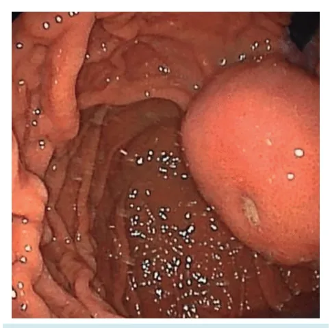
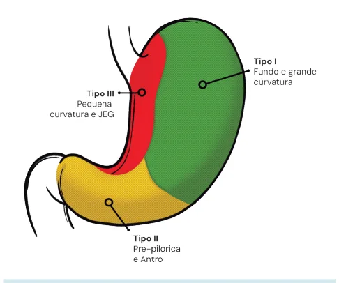
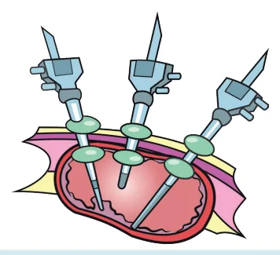
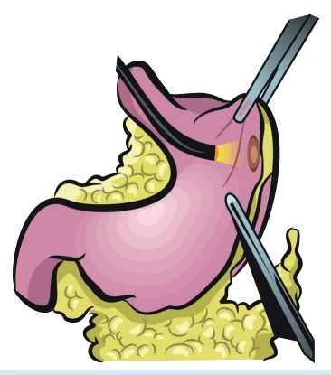

# Estômago Gist

<!-- page:1 -->

Estômago (CIR)

- Tumores derivados da Célula de Cajal;

- Subepiteliais (2ª ou 4ª camada da EcoEDA);

- Diagnóstico: EDA/ EcoEDA + PAAF;

- Não fazer biópsia com agulha grossa (risco de romper a cápsula!);

Tipo CD117 DOG-1 PKC-th + + + GISTs (>95%) (97%) (72%) Leiomioma - Leiomiosarcoma - Schwannoma - INTRODUÇÃO

- Tumores estromais do trato gastrointestinal;

- Derivados da célula de Cajal (marcapasso responsável pelos movimentos peristálticos do trato gastrointestinal);

- Mais comum no estômago (60-70%). Outros locais:

intestino delgado (20-25%), cólon e reto (5%), e esôfago (menos que 5%);

- Sintomatologia: Mais comumente assintomático; HDA; massa epigástrica; saciedade precoce;

- Lesão subepitelial (recoberta por mucosa normal); Mais comum na camada muscular (4ª camada da ecoendoscopia) ou muscular da mucosa (2ª camada na ecoendoscopia).

## DIAGNÓSTICOS DIFERENCIAIS

- Diagnósticos Diferenciais - outras lesões subepiteliais:

Leiomioma, Leiomiossarcoma, Schwannomas, Lipoma, Tumor Glômico e Pâncreas ectópico.

## CARACTERÍSTICAS

- A maioria dos GISTs são esporádicos, mas podem estar relacionados com síndromes genéticas: Neurofibromatose tipo 1 (NEM1), Síndrome CarneyStratakis e Síndromes familiares relacionadas ao GIST. - Estadiamento: TC TAP / Se reto ou fígado = RM

- Tratamento: Ressecção com Margens Livres –

Sem linfadenectomia!

## S100

heta CD34 AML* Desmina proteína + +/- - (60 to (30 to - ) (5%+) 70%) 40%) + + - + (10 to 15%)

- + - +

## + IMAGEM

- Endoscopia Digestiva Alta com presença lesão recoberta por mucosa normal; Pode haver umbilicação (local de sangramento prévio)

- Deve-se fazer ecoendoscopia para identificar o tumor na camada muscular + PAAF; Não se deve fazer biópsia por agulha grossa: Pode romper a cápsula do GIST - pior prognóstico; Se PAAF indisponível, conduta guiada apenas pela endoscopia.

Figura 1: GIST na endoscopia.

---

<!-- page:2 -->

## DIAGNÓSTICO: ECO-EDA + PAAF →

## IMUNOHISTOQUÍMICA

- O GIST tem CD117 (c-kit) positivo em mais de 90% das vezes;

- CD117 e/ou DOG-1 positivo = GIST;

- CD117 e/ou DOG-1 positivo = GIST;

- O PKC-teta, CD34 também auxiliam no diagnóstico para GIST;

- Caso o CD117 vier negativo, pesquisar PDGFRA Positivo: confirma GIST; Negativo: pode haver formas selvagens, sem expressão de nenhum destes genes.

- Verificar Tabela 1

## ESTADIAMENTO

- Tomografia computadorizada (TC) de Tórax, Se reto ou fígado, pedir RM;

Abdome e Pelve

- Principal tipo de metástase é por disseminação T hematogênica: fígado, peritônio, pulmão;

- OBS: GIST não dá metástase linfonodal (muito difícil)

- Fatores prognósticos GIST: Tamanho do tumor; Idade; Número de mitoses por campo; Ki-67; P53; Rotura da cápsula.

## TRATAMENTO

- Tumores menores (<2cm) = acompanhar clinicamente para observar o crescimento;

- Tumores > 2cm = cirurgia com ressecção com margens livres, sem linfadenectomia; T

- Modalidades de cirurgia – depende da localização do

- GIST (tipos 1, 2 e 3).

- Tabela 1: Marcadores em tumores gástricos subepiteliais.

Tipo CD117 DOG-1 PKC-theta + + + GISTs (>95%) (97%) (72%) Figura 2: Tipo de GIST conforme sua localização.

TIPO 1:

- Grande curvatura = gastrectomia em cunha;

- Parede posterior = endogastrocirurgia.

Figura 3: Endogastrocirurgia. TIPO 2:

- Região antropilórica;

- Gastrectomia parcial/antrectomia.

CD34 AML* Desmina proteína + +/- - - (60 to 70%) (30 to 40%) (5%+) + + - + (10 to 15%)

- + - +

- + -

---

<!-- page:3 -->

## TIPO 3: CRITÉRIOS DE ADJUVÂNCIA – USO DE

- Pequena curvatura e cárdia; IMATINIBE (INIBIDOR DA TIROSINA QUINASE)

- Grande = gastrectomia total;

- Apenas para pacientes c-kit positivo;

- Pequeno e não está na cárdia = LECS (ressecção

- Indicações - casos com mau prognóstico:

combinada entre videolaparoscopia e endoscopia). | Tumor extra-gástrico; combinada entre videolaparoscopia e endoscopia).

Figura 4: Tratamento cirúrgico combinado (LECS). | Tumor extra-gástrico; | Tamanho maior que 10 cm; | Tumor com > 10 mitoses por campo de 50 aumento;

| Tumor > 5 cm + > 5 mitoses por campo de 50 aumento; | Rotura da cápsula; | Recidiva / Metastático.

- A cirurgia de resgate pode ser feita após neoadjuvância com imatinibe, incluindo metastasectomia hepática; Neoadjuvância – indicada para tumores borderlines irressecáveis.

## REFERÊNCIAS

Figura 1: GIST na endoscopia. GAILLARD, F.; SILVERSTONE, L.; LE, L. et al. Gastrointestinal stromal tumor.

Radiopaedia.org, 16 ago. 2009. Disponível em: https://doi.org/10.53347/rID6758. Acesso em: 12 jul. 2025.

