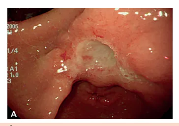
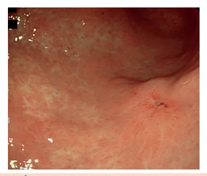
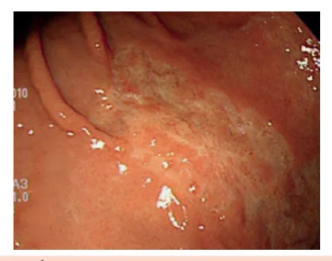
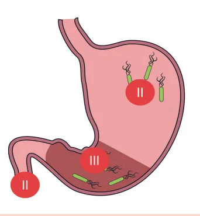
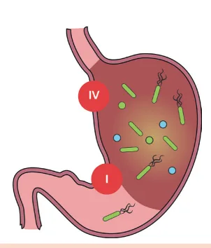
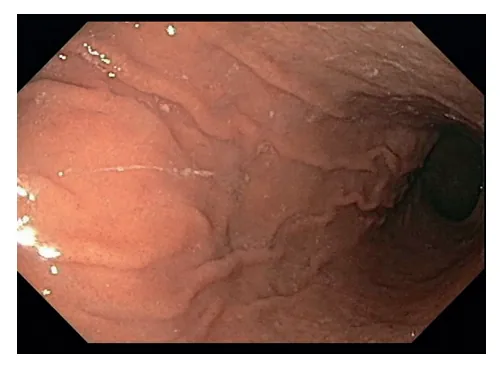

# Estômago II Úlcera Péptica, H. Pylori, Gastrite Atrófica e Dispepsia Funcional

<!-- page:1 -->

## ESTÔMAGO II: ÚLCERA PÉPTICA

## H. PYLORI, GASTRITE ATRÓFICA E

## DISPEPSIA FUNCIONAL

H. pylori, Úlcera Gástrica e Gastrite atrófica (CM)

## ÚLCERA

- Etiologia: H. pylori, AINES, Síndrome de Zollinger- ferropriva de causa desconhecida, PTI, def b12 → infecções, mastocitose, úlcera em anastomose,

Ellison, hiperparatireoidismo, neoplasias, DRGE não é indicação

- IV Consenso brasileiro (2018): OAC 14 d ou BOTM doenças granulomatosas, isquemia, estresse em 10-14 d → 2a linha = OAL ou BOFA 10-14 d // Alergia terapia intensiva penicilina = OCL 14 ou BOTM 14

- Classificação: Sakita (Ativa - A1 e A2, Cicatrizando

- V Consenso brasileiro (2026): Tentativa de

H1 e H2, Cicatriz S1 e S2) e Forrest (se sangramento enfrentar o aumento da resistência à claritromicina

- Ia, Ib, IIa = terapia endoscópica vs IIb, IIc, III) → BOTM 10-14 dias ou OAC virando qúadupla com

- Complicações: Sangramento (mais comum), bismuto (e/ou substitui IBP por PCAB) 10-14 dais ou

Perfuração, Obstrução (mais rara) Terapia dupla com altas doses de amoxicilina

- Tratamento: cessar etilismo e tabagismo, evitar GASTRITE ATRÓFICA

AINEs, medicamentos (IBP, PCAB, antiH2),

- Autoimune (corpo - anti-célula parietal e anti-fator cirurgia (se complicações, não cicatrização ou intrínseco) ou H. pylori (antro ± corpo) recidivas constantes)

- Atentar para: deficiência de ferro e b12 (anemia

H. PYLORI perniciosa) + risco TNE e adenocarcinoma

- Diagnóstico: Métodos invasivos (EDA - histologia, DISPEPSIA FUNCIONAL cultura, urease) e não invasivos (teste respiratório

- Roma IV: 1 ou + (plenitude pós-prandial, saciedade com ureia marcada, pesquisa antígeno precoce, dor ou queimação epigástrica) há pelo fecal, sorologia) menos 6 m + ausência de doença estrutural

- Quando pesquisar? Dispepsia, úlcera, câncer

- Tratamento: Procinéticos, antissecretores, tratar gástrico, MALT, uso prolongado AINEs/AAS, uso HP, antidepressivos prolongado IBP, gastrite associada ao HP, anemia

- Doenças granulomatosas → sarcoidose, doença de Crohn;

- Como qualquer outra etiologia péptica, surge do

- Insuficiência vascular → incluindo a vasoconstrição desbalanço entre os fatores de proteção da mucosa pelo uso de cocaína, crack e anfetamina;

gástrica e a acidez.

- Úlcera de estresse em terapia intensiva.

ETIOLOGIA Úlcera duodenal é 5x mais comum que a Duas principais etiologias: úlcera gástrica! Helicobacter pylori.

## AINEs: DIAGNÓSTICO

- Ação tópica direta e efeito dos metabólitos hepáticos EDA → em casos de sinais de alarme! secretados na bile.

- Classificação de Sakita:

- Age na COX1 e COX2, inibindo a produção das | A (active): A1 (bordas nítidas, presença de fibrina e prostaglandinas, a partir do ácido araquidônico hematina) ou A2 (bordas bem definidas, somente vascularização, diminuindo a perfusão.

→ Há redução da defesa gástrica e alteração na presença de fibrina espessa); Outras Etiologias

- Síndrome de Zollinger-Ellison (gastrinoma);

- Hiperparatireoidismo;

- Neoplasias → carcinoma, leiomiossarcoma, GIST; Considerar, principalmente, se são úlceras gástricas.

- Infecções → tuberculose, sífilis, herpes simples,

CMV, fungos;

- Mastocitose sistêmica;

- Pós-gastrectomia subtotal – úlcera de borda anastomótica; Figura 1: Úlcera ativa Sakita A2

---

<!-- page:2 -->

- H (healing): H1 (a fibrina é mais tênue, com Cirurgia hiperemia marginal) ou H2 (percebe-se uma ilha

- Reservado para: Não cicatrização; Recidivas constantes.

de regeneração); | Complicações;

- - O

- - Figura 2: Úlcera em fase final de cicatrização - Sakita H2

- S

- S (scar): S1 (cicatriz avermelhada) ou S2

(cicatriz esbranquiçada);

- - H

- C

- Figura 3: Úlcera cicatrizada - Sakita S2 (cicatriz esbranquiçada)

- Na presença de achado compatível com úlcera → sempre pesquisar H. pylori e coletar informações sobre uso prévio de AINEs;

- Sempre realizar biópsia em úlceras gástricas! o tratamento, a EDA deve ser repetida para observar a cicatrização!

ATENÇÃO! Em caso de úlceras gástricas, após

## TRATAMENTO

Medidas Gerais

- Alimentação;

- Cessar tabagismo;

- Cessar o etilismo;

- Evitar uso de AINEs/AAS.

Fármacos

- IBPs

- Anti H2;

- PCABs;

- Antiácidos;

- Sucralfato;

- Tratar o H. pylori se positivo!

- Se refratária pesquisar outras etiologias! | Recidivas constantes.

## COMPLICAÇÕES

Perfuração:

- Duodenais → parede anterior;

- Gástricas → parede anterior e pequena curvatura;

- Na presença de peritonite → cirurgia de urgência!

Obstrução;

- Evolui com quadro insidioso, com vômitos pósprandiais e perda de peso;

- Pode cursar com estenose pilórica ou bulbar;

- Na presença de inflamação → pode responder ao uso de IBP;

- Se cicatricial → proceder com dilatação ou cirurgia.

Sangramento:

- É a complicação mais comum;

- A úlcera é a principal causa de hemorragia digestiva alta não varicosa;

- 10 – 20% dos pacientes com HDA por úlceras não apresentam quadro dispéptico prévio;

- Em geral, o quadro se inicia com hematêmese ou melena;

- Local principal: parede posterior do bulbo

## HEMORRAGIA DIGESTIVA ALTA

- Realização de EDA após estabilização do quadro! Deve ser feita entre 12 – 24 horas;

Classificação de Forrest:

- IA sangramento em jato;

- IB sangramento em babação.

- IIA vaso visível;

- IIB coágulo aderido;

- IIC hematina;

- III apenas fibrina.

Figura 4: Úlceras: Forrest Ia (canto superior esquerdo); Ib (canto superior direito), IIb (canto inferior esquerdo), III (canto inferior direito).

---

<!-- page:3 -->

## H. PYLORI CLASSIFICAÇÃO DE JOHNSON (OBSERVE AS

## IMAGENS ANTERIORES)

- É uma infecção comum e às vezes sem

- Tipo I → úlcera em pequena curvatura, em corpo distal/ repercussão clínica! pequena incisura; associa-se à hipocloridria; É a mais comum.

## MECANISMOS DE LESÃO

- Estimula a produção de gastrina → Hipergastrinemia → leva à hipercloridria;

- O H. pylori é produtor de urease → favorece a conversão de ureia → BIC + amônia estimula a produção de toxinas que lesam a mucosa;

- Resposta imune na mucosa → causa inflamação local crônica.

## A INFECÇÃO

- Dá-se, inicialmente, pelo antro;

- Gera resposta inflamatória local → eleva a produção de gastrina e reduz a de somatostatina → decorre no aumento do HCl;

Figura 5: Topografia de úlceras gastroduodenais mais associadas com hipercloridria

- Com a cronificação da infecção: A resposta inflamatória exacerbada leva a uma atrofia e metaplasia antral → com perda gradual das células G → cursa com queda dos níveis de HCl; Nesse sentido, há migração do H. pylori para o corpo gástrico → atrofia → metaplasia displasia → câncer.

Figura 6: Topografia de úlceras gástricas mais associadas com hipocloridria | É a mais comum.

- Tipo II → ocorre no corpo gástrico e duodeno; associase à hipercloridria;

- Tipo III → úlcera pré-pilórica; associase à hipercloridria;

- Tipo IV → ocorre em pequena curvatura, em corpo gástrico proximal (alto); associa-se à hipocloridria; É a menos comum.

## DIAGNÓSTICO

- Para evitar falso-negativo: Suspender IBP 2 semanas antes; Suspender a antibioticoterapia e bismuto 4 semanas antes. Confira na página seguinte a tabela 1 atrofia e demorado sensibilidade rápido respiratório Pouco

Tabela 1: Métodos diagnósticos para pesquisa de H. pylori Método S E Comentários Padrão ouro Custo adicional Histologia 95% > 95% Dados sobre Custo elevado Invasivos 80- Pouco (EDA) Cultura > 95% 90% disponível Avaliar Menor custo 90Urease 90% Resultado 95% Teste

> 95% > 95% s marcada)

(Ur disponível Não Pesquisa

> Pouco invasivos antígeno > 90% fecal de cura

90% disponível Não é indicado 80- 80Sorologia para controle 90% 90%

## INDICAÇÕES PARA PESQUISA DE H. PYLORI

Indicações – delimitadas pelo IV Consenso Brasileiro, 2018;

- Úlcera;

- Câncer gástrico;

- Dispepsia;

- Linfoma MALT;

- Uso prolongado de AINE/AAS;

- Gastrite associada ao uso de H. pylori;

- Uso prolongado de IBP;

- Anemia ferropriva de causa desconhecida;

- Deficiência de vitamina B12;

- PTI.

---

<!-- page:4 -->

- Maastricht VI, 2022: A gastrite pelo H. pylori é Tabela 6: Alergia à penicilina:

uma doença infecciosa e, portanto, sempre deve ser tratada O IBP dose padrão 12/12h OBS.: A DRGE não configura indicação para o OBS.: A DRGE não configura indicação para o tratamento do H. pylori!

## ESQUEMA TERAPÊUTICO

ATENÇÃO! Muitas questões de prova já lhe fornecem o H. pylori positivo (independentemente da indicação da pesquisa ter sido bem feita ou não), nessas situações, na prática, se a pesquisa é positiva = tratamento.

Sempre fique atento ao comando da questão

- IV Consenso Brasileiro – 2018.

Tabela 2: 1ª linha: O IBP dose padrão 12/12h A + Amoxicilina 1 g 12/12h + Claritromicina 500 mg

- C

12/12h 14 dias Tabela 3: Alternativa Subcitrato de bismuto (120 mg q6h

- B ou 240 mg q12h)

O + IBP dose padrão 12/12h + Tetraciclina 500mg q6h G (Ou Doxiciclina 100mg q12h) + Metronidazol 400 mg 8/8h

- M

10-14 dias

- Alternar entre os esquemas de 1ª linha ou…

Tabela 4: 2ª e 3ª linha: O IBP dose padrão 12/12h A + Amoxicilina 1 g 12/12h + Levofloxacino 500 mg 24/24h 10-14 dias Tabela 5: Opção de 2a e 3a linha de tratamento Subcitrato de bismuto (120 mg q6h ou 240 mg q12h)

O + IBP dose padrão 12/12h F + Furazolidona 200 mg 12/12h A + Amoxicilina 1 g 12/12h 10-14 dias z A + Amoxicilina 1 g 12/12h + Levofloxacino 500 mg 24/24h 14 dias Tabela 7: Alternativa para alergia a penicilina = esquema de primeira linha Subcitrato de bismuto (120 mg q6h ou 240 mg q12h)

O + IBP dose padrão 12/12h + Tetraciclina 500mg q6h (Ou Doxiciclina 100mg q12h) + Metronidazol 400 mg 8/8h 10-14 dias É necessário o controle de cura? Sim!

- Faço controle de cura? Pelo menos 4 semanas após tratamento Preferir método não invasivos EDA apenas se indicada (ex : úlcera gástrica) ou na indisponibilidade de teste não-invasivo

- E se falhar 3x? Insistir apenas em casos especiais, como em pacientes com linfoma MALT, ressecção de câncer gástrico, úlceras refratárias

## GASTRITE ATRÓFICA

- Pode apresentar 2 etiologias principais: Autoimune Por H. pylori.

Figura 7: Achados endoscópicos de grande curvatura de corpo gástrico em paciente com gastrite atrófica

## GASTRITE ATRÓFICA AUTOIMUNE

- Acomete apenas o corpo gástrico; Presença dos anticorpos anticélula parietal e antifator intrínseco.

---

<!-- page:5 -->

- Evolui com deficiência de vitamina B12 TRATAMENTO

(anemia perniciosa);

- Síndrome do desconforto pós-prandial pró-cinéticos;

- Em face da hipocloridria gerada, pode ocorrer

- Síndrome do desconforto epigástrico antissecretores;

deficiência de ferro;

- H. pylori: tratar!;

- Observa-se hipergastrinemia;

- Se refratário: utilizar antidepressivo.

- Observa-se hipergastrinemia;

- Risco de tumor neuroendócrino gástrico;

- Adenocarcinoma.

- Observe a imagem a seguir: Redução das pregas gástricas; adelgaçamento da mucosa gástrica, associada à palidez.

## GASTRITE ATRÓFICA – H. PYLORI

- Acomete antro e corpo gástrico;

- Deve-se tratar o agente etiológico!;

- Demonstra risco de desenvolvimento de adenocarcinoma.

## CRITÉRIOS

- O diagnóstico é estabelecido a partir dos critérios de

## Roma IV (2016)

Tabela 8: Critérios de Roma IV para diagnóstico de

Um ou mais dos seguintes: a) Plenitude pós-prandial b) Saciedade precoce c) Dor epigástrica d) Queimação epigástrica + Ausência de evidência de doença estrutural Sintomas preenchidos nos últimos 3 meses, com pelo menos 6 meses de início - Se refratário: utilizar antidepressivo.

## REFERÊNCIAS

Figura 1: Úlcera ativa Sakita A2 Lee YJ et al, PLoS One, 2016. Figura 2: Úlcera em fase final de cicatrização - Sakita H2 Lee YJ et al, PLoS One, 2016.

Figura 3: Úlcera cicatrizada - Sakita S2 (cicatriz esbranquiçada) Lee YJ et al, PLoS One, 2016. Figura 4: Úlceras: Forrest Ia (canto superior esquerdo); Ib (canto superior direito), IIb (canto inferior esquerdo), III (canto inferior direito).

Arquivo Pessoal Figura 7: Achados endoscópicos de grande curvatura de corpo gástrico em paciente com gastrite atrófica Arquivo Pessoal
