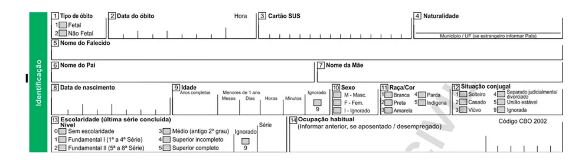
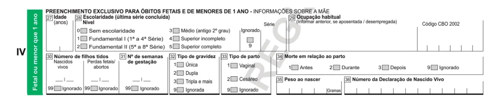
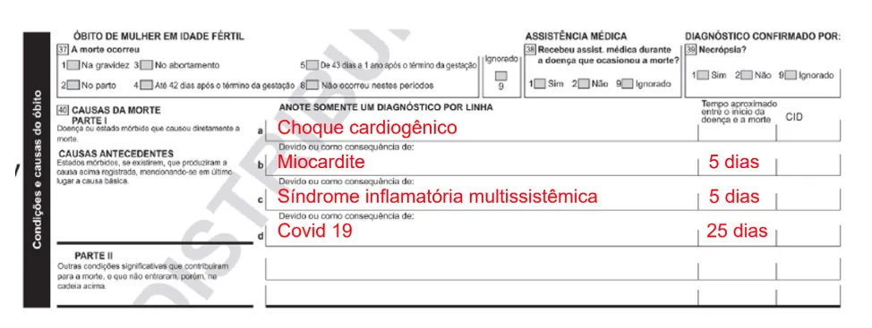
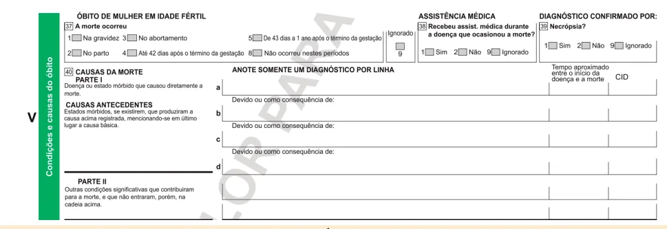
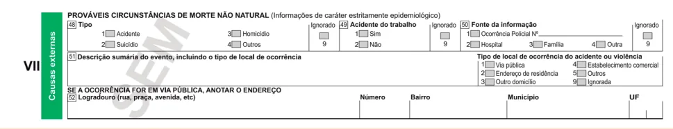

# Ética em pediatria - Parte 2

<!-- page:1 -->

## Definições

- **OMS**: circunscreve a adolescência à segunda década da vida (dos 10 aos 19 anos, 11 meses e 29 dias) e considera que a juventude se estende dos 15 aos 24 anos;
- **ECA**: considera-se criança, para os efeitos da Lei, a pessoa até 12 anos de idade incompletos, e adolescente aquela entre 12 e 18 anos de idade incompletos;
- **Adolescência**: período caracterizado por importantes transformações físicas, reorganização psíquica, peculiaridades afetivo-sexuais, comportamentais, socioculturais, espirituais, com busca de projetos de vida e outra percepção do mundo;
- Os adolescentes compõem um grupo heterogêneo de indivíduos, necessitando de um olhar atento às diferenças individuais.

## Atendimento a Adolescentes

- A pessoa central da consulta deve ser o adolescente;
- Deve-se deixar claro seus direitos ao sigilo, privacidade e confiabilidade, alertando quanto aos limites das questões éticas;
- A partir dos 12 anos de idade, podem ser atendidos sem a presença dos pais ou responsáveis, desde que sejam capazes de avaliar seu problema e de conduzir-se por meios próprios para solucioná-lo;
- Informar que nada será tratado com seus responsáveis sem que ele seja informado previamente, mesmo quando é preciso romper o sigilo;
- Segredos íntimos próprios da adolescência não requerem quebra de sigilo;
- Há necessidade de quebra se houver riscos à saúde ou integridade de vida do paciente ou de terceiros;
- O consentimento livre e esclarecido deve ser obtido do seu representante legal, e o assentimento da criança/adolescente, quando tiver discernimento para isso.

### Direitos dos adolescentes

- Consulta médica e procedimentos não invasivos sozinhos;
- Informações sobre sexualidade e saúde reprodutiva, escolha de métodos contraceptivos;
- Testes rápidos para gravidez, HIV e sífilis;
- Sigilo médico no caso de segredos íntimos próprios da adolescência.
- Deve haver quebra de sigilo se houver riscos à saúde ou integridade de vida do paciente ou de terceiros.

**Há consenso para a quebra do sigilo nas situações:**
- Gravidez;
- Violência de qualquer tipo;
- Vício em álcool ou em drogas;
- Recusa de um tratamento necessário;
- Doença grave;
- Risco de suicídio.

## Prontuário Médico

- É vedado negar o acesso ao paciente ou seu responsável legal;
- Antes da entrega do prontuário para pais ou responsáveis da criança/adolescente, deve-se avaliar a sua capacidade de discernimento.

## Pesquisa Médica em Pediatria

- Pesquisas com crianças só devem ser realizadas se a mesma não puder ser feita com adultos;
- Sempre que possível, as pesquisas com animais ou adultos devem anteceder as pesquisas com crianças.

## Declaração de Óbito (introdução)

- **Três vias**: primeira via (branca) → Secretaria de Saúde; segunda via (amarela) → Cartório de Registro Civil; terceira via (rosa) → Arquivo do serviço médico;
- Composta por 9 blocos;
- No bloco "Condições e causas do óbito": descrever as causas da morte em sequência lógica de eventos:
  - linha a: causa imediata;
  - linhas b e c: causas antecedentes;
  - linha d: causa básica.
- **Óbito fetal** se: gestação com duração igual ou superior a 20 semanas OU feto com peso corporal igual ou superior a 500 g OU estatura igual ou superior a 25 cm;
- Todos os nascidos vivos, independentemente da duração da gestação, do peso e do tempo que tenha permanecido vivo, devem ter DO emitida em caso de óbito.

---

<!-- page:2 -->

## Sigilo Médico e Adolescentes

> ⚠️ Dados de tabela ambíguos no OCR original — não foi possível reconstruir com segurança o pareamento exato entre situações e categoria; conteúdo listado em texto corrido a seguir, separado por categoria conforme indicado no material.

**Situações que indicam quebra do sigilo:**
- Presença de qualquer tipo de violência: emocional, maus tratos, sexual, bullying etc. (excluída a violência por sedução ou imposição explícita);
- Uso escalonado de álcool e outras drogas, sinais de dependência química;
- Autoagressão, ideações suicidas ou de fuga de casa, tendência homicida;
- Gravidez, abortamento;
- Sorologia positiva de HIV (comunicar aos familiares e parceria sexual);
- Não adesão a tratamentos, deixando o adolescente ou terceiros em risco;
- Diagnóstico de doenças graves, quadros depressivos e outros transtornos do campo mental.

**Situações que indicam manutenção do sigilo:**
- Ficar, namoro, iniciação sexual;
- Experimentação de psicoativos (sem sinais de dependência);
- Orientação sexual, conflitos com identidade de gênero;
- Prescrição de contraceptivos (para adolescente com maturidade para adesão);
- IST (afastada violência sexual e desde que o adolescente tenha maturidade para adesão ao tratamento).

## Particularidades do Atendimento aos Adolescentes

- Dividir a consulta em momentos distintos:
  - entrevista com paciente e familiares juntos;
  - entrevista com o paciente a sós (exceto em casos de deficiência intelectual grave, distúrbio psiquiátrico grave ou por não desejo do paciente);
  - retorno para os pais/responsáveis se necessário (casos de conflitos evidentes, violência familiar).

### Abordagem HEEADSSS

- Entrevista feita com o adolescente para avaliar comportamentos e complementar a anamnese do adolescente;
- Pelo menos uma vez por ano, ou sempre que houver indícios de algum fato estressante recente ou precipitante da consulta;
- Complementar a anamnese tradicional do adolescente;
- Cada letra da sigla corresponde a uma área a ser avaliada, para a qual são sugeridas perguntas:
  - **H** (Home) — Casa;
  - **E** (Education/Employment) — Educação / emprego;
  - **E** (Eating Disorders) — Distúrbios alimentares;
  - **A** (Activities) — Atividades;
  - **D** (Drugs) — Drogas lícitas / ilícitas;
  - **S** (Sexuality) — Sexualidade;
  - **S** (Security) — Segurança;
  - **S** (Suicide) — Suicídio.

## Direitos dos Adolescentes

- Direito a receber atenção em toda a rede de saúde, sem discriminação;
- Direito de receber informações sobre sexualidade e saúde reprodutiva;
- Direito de decidir pela escolha de métodos contraceptivos, para o exercício de uma vida sexual saudável e responsável;
- Direito à realização de testes rápidos para gravidez, HIV e sífilis:
  - até os 12 anos incompletos, a testagem e entrega dos exames devem ocorrer na presença dos pais ou responsáveis;
  - após 12 anos, a realização desses exames relaciona-se ao princípio da autonomia, após avaliação de suas condições de discernimento.
- Direito à escolha de realizar consulta médica e procedimentos não invasivos, sozinhos ou acompanhados:
  - a obrigatoriedade de um responsável para acompanhamento no serviço de saúde constitui lesão ao direito maior de uma vida saudável;
  - nos casos de internação hospitalar, é necessária a autorização de responsável legal, o que não impedirá qualquer conduta de emergência, por motivos éticos e profissionais de omissão de socorro.

## Adolescência e Atividade Sexual

- A contracepção pode e deve ser indicada para adolescentes, respeitando-se os critérios de elegibilidade médica, inclusive para menores de 14 anos de idade;
- Deve-se ter como meta a **dupla proteção**: prevenção da gravidez e de infecções sexualmente transmissíveis;
- Recomendação de contraceptivo oral ou **LARC** associado a método de barreira;
- Possibilitar a escolha entre uma ampla variedade de métodos;
- Por se tratar de métodos invasivos, a implantação dos LARC necessita da autorização de um responsável;
- Nas situações de violência sexual, é obrigatória a notificação ao Conselho Tutelar e/ou outra autoridade competente.

---

<!-- page:3 -->

- Para adolescentes menores de 14 anos de idade com atividade sexual consentida em relacionamento afetivo, é aconselhável que o médico avalie o contexto no qual está inserida a relação;
- Essa capacidade depende da maturidade e da capacidade de discernimento; essa avaliação é subjetiva e de difícil decisão;
- Do ponto de vista legal, o Código Penal Brasileiro, no artigo 217, estabelece como crime de **estupro de vulnerável** "ter conjunção carnal ou praticar outro ato libidinoso com alguém menor de 14 anos".

**Há consenso para a quebra do sigilo nas situações:**
- Gravidez;
- Violência de qualquer tipo;
- Vício em álcool ou em drogas;
- Recusa de um tratamento necessário;
- Doença grave;
- Risco de suicídio.

Em todas as situações em que se caracterizar a necessidade da quebra do sigilo médico, o paciente deve ser informado, justificando-se os motivos para esta atitude.

## Sigilo Médico

- O sigilo profissional é um dever previsto nos códigos de ética profissionais;
- Na profissão médica, é um dos pilares da relação entre o profissional, seu paciente e os familiares ou responsáveis;
- Revelar segredo médico, além de antiético, é crime — Artigo 154 do Código Penal Brasileiro.

## Código de Ética Médica e Sigilo Médico

**Capítulo IX – Sigilo Profissional**

É vedado ao médico:
- **Art. 73**: revelar fato de que tenha conhecimento em virtude do exercício de sua profissão, salvo por motivo justo, dever legal ou consentimento, por escrito, do paciente.
  - Parágrafo único. Permanece essa proibição:
    - mesmo que o fato seja de conhecimento público ou o paciente tenha falecido;
    - quando de seu depoimento como testemunha (nessa hipótese, o médico comparecerá perante a autoridade e declarará seu impedimento);
    - na investigação de suspeita de crime, o médico estará impedido de revelar segredo que possa expor o paciente a processo penal.
  - Existem três situações que permitem a quebra do sigilo:
    - quando o paciente permite (por escrito) que o médico quebre o segredo;
    - quando a legislação exige a quebra do sigilo (ex.: declaração de óbito, notificação);
    - por motivo justo (risco ao paciente ou a terceiros).
- **Art. 74**: revelar sigilo profissional relacionado a paciente menor de idade, inclusive a seus pais ou representantes legais, desde que o menor tenha capacidade de discernimento, salvo quando a não revelação possa acarretar dano ao paciente.
  - Na infância e adolescência, o sigilo profissional leva à reflexão sobre o princípio da autonomia relacionada a essa faixa etária;
  - O CEM defende o sigilo, introduzindo o conceito de discernimento ou a capacidade psiconeurobiológica para decidir;
  - Quando se diz respeito a crianças e adolescentes, cabe ao médico avaliar o nível de discernimento e decidir se deve ou não quebrar o sigilo profissional em cada situação;
  - A criança/adolescente tem direito ao sigilo se for capaz de entender o seu problema e tiver a capacidade de resolvê-lo sem ajuda.

### Prontuário médico

- Conjunto de documentos que mostra o histórico de atendimentos de saúde de um paciente;
- Documento fundamental que se reveste de segurança para o médico e o paciente;
- Protegido pelo sigilo médico;
- Qualquer paciente que receba atendimento em saúde tem direito ao prontuário;
- Compete ao médico (no consultório) e aos diretores clínicos/diretores técnicos a responsabilidade pela guarda dos documentos.

**Capítulo X – Documentos médicos**

É vedado ao médico:
- **Art. 87**: deixar de elaborar prontuário legível para cada paciente.
  - O prontuário deve conter os dados clínicos necessários para a boa condução do caso, sendo preenchido, em cada avaliação, em ordem cronológica, com data, hora, assinatura e número de registro do médico no Conselho Regional de Medicina;
  - O prontuário estará sob a guarda do médico ou da instituição que assiste o paciente.

**Observações:**
- As anotações devem ser feitas de forma legível, com data e horário, permitindo identificar os profissionais de saúde envolvidos no cuidado;
- O médico deve assinar e escrever seu nome legível e sua respectiva inscrição no CRM; não há obrigatoriedade no uso do carimbo;
- São obrigatórios: identificação do paciente, anamnese, exame físico, hipóteses diagnósticas e conduta adotada;
- Não se deve escrever a lápis, usar líquidos corretores ou mesmo deixar folhas em branco;
- O prontuário eletrônico tem a mesma função e segue as mesmas regras do documento em papel; deve ter assinatura eletrônica e certificada.

---

<!-- page:4 -->

**Capítulo X – Documentos Médicos**

É vedado ao médico:
- **Art. 85**: permitir o manuseio e o conhecimento dos prontuários por pessoas não obrigadas ao sigilo profissional, quando sob sua responsabilidade;
- **Art. 88**: negar, ao paciente, acesso a seu prontuário, deixar de lhe fornecer cópia quando solicitada, bem como deixar de lhe dar explicações necessárias à sua compreensão, salvo quando ocasionarem riscos ao próprio paciente ou a terceiros;
- **Art. 89**: liberar cópias do prontuário sob sua guarda, salvo quando autorizado, por escrito, pelo paciente, para atender ordem judicial ou para a sua própria defesa.
  - Quando requisitado judicialmente, o prontuário será disponibilizado ao perito médico nomeado pelo juiz;
  - Quando o prontuário for apresentado em sua própria defesa, o médico deverá solicitar que seja observado o sigilo profissional.

**Observações:**
- O paciente ou seu responsável têm direito aos originais ou cópias;
- A entrega para pais ou responsáveis acontece somente no caso de criança ou adolescente, avaliando a capacidade de discernimento do paciente antes da entrega; não há autorização de entrega para terceiros;
- Prontuários solicitados por outras entidades (ex.: convênios médicos, companhias de seguro), sem autorização expressa do paciente, é vedado ao médico fornecer as informações;
- O acesso pelo médico auditor enquadra-se no princípio do dever legal; esse acesso deve ocorrer dentro das dependências da instituição responsável.

### Código de Ética Médica e Pesquisa Médica

**Capítulo XII – Ensino e Pesquisa Médica**

É vedado ao médico:
- **Art. 101**: deixar de obter do paciente ou de seu representante legal o termo de consentimento livre e esclarecido para a realização de pesquisa envolvendo seres humanos, após as devidas explicações sobre a natureza e as consequências da pesquisa.
  - Para consentir, exige-se competência para tomar decisões autônomas, o que não ocorre com o menor;
  - O termo "consentimento informado" é inadequado para crianças e adolescentes;
  - Desenvolveu-se então o conceito da combinação da permissão dos pais e do assentimento do menor para pesquisas éticas e legalmente corretas;
  - No caso do paciente participante de pesquisa ser criança, adolescente, pessoa com transtorno ou doença mental, em situação de diminuição de sua capacidade de discernir, além do consentimento de seu representante legal, é necessário seu assentimento livre e esclarecido na medida de sua compreensão;
  - Nas pesquisas médicas com crianças e adolescentes, o termo de consentimento livre e esclarecido deve ser obtido do seu representante legal, e o assentimento livre e esclarecido deve ser obtido da criança ou do adolescente, quando tiver discernimento para isso.

## Declaração de Óbito (DO)

- Os médicos têm responsabilidade ética e jurídica pelo preenchimento e pela assinatura da DO;
- Ocorrido um óbito, o médico tem a obrigação legal de constatá-lo e atestá-lo, utilizando o formulário-padrão;
- Para as causas não naturais de morte, a emissão da DO é de competência dos médicos dos serviços médico-legais;
- A DO é o documento-padrão de uso em todo o território nacional;
- É padronizada, impressa com sequência numérica única, formando conjuntos de três vias autocopiativas, com diferentes cores (branca, amarela e rosa):
  - primeira via (branca) → Secretaria de Saúde;
  - segunda via (amarela) → Cartório de Registro Civil;
  - terceira via (rosa) → Arquivo do serviço médico.

### Objetivos da DO

- Coleta de dados sobre mortalidade que servem de base para o cálculo das estatísticas vitais e epidemiológicas;
- Caráter jurídico → documento hábil para a Certidão de Óbito (indispensável para as formalidades legais do sepultamento e para o início dos processos sucessórios).

## Consentimento Informado

- No âmbito médico existe o termo de consentimento informado;
- **Consentimento Informado** = processo no qual a pessoa recebe informações e explicações minuciosas sobre o procedimento, compreende, atua voluntariamente, é capaz para agir e, finalmente, consente ou não com a sua participação;
- Há diversas denominações usadas para se referir ao consentimento informado;
- O consentimento informado é a pedra fundamental de uma pesquisa eticamente correta.

## Pesquisas Médicas em Pediatria

- Pesquisas com crianças só devem ser autorizadas se a mesma investigação não puder ser feita com adultos capazes;
- Exceto quando não razoável, pesquisas com animais ou adultos devem anteceder as pesquisas com crianças.

---

<!-- page:5 -->

## Composta por 9 Blocos

### I – Identificação

- O campo idade deve ser preenchido em anos completos; no caso de menores de 1 ano, preencher em meses completos; no caso de menores de 1 mês, preencher em dias completos de vida;
- No caso de óbito fetal, o campo da idade não deve ser preenchido.

Figura 1: Bloco "Identificação" da Declaração de Óbito

### II – Residência

- No caso de óbito fetal, considerar o município de residência da mãe.

Figura 2: Bloco "Residência" da Declaração de Óbito

### III – Ocorrência

- O endereço de ocorrência do óbito refere-se ao local exato do falecimento, mesmo que a emissão da DO seja feita em hospital.

Figura 3: Bloco "Ocorrência" da Declaração de Óbito

### IV – Fetal ou Menor que 1 Ano

- As respostas para os itens 27 a 33 referem-se à mãe do falecido.

Figura 4: Bloco "Fetal ou menor que 1 ano" da Declaração de Óbito

---

<!-- page:6 -->

### V – Condições e Causas do Óbito

- Descrever as causas da morte em sequência lógica de eventos;
- CID não deve ser preenchido — cabe aos codificadores de causas de morte.

Figura 5: Bloco "Condições e causas do óbito" da Declaração de Óbito

**Exemplo de preenchimento:** Paciente masculino, 9 anos, previamente hígido, iniciou quadro de febre persistente associado a conjuntivite purulenta, rash cutâneo, dor abdominal intensa e vômitos há 4 dias. Tinha relato de sintomas gripais e SARS-CoV-2 positivo 20 dias antes. Deu entrada no pronto-socorro infantil apresentando hipotensão arterial e queda da saturação de oxigênio. Foi encaminhado à UTIP, submetido à IOT e administrado aminas não vasoativas devido à instabilidade hemodinâmica. Exames complementares evidenciaram miocardite e RT-PCR para SIM-P, com troponina, d-dímero e proteína C-reativa alterados, feito HD de choque cardiogênico e evoluiu ao óbito.

Figura 6: Exemplo de preenchimento da Declaração de Óbito

**Parte I**
- Doença ou estado mórbido que causou diretamente a morte, e outras condições significativas que contribuíram para a morte, mas que não entraram na cadeia inserida na parte I (as linhas devem ser preenchidas de cima para baixo, seguindo a ordem de "devido a" ou "como consequência de");
- Na linha a: anotar a doença ou a lesão que provocou a morte (causa terminal ou imediata);
- Nas linhas b e c: anotar os estados mórbidos que produziram a causa registrada na linha a (causas antecedentes ou consequenciais);
- Na linha d: anotar, corretamente, a causa básica, com um diagnóstico em caso de óbito fetal;
- Tempo aproximado entre o início da doença e a morte: pode ser descrito em anos, meses, dias, horas e minutos.

**Parte II**
- As causas registradas nesta parte são denominadas contribuintes.

### VI – Médico

- **Médico Assistente**: atendeu, efetivamente, o paciente durante a doença que ocasionou o óbito, ou a mãe, em caso de óbito fetal;
- **Médico Substituto**: o plantonista, residente, chefe de equipe que não tenha acompanhado o falecido durante a doença, apenas na ocasião da morte.

---

<!-- page:7 -->

Figura 7: Bloco "Médico" da Declaração de Óbito

### VII – Causas Externas

- Preenchimento pelo IML.

Figura 8: Bloco "Causas externas" da Declaração de Óbito

### VIII – Cartório

Figura 9: Bloco "Cartório" da Declaração de Óbito

### IX – Localidade sem Médico

- Este bloco deverá ser preenchido mediante a presença de duas testemunhas, apenas no caso de óbito ocorrido em localidade sem médico.

Figura 10: Bloco "Localidade sem médico" da Declaração de Óbito

## Condições para Emissão da DO

- Qualquer óbito, seja por causa natural, acidental ou violenta;
- **Óbito fetal** se: gestação com duração igual ou superior a 20 semanas OU feto com peso corporal igual ou superior a 500 g OU estatura igual ou superior a 25 cm;
- Todos os nascidos vivos que venham a falecer após o nascimento, independentemente da duração da gestação, do peso e do tempo que tenha permanecido vivo — nesse caso, a Declaração de Nascido Vivo também deve ser emitida.

### Quando não emitir a DO

- Óbito fetal, se a gestação teve duração menor que 20 semanas E se o feto tiver peso corporal menor que 500 g E estatura menor que 25 cm — apenas se a família requerer a DO, será facultada ao médico a emissão do documento para fins de sepultamento;
- Para peças anatômicas removidas por ato cirúrgico ou de membros amputados.

## Código de Ética Médica

**Capítulo X – Documentos Médicos**

É vedado ao médico:
- **Art. 83**: atestar óbito quando não o tenha verificado pessoalmente ou quando não tenha prestado assistência ao paciente, salvo, no último caso, se o fizer como plantonista, médico substituto ou em caso de necropsia e verificação médico-legal;
- **Art. 84**: deixar de atestar óbito de paciente ao qual vinha prestando assistência, exceto quando houver indícios de morte violenta.

## Referências

Figuras 1 a 10: BRASIL. Ministério da Saúde. Declaração de óbito: manual de instruções para preenchimento. Brasília, DF: Ministério da Saúde, 2022. Disponível em: https://www.gov.br/saude/pt-br/centrais-de-conteudo/publicacoes/svsa/vigilancia/declaracao-de-obito-manual-de-instrucoes-parapreenchimento.pdf. Acesso em: 17 jun. 2025.

