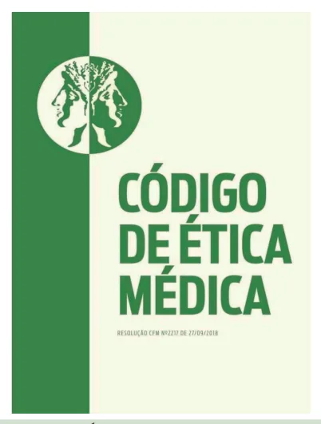

# Ética Médica

<!-- page:1 -->

Questões ético-legais.

## Ética e Bioética

### Conceitos Gerais

- **Ética:** conjunto de regras, princípios ou maneiras de pensar e se expressar. Representa os valores e normas que permitem às pessoas conviverem em sociedade e manterem uma relação profissional adequada;
- **Bioética:** estudo sistemático da conduta humana, analisada à luz de valores e princípios morais, especialmente diante de dilemas decorrentes da investigação e intervenção sobre a vida, a saúde e o meio ambiente. Promove reflexão crítica acerca dos fundamentos morais que orientam a vida em sociedade.

### Principialismo

Teoria bioética predominante, que se baseia em quatro princípios fundamentais:

- **Autonomia:** "a pessoa escolhe" — relaciona-se ao Termo de Consentimento Livre e Esclarecido (TCLE). O médico deve respeitar a decisão do paciente ou de seus representantes legais, exceto em situações de iminente perigo de vida, quando a beneficência prevalece.
  - *Exemplo:* paciente Testemunha de Jeová em risco iminente pode ter a autonomia limitada em prol da vida, quando for incapaz, menor, ou houver outro impedimento à autonomia livre.
  - Condições relacionadas: liberdade do paciente em decidir, de forma informada, livre e consciente, sobre sua conduta; capacidade de escolha e deliberação; evitar paternalismo médico; respeitar as decisões de pacientes aptos a escolher seu tratamento.
- **Não maleficência:** "evitar danos" — relacionado ao juramento hipocrático *"Primum non nocere"* (primeiro, não causar dano). Não matar, causar dor ou sofrimento desnecessário, incapacitar, ofender ou privar o paciente de bens necessários à vida.
- **Beneficência:** "fazer o bem" — agir em prol do bem-estar do paciente, maximizando benefícios e minimizando riscos. Relacionado ao altruísmo e à benevolência.
- **Justiça:** "tratar com equidade" — garantir equidade, tratando igualmente os iguais e de forma desigual os desiguais, priorizando os mais vulneráveis.

### Para o Médico Aplicar Tais Preceitos

- Ter intenção genuína de respeitar os princípios;
- Conhecer as consequências das condutas;
- Agir livre de influências externas.

### Responsabilidade Profissional

- Proibido causar dano por imperícia, imprudência ou negligência;
- **Iatrogenia:** dano decorrente de tratamento ou intervenção médica.

## Sigilo Médico

- Proibido revelar informações, salvo por dever legal, justa causa ou autorização expressa;
- Exemplos de dever legal: doenças de notificação compulsória, maus-tratos, Lei Maria da Penha.

## Publicidade Médica

- Deve ser educativa e informativa, sem sensacionalismo;
- Proibido prometer resultados ou anunciar especialidade não registrada.

## Telemedicina

- Atendimento remoto regulamentado.

> O tema de Telemedicina pode ser consultado na ficha "Ferramentas da APS/ESF".

---

<!-- page:2 -->

## Código de Ética Médica

### Princípios Básicos

- **Ética Profissional:** conjunto de normas morais e princípios que orientam a conduta do indivíduo no exercício de sua profissão, garantindo a integridade, a responsabilidade e o respeito às pessoas atendidas;
- **Ética Médica:** segmento da ética profissional que abrange os princípios fundamentais, direitos e deveres dos médicos, regulando a relação com pacientes, familiares, colegas e instituições. Está formalizada no Código de Ética Médica (CEM), que traduz as obrigações morais da profissão em normas deontológicas e diceológicas;
- **Resolução CFM nº 2.217**, de 27 de setembro de 2018, modificada pelas Resoluções CFM nº 2.222/2018 e 2.226/2019.

*Figura 1: Código de Ética Médica.*

- Contém as normas que devem ser seguidas pelos médicos no exercício de sua profissão, inclusive nas atividades relativas a ensino, pesquisa e administração de serviços de saúde, bem como em quaisquer outras que utilizem o conhecimento advindo do estudo da medicina;
- Também vale para as organizações de prestação de serviços médicos;
- Os médicos em geral também participam da fiscalização do cumprimento das normas;
- Aborda tanto direitos quanto deveres dos médicos;
- A transgressão das normas deontológicas sujeitará os infratores às penas disciplinares previstas em lei.

**Composição:**

- 26 princípios fundamentais do exercício da medicina;
- 11 normas diceológicas (direitos);
- 117 normas deontológicas (deveres);
- 4 disposições gerais.

**Capítulos:**

- I — Princípios Fundamentais;
- II — Direitos dos Médicos;
- III — Responsabilidade Profissional;
- IV — Direitos Humanos;
- V — Relação com Pacientes e Familiares;
- VI — Doação e Transplante de Órgãos e Tecidos;
- VII — Relação entre Médicos;
- VIII — Remuneração Profissional;
- IX — Sigilo Profissional;
- X — Documentos Médicos;
- XI — Auditoria e Perícia Médica;
- XII — Ensino e Pesquisa Médica;
- XIII — Publicidade Médica;
- XIV — Disposições Gerais.

> **Nota:** os Capítulos III a XIII iniciam com a expressão "É vedado ao médico...", indicando as proibições e obrigações deontológicas.

### Destaques no Capítulo I: Princípios Fundamentais

- **III** — Para exercer a medicina com honra e dignidade, o médico necessita ter boas condições de trabalho e ser remunerado de forma justa;
- **VII** — O médico exercerá sua profissão com autonomia, não sendo obrigado a prestar serviços que contrariem os ditames de sua consciência ou a quem não deseje, excetuadas as situações de urgência, emergência, ou quando sua recusa possa trazer danos à saúde do paciente;
- **VIII** — O médico não pode, em nenhuma circunstância ou sob nenhum pretexto, renunciar à sua liberdade profissional, nem permitir quaisquer restrições ou imposições que possam prejudicar a eficiência e a correção do seu trabalho;
  - *Observação:* o médico legalmente habilitado pode atuar em qualquer área da medicina, mas só pode anunciar especialidade registrada no CRM (com RQE);
- **X** — O trabalho do médico não pode ser explorado por terceiros com objetivos de lucro, finalidade política ou religiosa.
  - *Exemplo:* laboratórios (fabricantes de medicamentos, próteses e órteses) que "oferecem" percentuais ou mimos, como viagens e passagens aéreas, aos médicos que direcionarem suas prescrições para esta ou aquela empresa;
- **XI** — O médico guardará sigilo a respeito das informações de que detenha conhecimento no desempenho de suas funções, com exceção dos casos previstos em lei.

### Publicidade Médica

- **Definição:** publicidade é a promoção de serviços, qualificações ou estruturas médicas. Propaganda refere-se à divulgação de assuntos e ações de interesse da medicina;
- **Obrigatoriedade:** toda peça publicitária deve conter nome do médico, número do CRM e RQE (quando houver).

---

<!-- page:3 -->

**Permissões:**

- Divulgação de qualificação técnica, serviços, horários, localização, valores e formas de pagamento;
- Divulgação de aparelhos e tecnologias, conforme normas da Anvisa e CFM;
- Uso de redes sociais (Instagram, TikTok, Facebook etc.) para conteúdo informativo e educativo, sem caráter sensacionalista.

**Proibições:**

- Prometer resultados ou garantir sucesso de tratamentos;
- Divulgar especialidade sem RQE registrado;
- Expor imagens de pacientes ou procedimentos, mesmo com autorização, quando houver risco de identificação;
- Práticas de autopromoção, concorrência desleal ou sensacionalismo;
- Fazer propaganda de medicamentos, insumos ou equipamentos sem registro na Anvisa.

- **Uso de imagem:** permitido apenas com finalidade educativa, respeitando anonimato, pudor e direitos autorais;
- **Responsabilidade:** o médico, diretor técnico ou presidente de entidade médica responde pelo conteúdo divulgado.

### Sigilo Profissional

- **Art. 73** — É vedado ao médico revelar fato do qual tenha conhecimento em virtude do exercício da profissão, salvo em três situações:
  - Por motivo justo;
  - Por dever legal;
  - Com consentimento expresso, por escrito, do paciente.

**Parágrafo único** — Essa proibição permanece válida:

- **a)** Mesmo que o fato seja de conhecimento público ou o paciente tenha falecido;
- **b)** Durante depoimento como testemunha — nesta hipótese, o médico deve comparecer perante a autoridade e declarar formalmente seu impedimento;
- **c)** Na investigação de crime, quando a revelação do segredo possa expor o paciente a processo penal.

- **Art. 75** — Fazer referência a casos clínicos identificáveis, exibir pacientes ou imagens que os tornem reconhecíveis em anúncios profissionais ou na divulgação de assuntos médicos em meios de comunicação em geral, mesmo com autorização do paciente;
- **Art. 79** — É vedado ao médico deixar de preservar o sigilo profissional durante a cobrança de honorários, seja por meio judicial ou extrajudicial.
  - *Exemplo:* não se deve expor diagnósticos, detalhes clínicos ou documentos médicos em processos de cobrança;
- **Art. 89** — É vedado ao médico liberar cópias do prontuário sob sua guarda, exceto:
  - Para atender ordem judicial;
  - Para sua própria defesa;
  - Quando autorizado por escrito pelo paciente.
  - **§ 1º** Quando houver requisição judicial, o prontuário deve ser encaminhado diretamente ao juízo requisitante, nunca entregue a terceiros.

> A quebra de sigilo também é prevista como crime pelo Código Penal, exceto em algumas condições, pois o sigilo profissional não é absoluto.

### Processo de Morte — Eutanásia e Suicídio Assistido

- **Eutanásia:** ação direta do médico para antecipar a morte, com o objetivo de cessar o sofrimento do paciente. **É proibida no Brasil**;
- **Suicídio assistido:** o profissional fornece meios ou orientações para que o paciente provoque sua própria morte. **Também é proibido no Brasil**.

> **Art. 41 do Código de Ética Médica:** "É vedado ao médico abreviar a vida do paciente, ainda que a pedido deste ou de seu representante legal."
>
> "Nos casos de doença incurável e terminal, deve o médico oferecer todos os cuidados paliativos disponíveis, sem empreender ações diagnósticas ou terapêuticas inúteis ou obstinadas, levando sempre em consideração a vontade expressa do paciente ou, na sua impossibilidade, a de seu representante legal."

**Tabela 1: Diferenças entre Eutanásia e Suicídio Assistido**

| Papel | Eutanásia | Suicídio Assistido |
|---|---|---|
| Paciente | Passivo | Ativo |
| Profissional | Ativo | Passivo |

**Outros conceitos:**

- **Ortotanásia:** permissão da morte natural, evitando prolongamento artificial, com foco em cuidados paliativos e sedação, se necessária;
- **Distanásia (obstinação terapêutica):** intervenções desproporcionais ou inúteis que prolongam o processo de morte, causando sofrimento;
- **Mistanásia:** morte precoce e evitável por causas sociais, políticas, econômicas ou por má prática profissional (morte miserável).

*Figura 2: Dimensões da vida e do processo de morte — terapêuticas, ética e decisões (espectro entre viver/vida/curativa/antecipar e morrer/morte/paliativa-intensiva/postergar, incluindo eutanásia, suicídio assistido e obstinação terapêutica).*

---

<!-- page:4 -->

## Ética e Pesquisa

- **XXIV** — Sempre que participar de pesquisas envolvendo seres humanos ou qualquer animal, o médico respeitará as normas éticas nacionais, bem como protegerá a vulnerabilidade dos sujeitos da pesquisa.

**Pesquisa com humanos:**

- Relacionada com relevância social e científica;
- Deve ter aprovação por Comitê de Ética em Pesquisa;
- Deve ter o TCLE (consentimento informado).

## Destaques no Capítulo III: Responsabilidade Profissional

É vedado ao médico:

- **Art. 1º** — Causar dano ao paciente, por ação ou omissão, caracterizável como imperícia, imprudência ou negligência.

**Tipos de erros médicos:**

- **Imperícia:** falta de preparo técnico ou habilidade necessária para a prática médica. *Exemplo:* executar um procedimento sem o conhecimento adequado.
  > "Não sei / Não devo / Faço" → fez errado o que não sabia.
- **Imprudência:** agir de forma precipitada ou sem a devida cautela, mesmo conhecendo os riscos.
  > "Sei / Devo / Faço errado" → fez errado o que sabia.
- **Negligência:** omissão, descuido ou falta de atenção no cumprimento do dever médico.
  > "Sei / Devo / Não faço" → não fez o que sabia e devia.

**Erro médico x Iatrogenia:**

- **Erro médico:** resultado adverso decorrente de conduta inadequada do profissional;
- **Iatrogenia:** dano decorrente de intervenção médica, sem relação direta com negligência, imperícia ou imprudência. *Exemplo:* amputação de membro para evitar a disseminação de infecção.

> **Obs.:** o consentimento do paciente não exime a responsabilidade do médico.

### Responsabilidade e Código de Defesa do Consumidor (CDC)

- Em saúde suplementar, o paciente é equiparado a consumidor (art. 14, CDC). O médico responde de forma **subjetiva** (depende da prova de culpa), enquanto hospitais e clínicas podem ter responsabilidade **objetiva**;
- **Inversão do ônus da prova:** prevista no art. 6º, VIII, do CDC, em favor do paciente (hipossuficiência).

## Destaques no Capítulo X: Documentos Médicos

É vedado ao médico:

- **Art. 86** — Deixar de fornecer laudo médico ao paciente ou ao seu representante legal, quando este for encaminhado ou transferido para continuação do tratamento, ou em caso de solicitação de alta;
- **Art. 88** — Negar ao paciente ou, na sua impossibilidade, ao seu representante legal, acesso ao prontuário, bem como deixar de fornecer cópia quando solicitada, ou de prestar explicações necessárias para sua compreensão, salvo se houver risco ao próprio paciente ou a terceiros;
- **Art. 89** — Liberar cópias do prontuário sob sua guarda, exceto:
  - Para atender ordem judicial;
  - Para sua própria defesa;
  - Quando autorizado por escrito pelo paciente.
  - **§ 1º** Quando requisitado judicialmente, o prontuário deve ser encaminhado diretamente ao juízo requisitante, e não entregue a terceiros;
- **Art. 112** — Divulgar informação sobre assunto médico de forma sensacionalista, promocional ou de conteúdo inverídico;
- **Art. 113** — Divulgar, fora do meio científico, processo de tratamento ou descoberta cujo valor ainda não esteja cientificamente reconhecido por órgão competente;
- **Art. 114** — Anunciar títulos científicos que não possa comprovar, bem como especialidade ou área de atuação para a qual não esteja qualificado e registrado no CRM;
- **Art. 115** — Participar de anúncios de empresas comerciais, qualquer que seja sua natureza, utilizando-se de sua profissão;
- **Art. 117** — Deixar de incluir, em anúncios profissionais de qualquer ordem, seu nome completo, número no CRM com o estado da Federação, e Registro de Qualificação de Especialista (RQE) quando anunciar a especialidade. Nos anúncios de estabelecimentos de saúde, devem constar o nome e o número de registro no CRM do diretor técnico.

## Referências

- Figura 1: CONSELHO FEDERAL DE MEDICINA (Brasil). Resolução CFM nº 2.217, de 27 de setembro de 2018. Aprova o Código de Ética Médica. Diário Oficial da União: seção 1, Brasília, DF, 01 nov. 2018, p. 179-180.
