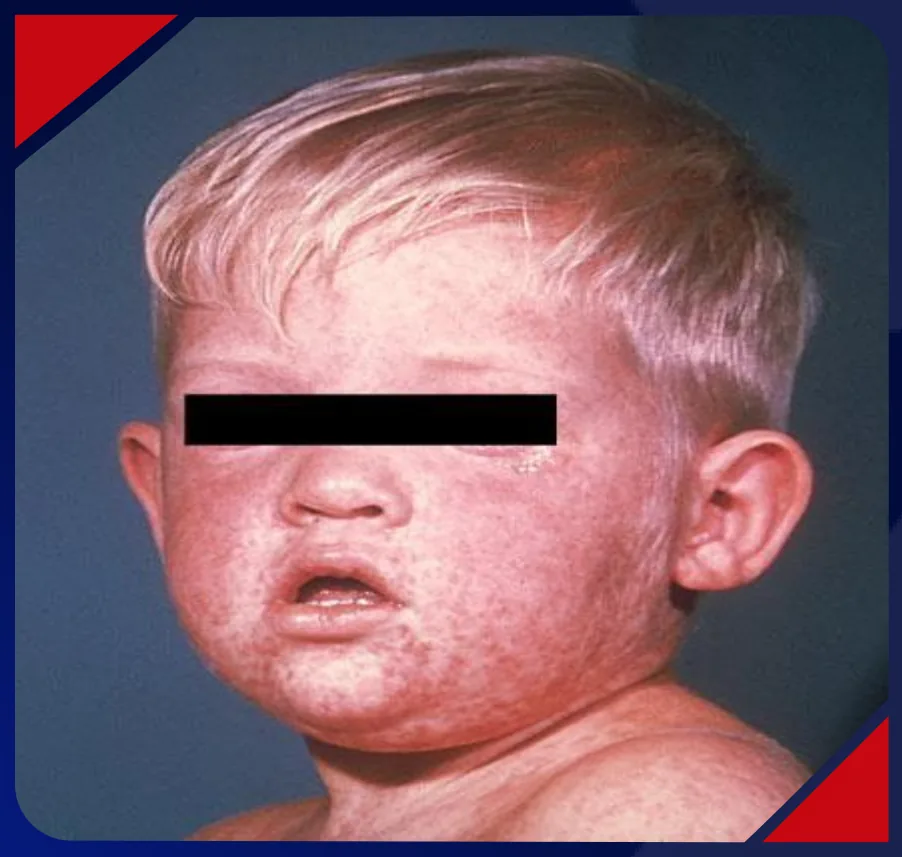
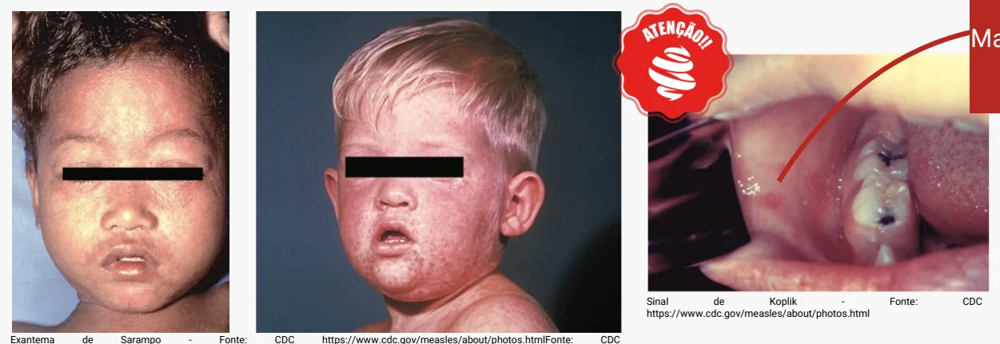
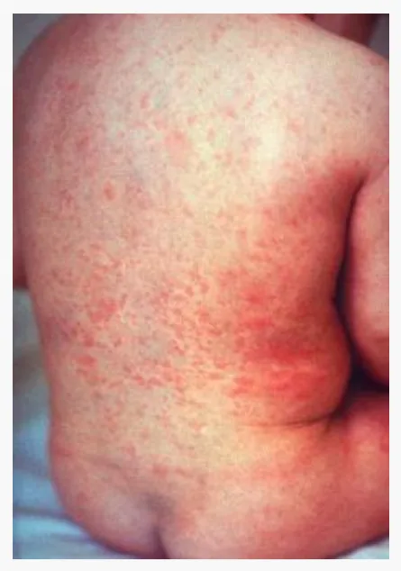
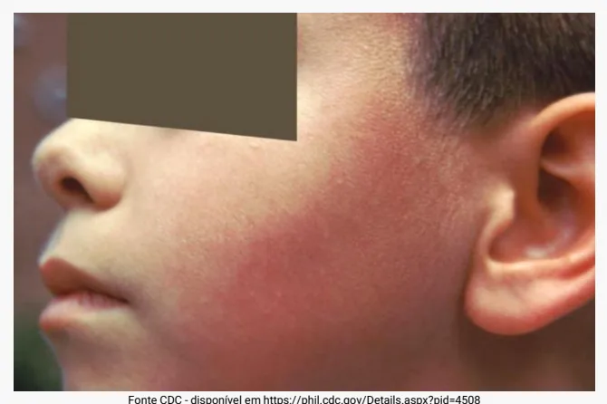
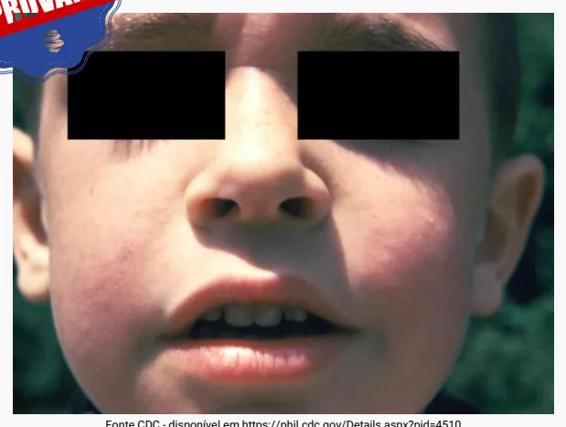
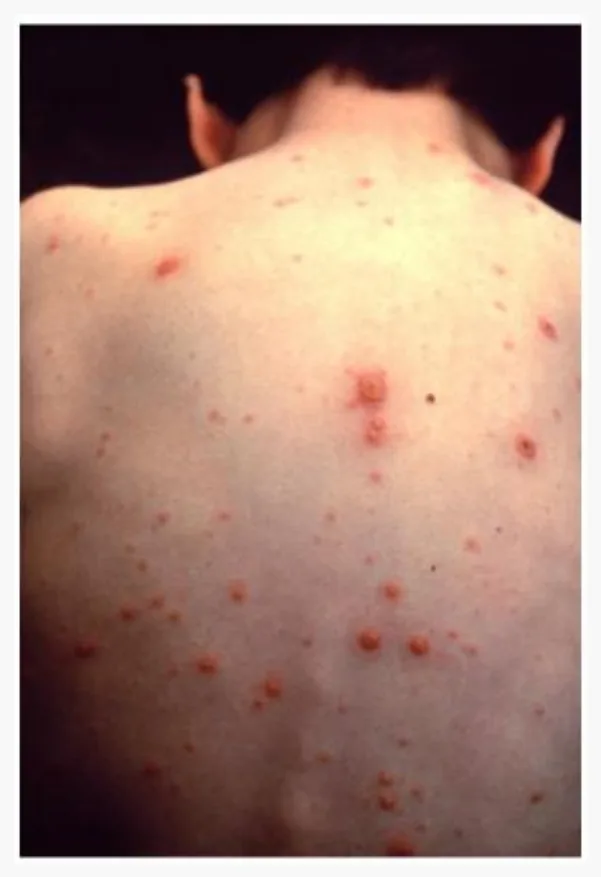
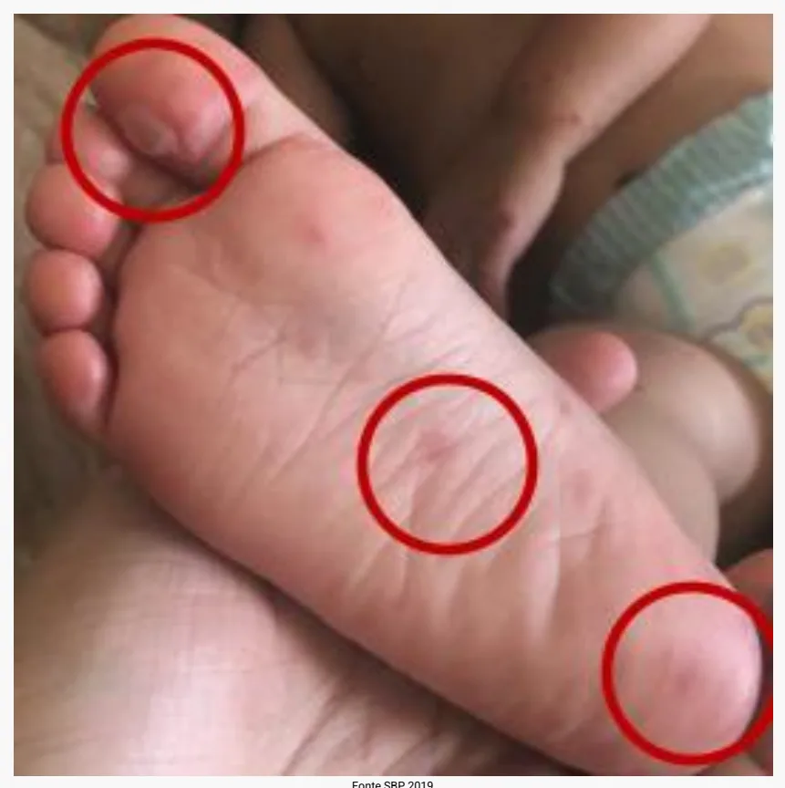
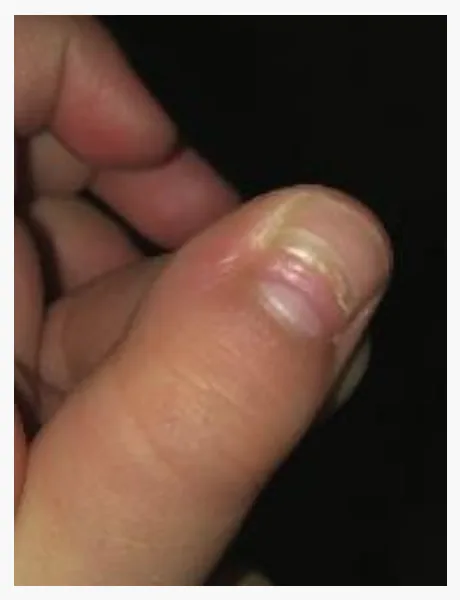
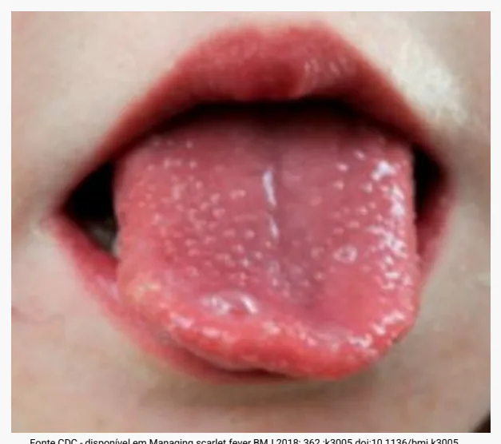
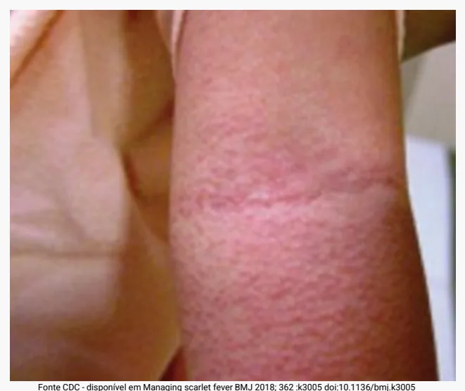

# Exantemáticas

<!-- page:1 -->

## Doenças Exantemáticas

### Dra. Mariah Rodrigues

### Infectologia

---

<!-- page:2 -->

## Nessa Aula Revisaremos

- Exantemas virais não vesiculares
- Exantemas virais vesiculares
- Exantemas bacterianos

---

<!-- page:3 -->

## Exantemas Virais Não Vesiculares

### Sarampo / Rubéola / Eritema Infeccioso / Exantema Súbito / Mononucleose Infecciosa

---

<!-- page:4 -->

## Sarampo

---

<!-- page:5 -->

### Conceitos Gerais

- **Agente**: *Paramyxoviridae* – gênero *Morbillivirus*
- **Incubação**: entre 7 e 21 dias
- **Epidemiologia**: qualquer faixa etária → lactentes até adultos jovens
- **Altamente contagioso**: até nove em cada dez pessoas suscetíveis com contato próximo com o sarampo desenvolverão a doença
- **Transmissão**: gotículas e aerossóis
- **Contágio**: 6 dias antes do exantema até 4 dias após seu aparecimento

---

<!-- page:6 -->

### Quadro Clínico

- **Pródromos catarrais**: febre, rinorreia, tosse, conjuntivite
- **Exantema**: maculopapular, morbiliforme, com direção **cefalocaudal**
- **Remissão**: escurecimento do exantema, com descamação fina e furfurácea
- **Sinal patognomônico — manchas de Koplik**: manchas branco-azuladas em mucosa jugal com fundo vermelho

Sinal de Koplik - Fonte: CDC https://www.cdc.gov/measles/about/photos.html | Exantema de Sarampo - Fonte: CDC https://www.cdc.gov/measles/about/photos.html

---

<!-- page:7 -->

### Diagnóstico

- **Caso suspeito**: todo indivíduo que apresentar febre e exantema maculopapular morbiliforme de direção cefalocaudal, acompanhados de ≥ 1 dos seguintes sinais e sintomas — tosse e/ou coriza e/ou conjuntivite, independentemente da idade e da situação vacinal
- **Diagnóstico**: todo caso suspeito comprovado a partir de critério laboratorial, vínculo epidemiológico ou critério clínico
  - **Sorologia (ELISA)**: anticorpos IgM específicos, soroconversão ou aumento de IgG
  - **RT-PCR**: em amostras de orofaringe, nasofaringe, urina e líquor

---

<!-- page:8 -->

### Manejo

> ⚠️ **Notificar imediatamente todo caso suspeito de sarampo em até 24 horas!**

- **Tratamento**: sintomático + vitamina A
- Pacientes com suspeita de sarampo internados devem ser submetidos a **isolamento respiratório de aerossol** até 4 dias após o início do exantema
- **Vitamina A**: 1x/dia por 2 dias → uma dose no dia da suspeita e uma no dia seguinte
  - **< 6 meses**: 50.000 UI VO
  - **6–11 meses**: 100.000 UI VO
  - **> 12 meses**: 200.000 UI VO
- **Complicações**: otite média, diarreia, pneumonia e laringotraqueobronquite
- **Complicações graves**: encefalite e panencefalite esclerosante subaguda (7–10 anos após a infecção inicial)

---

<!-- page:9 -->

### Controle

- **Prevenção**: vacinação é a medida mais eficaz
- **Estratégias de controle**: bloqueio vacinal x imunoglobulina

**Imunoglobulina**
- Indicada para: imunossuprimidos, gestantes, **< 6 meses**
- Prazo: em até 6 dias do contato

**Bloqueio vacinal**
- Vacinar os não vacinados a partir de 6 meses
- Prazo: em até 72h do contato, no menor tempo possível

---

<!-- page:10 -->

### Questão — Revalida 2020

Uma lactente com 10 meses de idade é levada à Unidade Básica de Saúde pela mãe, a qual demonstra preocupação pelo contato da filha com um tio que, no dia anterior, chegou de viagem do exterior com sintomas respiratórios e manchas no corpo. Ele procurou atendimento no pronto-socorro e foi diagnosticado como caso suspeito de sarampo. A conduta médica indicada para a lactente é administrar a vacina:

A) Tetraviral em até 48 horas após o contato com o caso suspeito, sendo essa a dose 1, seguida da segunda dose aos 12 meses

B) Tetraviral em até 72 horas após o contato com caso suspeito, sendo essa a dose 1, seguida da vacinação habitual aos 12 meses

C) Tríplice viral em até 48 horas após o contato com o caso suspeito, sendo essa a dose zero, seguida da segunda dose aos 12 meses

D) Tríplice viral em até 72 horas após o contato com o caso suspeito, sendo essa a dose zero, seguida da vacinação habitual aos 12 meses

---

<!-- page:11 -->

---

<!-- page:12 -->

## Rubéola

---

<!-- page:13 -->

- **Agente**: família *Togaviridae*
- **Incubação**: 12 a 23 dias
- **Epidemiologia**: escolares e adolescentes
- **Transmissão**: gotículas
- **Contágio**: 7 dias antes a 7 dias após a data do início do exantema

---

<!-- page:14 -->

### Quadro Clínico

> ⚠️ 20% a 50% de todas as infecções por rubéola ocorrem sem exantema ou outras manifestações clínicas!

- **Pródromos**: podem não ocorrer — febre baixa, mal-estar e coriza discreta
- **Linfadenopatia**: retroauricular, occipital e/ou cervical posterior, pode ocorrer
- **Exantema**: maculopapular, iniciado em face, couro cabeludo e pescoço; progride para tronco e membros; **sem descamação**
- **Manchas de Forchheimer**: manchas no palato
- **Sintomas articulares**: poliartralgia e poliartrite — raramente em crianças, comuns em adolescentes e adultos

Fonte: CDC - https://www.cdc.gov/rubella/about/photos.html

---

<!-- page:15 -->

- **Caso suspeito**: todo indivíduo que apresentar febre e exantema maculopapular, acompanhado de linfadenopatia retroauricular e/ou occipital e/ou cervical

---

<!-- page:16 -->

> ⚠️ **Notificar caso suspeito de rubéola em até 24 horas!**

- **Tratamento**: sintomático
- **Complicações**: encefalite pós-infecciosa e trombocitopenia

**Atenção — Síndrome da Rubéola Congênita (SRC)**

Ocorre quando a rubéola é adquirida pela gestante e transmitida ao feto → maior risco se nas primeiras 12 semanas de gestação.

- **Sintomas gerais**: icterícia, hepatoesplenomegalia, petéquias/púrpura, anemia hemolítica
- **Tríade clássica**: olhos, ouvidos e coração
  - Perda auditiva
  - Cardiopatia congênita (PCA e estenose pulmonar)
  - Catarata congênita (defeitos visuais em geral)

---

<!-- page:17 -->

## Eritema Infeccioso

---

<!-- page:18 -->

- **Agente**: Parvovírus B19
- **Incubação**: 4–14 dias (até 21 dias)
- **Epidemiologia**: 5–15 anos
- **Baixo contágio**

---

<!-- page:19 -->

### Quadro Clínico

- **Pródromos**: geralmente ausentes ou leves
- **Exantema em 3 fases**:
  - **Fase 1**: fácies esbofeteadas (eritema malar); exantema maculopapular que poupa região perioral, testa e nariz
  - **Fase 2**: maculopapular, rendilhado e pruriginoso; **poupa palmoplantar**
  - **Fase 3**: rendilhado, que recidiva com sol, atividade física e frio

Fonte CDC - disponível em https://phil.cdc.gov/Details.aspx?pid=4510 e https://phil.cdc.gov/Details.aspx?pid=4508

---

<!-- page:20 -->

### Diagnóstico e Manejo

- **Sorologia**: IgG e IgM para parvovírus humano B19
- **Detecção de DNA viral** por biologia molecular no sangue
- **Tratamento**: sintomático

---

<!-- page:21 -->

## Exantema Súbito

---

<!-- page:22 -->

- **Agente**: Herpes 6 e 7
- **Incubação**: 9–10 dias para HHV-6; desconhecida para HHV-7
- **Epidemiologia**: lactentes

---

<!-- page:23 -->

### Quadro Clínico

- Início **súbito**, com febre alta e contínua
- **Linfonodomegalia cervical**: achado muito frequente
- **Exantema**: surge quando cessa a febre, geralmente após 3–4 dias de duração
  - Lesões maculopapulares rosadas que se iniciam no tronco e se disseminam para cabeça e extremidades
  - Erupção de curta duração, desaparece sem deixar descamação ou hiperpigmentação
- Outra manifestação: doença febril inespecífica e sem rash (febre alta que pode persistir por 3 a 7 dias)

---

<!-- page:24 -->

- **Diagnóstico**: geralmente **clínico**
- **Complicações**: atentar para ocorrência de convulsão febril; encefalite em imunossuprimidos

---

<!-- page:25 -->

### Questão — Revalida 2023

Um paciente de 17 anos, previamente hígido, relata cefaleia, dor de garganta e febre há 8 dias. Ao exame físico, apresenta linfonodos cervicais com características fibroelásticas que são indolores; o maior possui 1,5 cm de diâmetro. Seu exame abdominal está sem alterações. O hemograma revela leucocitose (15.500 células/mm³) e linfocitose com presença de linfócitos atípicos. Diante desse quadro, a conduta diagnóstica inicial adequada é a realização de:

A) Sorologia para Epstein-Barr

B) Biópsia excisional do linfonodo

C) Punção aspirativa da medula óssea

D) Tomografia computadorizada do pescoço

---

<!-- page:26 -->

---

<!-- page:27 -->

## Mononucleose Infecciosa

---

<!-- page:28 -->

- **Agente**: a mononucleose infecciosa hoje é considerada uma síndrome; o vírus Epstein-Barr é o responsável por cerca de 80% dos casos
- **Incubação**: 30–50 dias
- **Epidemiologia**: > 2 anos até adolescentes
- **Transmissão**: contato íntimo oral

---

<!-- page:29 -->

### Quadro Clínico

- **Pródromos**: febre, cefaleia, mal-estar
- Evolui para linfonodomegalia, hepatoesplenomegalia e faringoamigdalite
- Pode apresentar **sinal de Hoagland**: edema periorbitário
- **Exantema**: tipo variável → surge em 15–20% dos casos apenas
- A erupção cutânea pode ser desencadeada pela administração de **penicilina ou ampicilina**

---

<!-- page:30 -->

- Intensa **leucocitose** no hemograma, com presença de linfócitos atípicos
- **Enzimas hepáticas** podem estar alteradas
- Anticorpos IgM e IgG costumam estar presentes no início do quadro clínico, assim como a detecção do genoma viral por PCR
- **Não é doença de notificação compulsória**
- **Risco de ruptura esplênica**

---

<!-- page:31 -->

## Exantemas Virais Vesiculares

### Varicela / Enteroviroses

---

<!-- page:32 -->

## Varicela

---

<!-- page:33 -->

- **Agente**: vírus da varicela zóster, do grupo herpes vírus
- **Incubação**: 10–21 dias
- **Epidemiologia**: 1 a 14 anos
- **Transmissão**: aerossol, contágio direto e raramente transmissão vertical
- **Contágio**: de um a dois dias antes do aparecimento do exantema até a formação de crostas de todas as lesões

---

<!-- page:34 -->

### Quadro Clínico

- **Pródromos**: febre baixa e mal-estar, mais proeminentes em adolescentes e adultos
- **Exantema**: primeiro sinal da doença em crianças → inicia na **face**
  - Maculo-vesicular que evolui para crosta → **polimorfismo regional**
  - Envolvimento do couro cabeludo, das mucosas orais e genitais é frequente

Fonte CDC - disponível em https://www.cdc.gov/chickenpox/signs-symptoms/photos.html

---

<!-- page:35 -->

- O diagnóstico é **clínico**, considerando os sinais e sintomas apresentados
- Os exames laboratoriais não são utilizados para confirmação ou descarte dos casos, **exceto**: diagnóstico diferencial em casos graves e óbitos, ou em apresentações clínicas menos típicas
- **Padrão-ouro**: PCR → swabs provenientes das lesões vesiculares não cobertas e das crostas de lesões crostosas

---

<!-- page:36 -->

### Tratamento

- Pessoas sem risco de agravamento: **sintomático**
- Isolamento respiratório e de contato
- Se infecção secundária, recomenda-se uso de antibióticos
- **Específico**: administração do antiviral **aciclovir** → indicado para pessoas com risco de agravamento

**Indicações de aciclovir**
- Idade maior do que 12 anos
- Portadores de doença dermatológica crônica
- Pessoas com pneumopatias crônicas ou em uso prolongado de ácido acetilsalicílico
- Pessoas em uso de corticoides (inalatório ou oral)

---

<!-- page:37 -->

### Complicações

- **Infecções bacterianas secundárias**: complicação mais frequente, causada por estreptococos e estafilococos
- **Pneumonite intersticial** secundária à varicela — nas crianças imunodeprimidas, é a causa mais importante de óbito
- **Encefalite**: a região mais frequentemente atingida é o cerebelo, traduzindo-se por ataxia; pode causar sonolência, coma e hemiplegia, podendo deixar sequelas
- **Síndrome de Reye**: degeneração aguda do fígado acompanhada de encefalopatia hipertensiva grave após uso de ácido acetilsalicílico (AAS) em pacientes com varicela

---

<!-- page:38 -->

### Estratégias de Controle

- **Prevenção**: esquema vacinal do PNI
- **Bloqueio vacinal pós-exposição**: controle de surto em ambiente hospitalar, creches e escolas que atendem crianças menores de sete anos; comunicantes suscetíveis imunocompetentes a partir de nove meses de idade — em até 120 horas (5 dias) do contato
- **Imunoglobulina pós-exposição**: paciente com risco de varicela grave + comunicante suscetível + contato significativo — em até 96 horas (4 dias) do contato
- Indicações: ver a seguir

---

<!-- page:39 -->

> ⚠️ Dados de tabela ambíguos no OCR original — não foi possível reconstruir com segurança; conteúdo listado em texto corrido.

**Grupos de risco:**
- Crianças ou adultos imunodeprimidos
- Menores de 1 ano de idade em contato hospitalar com VVZ
- Gestantes
- Recém-nascidos (RN) de mães em que a varicela ocorreu nos 5 últimos dias de gestação ou até 48 horas depois do parto
- RNs prematuros, com 28 ou mais semanas de gestação, cuja mãe nunca teve varicela
- RNs prematuros, com menos de 28 semanas de gestação (ou com menos de 1.000 g ao nascer), independentemente de história materna de varicela

**Contato significativo:**
- Contato domiciliar contínuo: permanência junto ao doente durante pelo menos uma hora em ambiente fechado
- Contato hospitalar: internadas no mesmo quarto do doente ou contato prolongado (de pelo menos uma hora)

---

<!-- page:40 -->

### Questão — Revalida 2022

Criança de 5 anos foi levada por familiar para consulta na unidade básica de saúde, com quadro de febre não aferida havia 3 dias, odinofagia e recusa alimentar. No exame físico, observou-se presença de lesões vesiculares na mucosa bucal e na língua, além de erupções papulovesiculares localizadas em regiões palmares e plantares bilateralmente. Considerando-se como principal hipótese diagnóstica a síndrome mão-pé-boca, qual é a conduta correta?

A) Orientar isolamento e afastar a criança da creche por sete dias ou até o desaparecimento das lesões cutâneas

B) Notificar imediatamente o caso ao serviço de vigilância epidemiológica e agendar visita à creche para busca ativa de casos

C) Recomendar isolamento domiciliar por sete dias e instituir tratamento ambulatorial com o antiviral plenaril

D) Encaminhar a criança para internação hospitalar, para hidratação, se necessária, tratamento sintomático e aplicação de imunoglobulina endovenosa

---

<!-- page:41 -->

---

<!-- page:42 -->

## Enterovírus

---

<!-- page:43 -->

- **Agente**: enterovírus → subdivididos em diversos grupos; um dos principais exemplares: vírus Coxsackie (A1 a A21, A24 e B1 a B6), Echovírus
- **Incubação**: 3–6 dias
- **Epidemiologia**: lactentes (< 2 anos)
- **Transmissão**: fecal-oral, fômites respiratórios
- **Contágio**: variável

---

<!-- page:44 -->

### Quadro Clínico

- **Pródromos**: febre baixa e sintomas gerais
- **Exantema**: variável — enterovírus são causa frequente de exantemas; mais de 30 tipos identificados como responsáveis por erupções cutâneas
- **Síndrome mãos-pés-boca**: bastante característica de Coxsackie A16, A5, A7, A9, A10, B2, B3, B5 e enterovírus 71
  - Lesões vesiculares na boca: rapidamente se rompem → úlceras dolorosas de tamanho variável
  - Lesões nas extremidades: papulovesiculares em dedos, dorso e palma das mãos e planta dos pés
  - Acometimento perineal: não é infrequente em lactentes
- Outras formas de apresentação: herpangina

---

<!-- page:45 -->

Fonte SBP 2019

---

<!-- page:46 -->

- O diagnóstico costuma ser **clínico**
- **Confirmação laboratorial**: identificação do vírus em cultura celular, detecção do RNA viral por PCR ou métodos sorológicos
- **PCR RNA viral**: padrão-ouro
- **Tratamento**: sintomático, com analgesia e hidratação otimizadas
- **Desidratação**: principal complicação
- **Onicomadese**: descolamento da unha a partir da sua base, nas mãos e/ou pés → 3–8 semanas após infecção aguda
- Outros: miocardite, meningoencefalite

Fonte SBP 2019

---

<!-- page:47 -->

### Questão

Uma criança com 3 anos de idade, sexo masculino, iniciou, segundo relato de sua mãe, febre há cerca de 5 dias. Durante o exame clínico, o pediatra observou conjuntivite bilateral, exantema polimorfo, língua em framboesa, lábios avermelhados, fissurados e secos, edema duro dos dedos de pés e mãos e adenopatia cervical, além de descamação das extremidades. Considerando a descrição desse caso, a principal hipótese diagnóstica é:

A) Escarlatina

B) Mononucleose

C) Eritema infeccioso

D) Doença de Kawasaki

---

<!-- page:48 -->

## Exantemas Bacterianos

### Escarlatina

---

<!-- page:49 -->

- **Agente**: Estreptococo ß-hemolítico do grupo A, produtor de toxina pirogênica (eritrogênica)
- **Incubação**: 2–5 dias
- **Epidemiologia**: 5–15 anos (algumas referências estendem até 18 anos)
- Mais frequentemente associada à faringite e, ocasionalmente, aos impetigos
- **Transmissão**: contato direto e próximo com paciente que apresenta faringoamigdalite estreptocócica aguda, por meio de gotículas de saliva ou secreções nasofaríngeas

---

<!-- page:50 -->

### Quadro Clínico

- **Pródromos** (12 a 24 horas de duração): febre alta, odinofagia, mal-estar geral, anorexia e astenia, náuseas e dor abdominal
- **Evolução**:
  - Faringoamigdalite com exsudato purulento
  - Adenomegalia cervical
  - Enantema em mucosa oral acompanhado de língua em framboesa (papilas protuberantes, edemaciadas e avermelhadas)
  - **Exantema**: após 12 a 48 horas → micropapular, com desaparecimento à digitopressão

Fonte CDC - disponível em Managing scarlet fever BMJ 2018; 362:k3005 doi:10.1136/bmj.k3005

---

<!-- page:51 -->

### Características do Exantema

- Aspecto de pele em lixa: **micropapular**, com desaparecimento à digitopressão
- Inicia no peito e expande para tronco, pescoço e membros, **poupando** palmas das mãos e plantas dos pés

### Sinais Característicos

- **Sinal de Filatov**: palidez da região perioral
- **Sinal de Pastia**: exantema mais intenso nas dobras cutâneas

Fonte CDC - disponível em Managing scarlet fever BMJ 2018; 362:k3005 doi:10.1136/bmj.k3005

---

<!-- page:52 -->

- A **cultura de orofaringe** é o padrão-ouro
- Pode-se lançar mão de teste rápido de orofaringe para estreptococo
  - Se positivo: diagnóstico confirmado → alto valor preditivo positivo
  - Se negativo: coletar cultura de orofaringe

---

<!-- page:53 -->

- **Não é doença de notificação compulsória**, apenas os surtos serão notificados
- **Antibioticoterapia**: o tratamento pode ser iniciado até nove dias após o início do quadro — **penicilina G benzatina ou amoxicilina**
- **Complicações supurativas**: abscessos, fasciíte necrotizante, síndrome do choque tóxico estreptocócico, meningite, pioartrite, endocardite, osteomielite, sinusite e abscesso cerebral
- **Complicações não supurativas**: febre reumática e glomerulonefrite

---

<!-- page:54 -->

---

<!-- page:55 -->

---

<!-- page:56 -->

---

<!-- page:57 -->

### Resumo

- **Sarampo**: pródromos catarrais; exantema morbiliforme
- **Rubéola**: febre baixa; linfadenopatia retroauricular e occipital
- **Exantema súbito**: < 2 anos; febre alta seguida de exantema; convulsão febril
- **Eritema infeccioso**: 3 fases de evolução do exantema — Fase 1: face esbofeteada; Fase 2: descamação; Fase 3: recidiva com estímulos
- **Escarlatina**: micropapular (em lixa); sinais de Filatov e Pastia; bacteriano — usar penicilina benzatina
- **Varicela**: polimorfismo regional
- **Mononucleose**: faringite + adenopatia + rash após ATB; hepatoesplenomegalia; linfocitose atípica

---

<!-- page:58 -->

