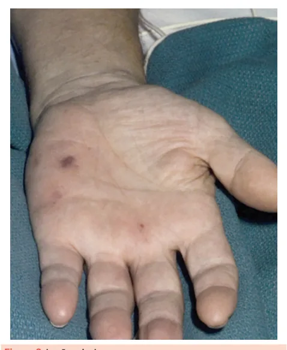
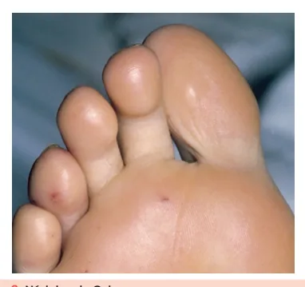

# Febre Reumática e Endocardite

<!-- page:1 -->

## Febre Reumática

É uma doença inflamatória que age envolvendo articulações, coração, pele e sistema nervoso e surge após um episódio não tratado de faringite por microorganismo do grupo estreptococo.

### Critérios de Jones para Diagnóstico

Para estabelecer o diagnóstico de febre reumática, são necessários:

- **2 critérios maiores**, OU
- **1 critério maior + 2 critérios menores**, com evidência de infecção recente por estreptococos.

#### Critérios Maiores

- **Artrite**: poliartrite migratória — em geral, de grandes articulações; é a principal manifestação;
- **Cardite**: pancardite, mas a manifestação mais comum na fase aguda é insuficiência mitral; na crônica, estenose mitral;
- **Coreia de Sydenham**: ocorre em 40% das apresentações; apresenta latência prolongada (6–8 semanas); caracteriza-se por movimentos irregulares e involuntários que desaparecem ao sono; presença isoladamente estabelece diagnóstico;
- **Eritema marginado**: indolor, poupa a face; de característica centrífuga;
- **Nódulos subcutâneos**: superfícies extensoras; podem ou não ser dolorosos (geralmente não); são raros e quase nunca ocorrem isoladamente.

*Figura 1: Eritema Marginatum — de característica centrífuga.*

**OBS.**: Para os nódulos e o eritema, vale saber que tendem a se associar às manifestações de cardite, artrite e Coreia de Sydenham.

#### Critérios Menores

- **Artralgia**: em populações de moderado a alto risco;
- **Febre**: ≥ 38,5 °C;
- **Aumento dos níveis de PCR/VHS**;
- **Aumento do intervalo PR**.

### Diagnóstico de Cardite

A cardite é a principal consequência, com maior morbidade. O acometimento mais comum é a **valvulite**:
- **Insuficiência mitral**: de forma aguda;
- **Estenose mitral**: de forma crônica.

### Evidência de Infecção por Estreptococo

- Cultura de swab da orofaringe;
- ASLO/Anti-DNAse B;
- Teste rápido de detecção do antígeno.

### Profilaxia Primária

Realizar o **tratamento da faringoamigdalite estreptocócica**:
- Penicilina BZT OU
- Amoxicilina OU
- Fenoximetilpenicilina.
- **Pacientes alérgicos à penicilina**: clindamicina, azitromicina ou claritromicina.

### Profilaxia Secundária

**Esquema**: Penicilina BZT de 21/21 dias.

**Alternativas**: sulfadiazina ou eritromicina.

**Dosagem de sulfadiazina**: < 25 kg: 500 mg ao dia; > 25 kg: 1 g ao dia.

**Por quanto tempo?**
- **Sem cardite**: manter até 18 anos de idade ou por 5 anos após o surto (o que for mais longo);
- **Com cardite, sem sequela**: manter até 25 anos de idade ou 10 anos após o surto (o que for mais longo);
- **Cardite e sequela**: manter até 40 anos para todos os pacientes; estender indefinidamente se exposição ocupacional (indivíduos que trabalham com crianças).

---

<!-- page:2 -->

## Endocardite Infecciosa

### Condições Predisponentes

- **Lesões valvares pré-existentes**, principalmente as regurgitantes;
- **Cardiopatia congênita**: CIV, Tetralogia de Fallot; em especial, aquelas de alto fluxo;
- **Prótese valvar**;
- **Outros dispositivos intracardíacos**: marcapasso, CDI.

### Quadro Clínico

- **Sopro**: em 80% dos casos;
- **Febre**: em 80–90% dos casos;
- **Fenômenos embólicos e imunológicos**.

### Exame Físico

- **Lesões de Janeway**.

*Figura 2: Lesões de Janeway.*

- **Nódulos de Osler**.

*Figura 3: Nódulos de Osler.*

---

<!-- page:3 -->

## Critérios de Duke 2023 para Diagnóstico de Endocardite Infecciosa

### Critérios Maiores

#### Evidência Microbiológica Típica

- **Hemocultura positiva** (duas para microorganismo típico ou três para microorganismo atípico) detectada por hemoculturas;
- Microorganismos típicos: todas as espécies de *Streptococcus*, *E. faecalis*, *Granulicatella* e *Abiotrophia* spp., *Gemella* spp., *Corynebacterium striatum* e *Corynebacterium jeikeium*, *Serratia marcescens*, *Mycobacterium chimaera*, *Candida* spp., *S. aureus*, *S. lugdunensis*, grupo HACEK, *Pseudomonas aeruginosa*, *Cutibacterium acnes*, micobactérias não-TB, estafilococos coagulase negativo.

#### Imagem Positiva para EI

- **Ecocardiografia**, **TC cardíaca** ou **PET/CT** (> 3 meses após procedimento): lesões anatômicas ou metabólicas características de EI nas valvas ou perivalvares, prótese ou materiais implantados.

#### Critério Cirúrgico

- **Evidência de EI documentada** à inspeção direta intraoperatória.

### Critérios Menores

- **Febre**: acima de 38 °C;
- **Predisposição**: EI prévia, valvopatia, cardiopatia congênita não corrigida ou corrigida parcialmente com material protético, cardiomiopatia hipertrófica obstrutiva;
- **Fenômenos vasculares**: infarto séptico pulmonar, espondilodiscite, embolia arterial (hemorrágicas ou isquêmicas), hemorragia conjuntival, lesões de Janeway, púrpura purulenta, aneurisma micótico, lesões intracranianas;
- **Fenômenos imunológicos**: glomerulonefrite, nódulos de Osler, manchas de Roth, fator reumatoide positivo;
- **Evidência microbiológica compatível com EI**: hemocultura positiva que não preenche critério maior, sorologia positiva para microorganismo ou PCR positivo (para *Coxiella*, *Bartonella*, *Tropheryma whipplei*);
- **Critérios de imagem de material protético ou dispositivo intracardíaco**: atividade metabólica anormal detectada por PET/CT com [18F]FDG nos primeiros 3 meses após implantação;
- **Exame físico clínico**: piora ou modificação de um sopro pré-existente, nova regurgitação valvar identificada na ausculta.

### Diagnóstico Definitivo

#### Critérios Patológicos

- **1) Microorganismos** em vegetação, tecido cardíaco, válvula protética, enxerto de aorta, dispositivo eletrônico intracardíaco implantável (CIED) ou em êmbolo arterial **+ sinais clínicos de EI ativa**, OU
- **2) Endocardite ativa** com evidência histopatológica.

#### Critérios Clínicos

- **2 maiores**, OU
- **1 maior + 3 menores**, OU
- **5 menores**.

### Diagnóstico Provável

- **1 maior + 1 (ou dois) menores**, OU
- **3 menores**.

### Diagnóstico Possível

- **1 critério maior + 1 ou 2 menores**, OU
- **3–4 menores**.

**Ações adicionais**:
- Repetir hemoculturas se negativas;
- Repetir ecocardiografia transtorácica (ECO-TT) ou transesofágica (TE) em 5–7 dias;
- Solicitar TC cardíaca para diagnosticar lesões valvares;
- Solicitar imagem de corpo inteiro para adicionar critérios menores;
- Se prótese: considerar PET/CT ou cintilografia com leucócitos marcados.

### Diagnóstico Excluído

- Diagnóstico alternativo bem estabelecido que explique os sinais/sintomas, OU
- Ausência de recorrência de infecção com terapia antibiótica por menos de 4 dias, OU
- Nenhuma evidência patológica ou macroscópica de endocardite infecciosa durante cirurgia ou autópsia com terapia antibiótica por menos de 4 dias, OU
- Não atende aos critérios para EI possível conforme descrito anteriormente.

---

<!-- page:4 -->

## Tratamento

### Valva Nativa ou Prótese Tardia (cirurgia > 1 ano)

- **Ampicilina** 2 g, EV, de 4/4 horas + **Oxacilina** 2 g, EV, de 4/4 horas OU **Ceftriaxona** 2 g, EV, de 12/12 horas, por **4 semanas** + **Gentamicina** 3 mg/kg, EV, 1x ao dia, por **2 semanas**.

### Prótese Valvar Precoce (cirurgia há menos de 1 ano)

- **Vancomicina** 15 mg/kg, EV, de 12/12 horas, por **6 semanas** OU **Daptomicina** 10 mg/kg, 1x ao dia + **Rifampicina** 300 mg, VO, de 8/8 horas, por **6 semanas**.

## Indicação Cirúrgica

- **Infecção não controlada**: febre persistente (antibioticoterapia guiada); bacteremia persistente > 1 semana; abscesso;
- **Insuficiência cardíaca**: choque cardiogênico; edema agudo de pulmão;
- **Embolização**: vegetação ≥ 10 mm com embolização recorrente a despeito do tratamento;
- **Complicações locais**: bloqueio atrioventricular (BAV) novo; fístula;
- **Patógeno desafiador**: fungo ou bactéria multidrogarresistente — *S. aureus* em próteses.

## Profilaxia

### Indicações (Diretriz Brasileira de Valvopatias 2020)

Indivíduos com condições predisponentes:
- Prótese valvar;
- Valvopatias moderadas ou importantes (apenas procedimento odontológico);
- Cardiopatia congênita não reparada ou corrigida parcialmente, ou corrigida com material protético;
- Endocardite prévia.

### Procedimentos Odontológicos (com manipulação gengival)

- **Amoxicilina** 2 g, VO – 1 hora antes do procedimento;
- **Alérgico**: clindamicina 600 mg.

### Trato Gastrointestinal ou Genito-Urinário (com lesão de mucosa)

- **Ampicilina** 2 g, EV + **Gentamicina** 1,5 mg/kg, EV – 30 min a 1 hora antes do procedimento;
- **Alérgico**: trocar ampicilina por vancomicina 1 g;
- **Após 6 horas do procedimento**: ampicilina 1 g, EV.

### Medidas Não Farmacológicas

- **Contraindicação** a tatuagens e piercings.

## Referências

Figura 1: Eritema Marginatum — de característica centrífuga. Binotto MA, Guilherme L, Tanaka AC. Rheumatic fever. Images Paediatric Cardiol 2002; 11:12.

Figura 2: Lesões de Janeway. Silverman, M et. al. Extracardiac Manifestations of Infective Endocarditis and Their Historical Descriptions. The American Journal of Cardiology 2007 Dec 15;100(12):1802-7.

Figura 3: Nódulos de Osler. Silverman, M et. al. Extracardiac Manifestations of Infective Endocarditis and Their Historical Descriptions. The American Journal of Cardiology 2007 Dec 15;100(12):1802-7.
