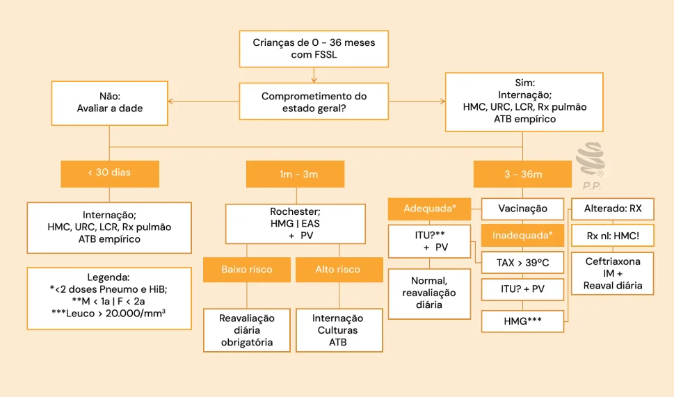

# Febre Sem Sinais Localizatórios

<!-- page:1 -->

Febre sem sinais localizatórios (PED)

**Abreviações**: FSSL: Febre sem sinais localizatórios; HMC: Hemocultura; URC: Urocultura; LCR: Líquor; ATB: Antibiótico; EAS: Análise de urina; PV: Painel viral; ITU: Infecção de trato urinário; TAX: Temperatura axilar; HMG: Hemograma.

## Conceitos

### Febre

- É a elevação da temperatura corporal, mediada por mecanismos de origem central, frente a um estímulo;
- Temperatura axilar maior ou igual a **37,8°C**;
- Em novo documento da SBP, pode ser considerada como febre a temperatura axilar acima de **37,5°C** ou **38°C** para temperatura retal.

### Febre Sem Foco

- **Febre sem sinais localizatórios (FSSL)**: febre de duração **< 7 dias**, cuja anamnese e exame físico detalhados não evidenciam a etiologia.
- **Febre de origem indeterminada (FOI)**: febre persistente por mais de 1 semana de avaliação ambulatorial ou 3 dias de avaliação intra-hospitalar intensiva.
- Revisão de tal conceito (FOI) proposto pelo documento da SBP, 2025:
  - Em ambiente hospitalar, alguns protocolos aceitam apenas 3 dias de investigação intensiva;
  - No contexto ambulatorial, considera-se uma semana de avaliação detalhada (com exames complementares direcionados);
  - Atualmente, a definição de FOI prioriza a qualidade e profundidade da investigação (incluindo métodos diagnósticos avançados) em vez de apenas o tempo de avaliação.

### Bacteremia Oculta

- Hemocultura positiva;
- Bom estado geral;
- Anamnese e exame físico sem indícios etiológicos;
- **Principais agentes**: Pneumococo e *Haemophilus influenzae* do tipo B.

## Avaliação da Criança com FSSL

- Na maioria dos casos: quadro benigno, autolimitado; etiologia viral.
- Quadro bacteriano grave: principal em pediatria é a **infecção do trato urinário**.

O desafio é a discriminação do paciente com risco de doença grave.

---

<!-- page:2 -->

- A estratificação é realizada de acordo com a faixa etária, em pacientes estáveis:
  - **< 1 mês** de vida;
  - **1-3 meses** de vida;
  - **3-36 meses** de vida.

## Avaliação do Recém-Nascido (< 1 mês)

- É suficiente o **relato familiar de febre**!
- Grupo de maior risco para doenças graves: a conduta deve ser mais invasiva!

**Investigação**:

- Hospitalização;
- Exames laboratoriais:
  - Hemograma;
  - Hemocultura;
  - Urina;
  - Urocultura;
  - Líquor;
  - Radiografia de tórax;
  - Pesquisa viral.

**Conduta**:

- Antibioticoterapia empírica: considerar os agentes etiológicos do canal de parto:
  - *Streptococcus* do grupo B;
  - *Escherichia coli*;
  - *Listeria monocytogenes*;
  - Herpes vírus.
- **Ampicilina** (cobertura de Listeria) associada à: **Gentamicina** OU **Cefotaxima** OU **Ceftriaxona** (evita-se o uso em recém-nascidos).

## Crianças de 1 a 3 Meses

- **Agentes etiológicos de importância**: agentes do canal de parto; Pneumococo; Meningococo; *Haemophilus influenzae* tipo B; *Salmonella*; *Staphylococcus aureus*.

**Estratificação de risco de doença bacteriana grave**:

- Escala de Rochester + pesquisa viral;
- Determina o paciente de **baixo risco**;
- Alto valor preditivo negativo.

> ⚠️ Tabela reconstruída a partir de OCR — confira contra a fonte original.

**Tabela 1: Escala de Rochester**

| Critérios clínicos | Critérios laboratoriais |
|---|---|
| Previamente hígido/sem doença crônica | Leucócitos entre 5.000-15.000/mm³ (Hemograma) |
| Nascido a termo, sem intercorrências periparto | Contagem absoluta de neutrófilos jovens < 1.500/mm³ |
| Sem toxemia | Microscopia de sedimento urinário com ≤ 10 leucócitos/campo (Urina I) |

Figura 1: Fluxograma para atendimento de FSSL em pacientes de 1 a 3 meses — Escala de Rochester → **baixo risco**: reavaliação diária; **alto risco**: internação, culturas, ATB empírico.

Quando indicada, a antibioticoterapia empírica é feita com cefalosporina de 3ª geração (ex: ceftriaxona).

## Crianças entre 3 e 36 Meses

- **Agentes etiológicos de importância**: Pneumococo; Meningococo; *Salmonella*; *Haemophilus influenzae* tipo B (HiB).

**Estratificação de risco de doença bacteriana grave**:

- Situação vacinal: completa (pelo menos 2 doses de Pneumococo e HiB);
- Valor da temperatura corporal;
- Avaliação do risco de infecção urinária. Maior risco:
  - Meninas < 24 meses;
  - Meninos não circuncidados < 12 meses;
  - Meninos circuncidados < 6 meses.

Figura 2: Manejo do paciente com FSSL de 3 a 36 meses e esquema vacinal completo — vacinação completa → pesquisa de vírus respiratórios → considerar Urina I/Urocultura se fatores de risco → reavaliação diária.

---

<!-- page:3 -->

Figura 3: Manejo do paciente com FSSL de 3 a 36 meses e esquema vacinal incompleto — vacinação incompleta → pesquisa de vírus respiratórios → TAX ≤ 39°C ou TAX > 39°C → considerar Urina I/Urocultura → se ITU, tratar → reavaliação diária.

> ⚠️ Tabela reconstruída a partir de OCR — confira contra a fonte original.

Figura 4: Conduta no paciente com FSSL de 3 a 36 meses após a realização dos exames laboratoriais:

- Urina I/Urocultura:
  - Urina I normal ou leucocitúria < 50.000/ml → Hemograma;
- Hemograma:
  - Leucócitos < 20.000/mm³ ou total de neutrófilos < 10.000/mm³ → reavaliação diária;
  - Leucócitos ≥ 20.000/mm³ ou total de neutrófilos ≥ 10.000/mm³ → radiografia de tórax;
- Radiografia de tórax:
  - Rx normal → hemocultura, reavaliação diária;
  - Rx alterado → pneumonia → ceftriaxona IM, 1x/dia, reavaliação diária.
