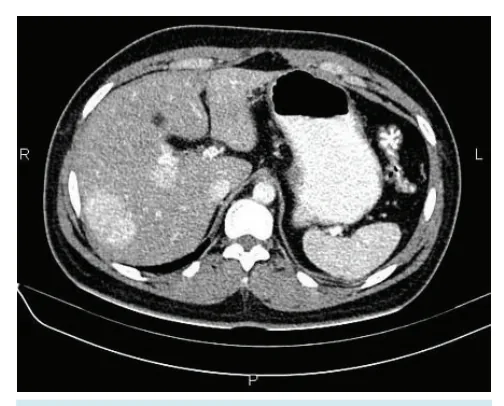
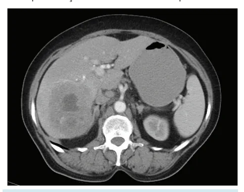
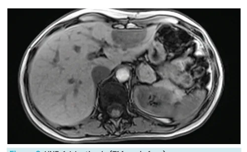
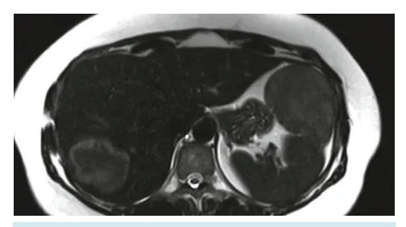

# Fígado - Adenoma Hepático

<!-- page:1 -->

- Lesão focal menos comum, mas que pode complicar;
- Relação com terapia hormonal (anticoncepcionais e anabolizantes) e também com obesidade e síndrome metabólica; fora condições genéticas (doenças do estoque do glicogênio – mais associadas com lesões múltiplas);
- Em homem, **SEMPRE OPERA!** Em mulher, depende do tamanho e da presença de sintomas;
- Lesões habitualmente hipervasculares e heterogêneas.

**Classificação Molecular**:

- **HNF1-α**: mais indolente; esteatótico; queda de sinal nas fases com supressão de gordura;
- **Inflamatório**: mais comum; hipervascular / telangiectasias; maior parte assintomático, mas pode causar complicações em pacientes com lesões maiores; tendência a redução com perda ponderal e supressão da terapia hormonal;
- **β-Catenina**: associação com esteroides anabolizantes e sexo masculino; maior predisposição a transformação maligna (éxon 3); sem padrão de imagem específico;
- **Sonic-Hedgehog**: recentemente descrito; associação importante com sangramento e ruptura; sem padrão de imagem específico.

## Epidemiologia

- **Terceiro** tumor hepático incidental mais comum (e o mais cobrado em prova);
- Preponderância feminina (10:1); idade entre 35-40 anos;
- Solitários (~70% dos casos); múltiplos têm relação com predisposições genéticas;
- Antes do advento do uso de contraceptivos, a incidência era de 1 caso/1 milhão. Hoje, a incidência em mulheres jovens é de 30-40 casos/1 milhão (também influenciado pelo sedentarismo, obesidade e outros fatores);
- O uso de contraceptivos hormonais é um fator de risco importante.

**Queridinho das provas: sangramento!**

- 1º: Medidas de suporte: UTI, transfusão, imagem confirmatória;
- 2º: Radiologia intervencionista (arteriografia com embolização);
- 3º: Estabilização; suspender terapia hormonal; repetir imagem em 3/6 meses (após reabsorver hematoma); cirurgia se adenoma residual; seguimento se ausência de adenoma residual.

> ⚠️ Fluxograma reconstruído a partir de OCR — confira contra a fonte original.
>
> **Figura 9: Manejo do adenoma hepatocelular** (RM com contraste hepatoespecífico)
> - Múltiplos nódulos/adenomatose → avaliar caso a caso conforme etiologia (ex.: glicogenose).
> - Nódulo único:
>   - **< 5 cm**: vigilância ativa.
>   - **≥ 5 cm**:
>     - Sexo masculino → **ressecção**.
>     - Sexo feminino → parar terapia hormonal, repetir RM em 6-12 meses:
>       - Se sangramento/ruptura ou irressecável → embolização transarterial / transplante hepático; repetir imagem após 3/6 meses (aguardar reabsorção do hematoma); ressecção se lesão viável.
>       - RM sugestiva de HNF-1α mutado, lesão central → vigilância ativa.
>       - Aspecto não sugestivo de HNF-1α mutado (suspeita de β-catenina mutado) → considerar biópsia; ressecção.

## Outros Fatores de Risco

- Esteroides anabolizantes (crescimento na população masculina);
- Obesidade/esteatose hepática;
- Hemocromatose;
- Doenças do glicogênio: glicogenose tipo I (associação com adenoma em 50% dos casos) e tipo III (associação em 25% dos casos).

## Quadro Clínico

- 80% assintomáticos;
- Dor e desconforto abdominal, normalmente mais insidiosa e eventual (alguns pacientes são assintomáticos): quando o paciente se apresenta com dor aguda, suspeitar de complicações, como trombose ou ruptura.

---

<!-- page:2 -->

## Classificação

- Complicações (sobretudo se > 5 cm):
  - Hemorragia (15%-30%) → maior chance durante a gravidez, devido ao aumento dos hormônios femininos e estímulo ao crescimento do adenoma;
  - Risco de degeneração maligna (pode se transformar em carcinoma hepatocelular).
- O adenoma hepático é uma entidade heterogênea.

### Classificação Molecular dos Adenomas Hepáticos (2006)

## Diagnóstico

- Realizado por meio de exames de imagem (TC ou RM), idealmente RM:
  - Boa sensibilidade para componente gorduroso e usa meio de contraste para avaliar padrão de vascularização (no geral, hipervasculares);
  - Pode apresentar realce vascular na periferia (telangiectasias);
  - Componente hipodenso (gordura);
  - Hiperdensidade (se sangramento recente).
- A TC ou a RM apresentam limitações nos seguintes casos:
  - Lesões pequenas (3 cm ou menores) podem ser confundidas com HNF;
  - Apresentação variada conforme subtipo.

> Figura 1: TC (fase arterial): lesão hipervascular, heterogênea, região hipodensa que pode corresponder a deposição gordurosa ou focos de hemorragia no interior.
>
> Figura 2: TC (fase arterial): duas lesões hipervasculares e homogêneas.

- Subtipos mais indolentes; outros com potencial risco de crescimento/sangramento; outros com potencial maior para degenerar para câncer;
- Essa classificação passou por atualizações e é reconhecida e adotada pela OMS desde 2010.

### Subtipos

**HNF-1α Inativado**

- 30%-40% dos adenomas; segundo mais comum; comportamento mais indolente;
- Fator associado à diferenciação hepatocitária e ao controle do metabolismo;
- Maior parte das mutações é adquirida; hereditárias em caso de adenomatose (> 10 adenomas) ou diabetes MODY3;
- São adenomas esteatóticos (com componente gorduroso importante);
- Marcador de imuno-histoquímica: **LFABP** (proteína de ligação para ácidos graxos);
- RM: homogêneos; esteatóticos: hiperintenso em T2 sem supressão de gordura, hipointensidade na fase com supressão de gordura, hipodensidade em T1 fora de fase. S 87%-91% / E 89%-100%.

> Figura 3: HNF-1α Inativado (T2 sem supressão de gordura).
> Figura 4: HNF-1α Inativado (T2 com supressão de gordura).

---

<!-- page:3 -->

> Figura 5: HNF-1α Inativado (T1 em fase).
> Figura 6: HNF-1α Inativado (T1 fora de fase).

**Inflamatórios**

- 40%-55% dos adenomas; subtipo mais comum; pode evoluir com sintomas / sangramento;
- Mutações da via JAK/STAT;
- Associação com obesidade e síndrome metabólica ou num contexto de alto consumo de álcool; redução com perda ponderal / supressão da terapia hormonal;
- Aspecto telangiectásico à microscopia;
- Imuno-histoquímica para proteína C-reativa e proteína amiloide A (SAA);
- Achados na RM: aspecto telangiectásico; sinal hiperintenso em T2 (pode ser difuso ou num formato de anel ao longo da periferia da lesão - "sinal do atol"); T1: iso ou hiperintenso, hiperintensidade persiste mesmo com supressão de gordura ou out phase; marcadamente hipervasculares com realce persistente ou tardio. S 85%-88% / E 88%-100%.

> Figura 7: T2 com hiper-realce periférico (sinal do atol).
> Figura 8: Ilustração do sinal do atol.

**β-Catenina Ativado**

- 10%-20% dos adenomas; subtipo menos comum;
- Risco aumentado de degeneração para CHC;
- Mutações do gene da β-catenina (CTNNB1), que podem ocorrer em éxons diferentes: éxon 3 - associação com **degeneração maligna**; éxons 7 e 8; exoma (sequenciamento) permite avaliar qual éxon está mutado (pouco disponível);
- Representação maior em sexo masculino; por isso, o homem com adenoma hepático tende a ser mais complicado;
- Presença de atipias, formações pseudoglandulares e colestase;
- Imuno-histoquímica positiva para glutamina-sintase (um alvo da β-catenina) e expressão nuclear da própria β-catenina;
- Não possui características típicas que possam diferenciá-lo à RM.

**Não Classificável**

- 5%-10% dos adenomas;
- À época da proposta da classificação (2006), esses adenomas não eram associados a nenhuma mutação ou morfologia específica;
- A classificação foi revista em 2017 pelo mesmo grupo e houve a transformação de quatro para oito subtipos, porém não ganhou grande adesão devido às dificuldades para compreensão. Além disso, foi construída uma ilustração com os principais subtipos e suas particularidades (não necessário decorar), como: a influência dos contraceptivos orais; mutações documentadas; apresentações clínicas; achados histológicos; corante utilizado na imuno-histoquímica para marcação da lesão;
- Destaque para o achado de um subtipo adicional: **Sonic Hedgehog pathway** — uma parcela dos adenomas não classificáveis cujo risco para sangramento (sintomático e assintomático) é muito maior, comparado às demais classificações.

---

<!-- page:4 -->

## Manejo

> ⚠️ Fluxograma reconstruído a partir de OCR — confira contra a fonte original.
>
> **Figura 9: Manejo do adenoma hepatocelular** (RM com contraste hepatoespecífico)
> - Múltiplos nódulos/adenomatose → avaliar (ex.: glicogenose).
> - Nódulo único:
>   - **< 5 cm**: vigilância ativa.
>   - **≥ 5 cm**:
>     - Sexo masculino → **ressecção**.
>     - Sexo feminino → parar terapia hormonal, reavaliar em 6-12 meses:
>       - Se sangramento/ruptura ou irressecável → embolização transarterial / transplante hepático; repetir imagem após 3/6 meses (aguardar reabsorção do hematoma); ressecção se lesão viável.
>       - RM sugestiva de HNF-1α mutado, lesão central → vigilância ativa.
>       - Aspecto não sugestivo de HNF-1α mutado (suspeita de β-catenina mutado) → considerar biópsia; ressecção.

### Resumindo o Manejo

**Homem**

- Resseca **sempre**.

**Mulher**

- 1º: parar terapia hormonal!
- Na sequência: reavaliar com nova imagem dentro de 6-12 meses:
  - Menor que 5 cm → acompanha;
  - Se maior no primeiro exame:
    - Reduziu (idealmente para menos de 5 cm) → acompanha;
    - Se manteve dimensões, avalia o aspecto da lesão:
      - Aspecto "ruim": **opera**;
      - Localização "ruim": biópsia / vigilância mais rigorosa;
      - Aspecto "bom": acompanha.

## Gestante

- USG frequente (a cada 6-12 semanas) para acompanhar tamanho;
- Adenomas menores que 5 cm, não exofíticos e que não estejam crescendo: sem contraindicações ou interferência na via de parto;

---

<!-- page:5 -->

- Considerar embolização para lesões maiores (após 24 semanas);
- Antes de 24 semanas: considerar cirurgia, especialmente para lesões periféricas.

## Sangramento

- 1º: Medidas de suporte: UTI, transfusão, imagem confirmatória;
- 2º: Radiologia intervencionista (arteriografia com embolização);
- 3º: Estabilização; suspender terapia hormonal; repetir imagem em 3/6 meses (após reabsorver hematoma); cirurgia se adenoma residual; seguimento se ausência de adenoma residual.

## Referências

Figura 1: TC (fase arterial): lesão hipervascular, heterogênea, região hipodensa que pode corresponder a deposição gordurosa ou focos de hemorragia no interior. Jacob D, Silverstone L, Mullineux J, et al. Hepatic adenoma. Reference article, Radiopaedia.org (Accessed on 17 Jun 2025).

Figura 2: TC (fase arterial): duas lesões hipervasculares e homogêneas. Jacob D, Silverstone L, Mullineux J, et al. Hepatic adenoma. Reference article, Radiopaedia.org (Accessed on 17 Jun 2025).

Figura 3: HNF-1α Inativado (T2 sem supressão de gordura). Jacob D, Silverstone L, Mullineux J, et al. Hepatic adenoma. Reference article, Radiopaedia.org (Accessed on 17 Jun 2025).

Figura 4: HNF-1α Inativado (T2 com supressão de gordura). Jacob D, Silverstone L, Mullineux J, et al. Hepatic adenoma. Reference article, Radiopaedia.org (Accessed on 17 Jun 2025).

Figura 5: HNF-1α Inativado (T1 em fase). Jacob D, Silverstone L, Mullineux J, et al. Hepatic adenoma. Reference article, Radiopaedia.org (Accessed on 17 Jun 2025).

Figura 6: HNF-1α Inativado (T1 fora de fase). Jacob D, Silverstone L, Mullineux J, et al. Hepatic adenoma. Reference article, Radiopaedia.org (Accessed on 17 Jun 2025).

Figura 7: T2 com hiper-realce periférico (sinal do atol). Jacob D, Silverstone L, Mullineux J, et al. Hepatic adenoma. Reference article, Radiopaedia.org (Accessed on 17 Jun 2025).

Figura 8: Ilustração do sinal do atol. Jacob D, Silverstone L, Mullineux J, et al. Hepatic adenoma. Reference article, Radiopaedia.org (Accessed on 17 Jun 2025).
