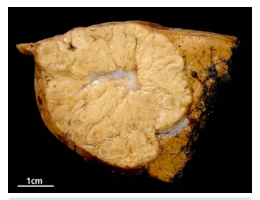
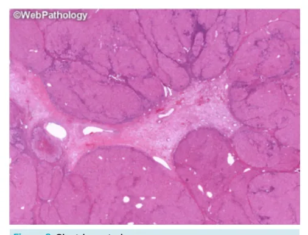
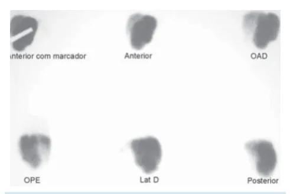

# Fígado Hiperplasia Nodular Focal

<!-- page:1 -->

## FÍGADO: HIPERPLASIA

## NODULAR FOCAL

Fígado (CIR)

- 2º Mais comum das lesões focais!

- Hiperproliferação benigna de hepatócitos (arteríola a

- Não malignizam / não sangram;

- Não tem relação com contraceptivos;

- CICATRIZ CENTRAL (~60%);

- Não tem canalículos biliares → Hiperrealce na fase h

- Tratamento conservador (exceto se sintomas limitan

## CONSIDERAÇÕES INICIAIS

- Segundo tumor hepático mais comum, após o hemangioma; Lesão benigna de origem não-vascular mais comum! (85%); Prevalência estimada entre 0,4-3% (estudos de necropsia); Preponderância feminina (90%).

- Na maioria dos casos, lesão única e inferior a 5 cm; Múltiplos (20-30% dos casos) → investigar alterações em SNC - tumores de leptomeninge e angiomas cerebrais).

- Etiologia mais provável: hiperproliferação de hepatócitos em resposta a uma arteríola anômala;

- Não apresentam hemorragia ou malignização;

- Não guardam relação com gestação ou uso de contraceptivos.

## FISIOPATOLOGIA

- Configurado por uma lesão, em geral, única, bem circunscrita, não encapsulada e que contém uma cicatriz central: Na região da cicatriz, podem ser observadas arteríolas distróficas.

Figura 1: Cicatriz central anômala?); hepatobiliar (na RM com Primovist!); ntes!). Figura 2: Cicatriz central

## DIAGNÓSTICO

Ultrassonografia de abdome superior:

- Demonstra apresentação variável;

- Tal fato justifica a investigação com RM ou TC, em boa parte dos casos;

- Pode ser observada pseudocápsula;

- Geralmente, hipo ou isoecogênico;

- Aspecto de “roda raiada” ao doppler (arteríola central).

Tomografia computadorizada:

- Lesão homogênea;

- Hipervascular – enchimento homogêneo na fase arterial;

- Isodensidade nas fases tardias;

- Cicatriz central – presente em até 60% das lesões > 3 cm.

- Pontos limitantes: Dificuldades para diferenciação do adenoma presentes em 1/3 dos casos; Visualização de lesões pequenas; Fígados esteatóticos – são bem visualizados na RM de abdome superior, com uso de contraste hepatoespecífico; Ausência de cicatriz central.

---

<!-- page:2 -->

Figura 3: Tomografia Cintilografia

- Cintilografia (Tc-99m) com enxofre coloidal e cintilografia com HIDA;

- Hipercaptação do marcador na Hiperplasia nodular focal (diferentemente das demais lesões – adenoma hepatocelular, HCC);

- Muito utilizada no passado; Há perda de apelo em face do aumento da disponibilidade da RM, com melhor resolução das imagens.

w l w l Figura 4: Cintilografia com Enxofre Coloidal Ressonância magnética T

- Exame padrão-ouro atualmente; c

- Hipointensa em T1, nas fases pré-contraste;

- Demonstra o mesmo padrão de realce do contraste – difuso e hipervascular; G

- Forma imagem muito hiperintensa em T2. R

- Na fase hepatobiliar, pelo uso de contraste hepatoespecífico, observa-se hipersinal; Tal fato representa um diferencial importante do adenoma hepatocelular. Figura 5: Fase hepatobiliar de ressonância magnética com imagem de lesão compatível com HNF

## MANEJO

- Principalmente conservador!

- Indicações cirúrgicas: Sintomáticos – por efeitos compressivos, dor; Dúvida diagnóstica (pode fazer biópsia).

ATENÇÃO! Gravidez e uso de contraceptivos orais não são contraindicações.

## REFERÊNCIAS

Figura 1: Cicatriz central Focal nodular hyperplasia: Gross Pathology. Disponível em https://www. webpathology.com/images/gastrointestinal/liver/liver-tumors-and-tumorlike-lesions---i/42983. Acessado em 23 de junho de 2025.

Figura 2: Cicatriz central Focal nodular hyperplasia: Microscopic. Disponível em https://www. webpathology.com/images/gastrointestinal/liver/liver-tumors-and-tumorlike-lesions---i/42990. Acessado em 23 de junho de 2025.

Figura 3: Tomografia Gaillard F, Le L, Walizai T, et al. Focal nodular hyperplasia. Reference article, Radiopaedia.org (Accessed on 23 Jun 2025).

Figura 4: Cintilografia com Enxofre Coloidal Texeira, MS et al. Hiperplasia nodular focal do fígado: apresentação de um caso e revisão da literatura. Radiol Bras 2007;40(4):283–285.

Figura 5: Fase hepatobiliar de ressonância magnética com imagem de lesão compatível com HNF Gaillard F, Le L, Walizai T, et al. Focal nodular hyperplasia. Reference article, Radiopaedia.org (Accessed on 23 Jun 2025).

