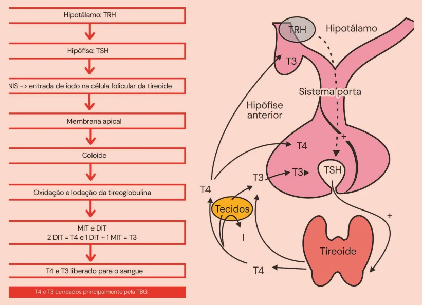
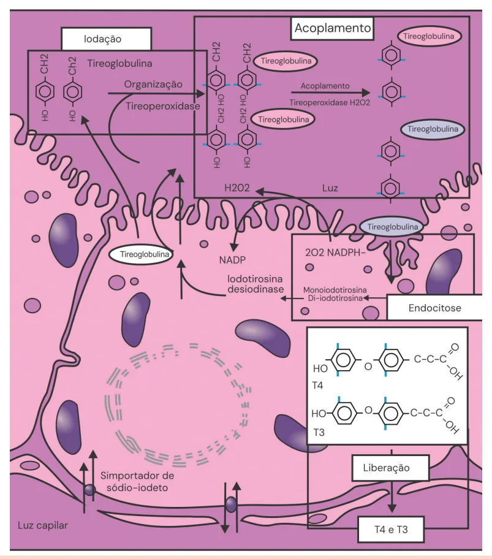

# Fisiologia da Tireoide

<!-- page:1 -->

Fisiologia da Tireóide (CM)

## REGULAÇÃO

- O TRH, sintetizado no hipotálamo, atua na adenohipófise estimulando a síntese e secreção do TSH;

- TSH atua na tireóide Estimulando produção principalmente de T4 e em menor quantidade o T3;

- Perifericamente o T4 é convertido em T3 Feedback negativo sob o TSH e sob o TRH. O contrário também é verdadeiro: quando temos diminuição do T4 e do T3, temos um feedback positivo estimulando o aumento de TSH e TRH.

## SÍNTESE DOS HORMÔNIOS

## TIREOIDIANOS

- Verificar Figura 1 na próxima página

- Simportador de sódio e iodeto (sódio e iodo para dentro da célula através do transporte ATIVO) Mecanismo estimulado pelo TSH;

- Iodo atinge membrana apical da célula folicular e posteriormente atinge o coloide

- No coloide se acopla à tireoglobulina (através de um processo chamado iodação) - Depois passa pelo processo de organificação, que é mediado pela tireoperoxidase e pela H O , formando duas moléculas diferentes Monoiodotirosina - MIT; Diiodotirosina - DIT T4 = 1 DIT + 1 DIT T3 = 1 DIT + 1 MIT

2 2

- A secreção de T3 e T4 é mediada por uma proteína localizada nas células da membrana apical chamada megalina Fagocita partes de coloide e introduz para as células foliculares, sendo liberado para a membrana basal e assim consequentemente liberado para a circulação sanguínea.

- Todo esse processo é estimulado pelo TSH e tanto o processo de iodação como de organificação como de acoplamento são mediados pela tireoperoxidase.

## AUTORREGULAÇÃO

## FENÔMENO DE WOLFF-CHAIKOFF

- Mecanismo de proteção da tireoide

- Níveis elevados de iodeto + Bloqueio da captação e organificação do iodo

- Transitório → Após alguns dias de excesso de iodo, escape com retorno à síntese dos hormônios tireoidianos

---

<!-- page:2 -->

Figura 1: Síntese dos hormônios tireoidianosSíndrome de Jod-Basedow SÍNDROME DE JOD-BASEDOW

- Situações que alteram ou a quantidade ou afinidade

- Falha no mecanismo de autorregulação de proteínas:

- Excesso de iodo → hipertireoidismo | Insuficiência hepática

- Escape do mecanismo de feedback negativo | Sepse fisiológico → autorregulação prejudicada

## CONVERSÃO

## TRANSPORTE

## DEIODINASES

- T3 e T4 ao atingirem circulação sanguínea se ligam, em

- Realizado através das deiodinases sua maioria, a uma globulina

- Tipo 1: mais prevalente, converte T4 em T3 Globulina ligadora de tiroxina (TBG) – 70-75% do T4; | Localização: fígado, rins, tireoide; Outras proteínas carreadoras são:

- Tipo 2: converte T4 em T3 Albumina (5- 15%) | Localização: SNC, placenta, músculo esquelético. Transtirretina (10-20%)

- Tipo 3: converte T4 em T3 reverso (forma inativa) Uma minoria circula na forma livre (0,02-0,04%); | Localização: SNC, placenta e pele.

- Vários fatores podem fazer com que ocorra aumento | SNC, placenta e pele.

ou diminuição da expressão do T4 total (levando em consideração o T4 ligado), por isso não é tão específico para usar na prática clínica.

| Usa-se mais corretamente o T4 em sua forma livre para dosagem;

