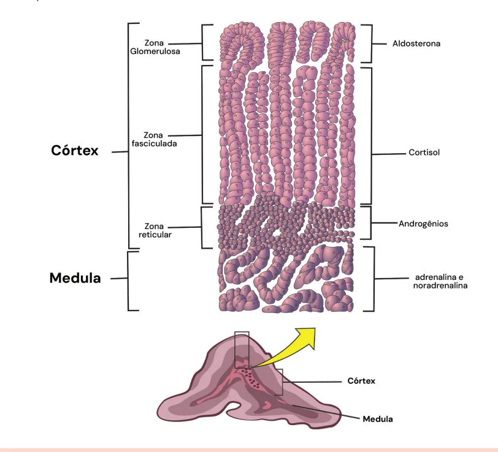
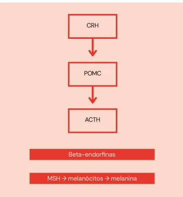
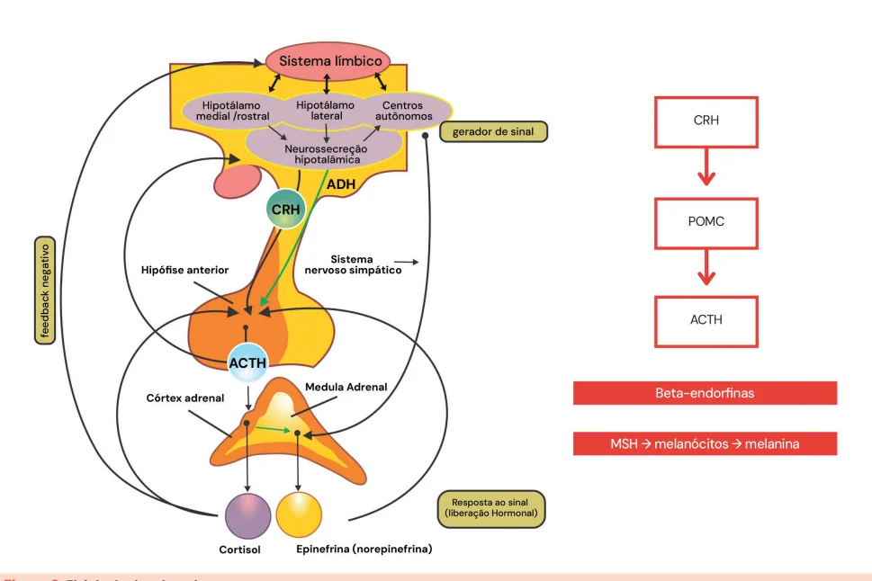

# Fisiologia e Anatomia da Adrenal

<!-- page:1 -->

## FISIOLOGIA E ANATOMIA

## DA ADRENAL

Fisiologia Adrenal (CM)

## CÓRTEX ADRENAL

- Granulosa → Aldosterona (SRAA)

- Fasciculada → Cortisol (ACTH)

- Reticulada → Andrógenos (ACTH)

## MEDULA ADRENAL

- Adrenalina e Noradrenalina (SNAS)

## ANATOMIA E HISTOLOGIA

- Também denominada de suprarrenal

- Dividida em medula (parte interna) e córtex

(parte externa) Figura 1: Anatomia da adrenal.

---

<!-- page:2 -->

## ZONA MEDULAR FISIOLOGIA

- Produção de adrenalina e noradrenalina (sistema nervoso autônomo simpático)

- Hipotálamo: secreta CRH, que atua a adenohipófise

(ou hipófise anterior) estimulando a clivagem da POMC ZONA CORTICAL (pró-opiomelanocortina)

- Dividida em três camadas: glomerulosa,

- POMC é um neurotransmissor fasciculada, reticular | Ao ser clivado, libera ACTH, beta-endorfina e MSH

- Glomerulosa (externa): produção de aldosterona (Hormônio Estimulador de Melanócitos) Estímulo do Sistema Renina Angiotensina | O MSH atua na pele, estimulando produção de

Aldosterona (SRAA) melanina (hiperpigmentação cutânea)

- Fasciculada (medial): produção cortisol | Diferenciação insuficiência adrenal Dependente de ACTH primária e secundária

- Reticulada (mais interna): produção dos andrógenos

- ACTH estimula produção de cortisol e adrenais (principalmente sulfato de DHEA) andrógenos adrenais Dependente de ACTH | Lembrando que a produção de aldosterona não é estimulada pelo ACTH e sim pelo SRAA;

Obs.: o ACTH, produzido na hipófise, atua principalmente na Zona Fasciculada e Zona Reticular.

- Verificar Figura 2

Figura 2: Fisiologia da adrenal

## REFERÊNCIAS

Figura 1: Anatomia da adrenal. Anatomia da adrenal. Adaptado de MOLINA, Patricia E. Fisiologia endócrina. 4. ed. Rio de Janeiro: McGraw Hill, 2014.

Figura 2: Fisiologia da adrenal Fisiologia da adrenal. Adaptado de Vilar, Lucio [et al]. Endocrinologia Clínica. 7ª edição. Rio de Janeiro: Guanabara Koogan, 2021 (modificado).

