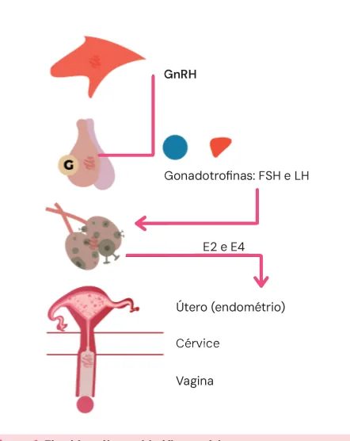
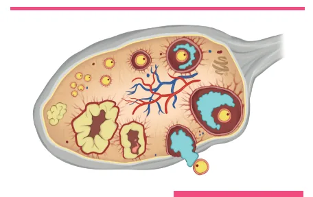
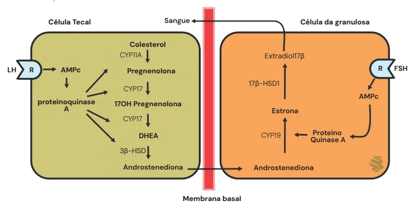
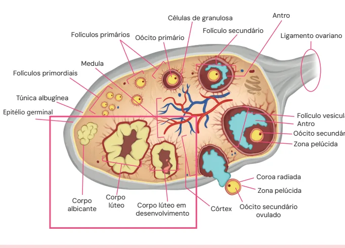
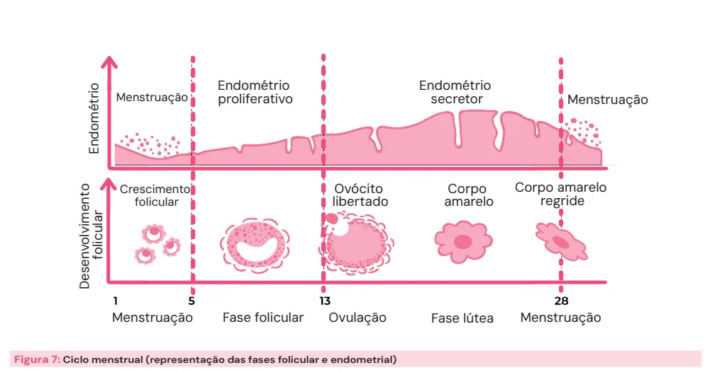
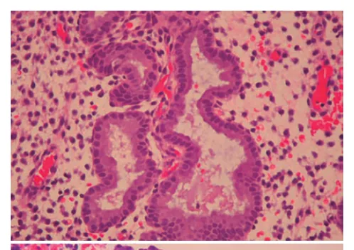
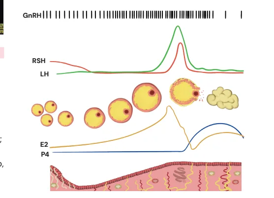
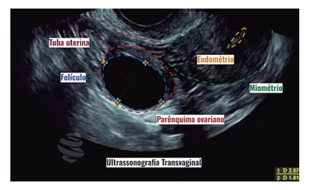

# Fisiologia Menstrual

<!-- page:1 -->

- Regulação neuroendócrina: eixo hipotálamo-

- Ovários:

hipófise-ovário; | Foliculogênese;

- Hipotálamo: GnRH (liberação pulsátil); | Esteroidogênese (Teoria das Duas Célulasz Hipófise: FSH e LH; Duas Gonadotrofinas);

- Ovário: estrogênio e progesterona; | Luteinificação.

- Fases do ciclo menstrual: 1ª metade: ovário → fase folicular; endométrio → fase proliferativa; 2ª metade: ovário → fase lútea; endométrio → fase secretora;

## CICLO MENSTRUAL

- Há comunicação com sistema límbico, córtex cerebral e promove:

CARACTERÍSTICAS TÍPICAS DO | controle do metabolismo e regulação da CICLO MENSTRUAL temperatura corporal;

- Frequência 24-38 dias; | controle do comportamento reprodutivo e sexual e

- Duração: ≤ 8 dias; da secreção de LH e FSH;

- Regularidade: ≤ 7-9 dias (diferença entre o intervalo | comunicação com hipófise. é variável conforme a idade da paciente: 18-25 anos: ≤ 9 dias; 26-41 anos: ≤ 7 dias; 42-45 anos:

mais longo e o intervalo mais curto em um período de 1 ano); ≤ 9 dias;

- Volume: 5-80 mL.

Obs: atualmente recomenda-se a determinação subjetiva pela paciente: volume aumentado é aquele que interfere no estado físico, social, emocional ou na qualidade de vida da mulher.

Guideline Internacional de SOP (2023)

- Irregularidade menstrual em adolescentes: é normal até 1 ano após a menarca; Entre 1-3 anos após a menarca, é considerada irregularidade menstrual quando os ciclos variam até < 21 dias e > 45 dias de duração.

## REGULAÇÃO DO CICLO MENSTRUAL

Eixo hipotálamo-hipófise-ovário

- O hipotálamo possui “visão macro” dos eventos e comanda a hipófise; Figura 1: Eixo hipotálamo-hipófise-ovário.

- A hipófise, por sua vez, é “chefe” dos ovários, que realizam múltiplas tarefas;

- Alguns dos neurônios mais importantes

- O endométrio é um “trabalhador sem autonomia”, são os progenitores de GnRH, de produção apenas obedece comandos. pulsátil e independente:

Qual o objetivo da regulação do ciclo menstrual? | Menor frequência de pulsos → produção de FSH;

- Promover desenvolvimento de folículo e a partir dele | Maior frequência de pulsos → produção de LH; Se o óvulo não for fecundado → menstruação; na fase lútea tardia é uma alteração importante que Se for fecundado → gestação. favorece a síntese de FSH; Um aumento na frequência e amplitude da

ocorrer a liberação do óvulo (ovulação): | A desaceleração da frequência de pulso do GnRH HIPOTÁLAMO secreção pulsátil de GnRH no meio do ciclo, por sua

- Não é uma glândula → é um complexo de núcleos de vez, favorece o aumento de LH que é necessário neurônios com função neuroendócrina; para ovulação e início da fase lútea.

---

<!-- page:2 -->

## HIPÓFISE

- Vai acontecer a seleção e dominância de um folículo,

- É uma glândula, também chamada de o qual se tornará o folículo dominante do ciclo e glândula pituitária. prosseguirá seu desenvolvimento até o rompimento

- Localização na base do crânio, formada pela base do a partir do estímulo de LH, com liberação do oócito.

osso esfenoide. Assim, durante cada ovulação, libera-se um oócito osso esfenoide. Hipófise anterior (adenohipófise)

- Recebe sinais do hipotálamo pelo sistema portal-hipofisário;

- Comunicação direta com o hipotálamo;

- 5 grupos celulares: gonadotrofos, tireotrofos, somatotrofos, lactotrofos, corticotrofos (produção de

FSH, LH, TSH, GH, prolactina, e ACTH respectivamente). Hipófise posterior (neurohipófise)

- Prolongamento de neurônios;

- Responsável pela secreção de ocitocina e vasopressina.

## OVÁRIO

- Glândula endócrina na qual ocorrem esteroidogênese e desenvolvimento folicular;

- Os hormônios esteroides (estrogênio, progesterona, testosterona) produzidos possuem papel importante na preparação do útero para possível implantação de óvulo fecundado.

FASES DO CICLO MENSTRUAL É dividido em duas metades (temporal e espacialmente) e o evento que as separa é a ocorrência da ovulação.

Além disso, também pode ser dividido em ciclo ovariano e ciclo endometrial. Tabela 1: Divisão didática - temporal e espacialmente - E do ciclo menstrual.

- 1° Metade 2° Metade

OVÁRIO Fase folicular Fase lútea

- ENDOMÉTRIO Fase proliferativa Fase secretora

## 1ª METADE CICLO MENSTRUAL

OVÁRIO (FASE FOLICULAR) Foliculogênese

- A foliculogênese (desenvolvimento do folículo ovariano) ocorre na região do córtex ovariano;

- Recrutamento folicular → independente de gonadotrofinas;

- Dependem das gonadotrofinas: Seleção e Dominância; Crescimento e maturação; O Ovulação.

- Células progenitoras formam folículos primordiais os quais ficam em estado de repouso (em prófase ciclo menstrual;

(camada de células que contém o oócito primário), I da meiose I) até serem ativados no início do

- Durante a puberdade, com o início dos ciclos menstruais, ocorre a retomada da meiose I até a metáfase II da meiose II;

Assim, durante cada ovulação, libera-se um oócito secundário que está estacionado na metáfase II da meiose II;

- Se ocorrer a fertilização, o oócito secundário vai terminar sua divisão meiótica.

Foliculogênese Independente de Recrutamento folicular Gonadotrofinas Seleção e Dominância Dependente de Crescimento e maturação Gonadotrofinas Ovulação Figura 2: Foliculogênese e suas fases.

Esteroidogênese ovariana

- É a produção de hormônios esteroides, que são derivados de uma molécula em comum (colesterol).

Preparam o útero para caso ocorra a gestação. Teoria das Duas células-duas gonadotrofinas

- Os folículos possuem dois tipos de células: as da teca mais interna);

(camada mais externa) e as da granulosa (camada

- As células da teca possuem receptores de LH e, a partir da ação deste, produzem androgênios, que migram para as células da granulosa e sob ação do FSH são convertidos em estrogênios (com participação da enzima aromatase).

Androstenediona → Estrona Testosterona → Estradiol

- Verificar Figura 3 na próxima página.

## OVULAÇÃO

- Aumento dos receptores de LH;

- Promovida pelo pico de LH (receptores LH) → que promove mudanças estruturais e enzimáticas para o rompimento folicular e liberação do óvulo;

- O folículo periovulatório fica grande, com diâmetro próximo de 18 mm;

- Rompimento folicular pela ação de enzimas proteolíticas, prostaglandinas e ativador plasminogênico;

---

<!-- page:3 -->

CCéélluullaa TTeeccaall Sangue Célula da granulosa Colesterol CYP11A Extradiol17β LLHH R AMPc Pregnenolona R FSH LLHH R AMPc Pregnenolona CYP17 proteinoquinase 17OH Pregnenolona CYP17 DHEA 3β-HSD Androstenediona Mem Figura 3: Esquema da teoria das duas gonadotrofinas

- As células da granulosa passam pelo processo de luteinização;

- O endométrio é formado por duas camadas: camada basal → reepiteliza o endométrio a cada ciclo; camada funcional → descama-se com a menstruação.

- Nessa fase proliferativa, endométrio sofre ação do estrogênio, responsável pelo efeito proliferativo nas células glandulares e estromais.

## 2ª METADE DO CICLO MENSTRUAL

## OVÁRIO (FASE LÚTEA)

- Tem duração geralmente constante de 14 dias;

- Ocorreu rompimento folicular com liberação do óvulo (ovulação);

Folículos primários Oócito prim Medula Folículos primordiais Túnica albugínea Epitélio germinal Corpo Corpo lúteo Corpo lúteo albicante desenvolvim Figura 5: Foliculogênese com corpo lúteo e albicans (em destaqu R FSH 17β-HSD1 AMPc Estrona CYP19 Proteino Quinase A Androstenediona mbrana basal Figura 4: Representação histológica do endométrio na fase proliferativa

- Células remanescentes desse folículo formam o corpo lúteo, o qual produz o hormônio da progesterona.

- Verificar Figura 5 mário Ligamento ovariano o em Córtex Oócito secundário mento ovulado ue).

Células de granulosa Antro Folículo secundário Folículo vesicular Antro Oócito secundário Zona pelúcida Coroa radiada Zona pelúcida

---

<!-- page:4 -->

## ENDOMÉTRIO (FASE SECRETORA)

- Nos primeiros dias do ciclo, o endométrio ainda está

- Sob ação da progesterona, glândulas sofrem descamando e os ovários estão em repouso;

diferenciação e fazem secreção abundante de

- Na fase folicular inicial, os hormônios esteroides ainda glicogênio e glicoproteínas; estão em níveis muito baixos;

- Diferenciação de glândulas e secreção de

- Se uma USG for feita nessa fase, terá imagem com

- Diferenciação de glândulas e secreção de glicogênio e glicoproteínas.

Figura 6: Representação histológica do endométrio na fase secretora.

## JUNTANDO TUDO

## (O CICLO MENSTRUAL)

otnemivlovneseD oirtémodnE ralucilof

- - Endométrio folicular liberta

Menstruação proliferativo Crescimento Ovóc Menstruação Fase folicular Ovulaç Figura 7: Ciclo menstrual (representação das fases folicular e endome

- Se uma USG for feita nessa fase, terá imagem com vários folículos recrutados (pré-antrais) pequenos, que estão esperando o “sinal” do FSH para começarem a se desenvolver;

- O endométrio, nessa fase, pelo baixo nível do estrogênio, estará fino (habitualmente na USG está com espessura < 4mm);

- Esse estrogênio baixo, por sua vez, desencadeará uma elevação sutil do FSH, que selecionará um folículo (que será dominante).

Figura 8: USG de ovário na fase folicular. Endométrio secretor Menstruação cito Corpo Corpo amarelo ado amarelo regride ção Fase lútea Menstruação etrial)

---

<!-- page:5 -->

- O folículo dominante tem produção crescente de hormônios como estradiol e inibina B;

- Isso será suficiente para inibir a produção do FSH, ocasionando sua queda, que impedirá que outros folículos cresçam e garantirá que o ciclo tenha apenas folículos cresçam e garantirá que o ciclo tenha apenas um folículo dominante;

- O folículo dominante tem receptores superexpressos de FSH em sua superfície, ou seja, é capaz de responder a esse, mesmo em quantidades pequenas do hormônio;

- Ocorre, assim, a produção de estrogênio, que ocasiona a proliferação do endométrio;

- A elevação da produção do estrogênio muda o feedback do eixo: antes, a liberação de gonadotrofinas era inibida. Mas com aumento sustentado do estradiol, há feedback positivo, com estímulo para liberação de

FSH e LH. Figura 9: USG com folículo pré-ovulatório.

- A ovulação ocorre em torno de 36 a 40 horas após o pico de LH;

- Após a ovulação, células foliculares remanescentes dão origem ao corpo lúteo;

- Nessa fase, há queda brusca na produção do estrogênio e o principal hormônio será a progesterona;

- A elevação da progesterona, cuja elevação lentifica os pulsos de GnRH de forma a promover bloqueio do eixo, mantendo FSH e LH em níveis baixos;

- Na USG, a imagem compatível com corpo lúteo será circular, com bordas irregulares e acentuação da ecogenicidade;

, Figura 10: Exames de ultrassonografia evidenciando alterações ovarianas e endometriais nas diferentes fases do ciclo menstrual.

- Ocorre, ainda, a produção de inibina A, a qual concomitantemente com a progesterona bloqueia mais uma vez o eixo (suprime ainda mais a liberação de FSH E LH);

- O endométrio passa a assumir padrão secretor, com glândulas mais tortuosas. USG demonstra endométrio mais hiperecogênico;

- Quando a fecundação não acontece, o corpo lúteo não recebe HCG e começa o processo de atresia → caem os níveis de estradiol, progesterona e inibina A;

- A queda da progesterona leva a uma cascata de eventos que culminará na menstruação;

- A inibina A também cai, não há mais bloqueio do eixo e

FSH volta a subir. GnRH RSH LH E2 P4 , Figura 11: Fases do ciclo menstrual e os hormônios envolvidos.

---

<!-- page:6 -->

## PEPTÍDEOS GONADAIS E CICLO MENSTRUAL REFERÊNCIAS

- Inibinas: hormônios glicoproteicos que regulam a liberação do FSH (inibem seletivamente). São Figura 4: Representação histológica do endométrio na produzidas nas células da granulosa; fase proliferativa Inibina B surge antes da ovulação (before); Inibina B surge antes da ovulação (before); F Inibina A surge depois da ovulação (after); G

- Ativina: produzida nas células da granulosa. Promove elevação de FSH, inibição de prolactina, ACTH e GH;

- Folistatina: é produzida na hipófise. Inibe FSH através F da modulação da ativina. G

## OUTRAS SUBSTÂNCIAS REGULADORAS

- GABA: ação inibitória sobre GnRH; F

- Glutamato e aspartato: ação estimulatória sobre L c pulsatilidade do GnRH;

- Leptina: fornece sinal de permissividade de que existe reserva energética mínima e pode ocorrer a ovulação; Todas essas substâncias agem sobre a kisspeptina, F que equilibra todos esses estímulos. C

## CASO OCORRA A FECUNDAÇÃO

- A partir do 5º ao 8º dia de fecundação, a gonadotrofina coriônica humana impede que o corpo F lúteo da mãe involua; a

- Continua a secretar progesterona e estrógenos até os e pela placenta.

3 meses de gravidez, quando a função é substituída Fonte: SCHAEFFER, Joseph I.; HOFFMAN, Barbara L.; SCHORGE, John O.

Ginecologia de Williams. 2. ed. São Paulo: McGraw-Hill, 2014. p. 433. Figura 6: Representação histológica do endométrio na fase secretora Fonte: SCHAEFFER, Joseph I.; HOFFMAN, Barbara L.; SCHORGE, John O.

Ginecologia de Williams. 2. ed. São Paulo: McGraw-Hill, 2014. p. 433. Figura 8: USG de ovário na fase folicular Fases do Ciclo Menstrual (Fase Folicular, Fase Lútea) e Ovulação.

Fonte: SANTOS, Ricardo. Fases do Ciclo Menstrual (Fase Folicular, Fase Lútea) e Ovulação. Disponível em: https://www.saudebemestar.pt/pt/ clinica/ginecologia/fases-do-ciclo-menstrual/. Acesso em: 14 abr. 2025.

Figura 9: USG com folículo pré-ovulatório. Fases do Ciclo Menstrual (Fase Folicular, Fase Lútea) e Ovulação.

Fonte: CHIZEN, D.; PIERSON, R. Normal proliferative endometrium. Case study. Global Library of Women’s Medicine, 2010. DOI: 10.3843/ GLOWM.10326.

Figura 10: Exames de ultrassonografia evidenciando alterações ovarianas e endometriais nas diferentes fases do ciclo menstrual Fonte: FORMIGHIERI, Flávia. Infertilidade Masculina e Espermatogênese

- Ginecologia. Disponível em: https://www.passeidireto.com/ arquivo/99079547/infertilidade-masculina-e-espermatogenese. Acesso em: 15 abr. 2025.
