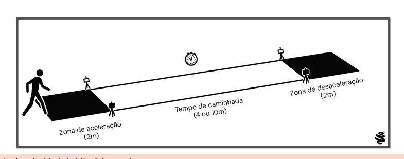
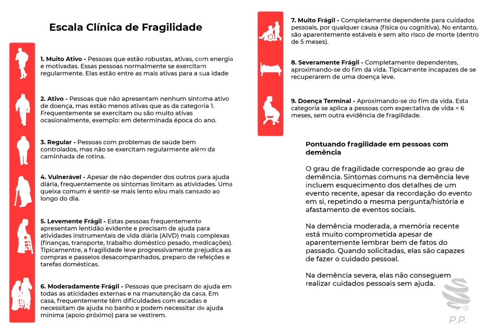
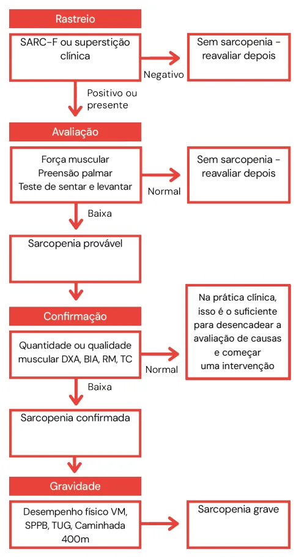

# Fragilidade e Sarcopenia

<!-- page:1 -->

## Resumo Rápido

Fragilidade (CM) e Sarcopenia (CM).

### Fragilidade

- Perda da capacidade de adaptação aos fatores agressores.

**Fisiopatogenia**

- Sarcopenia (perda de força e massa muscular);
- Desregulação neuroendócrina;
- Alterações imunológicas.

**Diagnóstico**: critérios de Fried; escala de Rockwood; acrônimo FRAIL.

> ⚠️ Tabela reconstruída a partir de OCR — confira contra a fonte original.

**Critérios de Fried**

| Critério | Definição |
|---|---|
| Perda de peso não intencional | > 4,5 kg ou ≥ 5% do peso corporal, se medido no último ano |
| Força de preensão palmar | Abaixo do percentil 20 da população, corrigido por gênero e índice de massa corporal |
| Velocidade de marcha | Abaixo do percentil 20 da população, em teste de caminhada de 4,6 m, corrigido por gênero e estatura |
| Sensação de exaustão | Autorreferida — questionário CES-D |
| Atividade física baixa | Abaixo do percentil 20 da população, em kcal/semana — Minnesota Leisure Time Activity Questionnaire, versão curta |

**Interpretação**: ≥ 3 critérios: frágil; 1 ou 2: pré-frágil; 0: robusto.

### Definição

- "Síndrome geriátrica resultante do declínio da reserva fisiológica, com consequente redução da resistência a fatores estressores e da capacidade de homeostase, com aumento da vulnerabilidade."
- Perda da capacidade de adaptação aos fatores agressores.
- Prevalência aumenta de acordo com o envelhecimento:
  - **4,1%** para os sexagenários;
  - **8,4%** entre os septuagenários;
  - **28,0%** nos octogenários;
  - **55,9%** entre os nonagenários e centenários.

### Sarcopenia

- Fragilidade e sarcopenia não são sinônimos!
- Definição: perda de massa muscular, força e desempenho.

**Fluxograma da EWGSOP2**

- Triagem (SARC-F);
- Avaliação (teste de preensão palmar/levantar da cadeira);
- Confirmação (DXA, RNM, TC, BIA);
- Gravidade (desempenho físico: velocidade da marcha, TUGT, caminhada 400m e SPPB).

**Prevenção e tratamento**

- Exercício físico: aeróbico + resistido;
- Vitamina D > 30;
- Suporte calórico e proteico.

*Figura 1: Ciclo envolvido na síndrome de fragilidade.*

---

<!-- page:2 -->

## Fisiopatologia

- É marcada por três pontos fundamentais:
  - Desregulação neuroendócrina;
  - Alterações imunológicas;
  - Sarcopenia.
- Variação genética e ambiental;
- Doenças inflamatórias / *inflammaging* (inflamação crônica persistente relacionada ao envelhecimento);
- Dano ao DNA / envelhecimento celular;
- Estresse oxidativo / disfunção mitocondrial.
- Em via final, tais alterações resultarão em: **IL-1**, **IL-6**, **TNF-alfa** → sarcopenia; osteopenia; alterações cognitivas; anorexia; alterações de coagulação.
- Verificar Figura 2.

### Impacto e Consequências

- A fragilidade no idoso é multifatorial e também gera uma série de consequências danosas, que pode ser representada através da espiral da fragilidade:
  - Déficit cognitivo — fragilidade cognitiva;
  - Desequilíbrio postural e quedas;
  - Alteração motora;
  - Alterações no humor;
  - Redução da massa óssea;
  - Vulnerabilidade aos processos infecciosos;
  - Má resposta às terapêuticas.
- Ocorre redução de: IGF-1; S-DHEA e testosterona; albumina; colesterol; vitamina D (relacionada com a qualidade óssea e muscular); óxido nítrico.
- Ocorre aumento de: cortisol e insulina em jejum; PCR.

**Espiral da fragilidade (componentes)**: sarcopenia, baixa velocidade de marcha, perda de peso, baixa atividade física, fadiga, fraqueza, desregulação neuroendócrina, alterações imunológicas, anorexia, sarcopenia, osteopenia, alteração cognitiva, alteração da coagulação.

*Figura 2: Fisiopatologia envolvida na síndrome de fragilidade.*

---

<!-- page:3 -->

> ⚠️ Diagrama/fluxograma reconstruído a partir de OCR — confira contra a fonte original.

**Figura 3: O espiral da fragilidade**

Fatores contribuintes: doenças, incapacidade, medicações, ↓ paladar e olfato, dentição pobre, depressão, demência, doenças e hospitalização.

- Balanço energético negativo → desregulação neuroendócrina, anorexia do envelhecimento → desnutrição crônica → balanço nitrogenado negativo → envelhecimento, alterações musculoesqueléticas → ↓ massa muscular → sarcopenia;
- ↓ Gasto energético e ↓ taxa metabólica de repouso;
- Sarcopenia → ↓ força e potência, ↓ VO2 máx., ↓ sensibilidade à insulina;
- Estado catabólico → inflamação crônica, citocinas;
- Sarcopenia → ↓ velocidade de caminhada, ↓ atividade física → doenças (demência e depressão), doença aguda, medicação (sedativos), eventos estressantes → quedas e lesões, imobilização → balanço prejudicado → dependência.

## Diagnóstico

### Critérios de Fried

> ⚠️ Tabela reconstruída a partir de OCR — confira contra a fonte original.

**Tabela 1: Critérios de Fried**

| Critério | Definição |
|---|---|
| Perda de peso não intencional | Acima de 4,5 kg ou 5% do peso corporal, se medido no último ano |
| Força de preensão palmar | Abaixo do percentil 20 da população, corrigido por gênero e índice de massa corporal |
| Velocidade de marcha | Abaixo do percentil 20 da população, em teste de caminhada de 4,6 m, corrigido por gênero e estatura |
| Sensação de exaustão | Autorreferida — questionário CES-D |
| Atividade física baixa | Abaixo do percentil 20 da população, em kcal/semana — Minnesota Leisure Time Activity Questionnaire, versão curta |

**Interpretação**: ≥ 3 critérios: frágil; 1 ou 2: pré-frágil; 0: robusto.

---

<!-- page:4 -->

Avalia 5 domínios; é a mais cobrada em provas.

### Acrônimo FRAIL

- O acrônimo FRAIL é um instrumento de triagem baseado em autorrelato, composto por cinco domínios, sendo mais simples e rápido, sem necessidade de testes físicos:
  - **F**atigue (fadiga);
  - **R**esistance (capacidade de subir escadas);
  - **A**mbulation (capacidade de caminhar);
  - **I**llnesses (presença de ≥ 5 doenças crônicas);
  - **L**oss of weight (perda de peso ≥ 5%).
- Cada item positivo soma um ponto, com a seguinte classificação:
  - 0 = não frágil;
  - 1-2 = intermediário/pré-frágil;
  - 3-5 = frágil.

### Escala Clínica de Fragilidade de Rockwood

- Escala mais simples, prática e descritiva;
- Verificar Figura 5 na próxima página.

### Detalhes dos Critérios de Fried

**Força de preensão palmar (*handgrip*)**

- Sentado(a) em uma cadeira sem apoio lateral;
- Dinamômetro na mão dominante, com o braço a 90º ao lado do corpo;
- Preensão palmar com esforço máximo (medida em kg);
- O procedimento deve ser realizado 3 vezes, com intervalo de 1 minuto.

**Velocidade de marcha (teste da velocidade de marcha)**

- Deambular 4,6 metros (15 pés) com passos e velocidade habituais;
- Pode-se usar dispositivo de auxílio de marcha (bengala, andador);
- O procedimento deve ser realizado 3 vezes;
- Velocidade < 0,8 m/s ou < p20 corrigido para gênero e estatura: "baixa velocidade".
- Verificar Figura 4.

**ATENÇÃO**: não confundir o teste de velocidade de marcha (4,6 metros) com o TUGT (*Timed Up and Go Test*) (3 metros), que avalia o risco de queda.

**Perda de peso não intencional**

- > 4,5 kg OU 5% do peso corporal, no último ano.

**Sensação de exaustão**

- "Nas últimas 2 semanas o(a) sr(a) sentiu que teve que fazer esforço para dar conta de suas atividades habituais? O(a) sr(a) conseguiu levar adiante suas atividades?"
- Positivo se: > 3 a 4 dias com elevado esforço ou atividades incompletas.

**Atividade física baixa**

- Identificado através do questionário de Minnesota: 42 questões, que abrangem atividades como caminhada, exercícios de condicionamento, esportes, atividades no jardim e horta, atividades de reparos domésticos;
- O idoso é questionado quanto à realização da atividade, a média de vezes que realizou a atividade nas duas semanas anteriores e o tempo em minutos por ocasião;
- Positivo se < p20 OU < 383 kcal (para homens) ou < 270 kcal (para mulheres).

### Diagnósticos Diferenciais

- Fragilidade não é a mesma coisa que incapacidade ou comorbidades:
  - Em alguns casos, mesmo preenchendo critérios para fragilidade, o idoso ainda consegue ser independente para atividades básicas de vida diária (ABVDs), ele não é incapaz!
  - No fenótipo da fragilidade, existem pacientes que não apresentam todas as características da síndrome da fragilidade, contudo ainda assim pontuam em 3 critérios; é o caso de algumas comorbidades, como:
    - Demência;
    - Neoplasia;
    - Parkinson;
    - Insuficiência cardíaca;
    - DPOC.
- Fragilidade não é a mesma coisa que sarcopenia:
  - A sarcopenia pode fazer parte da fragilidade;
  - Mas nem todo frágil possui sarcopenia!
  - Assim como nem todo sarcopênico é frágil!
  - Utilizamos outros critérios (verificar na próxima página).

*Figura 4: Teste de velocidade habitual de marcha.*

---

<!-- page:5 -->

## Sarcopenia

- Perda de massa muscular, força e desempenho;
- Na prática, para seu diagnóstico utilizamos o fluxograma da *European Working Group on Sarcopenia in Older People* (EWGSOP2): triagem, avaliação, confirmação e classificação (gravidade);
- Triagem: através do questionário SARC-F ou suspeita clínica;
- Avaliação da força muscular: através do teste de preensão palmar (*handgrip*) ou teste do levantar da cadeira.

> ⚠️ Tabela reconstruída a partir de OCR — confira contra a fonte original.

**Tabela 2: Definição operacional de sarcopenia 2018 (EWGSOP2)**

| Critério | Normalidade (varia conforme referência) |
|---|---|
| (1) Baixa força muscular | Homens: ~27 kg; Mulheres: ~16 kg |
| (2) Baixa quantidade ou qualidade muscular | — |
| (3) Baixo desempenho físico | — |

- Critério 1 — provável sarcopenia;
- Critério 1 + 2 — diagnóstico de sarcopenia;
- Critério 1 + 2 + 3 — diagnóstico de sarcopenia grave.

*Figura 5: Escala clínica de fragilidade de Rockwood.*

- **Confirmação**: densitometria óssea (DXA — padrão-ouro), ressonância nuclear magnética (RNM), tomografia computadorizada (TC) ou bioimpedância (BIA). A ultrassonografia (USG) de coxas vem crescendo também como método experimental para confirmação da sarcopenia.

**ATENÇÃO**: atualmente, está validado o teste da circunferência da panturrilha (desde que sem sinais de edema de membros inferiores), com um corte < 33 cm, para casos onde não há disponibilidade dos exames de imagem acima.

- **Classificação (gravidade)**: avaliação do desempenho físico, através da velocidade da marcha, TUGT, caminhada de 400m e SPPB (questionário que combina os testes anteriores).

---

<!-- page:6 -->

## Prevenção e Tratamento

- O principal objetivo é evitar polifarmácia e promover o tratamento das comorbidades.

### Exercício Físico

- **Aeróbico**: redução da fadiga; melhora da capacidade cardiovascular;
- **Resistido**: aumento da massa muscular e do equilíbrio.

### Vitamina D

- Meta: **> 30 ng/mL**;
- Os níveis adequados estão relacionados com: redução de quedas; menor processo inflamatório.

### Suporte Calórico e Proteico

- Objetivo: manter 30 g de proteína em 3 refeições ao dia;
- De outro modo, 1,2 – 1,5 g de proteína/kg/dia;
- Na prática clínica, isso é o suficiente para desencadear a avaliação de causas e começar uma intervenção;
- Se for necessário, suplementar proteínas: em estudos mais recentes, observou-se uma melhora significativa do processo de recuperação muscular, inclusive em pacientes internados.

### Controvérsias

- **Testosterona**: aumenta risco cardiovascular; relacionada com neoplasia de próstata; estudos mostram aumento de massa, sem ganho de força;
- **GH**: diversos efeitos adversos;
- **DHEA, estrógeno e progestágeno**: o risco é maior que o benefício;
- **AINEs** (*inflammaging*): sem benefício;
- **Creatina**: pode ser positiva, se associada a exercício resistido.

*Figura 6: Fluxograma de sarcopenia (EWGSOP2).*

