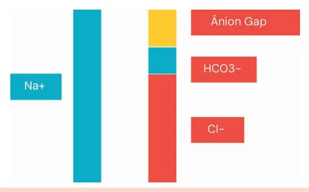

# Gasometria Arterial I

<!-- page:1 -->

## Gasometria Arterial

### Interpretação da Gasometria

**Primeiro passo** é checar o pH:

- Normal: 7,35 – 7,45;
- Acidose: < 7,35;
- Alcalose: > 7,45.

### Acidose Respiratória

- pH < 7,35;
- pCO2 > 45;
- Retenção de CO2: asma, DPOC; doenças musculares; doenças neurológicas;
- **Compensação**: o bicarbonato sobe 1 mEq/L para cada 10 mmHg de aumento da pCO2.

### Acidose Metabólica

- pH < 7,35;
- Bicarbonato < 22;
- Calcular ânion gap (ânion gap = Na+ - Cl- - Bic);
- **Ânion gap normal (≤ 12)**: acidose tubular renal; diarreia; soro fisiológico 0,9%;
- **Ânion gap aumentado (> 12)**: acidose lática; cetoacidose; etilenoglicol e metanol; insuficiência renal;
- **Compensação**: pCO2 = (1,5 x HCO3-) + 8 (±2).

## Equilíbrio Ácido-Base

- Vale relembrar a equação de equilíbrio do sistema tampão (equilíbrio entre água e gás carbônico):

  CO2 + H2O ↔ H2CO3 ↔ HCO3- + H+

- Essa reação pode se deslocar para ambos os lados de acordo com a necessidade fisiológica.

## Gasometria

- Exame que descreve pH, pressão parcial de O2 e CO2 no sangue, além do bicarbonato;
- **Sangue arterial**: indicado para o diagnóstico inicial dos distúrbios ácido-base;
- **Sangue venoso**: pode ser solicitado para acompanhar a evolução e o tratamento do distúrbio ácido-base;
- Geralmente o exame vem da seguinte forma (lembrando que algumas provas não fornecem valores de referência):

> ⚠️ Tabela reconstruída a partir de OCR — confira contra a fonte original.

**Tabela 1: Exemplo de gasometria arterial com os valores de referência normais**

| Resultado | Valor de Referência |
|---|---|
| pH | 7,35 – 7,45 |
| pO2 | 80 – 120 mmHg |
| pCO2 | 35 – 45 mmHg |
| HCO3- | 22 – 26 mEq/L |
| Na+ | 135 – 145 mEq/L |
| K+ | 3,5 – 5 mEq/L |
| Cl- | 95 – 105 mEq/L |

### Alcalose Respiratória

- pH > 7,45;
- pCO2 < 35: hiperventilação; dor; ansiedade;
- **Compensação**: o bicarbonato cai 2 a 4 mEq/L para cada 10 mmHg de queda da pCO2.

### Alcalose Metabólica

- pH > 7,45;
- Bicarbonato > 26;
- Acúmulo de bicarbonato (rim) ou perda de cloro e contração volêmica extracelular: tubulopatias; uso de diuréticos; perda gastrointestinal alta; bicarbonato intravenoso;
- **Compensação**: pCO2 = HCO3- + 15 (±2).

### Ou Seja

1. **1º Passo**: checar o pH;
2. **2º Passo**: respiratório ou metabólico?
3. **3º Passo**: avaliar compensação;
4. **4º Passo**: checar a ficha resumo "Gasometria II".

## Acidoses

- O primeiro parâmetro a ser avaliado é o pH: pH menor que 7,35 indica acidose;
- Se o pH estiver abaixo de 7,35, o próximo passo é checar o HCO3- e o CO2:
  - pCO2 > 45 mmHg indica acidose respiratória;
  - HCO3- < 22 indica acidose metabólica.

---

<!-- page:2 -->

## Acidose Respiratória

- Retenção de pCO2 secundária a:
  - Doenças neuromusculares: miastenia gravis, Guillain-Barré, etc.;
  - Doenças obstrutivas: asma, DPOC.

> ⚠️ Tabela reconstruída a partir de OCR — confira contra a fonte original.

**Tabela 2: Exemplo de gasometria mostrando acidose respiratória**

| Resultado | Valor Obtido | Valor de Referência |
|---|---|---|
| pH | 7,29 | 7,35 – 7,45 |
| pO2 | 55 | 80 – 120 mmHg |
| pCO2 | 60 | 35 – 45 mmHg |
| HCO3- | 27 | 22 – 26 mEq/L |

Na Tabela 2, o pH está baixo, indicando acidose; e a pCO2 está alta, indicando que a acidose é respiratória.

**Compensação da acidose respiratória**

- Na acidose respiratória, o sistema renal tende a aumentar o bicarbonato, porém essa compensação é lenta;
- Para cada 10 mmHg de aumento da pCO2, o bicarbonato sobe 1 mEq/L.

↑ 10 mmHg pCO2: ↑ 1 mEq/L HCO3-

## Acidose Metabólica

- Perda de bicarbonato, retenção de ácidos e presença de substâncias ácidas são possíveis causas da acidose metabólica;
- Sempre calcular o ânion gap:

  Ânion gap = Na+ - HCO3- - Cl- = 12

- Lembrar da eletroneutralidade do sangue, na qual a quantidade de íons negativos e positivos deve se equivaler: principal íon de carga positiva é o sódio, principal íon de carga negativa é o cloro;
- A subtração entre cargas positivas e negativas intuitivamente seria zero. Porém não é o que acontece; o resultado normalmente fica em torno de 12, o que chamamos de ânion gap.

*Figura 1: Representação do ânion gap. As cargas negativas equivalem às cargas positivas, mantendo a eletroneutralidade do sangue.*

**Compensação da acidose metabólica**

- Na acidose metabólica, o corpo tende a eliminar mais CO2 na tentativa de compensar o distúrbio, aumentando a ventilação;
- A compensação na acidose metabólica é determinada pela fórmula:

  pCO2 = (1,5 x HCO3-) + 8 (±2)

> ⚠️ Tabela reconstruída a partir de OCR — confira contra a fonte original.

**Tabela 3: Exemplo de gasometria mostrando acidose metabólica**

| Resultado | Valor Obtido | Valor de Referência |
|---|---|---|
| pH | 7,29 | 7,35 – 7,45 |
| pO2 | 55 | 80 – 120 mmHg |
| pCO2 | 34 | 35 – 45 mmHg |
| HCO3- | 18 | 22 – 26 mEq/L |

Na Tabela 3, o paciente está em acidose, o que é evidenciado pelo pH abaixo do valor de referência; e o HCO3- está baixo, indicando acidose metabólica. A pCO2 também está baixa, mas não é possível saber se é uma compensação adequada ou se o paciente está sob um distúrbio misto. Para saber qual das duas opções anteriores é verdadeira, usamos a fórmula da compensação da acidose metabólica descrita no tópico imediatamente acima:

- pCO2 = (1,5 x 18) + 8;
- pCO2 = 27 + 8 = 35.

A margem de erro é ± 2, de modo que 34 está dentro da margem de erro. Logo, trata-se de uma acidose metabólica compensada.

**Ânion gap aumentado**

- Quando o ânion gap calculado é > 12;
- O aumento ocorre pela presença de ânions não mensuráveis, como:
  - Lactato (acidose lática);
  - Cetoácidos (cetoacidose diabética ou alcoólica);
  - Ânions retidos na insuficiência renal (ex.: sulfato, fosfato);
  - Intoxicação por salicilatos (AAS);
  - Intoxicação por etilenoglicol ou metanol.

**Ânion gap normal**

- Quando o ânion gap calculado é ≤ 12 mEq/L;
- Geralmente ocorre por perda de bicarbonato ou acúmulo de ácidos clorídricos, como na:
  - Diarreia;
  - Acidose tubular renal;
  - Administração excessiva de soro fisiológico 0,9% (rico em Cl-).

## Alcaloses

- O primeiro parâmetro a ser avaliado é o pH: pH maior que 7,45 indica alcalose;
- Se o pH estiver acima de 7,45, o próximo passo é checar o HCO3- e o pCO2:
  - pCO2 < 35 mmHg indica alcalose respiratória;
  - HCO3- > 26 indica alcalose metabólica.

---

<!-- page:3 -->

## Alcalose Respiratória

- Diminuição de CO2 devido a hiperventilação por:
  - Ansiedade;
  - Dor;
  - Ventilação mecânica excessiva.

**Compensação da alcalose respiratória**

- Na alcalose respiratória, o sistema renal tende a diminuir o bicarbonato, e essa compensação depende se a alcalose é aguda ou crônica;
- Na alcalose aguda, para cada 10 mmHg de queda da pCO2, o bicarbonato cai 2 mEq/L;
- Na alcalose crônica, para cada 10 mmHg de queda da pCO2, o bicarbonato cai 4 mEq/L.

Na alcalose respiratória aguda: ↓ 10 mmHg pCO2: ↓ 2 mEq/L HCO3-

Na alcalose respiratória crônica: ↓ 10 mmHg pCO2: ↓ 4 mEq/L HCO3-

> ⚠️ Tabela reconstruída a partir de OCR — confira contra a fonte original.

**Tabela 4: Exemplo de gasometria mostrando alcalose respiratória**

| Resultado | Valor Obtido | Valor de Referência |
|---|---|---|
| pH | 7,51 | 7,35 – 7,45 |
| pO2 | 55 | 80 – 120 mmHg |
| pCO2 | 25 | 35 – 45 mmHg |
| HCO3- | 20 | 22 – 26 mEq/L |

No caso da Tabela 4, o valor do pH evidencia alcalose e o valor de pCO2 diminuído mostra que a origem dessa alcalose é respiratória. Considerando o limite inferior de pCO2 como 35 mmHg, vemos que este caiu 10 mmHg.

Para considerar o distúrbio como compensado, no caso de alcalose respiratória aguda, o bicarbonato deve cair 2 mEq/L (o que aconteceu, já que está em 2 unidades abaixo do limite inferior para o bicarbonato).

## Alcalose Metabólica

- Ocorre por acúmulo de bicarbonato (geralmente por ação renal) ou perda de cloro e contração volêmica extracelular:
  - Vômitos;
  - Aspiração gástrica (ex.: sonda nasogástrica aberta);
  - Tubulopatias;
  - Uso excessivo de diuréticos (especialmente tiazídicos ou de alça);
  - Infusão intravenosa de bicarbonato.

Perda de cloro leva ao aumento do bicarbonato para manutenção da eletronegatividade.

**Compensação da alcalose metabólica**

- Na alcalose metabólica, o corpo tende a eliminar menos CO2 na tentativa de compensar o distúrbio, diminuindo a ventilação;
- A compensação na alcalose metabólica é determinada pela fórmula:

  pCO2 = HCO3- + 15 (±2)

> ⚠️ Tabela reconstruída a partir de OCR — confira contra a fonte original.

**Tabela 5: Exemplo de gasometria mostrando alcalose metabólica**

| Resultado | Valor Obtido | Valor de Referência |
|---|---|---|
| pH | 7,52 | 7,35 – 7,45 |
| pO2 | 67 | 80 – 120 mmHg |
| pCO2 | 52 | 35 – 45 mmHg |
| HCO3- | 36 | 22 – 26 mEq/L |

Na gasometria da Tabela 5, temos o valor de pH alcalótico com bicarbonato acima do valor de referência, indicando alcalose metabólica. Seguindo a fórmula de compensação acima, se adicionarmos 15 ao valor do bicarbonato, obteremos 51 mmHg como resultado para a pCO2 esperada. Está dentro da margem de erro de ± 2, representando uma alcalose metabólica compensada.

Comumente, a ocorrência de compensações adequadas ameniza os distúrbios ácido-básicos, mas não normaliza completamente o pH!
