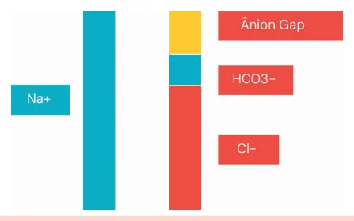

# Gasometria Arterial II

<!-- page:1 -->

Gasometria arterial (CM) ACIDOSE METABÓLICA DE ÂNION GAP AUMENTADO Delta/Delta

- Pesquisa de distúrbios associados

Δ AG AG – 12 → Δ Bic 25 – Bic

- <1 = Acidose ânion gap normal associada

- 1-2 = Acidose ânion gap aumentado pura

- >2 = Alcalose metabólica associada

Gap osmolar

- Osmolaridade sérica = (2 x Sódio) + (Glicose/18)

+ (Ureia/6)

- Gap osmolar = Osm Medida – Osm Calculada Gap > 10 Presença de tóxico exógeno

- Etilenoglicol

- Metanol

## ACIDOSE METABÓLICA DE ÂNION GAP NORMAL

Ânion gap urinário

- (Na+urina + K+urina) – Cl- urina

- Avalia capacidade do rim de excretar ácido

- A culpa é do rim?

- Ânion gap urinário negativo Bastante Cl- na urina (para neutralizar H+) Perda gastrointestinal ou acidose tubular renal tipo 2

## RELEMBRANDO ALGUNS

CONCEITOS GASOMETRIA Tabela 1: Exemplo de gasometria arterial normal. Resultado Valor de referência pH 7,35 – 7,45 pCO 35 – 45 mmHg pO 80 – 100 mmHg HCO - 22 – 26 mEq/L Na+ 135 – 145 mEq/L K+ 3,5 – 5,5 mEq/L Cl- 95 – 105 mEq/L pCO marca distúrbios respiratórios. HCO - marca 2 3 distúrbios metabólicos! - Ânion gap urinário positivo | Pouco Cl- na urina (pouco ácido)

| Acidose tubular renal tipo 1 ou 4 Acidose tubular renal Distal por Hipocalemia Tipo defeito na Litíase urinária Sjögren 1 excreção de Nefrocalcinose H+ Proximal por Hipocalemia Fanconi Tipo perda de Hipofosfatemia Aminoglicosídeo BIcarbonato Glicosúria Tenofovir Distal por Diabetes Tipo defeito na Hipercalemia Insuficiência 4 excreção de adrenal H+ e K+ ALCALOSE METABÓLICA

- Cl- urinário <15 = Perda de cloro e depleção do volume extracelular

- Cl- urinário >15 = Retenção de bicarbonato

## ÂNION GAP

Lembre-se, no sangue é preciso haver certa eletroneutralidade. Esse conceito é ilustrado pelo ânion gap:

Ânion gap = Na+ - (HCO - + Cl-)

- Valor de referência: 12 mEq/L;

- O ânion gap representa os ânions não mensuráveis;

- O cloro e o bicarbonato apresentam ajuste fino entre si;

- A redução do cloro, por qualquer motivo que seja, cursa com aumento compensatório do bicarbonato;

Figura 1: Representação do ânion gap.

---

<!-- page:2 -->

As cargas negativas equivalem às cargas positivas,

- A relação Δ/Δ é a divisão entre a variação do ânion mantendo a eletroneutralidade do sangue. gap (delta ânion gap) e a variação do bicarbonato carga negativa da molécula da albumina:

Uma parte dessa eletroneutralidade é influenciada pela (delta bicarbonato):

- O cálculo do ânion gap deve ser corrigido em função Relação Δ/Δ = Δ ânion gap / Δ HCO

- O cálculo do ânion gap deve ser corrigido em função dos níveis de albumina;

- Se hipoalbuminemia, a correção deve ser realizada segundo o cálculo abaixo:

- Ânion gap corrigido = ânion gap calculado

+ 2,5 x (4 – albumina do paciente)

## ACIDOSE METABÓLICA COM

## ÂNION GAP AUMENTADO

DETERMINANDO A ETIOLOGIA Â Decorre da presença de ânions não mensuráveis em excesso: D

- Lactato: G Marcador de metabolismo anaeróbico celular; d Secundário a hipoperfusão, disfunção hepática.

- Disfunção renal: Em estágios iniciais, pode cursar com acidose de ânion gap normal, em virtude da disfunção tubular; Em estágios mais avançados, há retenção de ácidos orgânicos, sendo observado o ânion gap aumentado.

- Cetoacidose: Metabolismo celular com déficit de glicose, com  concomitante produção de cetoácidos (beta- hidroxibutirato e acetoacetato); Secundário ao diabetes e etilismo.

- Intoxicação por salicilatos: AAS.

- Intoxicação por ácidos exógenos: Metanol e etilenoglicol; Calcular o gap osmolar:

Gap osmolar = osmolaridade medida osmolaridade calculada. Osmolaridade calculada = (2x Sódio) + (Glicose/18)

+ (Ureia/6). | Gap osmolar > 10 mOsm/kg indica a presença de ácidos exógenos (etilenoglicol e metanol).

## DETERMINANDO DISTÚRBIOS ASSOCIADOS

- A proporção de aumento do ânion gap deve ser comparada à proporção de queda do bicarbonato nas acidoses metabólicas de ânion gap aumentado;

- Dois cenários são possíveis nas acidoses metabólicas de ânion gap aumentado: 1° cenário: se o aumento no valor do ânion gap é proporcionalmente maior que a queda do bicarbonato, provavelmente existe um quadro concomitante de alcalose metabólica; 2° cenário: se a queda do bicarbonato é exagerada em relação ao aumento no ânion gap, há acidose metabólica de ânion gap normal associada;

- Essa comparação é feita a partir do cálculo da relação delta/delta (Δ/Δ); Relação Δ/Δ = Δ ânion gap / Δ HCO 3

Δ ânion gap = (ânion gap - 12) Δ HCO3 = (25 - HCO -)

- Interpretação da relação Δ/Δ : Relação < 1: acidose com ânion gap normal associada; Relação = 1 – 2 : acidose com ânion gap aumentado pura; Relação > 2: alcalose metabólica associada.

ÂNION GAP NORMAL DETERMINANDO A ETIOLOGIA Geralmente ocorre por perda de bicarbonato ou acúmulo de ácidos clorídricos, como na:

- Diarreia;

- Acidose tubular renal: Pode decorrer da incapacidade do rim de excretar ácidos.

- Acidose dilucional: Hiperclorêmica, pelo uso excessivo de soro fisiológico.

Ânion gap urinário

- O rim excreta os seguintes ácidos: H+ e NH + (amônio);

- Determina-se a capacidade do rim de excretar ácidos calculando-se o ânion gap urinário;

- A dosagem direta de amônio não é possível. Contudo, pelo princípio da eletroneutralidade pode-se inferir a partir do cálculo do ânion gap urinário;

- As cargas positivas restantes, em teoria, seriam da molécula de amônio.

Ânion gap urinário = (Na+ urinário + K+ urinário) Cl- urinário

- Interpretação do ânion gap urinário: Ânion gap urinário < 0 mEq/L: capacidade de acidificação urinária preservada;

Ânion gap urinário negativo resulta da elevação do cloro (carga negativa) em comparação às cargas positivas (sódio e potássio). De tal forma, deve existir alguma carga positiva não quantificada, isto é, o amônio.

Ou seja, o rim consegue excretar amônio e sua capacidade de acidificação urinária está preservada. | Ânion gap urinário > 0 mEq/L: deficiência na acidificação da urina.

Ânion gap urinário positivo demonstra que os níveis de sódio e potássio urinários estão mais altos,e os níveis de cloro estão mais baixos. Assim, observa-se uma deficiência na acidificação da urina, pela baixa quantidade de amônio excretada.

---

<!-- page:3 -->

## ACIDOSE TUBULAR RENAL

- Ou seja, incapacidade na troca de 4 íons, gera a

Acidose tubular renal tipo 1 acidose tubular renal do tipo 4;

- No túbulo contorcido distal, há um trocador

- O ânion gap urinário é > 0 mEq/L, pela incapacidade responsável pela troca de potássio ou hidrogênio de excretar H+ (e consequentemente, amônio).

por sódio; por sódio;

- Esse trocador é modulado pela aldosterona;

- O defeito na ação desse trocador prejudica a excreção renal de H+, resultando na acidose tubular renal do tipo 1;

- A troca do sódio pelo potássio ainda permanece;

Além da dificuldade em excretar H+, a acidose tubular renal tipo 1 também pode evoluir com hipocalemia, já que a excreção de potássio está preservada.

- Observa-se um ânion gap urinário >0 mEq/L, pela incapacidade de excretar H+ (o H+ não é transportado adequadamente para formar a molécula de amônio);

- A acidose tubular renal do tipo 1 pode apresentar nefrocalcinose.

A acidose tubular renal do tipo 1 costuma ocorrer na doença de Sjögren! Acidose tubular renal tipo 2

- Decorre da perda urinária de bicarbonato;

Acidose tubular renal “tipo 2” – perda de “BI”-carbonato!

- O bicarbonato é reabsorvido no túbulo contorcido proximal;

- O túbulo contorcido proximal também reabsorve fosfato, glicose, aminoácidos, bicarbonato e potássio;

Além da perda de bicarbonato, a acidose tubular renal tipo 2 também evolui com hipocalemia.

- Como a deficiência ocorre no túbulo proximal, a porção responsável pela acidificação urinária (túbulo contorcido distal) permanece intacta;

- Assim sendo, é possível notar que o ânion gap urinário é < 0 mEq/L.

- Pode ser decorrente de: Medicações (tenofovir, aminoglicosídeos); Doenças autoimunes; Mieloma múltiplo, amiloidose; Metais pesados.

A disfunção do túbulo contorcido proximal, cursando com acidose tubular renal do tipo 2 e perda urinária de fosfato, glicose, aminoácidos e potássio é chamada de síndrome de Fanconi!

Acidose tubular renal tipo 4

- Decorre da deficiência de aldosterona ou da resistência a sua ação;

- Desta forma, o trocador de potássio ou hidrogênio por sódio no túbulo contorcido distal, modulado pela aldosterona, torna-se incapaz de trocar Na+ por H+, ou mecanismo de hipoaldosteronismo, e evolui com hipercalemia! O hipoaldosteronismo pode ser decorrente de insuficiência adrenal primária, ou, ainda, em quadros secundários, de resistência à ação da aldosterona, principalmente em pacientes diabéticos (hipoaldosteronismo hiporreninêmico).

Na+ por K+; A acidose tubular renal do tipo 4 ocorre por um

## ALCALOSES METABÓLICAS

DETERMINANTE A ETIOLOGIA Ocorre por perda de cloro ou acúmulo de bicarbonato:

- Alcalose hipoclorêmica;

- Alcalose por retenção isolada de bicarbonato.

Lembre-se de que a perda de cloro causa retenção de bicarbonato, a fim de manter a eletroneutralidade do sangue!

A dosagem do cloro urinário é o principal marcador para definir o tipo de alcalose metabólica. Cloro urinário < 15 mEq/L

- Uma concentração tão baixa de cloro sugere alcalose metabólica hipoclorêmica, frequentemente associada à perda gastrointestinal alta ou à chamada alcalose de contração (depleção do volume extracelular). Vômitos ou aspiração gástrica prolongada; Uso de diuréticos levando a depleção do volume extracelular; Diarreia secretória (ex: adenoma viloso do cólon); Fibrose cística (em crianças, com sudorese excessiva);

Deve-se investigar: Cloro urinário > 15 mEq/L

- Sugere que os rins estão eliminando cloro adequadamente, o que indica retenção de bicarbonato. Deve-se investigar: Uso de diuréticos (tiazídicos e de alça); Infusão intravenosa de bicarbonato; Distúrbios de perda renal de sal com retenção de bicarbonato.

Os distúrbios renais de perda de sal com retenção de bicarbonato incluem o hiperaldosteronismo primário, a síndrome de Liddle (defeito em canal amiloridesensível), a síndrome de Bartter (mimetiza intoxicação por diurético de alça) e a síndrome de Gitelman (mimetiza intoxicação por diurético tiazídico).
