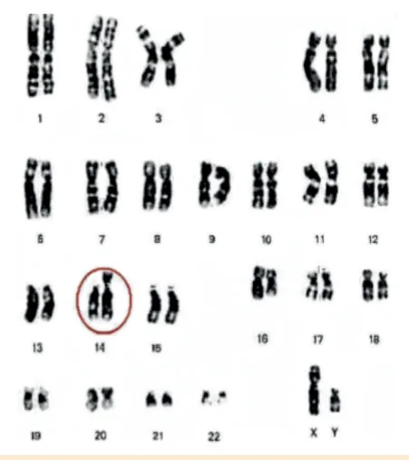
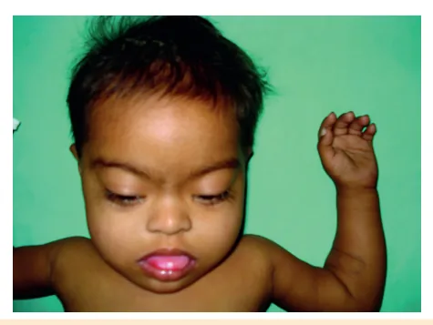
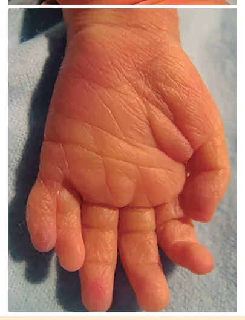
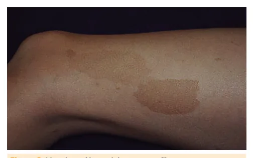
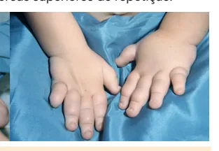
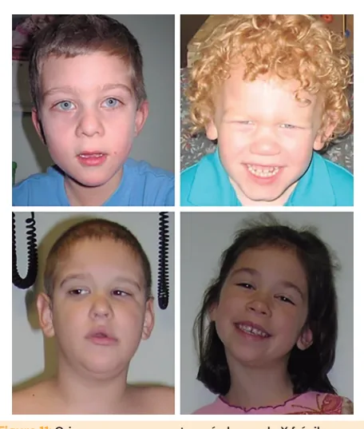
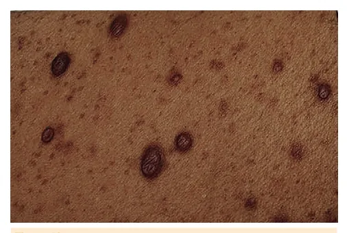
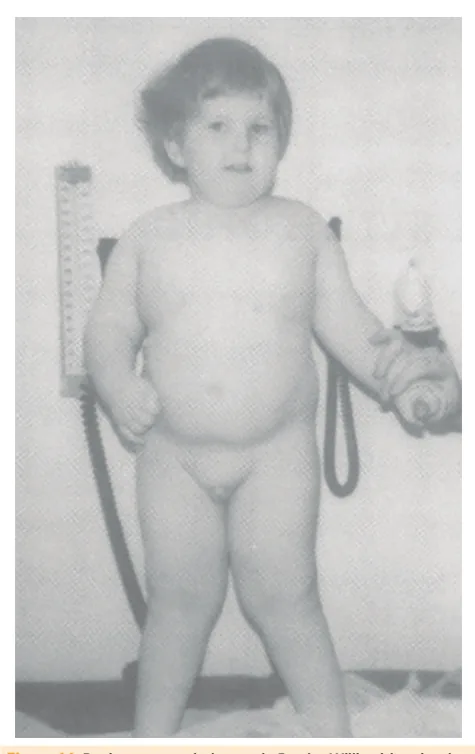
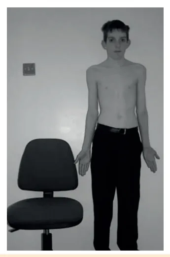

# Genética

<!-- page:1 -->

Síndrome de Down (PED) Outras síndromes genéticas (PED) Síndrome de Turner (PED) Síndrome de Klinefelter (PED)

Trissomia do cromossomo 21 Fenótipo: Hipotonia, fendas palpebrais oblíquas, prega palmar única, baixa estatura;

Tabela 1: Acompanhamento com exames periódicos dos pacie Exame 0 a 2 anos 0m, 6m, 12m Hemograma Anualmente após TSH/T4L 0m, 6m, 12m Glicemia de jejum Perfil lipídico Ecocardiograma USG abdome Na suspeita clínica Cariótipo RX coluna cervical IgA e antiendomísio Aos 2 anos Avaliações Visão e audição (6m)

Síndromes genéticas em pediatria Síndrome de Turner: 45,X. Baixa estatura, coarctação de aorta, atraso puberal, pescoço alado;

Síndrome de Klinefelter: 47,XXY. Alta estatura, testículos pequenos, ginecomastia, alterações comportamentais;

Síndrome de Patau: Trissomia do cromossomo 13; alta letalidade. Microftalmia, fenda palatina, polidactilia, holoprosencefalia, malformações cardíacas;

Síndrome de Edwards: Trissomia do cromossomo 18; alta letalidade. Mão em punho fechado com sobreposição de dedos e pés em rocker-bottom;

malformações cardíacas; ALTERAÇÕES CROMOSSÔMICAS

- Alterações cromossômicas são grandes;

- São vistas em cariótipo (detecta alterações de 5-10Mb);

- Numéricas: um cromossomo a mais ou a menos;

- Estruturais: translocação, perda de um dos braços do cromossomo, cromossomo em anel;

- Balanceadas: mesma quantidade de material genético esperado, mas rearranjado de uma forma diferente;

- Desbalanceadas: aumento ou redução da quantidade de material genético. Comorbidades: cardiopatia congênita, malformações renais, hipotireoidismo, instabilidade atlanto-axial, doença celíaca entes com Síndrome de Down.

2 a 10 anos 10 a 19 anos Anualmente Anualmente Anualmente Anualmente A cada 5 anos A cada 5 anos 3 e 10 anos Se sintomas Ou se sintomas Se sintomas Se sintomas Bianual se HLA de risco Bianual se HLA de risco Visão (bianual) e Visão e audição (anual)

audição (anual) Neurofibromatose tipo 1: Manchas café com leite, neurofibromas e tumores (ex: glioma óptico);

X frágil: Expansão da trinca CGG. Disfunção cognitiva, espectro autista, fácies característica (face longa, orelhas grandes, mandíbula quadrada);

Mucopolissacaridoses: mutações em enzimas lisossomais. Acometimento intelectual, fácies típica, hepatoesplenomegalia, baixa estatura. Está no teste do pezinho ampliado;

Síndrome de Prader Willi: principal causa genética de obesidade. Hipotonia e baixo ganho ponderal até 9 meses; aumento do peso e do apetite a partir de 2-4 anos, sem saciedade a partir de 8 anos.

Tratamento: GH, dieta, atividade física. SÍNDROME DE DOWN (SD) CONCEITOS

- Trissomia do cromossomo 21;

- Acomete 1:600 - 1:1000 nascidos vivos;

- Expectativa de vida: 60-65 anos (cada vez maior).

## DIAGNÓSTICO

- Diagnóstico clínico: Todos os bebês com SD têm ao menos 4 dos sinais de Hall.

Sinais cardinais de Hall

- Perfil facial achatado;

- Reflexo de Moro diminuído;

- Hipotonia;

- Hiperflexibilidade das articulações;

---

<!-- page:2 -->

- Fendas palpebrais oblíquas;

- Pele redundante na nuca;

- Displasia da pelve (Raio X);

- Displasia da falange média do 5º quirodáctilo;

- Orelhas pequenas e arredondadas;

- Orelhas pequenas e arredondadas;

- Prega palmar única.

Outras características

- Epicanto;

- Sinófris (união das sobrancelhas);

- Base nasal plana, retrognatia;

- Protrusão lingual;

- Palato ogival;

- Cabelo fino;

- Clinodactilia do 5º quirodáctilo;

- Pé plano;

- Diástase de reto abdominal e hérnia umbilical;

- - Figura 1: Dismorfismos presentes em pacientes portadores de síndrome de Down.

- Cariótipo

- O cariótipo ajuda a orientar a família, pois determina o mecanismo genético e o risco de recorrência;

- Tipos de cariótipos na SD: Trissomia livre (47, XX ou XY,+21); Translocação Robertsoniana 46, XX ou XY t(14,21) (14q;21q): isso quer dizer que um dos três cromossomos 21 está ligado ao cromossomo 14 de prole com SD. E

(não está livre). Essa forma apresenta maior risco

- - - S

- Figura 2: Cariótipo evidenciando a trissomia livre do cromossomo 21 na síndrome de Down. Figura 3: Cariótipo mostrando translocação

Robertsoniana t(14,21) levando à Síndrome de Down.

## COMORBIDADES

- Oftalmológicas: Catarata congênita, pseudo-estenose do ducto lacrimal, vício de refração, glaucoma, nistagmo;

- Otorrinológicas: Perda auditiva, otite de repetição, apneia do sono;

- Cardiovasculares: comunicação interatrial (CIA), comunicação interventricular (CIV), defeito de septo atrioventricular (DSAV);

- Gastrointestinais: Atresia de esôfago, estenose ou atresia de duodeno, megacólon aganglionar (Doença de Hirschsprung), doença celíaca;

- Sistema nervoso: Síndrome de West, autismo, atraso de desenvolvimento neuropsicomotor, hipotonia;

- Endócrino: Hipotireoidismo;

- Ortopédico: subluxação cervical com ou sem lesão medular, luxação de quadril, instabilidade articular;

- Hematológico: leucemia, anemia, mieloproliferação transitória.

EXAMES COMPLEMENTARES Na suspeita de Síndrome de Down, devemos realizar:

- Ecocardiograma (50% tem cardiopatias: CIA,

CIV, DSAV);

- Hemograma (reações leucemoides, policitemia, leucemia, mieloproliferação transitória);

- Triagem para hipotireoidismo (triagem neonatal);

- USG de abdome (malformações gastrointestinais).

## SEGUIMENTO AMBULATORIAL

Lactente

- Reabilitação: acuidade auditiva e visual, fonoaudiologia: Avaliação de acuidade auditiva e visual os 6 e aos

12 meses, e anualmente após.

- Hipotonia: fisioterapia motora: Se instabilidade de quadril, fazer USG aos 6 meses ou RX após 1 ano.

---

<!-- page:3 -->

- Alimentação: aleitamento materno exclusivo até

6 meses, alimentação complementar saudável;

- Odontologista: iniciar no primeiro ano de vida;

- Crescimento: curva de crescimento própria.

2 a 10 anos

- Instabilidade atlanto-axial: Avaliação no exame físico em todas as consultas; RX coluna cervical aos 3 anos e aos 10 anos (ou apenas se sintomas); Evitar movimentos de flexão e extensão total da coluna.

orientar postura cervical;

- Doença celíaca: Acomete 3% dos pacientes; Triagem inicial aos 2 anos com coleta de antiendomísio e IgA.

- Estilo de vida saudável; autonomia, socialização, escolaridade;

- Exames anualmente: Hemograma, TSH e T4, avaliação de acuidade visual e auditiva, odontologia.

Adolescentes

- Anualmente: hemograma, TSH e T4 livre, acuidade auditiva, odontologia;

- A cada dois anos: avaliação de acuidade visual;

- A cada cinco anos: glicemia de jejum e perfil lipídico;

- Polissonografia se houver obesidade.

## SÍNDROME DE PATAU

## CONCEITOS

- Trissomia do cromossomo 13;

- Acomete 1:10 mil nascimentos;

- Letalidade precoce. Figura 4: Paciente portador de Síndrome de Patau, com microcefalia, orelha de baixa implantação e polidactilia.

Tríade Microftalmia + Fenda palatina + CARACTERÍSTICAS FENOTÍPICAS Polidactilia.

- Cabeça: microcefalia, fissuras palpebrais, nariz hipoplásico, occipício proeminente, fenda palatina;

## CARACTERÍSTICAS FENOTÍPICAS

- Tórax: cardiopatias (CIV, PCA, CIA), esterno curto;

- Sistema nervoso: holoprosencefalia;

- Extremidades: hipertonia, dedos sobrepostos,

- Cabeça: microcefalia, microftalmia, fenda palatina, punho fechado, pés em rocker-bottom orelhas baixas; (calcâneo proeminente e convexidade da sola),

- Extremidades: polidactilia, unhas hipoplásicas; unhas hipoplásicas;

- Tórax: malformações cardíacas (CIA, CIV, persistência

- Geral: atraso no neurodesenvolvimento.

do canal arterial - PCA);

- Geral: atraso no desenvolvimento, restrição de crescimento pré e pós natais importantes, malformações renais, criptorquidia;

- Verificar Figura 4 na coluna ao lado.

## SÍNDROME DE EDWARDS

- Trissomia do cromossomo 18;

- Acomete 1:6 mil nascimentos;

- Letalidade precoce.

Figura 5: Síndrome de Edwards: mão em punho fechado com sobreposição de dedos e pés em rocker-bottom.

---

<!-- page:4 -->

## SÍNDROME DE TURNER

- Presença de um cromossomo X e perda total ou parcial do segundo cromossomo sexual (X ou Y), com parcial do segundo cromossomo sexual (X ou Y), com manifestações clínicas típicas;

- Acomete em 1:2500 nascidas vivas.

- Pescoço alado, linfedema em mãos e pés;

- Cardiopatias congênitas (coarctação de aorta, valva aórtica bicúspide);

- Malformações renais (rim em ferradura);

- Gônadas em fita e consequente hipogonadismo hipergonadotrófico;

- Baixa estatura;

- Hipertelorismo mamário;

- Inteligência normal;

- Infecção de vias aéreas superiores de repetição.

- Figura 6: Edema de mãos e em região cervical em recém nascida com síndrome de Turner.

## SÍNDROME DE KLINEFELTER

- Cromossomo X adicional em meninos (47, XXY);

- Acomete em 1:1000 homens.

Micropênis, testículos pequenos, hipogonadismo hipergonadotrófico.

- Hipogonadismo (puberdade começa, mas testículos fibrosam, ficando pequenos e mais endurecidos);

- Ginecomastia;

- Poucos pelos;

- Alta estatura desproporcional (membros longos);

- Infertilidade;

- Baixo QI;

- Risco de autoimunidade;

- Verificar Figura 7 na coluna ao lado.

## SÍNDROME NEUROCUTÂNEAS

## NEUROFIBROMATOSE TIPO 1

- Autossômica dominante, gene NF1;

- Acomete em 1:3000 nascidos vivos.

- Manchas café com leite;

- Neurofibromas: cutâneos, nodulares ou plexiformes. Figura 7: Paciente com Síndrome de Klinefelter, mostrando alta estatura, ginecomastia e microrquidia.

- Tumores: Glioma óptico; Malignos em nervos periféricos; Outras neoplasias (feocromocitoma, rabdomiosarcoma, leucemia, tumor de wilms).

Tabela 2: Manifestações da neurofibromatose tipo 1 em cada faixa etária. 0 a 2 2 a 6 6 a 10 Adolescente anos anos anos Sardas axilares Neurofibroma Manchas Nódulos de TDAH cutâneo café com Lish Neurofibroma Transformação leite Glioma de plexiforme maligna de Glioma vias ópticas Outros neurofibroma de via Tumores SNC tumores plexiforme óptica Neurofibroma HAS plexiforme Figura 8: Mancha café com leite na neurofibromatose.

---

<!-- page:5 -->

Vigabatrina é terapia de escolha na epilepsia na esclerose tuberosa.

## OUTRAS SÍNDROMES

Figura 9: Sardas axilares na neurofibromatose. Figura 10: Neurofibromas cutâneos na neurofibromatose.

Diagnóstico Presença de 2 ou mais dos seguintes:

- Seis ou mais manchas café com leite >5mm em prépúberes, ou >15mm em pós-púberes;

- Sardas axilares ou inguinais;

- Dois ou mais nódulos de Lisch (hamartomas na íris);

- Dois ou mais neurofibromas, ou um neurofibroma plexiforme;

- Lesão óssea sugestiva;

- Glioma de via óptica;

- Familiar de primeiro grau com NF1;

- Pesquisa genética positiva.

Manejo

- Controle das complicações.

## ESCLEROSE TUBEROSA

- Autossômica dominante, gene TSC1 ou TSC2;

- Acomete em 1:6000 nascidos vivos.

Fisiopatologia

- Afeta a hamartina e a tuberina (reguladoras da síntese proteica e do tamanho das células);

- Elas atuam na supressão de tumores; com a mutação, há formação de tumores benignos (hamartomas).

Diagnóstico

- Quadro clínico + confirmação genética.

Quadro clínico

- Pele: máculas hipopigmentadas, angiofibromas;

- Sistema nervoso central: harmatomas, nódulos subependimários, outros tumores, epilepsia intratável;

comprometimento intelectual;

- Outros: rabdomiomas, angiomiolipomas (em olhos, coração, pulmões, rins), puberdade precoce central. X FRÁGIL

- Herança dominante ligada ao X, mutação no gene FMR1.

Fisiopatologia

- Regiões frágeis: regiões dos cromossomos que têm tendência à separação e quebra;

- Expansão de CGG (>200 repetições) no braço longo distal do cromossomo X;

- Silencia a produção de uma proteína reguladora, e afeta a função sináptica.

Quadro clínico

- Disfunção cognitiva;

- Espectro autista;

- Articulações hiperextensíveis;

- Fácies característica (face longa, orelhas grandes, mandíbula quadrada).

Figura 11: Crianças que apresentam síndrome do X frágil, evidenciando facies típica. SÍNDROME DE MARFAN

- Autossômica dominante, gene FBN1;

- Ocorre em 1:5000-10000 nascidos vivos.

Quadro clínico

- Esqueleto: deformidade torácica, sinal do punho, sinal do polegar;

- Ocular: luxação do cristalino;

- Cardiovascular: aneurisma de aorta, prolapso mitral;

- Alta estatura desproporcionada (envergadura maior que a altura);

- Verificar Figura 12 na próxima página.

;

---

<!-- page:6 -->

## SÍNDROME DE PRADER WILLI

- Principal causa genética de obesidade (1:15mil nascidos);

- 3 subtipos genéticos: Deleção no alelo paterno; Dissomia uniparental;

- - Figura 12: Sinal do polegar e sinal do punho, presentes na síndrome de Marfan.

Figura 13: Paciente com síndrome de Marfan, evidenciando alta estatura desproporcionada.

## MUCOPOLISSACARIDOSES

- Doenças hereditárias progressivas por mutações em enzimas lisossomais necessárias para degradar os mucopolissacarídeos;

- Em geral são de herança autossômica recessiva: Exceção: doença de Hunter (recessiva ligada ao X).

- Pode haver atividade residual das enzimas mutadas, T com quadro clínico menos severo.

- Quadro clínico

- R

Acometimento principal: tecido conjuntivo e SNC. Quadro varia com a síndrome, mas em geral há:

- Acometimento intelectual;

- Fácies típica; R

- Alterações oculares; A r

- Hepatoesplenomegalia; P

- Baixa estatura;

- Alterações ósseas. Defeito do centro do imprinting.

Diagnóstico R Está no teste do pezinho ampliado: alfa-liduronidase. S M | Dissomia uniparental; Características fenotípicas

- Hipotonia e baixo ganho ponderal até 9 meses;

- Aumento do peso e do apetite a partir de 2-4 anos, sem saciedade a partir de 8 anos: Obesidade grave;

- Deficiências de hormônios hipofisários.

Figura 14: Paciente com síndrome de Prader Willi evidenciando a obesidade, mãos pequenas e lábio superior fino.

Tratamento

- Dieta, atividade física e GH precoce;

- Cirurgia bariátrica é ineficaz.

## REFERÊNCIAS

Figura 1: Dismorfismos presentes em pacientes portadores de síndrome de Down. Referência: PRASAD, Rajniti; SINGH, Utpal Kant; MISHRA, Om Prakash.

Arteriovenous malformation of brain with stroke in Down syndrome: a case report. BMJ Case Reports, 20 fev. 2009. doi: 10.1136/bcr.07.2008.0414.

PMCID: PMC3027944. PMID: 21686822. Figura 2: Cariótipo evidenciando a trissomia livre do cromossomo 21 na síndrome de Down.

Referência: DIRETRIZES DE ATENÇÃO À SAÚDE DE PESSOAS COM SÍNDROME DE DOWN - SOCIEDADE BRASILEIRA DE PEDIATRIA MARÇO/2020.

---

<!-- page:7 -->

Figura 3: Cariótipo mostrando translocação Figura 9: Sardas axilares. Robertsoniana t(14,21) levando à Síndrome de Down. Referência: Boyd, Kevin P., Bruce R. Korf, and Amy Theos.

“Neurofibromatosis type 1.” Journal of the American Academy of Referência: DIRETRIZES DE ATENÇÃO À SAÚDE DE PESSOAS COM Dermatology 61.1 (2009): 1-14.

SÍNDROME DE DOWN - SOCIEDADE BRASILEIRA DE PEDIATRIA MARÇO/20 20. Figura 10: Figura 4: Paciente portador de Síndrome de Patau, com microcefalia, orelha de baixa implantação e polidactilia.

Referência: Ramsey, K. Wong, et al. “Monozygotic twins discordant for trisomy 13.” Journal of Perinatology 32.4 (2012): 306-308.

Figura 5: Síndrome de Edwards: Mão em punho fechado com sobreposição de dedos e pés em rocker-bottom.

Referência: https://phil.cdc.gov/Details.aspx?pid=15408 Figura 6: Edema de mãos e em região cervical em recém nascida com síndrome de Turner.

Referência: Sybert, Virginia P., and Elizabeth McCauley. “Turner’s syndrome.” New England Journal of Medicine 351.12 (2004): 1227-1238.

Figura 7: Paciente com Síndrome de Klinefelter, mostrando alta estatura, ginecomastia e microrquidia.

Referência: Smyth, Cynthia M., and William J. Bremner. “Klinefelter syndrome.” Archives of internal medicine 158.12 (1998): 1309-1314.

Figura 8: Mancha café com leite na neurofibromatose. Referência: Boyd, Kevin P., Bruce R. Korf, and Amy Theos.

“Neurofibromatosis type 1.” Journal of the American Academy of Dermatology 61.1 (2009): 1-14. Figura 10: Neurofibromas cutâneos.

Referência:Boyd, Kevin P., Bruce R. Korf, and Amy Theos. “Neurofibromatosis type 1.” Journal of the American Academy of Dermatology 61.1 (2009): 1-14.

Figura 11: Crianças que apresentam síndrome do X frágil, evidenciando facies típica. Referência: Garber, Kathryn B., Jeannie Visootsak, and Stephen T. Warren.

“Fragile X syndrome.” European journal of human genetics 16.6 (2008): 666-672. Figura 12: Sinal do polegar e sinal do punho, presentes na síndrome de Marfan.

Referência: Dean, John. “Marfan syndrome: clinical diagnosis and management.” European Journal of Human Genetics 15.7 (2007): 724-733.

Figura 13: Paciente com síndrome de Marfan, evidenciando alta estatura desproporcionada. Referência: Dean, John. “Marfan syndrome: clinical diagnosis and management.” European Journal of Human Genetics 15.7 (2007): 724-733.

Figura 14: Paciente com síndrome de Prader Willi evidenciando a obesidade, mãos pequenas e lábio superior fino.

Cassidy, Suzanne B. “Prader Willi syndrome” Journal of medical genetics 34.11 (1997): 917-923.
