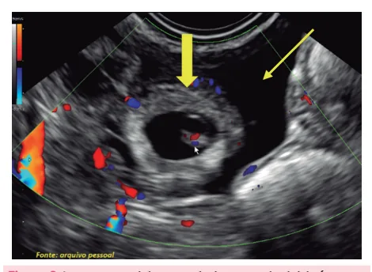
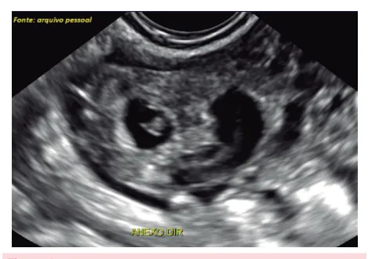

# Gestação Ectópica

<!-- page:1 -->

## Resumo

**Tópicos**: gestação ectópica; diagnóstico de gestação ectópica; conduta não cirúrgica na gestação ectópica; conduta cirúrgica na gestação ectópica.

- A maioria será tubária;
- Suspeitar em casos de: dor + atraso menstrual + sangramento vaginal;
- Beta-hCG discriminatório a partir de **2.000 mUI/mL**: esse é o valor a partir do qual deve ser observada alguma imagem intrauterina. Espera-se que esses títulos dobrem a cada 48h;
- O tratamento pode ser: expectante, farmacológico ou cirúrgico.

## Definição

- Implantação ou desenvolvimento do ovo fora da cavidade uterina.

## Fatores de Risco

- Antecedente de gravidez ectópica;
- Doença Inflamatória Pélvica;
- Cirurgia tubária;
- Infertilidade;
- Endometriose;
- Uso de DIU (aumento de risco relativo);
- Uso de contracepção de emergência;
- Tabagismo.

**Dor + atraso menstrual + sangramento vaginal → suspeita de GE.**

## Evolução Normal da Gravidez

- Atraso de 5 semanas → espero saco gestacional (SG) na cavidade uterina;
- Beta-hCG > 2.000 mUI/mL → espero ter imagem intraútero.

> **Atenção**: GE não é sinônimo de gravidez tubária.

## Achados Ultrassonográficos

- **Anel tubário ("bagel")**: imagem paraovariana semelhante ao saco gestacional;
- **Imagem heterogênea e complexa ("blob")**.

- Verificar Figuras 1 e 2.

## Tratamento

- **Metotrexato (MTX)**: se GE íntegra, até 5 cm, atividade cardíaca ausente, pouco líquido livre, beta-hCG inicial < 5.000 mUI/mL e crescente, e desejo reprodutivo. **Regra dos 15%** para saber se funcionou (D1, D4 e D7);
- **Laparotomia**: se instabilidade hemodinâmica;
- **Laparoscopia**: se estável, sem desejo reprodutivo, sem critérios para conduta expectante ou farmacológica;
- **Ectópica não tubária** (intersticial, cervical ou em cicatriz de cesárea): MTX (sistêmico, local ou ambos).

Figura 1: Massa anexial heterogênea.

Figura 2: Imagem anexial compatível com anel tubário (seta grossa) circundada por líquido livre na pelve (seta fina).

## Conduta

- Beta-hCG de fita positivo e dor abdominal: dosar beta-hCG quantitativo;
- Beta-hCG < 2.000 mUI/mL sem SG intraútero: repetir em 48h;
- Se houver imagem anexial compatível com GE, o valor do beta-hCG tem menos importância, pois o diagnóstico já poderá ser considerado.

---

<!-- page:2 -->

- Beta-hCG ≥ 2.000 sem SG intraútero: devo considerar como gestação de localização indeterminada e devo achar e tratar;
- Se instabilidade hemodinâmica e suspeita de GE, deve-se operar a paciente.

## Como Saber se Funcionou com Dose Única (Regra dos 15%)

1. Dosar beta-hCG no D1 + aplicação do MTX;
2. Dosar beta-hCG no D4 e D7: espera-se queda de, pelo menos, 15% entre D4 e D7 (se < 15%, pode fazer nova dose).

## Tratamento Expectante

- Estabilidade hemodinâmica;
- Declínio do beta-hCG;
- Beta-hCG inicial < 2.000 mUI/mL e decrescente;
- USG: ausência de embrião vivo, massa tubária < 5 cm e desejo de gravidez futura.

## Tratamento Medicamentoso - Metotrexato (MTX)

- GE íntegra de até 4 cm (ou 5 cm);
- Ausência de atividade cardíaca;
- Líquido livre, no máximo, limitado à pelve;
- Beta-hCG inicial < 5.000 (ou 2.000) e crescente;
- Estabilidade hemodinâmica;
- Desejo reprodutivo;
- Consentimento da paciente, por escrito.

**Contraindicações:**

- Amamentação;
- Alteração de enzimas hepáticas ou creatinina, imunodeficiências, anemia, leucopenia e/ou trombocitopenia;
- Impossibilidade de seguimento;
- Recusa à transfusão.

**Cuidados:**

- Dosar hemograma, enzimas hepáticas, creatinina e tipagem sanguínea;
- Considerar imunoglobulina anti-D (paciente Rh negativo e parceiro Rh positivo);
- Aplicação em dose única (DU).

## Laparoscopia/Laparotomia

- **Laparoscopia**: estabilidade hemodinâmica;
- **Laparotomia**: se instabilidade hemodinâmica;
- Salpingectomia x salpingostomia.

## Outras Topografias de Gestação Ectópica - Conduta

**Intersticial, Cervical ou em Cicatriz de Cesárea:**

- MTX sistêmico, se não houver atividade cardíaca;
- MTX local guiado por USG, se houver atividade cardíaca;
- MTX combinado, se atividade cardíaca e beta-hCG ≥ 5.000 mUI/mL.

**Ovariana e Abdominal:**

- Cirúrgico. Recidiva ectópica na mesma tuba.

## Referências

Figura 1: Massa anexial heterogênea. Fonte: Arquivo Medcof.

Figura 2: Imagem anexial compatível com anel tubário. Fonte: Arquivo Medcof.
