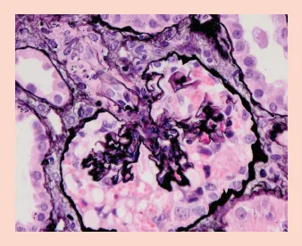
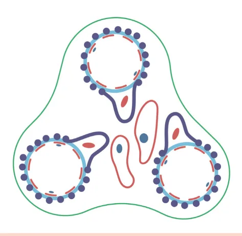
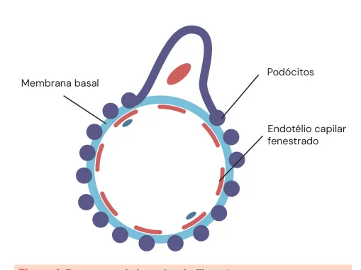
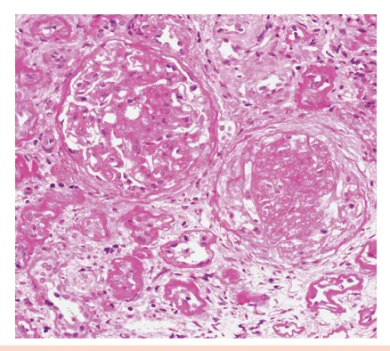
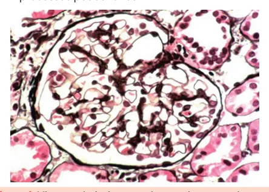
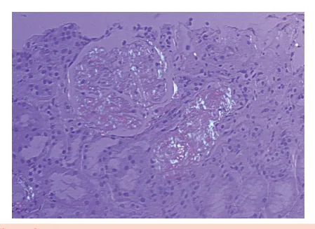
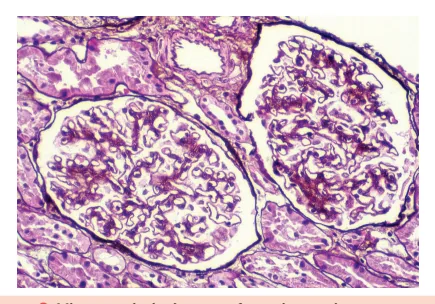
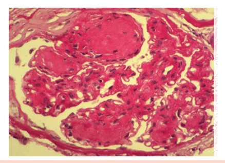

# Glomerulopatias I

<!-- page:1 -->

Glomerulopatias (CM)

## HEMATÚRIA

Glo Dismorfismo Eritrocitário Presen Aspecto M Cilindros Hemáticos Pre Proteinúria SÍNDROME NEFRÓTICA

- Proteinúria > 3,5g;

- Anasarca;

- Hipoalbuminemia;

- Hiperlipidemia; Crianças: biópsia não indicada – lesão mínima é mais comum; Adultos e idosos: a regra é biopsiar.

Lesão mínima

- Mais comum em crianças. Boa resposta a corticoides;

- Secundária: linfoma, AINE.

## GESF

- Mais comum em adultos;

- Primária: corticoide;

- Secundária: hiperfiltração, obesidade, HIV.

GESF colapsante

- Variante relacionada a HIV, COVID-19, pamidronato.

## CONSIDERAÇÕES INICIAIS

## O GLOMÉRULO

- É responsável pela filtração do sangue;

- É uma estrutura complexa formada por alças capilares arteriais que se iniciam em uma arteríola e terminam em outra; omerular Urológica ntes (>20%) esentes Ausentes

Ausente Marrom Vivo e com coágulos

> 1g < 1g

Membranosa

- Mais comum em idosos;

- Primária: anticorpo anti-PLA2R positivo;

- Secundário: neoplasias, lúpus, hepatite B.

Membranoproliferativa

- Infecções: hepatite C, endocardite;

- Autoimunidade: Sjögren, crioglobulinemia.

Amiloidose

- AL: cadeia leve;

- AA: inflamatória;

- Diagnóstico histológico: corante vermelhoCongo positivo.

Trombose de Veia Renal

- Complicação da síndrome nefrótica (mais comum na membranosa);

- Tríade: hematúria, piora de função renal, dor lombar;

- Tratamento: anticoagulação.

ANORMALIDADES URINÁRIAS Nefropatia da IgA

- Hematúria sinfaringítica;

- Biópsia: proliferação mesangial com IgA dominante ou codomintante;

- Tratamento: controle da proteinúria

(iECA/ BRA/ iSGLT-2). Doença de Alport

- Doença genética do colágeno tipo IV;

- Tríade: disfunção renal, surdez neurossensorial e alteração ocular;

- Herança mais comum ligado ao X. Arteríola eferente: de saída; Arteríola aferente: de entrada; Cápsula de Bowman: epitélio do glomérulo com espaço para acúmulo do ultrafiltrado.

---

<!-- page:2 -->

## A BARREIRA DE FILTRAÇÃO

Figura 1: Estruturas da barreira de filtração.

- Figura 2: Estrutura do glomérulo.

- O primeiro componente da barreira é o próprio endotélio capilar: Apresenta fenestrações, dando a possibilidade de filtração de alguns componentes.

- O segundo componente da barreira é a membrana basal: É um componente acelular, composta de proteoglicano; Envolve o capilar glomerular.

- O terceiro componente é a barreira de podócitos: Demonstra capacidade para selecionar componentes maiores; Têm passagem livre: líquido, plasma, eletrólitos.

- As barreiras criadas são tanto de tamanho, quanto de carga. Assim sendo, proteínas e células não têm passagem permitida.

## O MESÂNGIO

- Composto por matriz e células que preenchem o espaço entre os capilares glomerulares e promovem sua sustentação: Tais células são denominadas células mesangiais. Figura 3: O mesângio é composto de matriz e células mesangiais entre os capilares.

## PROPEDÊUTICA GLOMERULAR

## EXAME DE URINA TIPO 1

- Através desse exame, é possível obter informações importantes sobre a síndrome;

- A presença de hematúria e proteinúria é o principal sinal que influencia na investigação de uma doença glomerular.

Tabela 1: Diagnóstico diferencial da hematúria. Glomerular Urológica Dismorfismo Presente Ausente eritrocitário Vivo e com Aspecto Marrom coágulos Cilindros Presentes Ausentes hemáticos Proteinúria > 1 g < 1 g O dismorfismo eritrocitário é a evidência de alteração morfológica da hemácia na passagem pela barreira de filtração glomerular lesada. A presença de hemácias dismórficas em exame de urina tipo 1 é um sinal de doença glomerular!

- Tais hemácias podem interagir com as proteínas do túbulo (proteínas de Tamm-Horsfall), formando cilindros hemáticos: A presença de cilindros hemáticos denota também presença de hemácias advindas do glomérulo; Ou seja, os cilindros hemáticos evidenciam hematúria glomerular; A presença de cilindros hemáticos é uma alteração pouco sensível, mas bem específica de hematúria glomerular.

---

<!-- page:3 -->

## AVALIAÇÃO DE PROTEINÚRIA

- Pode ser feita por meio da coleta de urina de 24 horas ou através da relação proteína/creatinina em amostra isolada: Valor normal para proteinúria (urina de 24h: < Valor normal para proteinúria (urina de 24h: < proteinúria com uso de uma fita reagente. Contudo, tal fita é capaz de identificar apenas albumina.

200 mg/24h/ Relação P/C de amostra isolada: 200 mg/g.) No exame de urina tipo 1 é possível identificar DIAGNÓSTICO SINDRÔMICO

- Glomerulonefrite rapidamente progressiva;

- Síndrome nefrítica;

## Síndrome nefrótica

- Anormalidades urinárias.

- É definida pela presença de proteinúria maciça: Proteinúria > 3,5 g/dia ou 50 mg/kg/dia;

- Outras manifestações concomitantes que podem ser encontradas são: Hipoalbuminemia; Edema; Hipercolesterolemia; Hipercoagulabilidade; Pode ter tendência a infecções por germes encapsulados por perda de anticorpos.

## DOENÇA POR LESÃO MÍNIMA

- É a principal causa de síndrome nefrótica em crianças: É responsável por mais de 90% das síndromes nefróticas nessa população.

- Ainda, é importante saber que não requer biópsia renal em crianças: A microscopia óptica é normal.

- Apresenta ótima resposta ao uso de corticoide: É possível manter um esquema de prednisona 1 mg/ kg com resposta drástica! Avaliar biópsia se resistente ao tratamento.

- Biópsia: À microscopia óptica: normal; À microscopia eletrônica: fusão dos processos podocitários.

Figura 4: Microscopia óptica normal em paciente com doença por lesão mínima. Figura 5: Microscopia eletrônica com fusão dos processos podocitários.

- Para fins de investigação, é útil conhecer algumas outras causas: Uso de drogas: AINE, lítio; Malignidade: linfoma Hodgkin e não Hodgkin; Infecções: sífilis; micoplasma; estrongiloidíase.

## GLOMERULOESCLEROSE SEGMENTAR E FOCAL (GESF)

- É a principal causa de síndrome nefrótica em adultos A presença do quadro nefrótico constitui indicação para realização de biópsia em adultos;

(30 – 35% dos casos):

- Ocorre pelo mecanismo de esclerose glomerular em parte do tufo glomerular acometendo < 50% dos glomérulos da amostra;

- Tanto a GESF quanto a doença por lesão mínima são podocitopatias;

l / Figura 6: Microscopia óptica na GESF. Observa-se substituição parcial do tufo capilar por material eosinofílico denso (esclerose) em parte do glomérulo (segmentar).

- Formas: Primária: caráter imunológico; responde ao uso de imunossupressão; Hereditária: decorre de um defeito nas proteínas dos podócitos; Secundária: ocorre a partir de uma sobrecarga do néfron (por obesidade, hiperfiltração, nefrectomia).

É a forma mais comum em adultos.

---

<!-- page:4 -->

GESF colapsante

- Secundária:

- Variante da GESF com colapso glomerular | Neoplasia: proceder com rastreio para a idade;

na histologia; | Lúpus: nefrite lúpica classe V;

- Mau prognóstico; | Infecção: hepatite B.

- Classicamente, está relacionada ao HIV (nesses casos,

- Classicamente, está relacionada ao HIV (nesses casos, o tratamento é direcionado para o HIV); A

- Drogas do risco: pamidronato, inibidores de calcineurina, anabolizantes.

- Figura 7: Microscopia óptica na GESF colapsante.

Observa-se alças capilares retraídas, com colapso acentuado e retração das estruturas glomerulares.

## NEFROPATIA MEMBRANOSA

- É a principal causa de síndrome nefrótica em idosos;

- Decorre de um espessamento da membrana basal, com formação de espículas;

- O principal antígeno relacionado é o PLA-2R: Pode ser dosado no sangue ou em biópsia renal. O

- Outros antígenos: i THSD7A: anticorpo presente em menos de 1% dos casos; G Nell-1: membranosa secundária a neoplasias. M

- Pode ser primária ou secundária.

- - - Figura 8: Microscopia óptica na nefropatia membranosa.

Observe o espessamento da membrana basal glomerular.

- Primária: Doença autoimune (anti-PLA2R positivo); Tratamento da forma primária: Imunossupressão para casos de alto risco corticoide + ciclofosfamida; Todos os pacientes: controle pressórico e controle da proteinúria com iECA/BRA. AMILOIDOSE

(síndrome nefrótica + piora de função renal):

- É o depósito da proteína amiloide no rim;

- Comumente, é relacionada com neoplasia plasmocitária: Amiloidose AL (marcada pela presença de cadeia leve).

- Pode ser causada por quadros inflamatórios (amiloidose AA).

- Biópsia: utiliza-se a coloração vermelho Congo.

Figura 9: Biópsia renal de paciente com amiloidose após aplicação de vermelho Congo. Observe a birrefringência verde maçã na lâmina, indicando depósitos de proteína amiloide.

## GLOMERULONEFRITE MEMBRANOPROLIFERATIVA

- Caracteristicamente, é a lesão imunomediada da membrana basal;

- A microscopia evidencia uma duplicação da membrana, com padrão de depósito subendotelial;

- Ainda, costuma se apresentar como uma síndrome mista (nefrítica e nefrótica);

- Imunofluorescência com depósito de imunocomplexos ou apenas complemento;

- Há presença de imunocomplexos na biópsia membranoproliferativa.

(imunofluorescência positiva). Figura 10: Microscopia óptica na glomerulonefrite

---

<!-- page:5 -->

Presença de duplicação das membranas basais. Biópsia

- Nódulos de Kimmelstiel-Wilson, que apresentam positividade à coloração PAS.

Figura 11: Imunofluorescência renal positiva. Etiologias

- Autoimunidade: Lúpus; Síndrome de Sjögren; Crioglobulinemia.

- Infecções: Hepatite C; Esquistossomose; Endocardite infecciosa.

- Neoplasia: Paraproteinemia.

- Não mediada por imunocomplexos: Glomerulopatia do C3 (depósito predominante de por hipercoagulabilidade, principalmente na glomerulopatia membranosa.

C3 na imunofluorescência). TROMBOSE DA VEIA RENAL É uma complicação relacionada à síndrome nefrótica, Manifestações associadas

- Dor lombar;

- Hematúria;

- Piora da função renal.

Tratamento

- Anticoagulação plena.

## NEFROPATIA DIABÉTICA

- Pode causar proteinúria em níveis considerados nefróticos nos estágios mais avançados;

- Geralmente, tende a ser associada à retinopatia diabética.

Progressão da lesão

- Hiperfiltração;

- Albuminúria A2 (30 – 300 mg/g);

- Albuminúria A3 (> 300 mg/g);

- Perda de função renal.

Tratamento

- Compensar o quadro diabético;

- Uso de medicamentos antiproteinúricos que retardam a progressão da doença renal: IECA ou BRA (favorecem a vasodilatação da arteríola aferente); Inibidores do SGLT2; Finerenone; Semaglutida. Figura 12: Biópsia renal na nefropatia diabética.

Observam-se nódulos de Kimmelstiel-Wilson.

## ANORMALIDADES URINÁRIAS

## NEFROPATIA POR IGA

- É observada uma presença de IgA anômala que se deposita no mesângio.

Manifestações clínicas e laboratoriais

- Hematúria macroscópica associada a infecção de vias aéreas superiores (IVAS): hematúria sinfaringítica;

- Outras manifestações: Pode apresentar hematúria microscópica persistente e evoluir com perda de função renal; Quando associada a lesões purpúricas e dor abdominal, deve-se considerar quadro de púrpura de Henoch Schönlein (vasculite por IgA).

## DOENÇA DE ALPORT

- É uma doença do colágeno, geralmente ligada ao X.

Manifestações clínicas e laboratoriais

- Classicamente, é evidenciada uma tríade clássica em homens:

- Alteração urinária;

- Surdez neurossensorial;

- Alteração ocular: geralmente se apresenta com ceratocone;

- Em boa parte dos casos, evolui para doença renal em estágio final na adolescência ou na vida adulta.

## REFERÊNCIAS

Cofexpress: Figura da tabela Acanthocytes in the Urine, HEINE GH. Diabetes Care 27:190–194, 2004 Figura 4: Microscopia óptica normal em paciente com doença por lesão mínima.

NATIONAL KIDNEY FOUNDATION. National Kidney Foundation. Disponível em: https://www.kidney.org/. Acesso em: 13 jun. 2025.

Figura 5: Microscopia eletrônica com fusão dos processos podocitários. NATIONAL KIDNEY FOUNDATION. National Kidney Foundation. Disponível em: https://www.kidney.org/. Acesso em: 13 jun. 2025.

---

<!-- page:6 -->

Figura 6: Microscopia óptica na GESF. Figura 10: Microscopia óptica na glomerulonefrite NATIONAL KIDNEY FOUNDATION. National Kidney Foundation. Disponível membranoproliferativa.

em: https://www.kidney.org/. Acesso em: 13 jun. 2025. NATIONAL KIDNEY FOUNDATION. National Kidney Foundation. Disponível em: https://www.kidney.org/. Acesso em: 13 jun. 2025.

Figura 7: Microscopia óptica na GESF colapsante. Figura 11: NATIONAL KIDNEY FOUNDATION. National Kidney Foundation. Disponível em: https://www.kidney.org/. Acesso em: 13 jun. 2025.

e Figura 8: Microscopia óptica na nefropatia membranosa. NATIONAL KIDNEY FOUNDATION. National Kidney Foundation. Disponível em: https://www.kidney.org/. Acesso em: 13 jun. 2025.

e Figura 9: Biópsia renal de paciente com amiloidose após aplicação de vermelho Congo. NATIONAL KIDNEY FOUNDATION. National Kidney Foundation. Disponível em: https://www.kidney.org/. Acesso em: 13 jun. 2025. Figura 11: Imunofluorescência renal positiva.

NATIONAL KIDNEY FOUNDATION. National Kidney Foundation. Disponível em: https://www.kidney.org/. Acesso em: 13 jun. 2025.

Figura 12: Biópsia renal na nefropatia diabética. NATIONAL KIDNEY FOUNDATION. National Kidney Foundation. Disponível em: https://www.kidney.org/. Acesso em: 13 jun. 2025.
