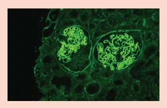
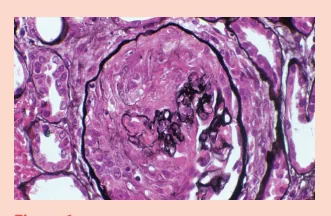
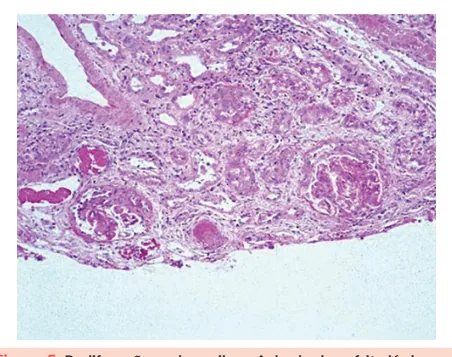
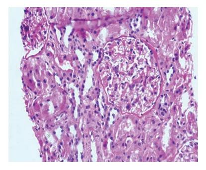
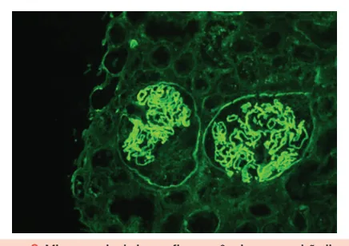
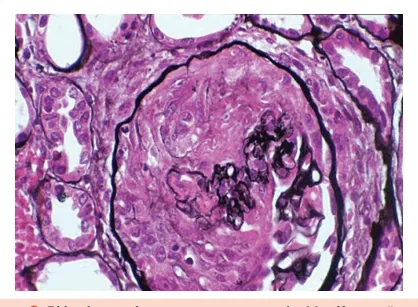

# Glomerulopatias II

<!-- page:1 -->

## GLOMERULOPATIAS PARTE II

Glomerulopatias (CM)

## SÍNDROME NEFRÍTICA

Glomerulonefrite pós-estreptocócica | 1-2 semanas após faringite; 2-4 semanas após impetigo | Síndrome nefrítica – comum em crianças 4-15 anos | Consumo de C3 isolado | ASLO – Marcador de contato com estrepto Nefrite Lúpica

- Acometimento grave ; 50% dos pacientes com LES

- Anti-DNAds – marcador de nefrite e atividade Classe 1 – Mesangial Mínima

- Sem alterações na óptica Classe 2 – Proliferativa Mesangial

- Hipercelularidade Mesangial

- Classe 3 e 4 – Proliferativa Focal (3) e Difusa (4) Hipercelularidade Endocapilar / Crescentes

Figura 1

## CONSIDERAÇÕES INICIAIS

## RELEMBRANDO

- Diagnóstico sindrômico: Glomerulonefrite rapidamente progressiva;

| Síndrome nefrótica; | Anormalidades urinárias.

- Decorre de uma queda na capacidade de filtração glomerular, com um aumento da permeabilidade;

## MANIFESTAÇÕES RELACIONADAS

- Hematúria;

- Proteinúria não nefrótica;

- Hipertensão;

- Edema;

- Piora da função renal.

## GLOMERULONEFRITE RELACIONADA À INFECÇÃO

- É o protótipo da síndrome nefrítica;

- Dá-se pela formação de imunocomplexos relacionados à infecção → complicação não supurativa; Glomerulonefrite Rapidamente Progressiva

- Presença de Crescentes

- Sd Nefrítica + Piora rápida de função renal Figura 1

Vasculite ANCA-associada

- GNRP com anticorpo anticitoplasma de neutrófilo

- IF pauci-imune

- Síndrome Pulmão RIM P-ANCA – anti-MPO Poliangeíte microscópica c-ANCA – anti-PR3 Granulomatose com poliangeíte

Síndrome de Goodpasture

- GNRP com anticorpo membrana basal

- Imunofluorescência linear

- Síndrome Pulmão-Rim Tratar com Plasmaférese +

Imunossupressão Figura 2 Figura 2

- Comumente, ocorre em infecções estreptocócicas em crianças; Tende a surgir cerca de 1 – 2 semanas após faringite; Ou ainda, cerca de 4 – 6 semanas após quadro de impetigo (Estreptococo do grupo A).

- Não há bactéria no rim, sendo apenas uma ativação do sistema imune;

- Quadro clínico: autolimitado! Hipertensão, edema e oligúria; hematúria e proteinúria subnefrótica (<

3,5 g/dia).

- Diagnóstico: O diagnóstico é clínico! Sendo assim, não há necessidade da realização de biópsia renal; Considerações importantes: ASLO (Antiestreptolisina O): é positivo após faringite estreptocócica; é um marcador de contato com o em > 60% dos casos; Consumo de complemento:

Estreptococo. Anti-DNAse B: positivo após impetigo C3 reduzido – via alternativa; C4 normal – via clássica. Biópsia – GNPE; presença de “humps” ou corcovas na microscopia eletrônica; é um sinal de depósito de imunocomplexos.

- Verificar Figura 1 na próxima página s

---

<!-- page:2 -->

Figura 1: Proliferação endocapilar na glomerulonefrite pós Figura 3: Nefrite Lúpica Classe 1 - Microscopia óptica normal infecciosa com depósito apenas à imunofluorescência

- Classe II – mesangial proliferativa;

Figura 2: “Humps“ ou corcovas - Depósitos de imunocomplexo Figura 4: Nefrite Lúpica Classe 2 - hipercelularidade mesangial na microscopia eletrônica na microscopia óptica

- Tratamento:

- Classe III: Presença de acometimento proliferativo

- Medidas de suporte: Diuréticos; anti-hipertensivos. focal; < 50% dos glomérulos acometidos;

- Antibioticoterapia: Não é realizada pelo quadro renal, iniciar tratamento! mas pela infecção Estreptocócica de base.

- Para erradicar a cepa nefritogênica do estreptococo:

Melhora e correção da função renal e do edema costuma ocorrer em até 2 semanas; proteinúria – em cerca de 6 meses; hematúria microscópica – em até 2 anos.

- Na presença de síndrome nefrótica ou persistência do quadro clínico: proceder com biópsia.

## NEFRITE LÚPICA

É o acometimento renal do Lúpus Eritematoso Sistêmico (LES) e está presente em até 50% dos portadores de LES;

- Marcadores: Anti-DNA dupla fita: É o anticorpo mais associado à nefrite lúpica (evidencia FAN com padrão Figura 5: Proliferação endocapilar - Achado da nefrite lúpica nuclear homogêneo) → acompanhamento de classes 3 e 4 tratamento: sua negativação pode significar melhora de atividade de doença e sua nova

- Classe IV: É a classe mais comum, mais grave e positivação,reicidiva. requer tratamento! Presença de acometimento

- Classes histológicas: proliferativo difuso; > 50% dos glomérulos acometidos. Classe I – mesangial mínima: Pouca alteração ou Imunofluorescência rica – IgA, IgG, IgM, C3, C1q → discreta hematúria; “full house”.

---

<!-- page:3 -->

Síndrome de Goodpasture

- GNPR + alveolite pulmonar (hemoptise);

- Isto é, observa-se síndrome pulmão-rim. Contudo, é muito rara;

- Ainda, há a presença de um anticorpo antimembrana

Figura 6: Imunofluorescência positiva em biópsia renal

- Classe V: Nefropatia membranosa (membrana basal espessada); o quadro clínico da classe V pura costuma ser evidenciado com síndrome nefrótica;

Figura 7: Nefrite Lúpica Classe V: Depósitos subepiteliais (“espículas”) na membrana basal

- Classe VI: Esclerose avançada.

- Outros acometimentos renais do LES: Podocitopatia lúpica: Caracteriza-se por síndrome nefrótica com biópsia normal (semelhante à Doença por Lesões Mínimas) ou GESF; Microangiopatia trombótica: Demonstra maior risco em pacientes portadores da SAAF (Síndrome do

Anticorpo Antifosfolípide). GLOMERULONEFRITE RAPIDAMENTE PROGRESSIVA

- Decorre de um quadro nefrítico, com rápida evolução da disfunção renal;

- Biópsia renal: Microscopia óptica com “crescentes”

- ou seja, há uma proliferação das células da cápsula de Bowman, reduzindo o espaço glomerular com consequente redução da filtração glomerular.

Figura 8: Biópsia renal com crescente aguda: Manifestação histológica da GNRP - Ainda, há a presença de um anticorpo antimembrana basal – que lesa a membrana basal glomerular e a membrana alveolar;

- O principal fator de risco relacionado é o tabagismo;

- Imunofluorescência com depósito linear;

- Tratamento: Plasmaférese + imunossupressão.

a Figura 9: Microscopia de imunofluorescência com padrão linear, característico de Anti-Membrana Basal VASCULITES ANCA-ASSOCIADAS São doenças relacionadas com anticorpos anticitoplasma de neutrófilos (ANCA);

- O quadro é mais comum em pacientes idosos;

- Manifestações: Pródromos: Astenia; febre; perda ponderal.

a

- Evolui com síndrome pulmão-rim;

O ANCA representa um anticorpo patogênico nas vasculites renais relacionadas:

- c-ANCA: Padrão citoplasmático; granulomatose com poliangeíte – “Wegener”; relacionado com antiproteinase 3.

- p-ANCA: Padrão perinuclear; poliangeíte microscópica;

relacionado com antimieloperoxidase. ATENÇÃO! As vasculites associadas à cocaína podem ter pANCA e cANCA concomitantes. Lembre-se do Levamisol (contaminante da cocaína) → Necrose em lóbulo da orelha e ponta do nariz.

- Biópsia: Imunofluorescência negativa;

Figura 10: Imunofluorescência renal negativa, característica das vasculites ANCA-associadas (Pauci-imunes)

- Tratamento: Imunossupressão.

---

<!-- page:4 -->

## REFERÊNCIAS

Figura 6: Imunofluorescência positiva em biópsia renal National Kidney Foundation, 1998 Figura 1: Proliferação endocapilar na glomerulonefrite pós Figura 7: Nefrite Lúpica Classe V: Depósitos subepiteliais infecciosat (“espículas”) na membrana basal National Kidney Foundation, 1998 National Kidney Foundation, 1998 Figura 2: “Humps“ ou corcovas - Depósitos de imunocomplexo Figura 8: Biópsia renal com crescente aguda: Manifestação na microscopia eletrônica histológica da GNRP National Kidney Foundation, 1998 National Kidney Foundation, 1998 Figura 3: Nefrite Lúpica Classe 1 - Microscopia óptica normal Figura 9: Microscopia de imunofluorescência com padrão com depósito apenas à imunofluorescência linear,característico de Anti-Membrana Basal National Kidney Foundation, 1998 National Kidney Foundation, 1998 Figura 4: Nefrite Lúpica Classe 2 - hipercelularidade mesangial Figura 10: Imunofluorescência renal negativa, característica das na microscopia óptica vasculites ANCA/Pauci-imunes National Kidney Foundation, 1998 ROYAL V. Masked deposits on kidney biopsy - AJKD Blog Figura 5: Proliferação endocapilar - Achado da nefrite lúpica classes 3 e 4 National Kidney Foundation, 1998
