# Hanseníase

<!-- page:1 -->

## PQT-U para > 50 kg

- 6 meses - Paucibacilar;
- 12 meses - Multibacilar;
- **Dapsona** 100mg (mensal supervisionada);
- **Rifampicina** 600mg (mensal supervisionada);
- **Clofazimina** 300mg (mensal supervisionada);
- **Dapsona** 100mg (diária autoadministrada);
- **Clofazimina** 50mg (diária autoadministrada).

## PQT-U para 30-50 kg

- **Dapsona** 50mg (mensal supervisionada);
- **Rifampicina** 450mg (mensal supervisionada);
- **Clofazimina** 150mg (mensal supervisionada);
- **Dapsona** 50mg (diária autoadministrada);
- **Clofazimina** 50mg (dias alternados).

## Reações Hansênicas (Tipo 2)

- EM, neurite, iridociclite, orquite, GN, artrite, hepatoesplenomegalia...;
- Febre, artralgia, mal-estar, inapetência;
- Pode ter reação necrotizante (vasculite);
- Protótipo: **eritema nodoso hansênico**;
- Tratamento: **talidomida**, **pentoxifilina** e, em alguns casos, corticoide.

## Reações Hansênicas Tipo 1 (= Reação Reversa)

- Quem? Alteração da imunidade celular (dimorfas);
- Novas lesões (não é falha);
- Eritema ou edema de lesões preexistentes;
- Neurite;
- Tratamento: corticoide.

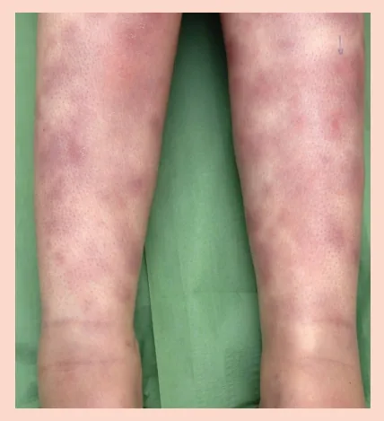

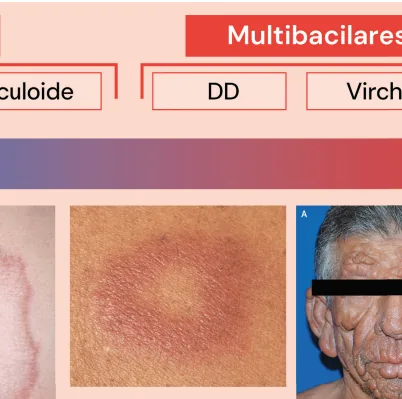

---

<!-- page:2 -->

- Incubação dura: 2 a 7 anos (eliminação: VAS). Normalmente, a fonte da doença é um parente próximo ou convivente que não sabe que está doente;
- **Agente**: *Mycobacterium leprae* (BAAR, Gram-positivo). O Brasil ocupa a 2ª posição do mundo entre os países que registram casos novos: endêmica – Índia, Brasil e Indonésia;
- Nervos superficiais da pele e troncos nervosos periféricos, mas também pode afetar os olhos e órgãos internos.

## Lesões Elementares

> Figura 1: Lesões elementares da hanseníase.
> Figura 2: Lesões elementares.
> Figura 3: Lesões elementares.

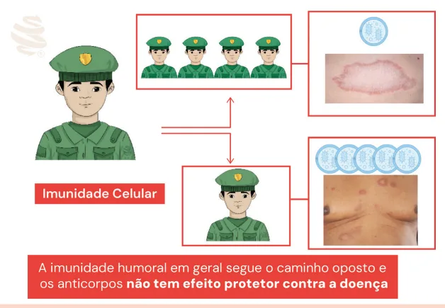

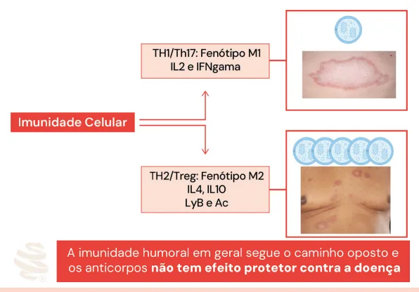

---

<!-- page:3 -->

## Classificação OMS

**Paucibacilar**

> Figura 4: Lesão de hanseníase forma indeterminada.

- Mácula hipocrômica + perda de sensibilidade: térmica > dolorosa > tátil.

> **OBS.**: Deve-se suspeitar de hanseníase diante de manchas hipocrômicas ou avermelhadas na pele, perda ou diminuição da sensibilidade em mancha(s) da pele, dormência ou formigamento de mãos/pés, dor ou hipersensibilidade em nervos, edema ou nódulos na face ou nos lóbulos auriculares, ferimentos ou queimaduras indolores nas mãos ou pés.

O Ministério da Saúde define um caso com pelo menos um dos seguintes critérios, conhecidos como **sinais cardinais** da hanseníase:

1. Lesão(ões) e/ou área(s) da pele com alteração de sensibilidade térmica e/ou dolorosa e/ou tátil;
2. Espessamento de nervo periférico, associado a alterações sensitivas e/ou motoras e/ou autonômicas;
3. Presença do *M. leprae*, confirmada na baciloscopia de esfregaço intradérmico ou na biópsia de pele.

### Classificação OMS

- **Paucibacilar**: 1 a 5 lesões e baciloscopia de raspado intradérmico negativa (obrigatoriamente); MS - apenas 1 nervo;
- **Multibacilar**: 6 ou mais lesões ou baciloscopia de raspado intradérmico positiva; OMS - mais de 1 nervo;
- Hanseníase primariamente neural — ficou na dúvida? **Trate como multibacilar!**

> Figura 5. Figura 6: Multibacilar.

## Classificação Madri (1953)

- **Paucibacilar**: indeterminada; tuberculoide;
- **Multibacilar**: dimorfa (DD); virchowiana.

A classificação de Ridley e Jopling (1966) baseia-se especialmente nos aspectos histopatológicos das lesões.

**Indeterminada**

- Fase inicial – todos;
- Mácula hipocrômica;
- Térmica > dolorosa > tátil;
- Prova da histamina: incompleta;
- Baciloscopia negativa;
- Biópsia pode não demonstrar;
- Se não tratada, vai evoluir para algum tipo de hanseníase, o que depende da imunidade do indivíduo!

> Figura 7: Lesão característica da forma indeterminada.

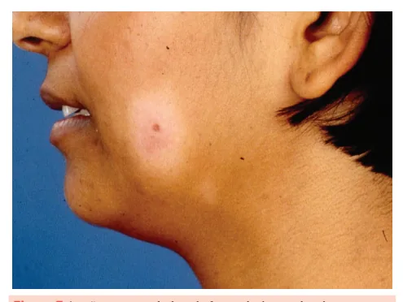

---

<!-- page:4 -->

**Tuberculoide**

- OMS: não tem "manchas visíveis";
- Pele infiltrada, poupa áreas quentes (dobras, lombar) e couro cabeludo;
- Comum: hansenoma, madarose, perda de pelos;
- Suor reduzido;
- Sistema imune ++++;
- Incubação: 5 anos;
- Crianças de colo (nodular da infância);
- Alteração de sensibilidade, perda de sudorese; térmica > dolorosa > tátil;
- Anatomopatológico: granulomas tuberculoides;
- Pode ter nervos espessados de forma localizada e assimétrica.

> Figura 8: Lesão característica da forma tuberculoide.
> Figura 9: Lesão característica da forma tuberculoide.

**Virchowiana**

- Suor reduzido;
- As lesões podem ter sensibilidade normal;
- Dor neuropática, parestesia, espessamento de nervos periféricos, geralmente espessados difusamente e de forma simétrica;
- Artrite, orquite;
- Baciloscopia +++.

> Figura 10: Lesão característica da forma virchowiana.

**Dimorfa (DD)**

- OMS: forma mais comum (70%);
- O mais típico: lesão foveolar;
- Variabilidade clínica: manchas e placas hipocrômicas, acastanhadas ou violáceas, predominando o aspecto infiltrativo;
- Quando a resposta imune predominante é celular, podem parecer a forma tuberculoide, com surgimento de diversas placas com limites nítidos e comprometimento evidente da sensibilidade cutânea;
- Quando o predomínio é da resposta humoral, as lesões surgem em grande número, podendo haver hansenomas e infiltração assimétrica dos pavilhões auriculares, destacando-se as lesões infiltradas de limites imprecisos;
- Espessamento de nervos, altera discretamente a sensibilidade;
- Incubação > 10 anos (bacilo multiplica a cada 14 dias);
- Baciloscopia (lesão) +.

> Figura 11: Lesões da forma dimorfa.

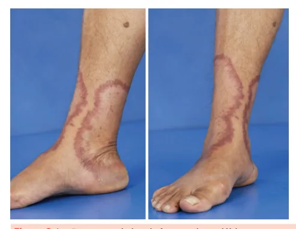

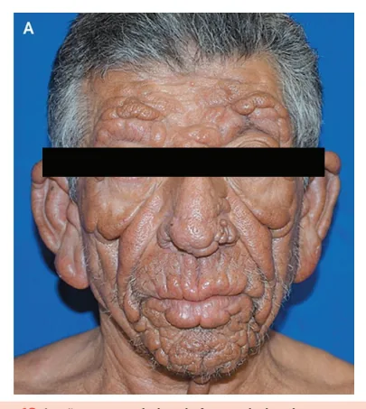

---

<!-- page:5 -->

> Figura 12: Hanseníase.

## Hanseníase Neural Pura

- Exclusivamente neural, sem lesões cutâneas e com baciloscopia negativa, o que representa um desafio diagnóstico;
- Alguns exames complementares, como o eletroneuromiograma, a biópsia de nervo, a sorologia e a biologia molecular, podem auxiliar na definição etiológica;
- Nervos ulnares: mais frequentemente acometidos; embora qualquer nervo periférico possa ser afetado, especialmente os medianos, radiais, fibulares e seus ramos superficiais, como o nervo ulnar superficial, radial cutâneo, fibular superficial, além do nervo sural.

## Reações Hansênicas

- Até 50% dos MB (V e D) podem ter;
- Processo inflamatório agudo no curso da doença;
- Antes, durante ou após o final do tratamento com a PQT;
- Não é falha terapêutica;
- Pacientes com carga bacilar mais alta (virchowianos) geralmente apresentam reações de início mais tardio, ou seja, no final ou logo após o término da PQT.

**Gell e Coombs - Tipos de Hipersensibilidade**

- Tipo I: imediata - IgE;
- Tipo II: mediada por anticorpos - IgM e IgG;
- Tipo III: mediada por imunocomplexos (Ag + Ac IgM e IgG);
- Tipo IV: mediada por células (linfócitos).

### Tipo 1 (Reação Reversa)

- Reação de hipersensibilidade do tipo III e IV de Gell e Coombs;
- Resposta imunológica contra antígenos do *M. leprae* (mesmo que inviáveis e inativos);
- Quem? Alteração da imunidade celular (dimorfas);
- Novas lesões (não é falha);
- Eritema ou edema de lesões preexistentes;
- Neurite;
- Tratamento: corticoide.

> Figura 13: Reações hansênicas tipo 1.

### Tipo 2

- Causada por imunocomplexos circulantes (ativação de resposta humoral): o paciente entra em contato com o antígeno e forma anticorpo, normalmente IgM; deposita imunocomplexos, dando as lesões;
- EM, neurite, iridociclite, orquite, GN, artrite, hepatoesplenomegalia...;
- Febre, artralgia, mal-estar, inapetência;
- Pode ter reação necrotizante (vasculite);
- Protótipo: eritema nodoso hansênico;
- Agudo (< 6 meses) / Recorrente ou "subentrante" (mais de uma vez, > 28 dias do tratamento da reação) / Crônico (> 6 meses);
- Tratamento: talidomida, pentoxifilina e, em alguns casos, corticoide.

> Figura 14: Reações hansênicas tipo 2.

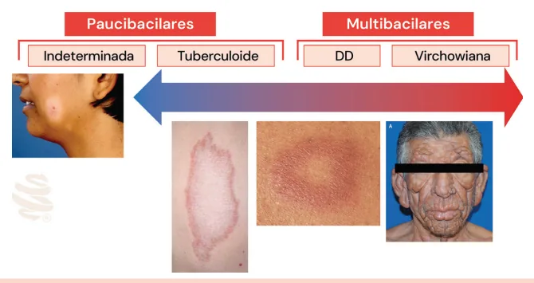

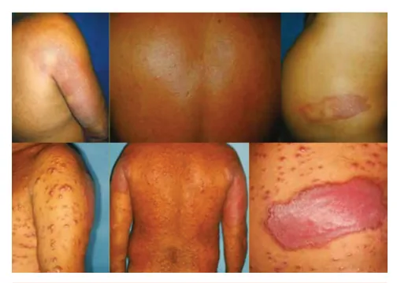

---

<!-- page:6 -->

## Outras Reações Hansênicas

**Fenômeno de Lúcio**

- Para alguns: reação tipo 3 ou manifestação específica; imunopatogênese desconhecida;
- Necrose arteriolar (invasão pelo *M. leprae*);
- Trombose dos vasos profundos e superficiais;
- Lesões cutâneas eritematosas ou cianosadas / bolhosas, necrose e úlcera, cicatrizes;
- Característico da variante virchowiana: "Lepra de Lúcio-Latapi-Alvarado".

> Figura 15: Reações hansênicas tipo 3. Imagem retirada da prova de título em dermatologia de 2022.

**Avaliação Neurológica Simplificada (ANS)**

- Face – trigêmeo e facial;
- Braços – radial, ulnar e mediano;
- Pernas – fibular e tibial.

## Exame Físico - Hanseníase

- Exame dermatológico completo (não esquecer: genital, palmas, plantas);
- Palpação de nervos;
- Testes de sensibilidade.

> Figura 16: Hanseníase.

## Exame Complementar - Hanseníase

- **Baciloscopia de raspado intradérmico**: índices baciloscópicos (IB) variam de 0 a 6+. A média dos IBs obtidos em cada esfregaço serve como estimativa da carga bacilar do paciente;
- Baciloscopia negativa: biópsia pode não demonstrar granuloma tuberculoide, bacilo, infiltrado histiocitário xantomizado ou macrofágico;
- Baciloscopia de raspado intradérmico / exame histopatológico;
- Prova da histamina.

> Figura 17: Exames complementares. Guia Prático sobre a Hanseníase – Ministério da Saúde, 2016.
> Figura 18: Exames complementares. Guia Prático sobre a Hanseníase – Ministério da Saúde, 2016.

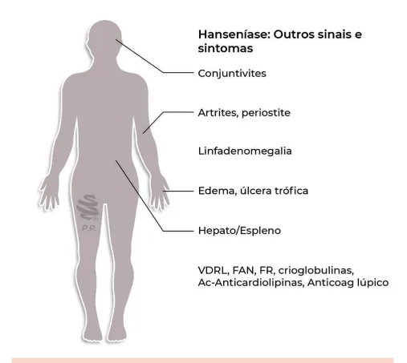

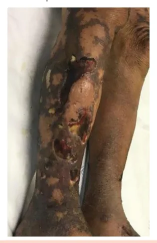

---

<!-- page:7 -->

## Tríplice Reação de Lewis (Prova de Histamina Endógena)

- **Sinal da pintura - eritema reflexo secundário**: no local da puntura, 15 a 20 segundos, presente em ambas as áreas;
- **Pápula edematosa**: lenticular, 30 a 60 segundos, ausente na área sem sensibilidade;
- **Eritema circunscrito**: atinge de 2 a 8 cm de diâmetro, limites fenestrados, de 2 a 3 minutos, presente em ambas as áreas.

> Figura 19: Tríplice reação de Lewis. Setas indicando alterações intragoticulares; setas perigoticulares e perilesionais indicam áreas de integridade funcional das fibras autonômicas.

- Avaliação do suor, USG de nervos, eletroneuromiografia (ENM);
- **Teste rápido**: ferramenta de apoio na avaliação de contatos;
- **PCR**: incorporado no SUS em 2021.

> Figura 20: Prova de histamina endógena.
> Figura 21: Fluxograma de exames complementares.

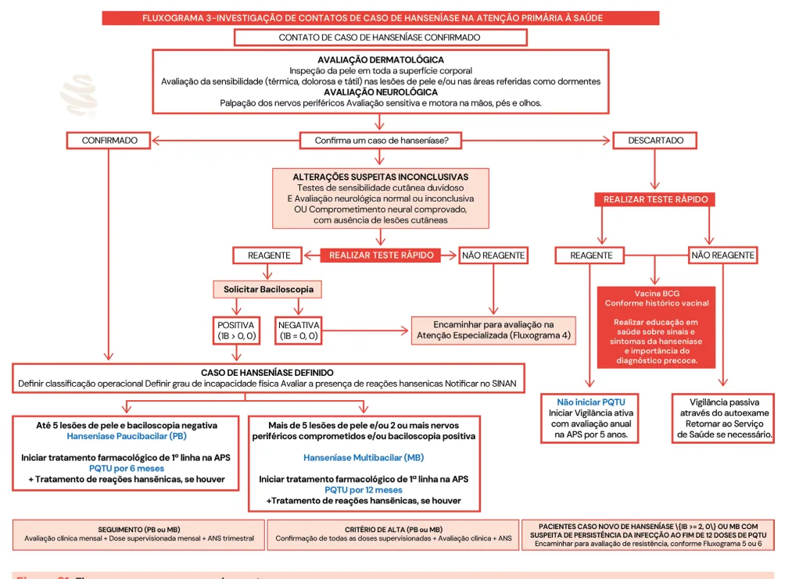

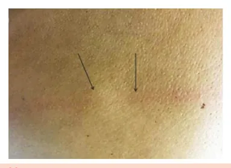

---

<!-- page:8 -->

## Tratamento

- Se surtos recorrentes: investigar focos infecciosos (dentários), diabetes, contactante, necessidade de reiniciar tratamento.

### Poliquimioterapia Única (PQT-U) para > 50 kg

**6 meses - Paucibacilar**

- Dapsona 100mg (mensal supervisionada);
- Rifampicina 600mg (mensal supervisionada);
- Clofazimina 300mg (mensal supervisionada);
- Dapsona 100mg (diária autoadministrada);
- Clofazimina 50mg (diária autoadministrada).

**12 meses - Multibacilar**: mesmo esquema, prolongado.

### PQT-U para 30-50 kg

- Dapsona 50mg (mensal supervisionada);
- Rifampicina 450mg (mensal supervisionada);
- Clofazimina 150mg (mensal supervisionada);
- Dapsona 50mg (diária autoadministrada);
- Clofazimina 50mg (dias alternados).

- A PQT-U deverá ser interrompida após o tratamento, quando os pacientes deverão receber alta por cura, saindo do registro ativo do SINAN.

## Critérios de Cura

- Completou o tratamento?
  - PB: 6 cartelas até 9 meses;
  - MB: 12 cartelas até 18 meses;
  - MB: não melhora após 12 cartelas → será que tem contactante sem diagnóstico?
- Se reações ou deficiências no momento da alta: monitorar.

## Complicações da PQT

- **Rifampicina 600mg**: síndrome dengue-like, urina avermelhada, urticária após 30 minutos, interfere no ACO;
- **Dapsona 100mg**: reações alérgicas, metemoglobinemia, agranulocitose, hemólise; anemia com queda de 0,2g% do Hb/mês → manter;
- **Clofazimina 50mg**: pigmentação, ressecamento, obstipação;
- Gravidez e aleitamento não contraindicam o tratamento;
- Intolerância à dapsona: rifampicina com clofazimina.

## Tratamento — Reações Hansênicas

**Tipo 1**

- Profilaxia;
- Prednisona 1mg/kg/dia VO;
- Dexametasona 0,15mg/kg/dia;
- Clorpromazina ou carbamazepina (dor neuropática).

**Tipo 2**

- Teratogênica, neuropatia;
- Talidomida 100 a 400mg/dia;
- Se contraindicação: pentoxifilina 400mg 3x/dia ou AINEs;
- Associar prednisona 1mg/kg/dia (dor neuropática);
- Talidomida + corticoide: considerar AAS 100mg/dia.

## Considerações Finais

- Doença de notificação compulsória (semanalmente) – inclusive recidiva;
- Se < 15 anos: Protocolo Complementar de Investigação Diagnóstica de Casos de Hanseníase em Menores de 15 Anos (PCID<15);
- Investigação de contatos pelo menos uma vez ao ano, por pelo menos 5 anos;
- Vacinação BCG para os contatos sem presença de sinais e sintomas (abreviar tempo de incubação):
  - Se 1 cicatriz ou nenhuma = fazer BCG;
  - Se 2 cicatrizes = não precisa.

## Referências

Figura 4: Lesão de hanseníase forma indeterminada. ATLAS DERMATOLÓGICO. Lepra indeterminada. Disponível em: https://www.atlasdermatologico.com.br/disease.jsf?diseaseId=232. Acesso em: 14 jul. 2025.

Figura 7: Lesão característica da forma indeterminada. Imagem do Dr. Jan R. Mekkes, reproduzida com permissão.

Figura 8: Lesão característica da forma tuberculoide. EICHELMANN, K.; et al. Lepra: puesta al día. Definición, patogénesis, clasificación, diagnóstico y tratamiento. Actas Dermosifiliográficas, v. 104, p. 554-563, 2013.

Figura 9: Lesão característica da forma tuberculoide. Imagens do Dr. Jan R. Mekkes, reproduzidas com permissão.

Figura 10: Lesão característica da forma virchowiana. Imagens do Dr. Jan R. Mekkes, reproduzidas com permissão.

Figura 11: Lesões da forma dimorfa. Imagens do Dr. Jan R. Mekkes, reproduzidas com permissão.

Figura 13: Reações hansênicas tipo 1. Guia Prático sobre a Hanseníase – Ministério da Saúde, 2016.

Figura 14: Reações hansênicas tipo 2. Imagens do Dr. Jan R. Mekkes, reproduzidas com permissão.

Figura 15: Reações hansênicas tipo 3. Imagem retirada da prova de título em dermatologia de 2022.

Figura 17: Exames complementares. Guia Prático sobre a Hanseníase – Ministério da Saúde, 2016.

Figura 18: Exames complementares. Guia Prático sobre a Hanseníase – Ministério da Saúde, 2016.

Figura 20: Prova de histamina endógena. Arquivo pessoal.

Figura 21: Fluxograma de exames complementares. Protocolo Clínico e Diretrizes Terapêuticas da Hanseníase, 2022.
