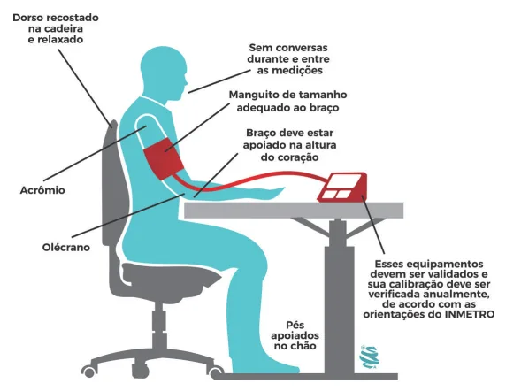
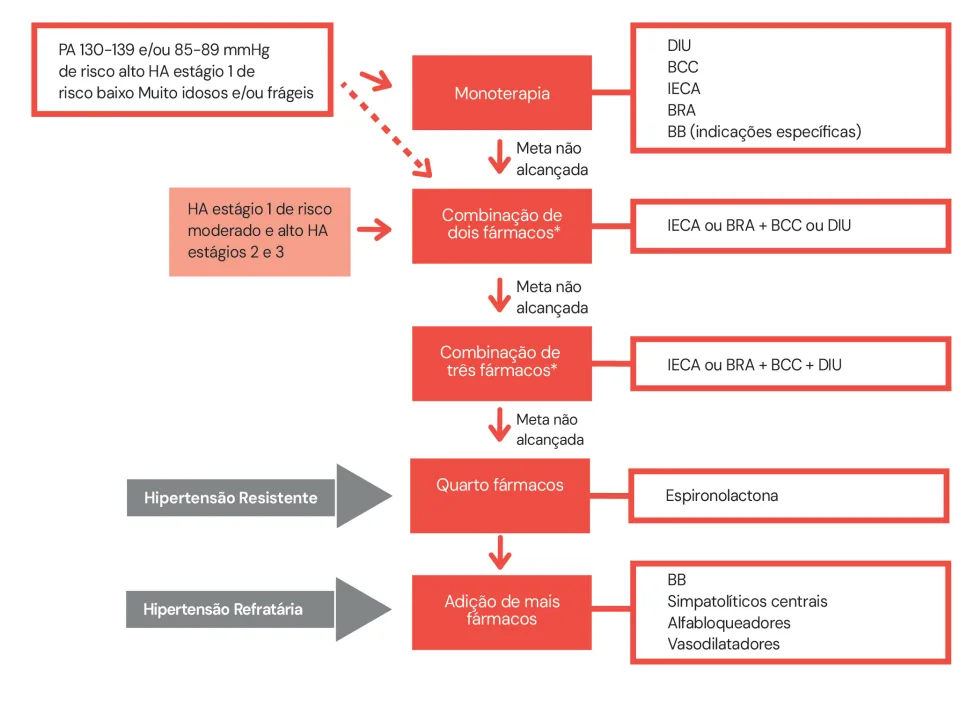
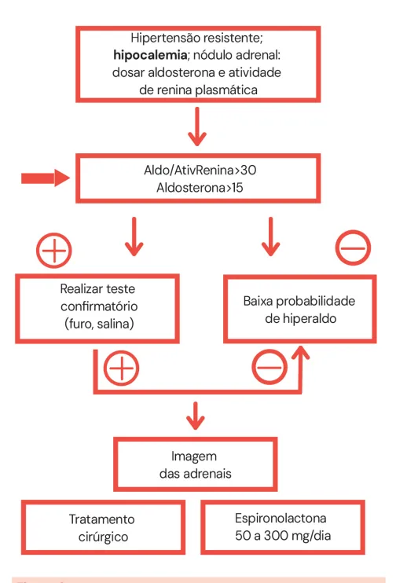
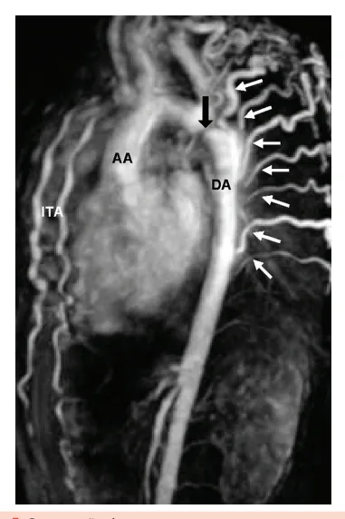
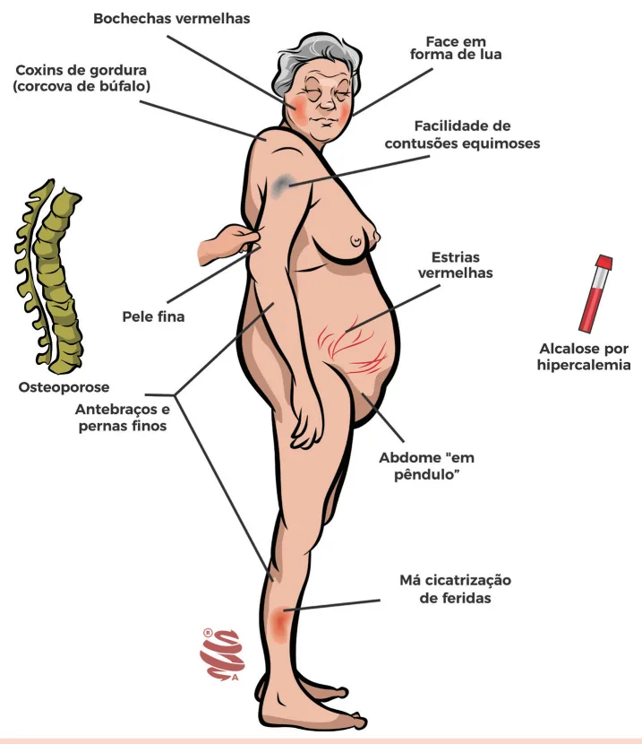
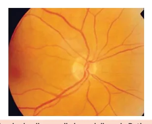
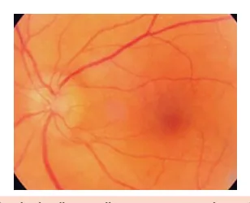

# HAS

<!-- page:1 -->

## Hipertensão Arterial Sistêmica

Hipertensão Arterial Sistêmica (CM)

## Diagnóstico

- **Pressão Arterial (PA) ≥ 140 x 90 mmHg** em 2 consultas (SBC) OU
- **PA ≥ 180 x 110 mmHg** medida isolada OU
- Medidas residenciais (MRPA ou MAPA) com PA média **≥ 130 x 80 mmHg**;
- Ao diagnóstico: estratificar risco CV e avaliar lesões de órgão-alvo;
- MAPA e MRPA sempre que possível.

**Classificação de PA:**

- PA normal: < 120/80;
- Pré-hipertensão: PA consultório 120-139 e/ou 80-89 mmHg.

**Conduta:**

1. Solicitar MRPA ou MAPA;
2. Estratificar + MEV (mudança de estilo de vida) para todos, tratar farmacologicamente aqueles com PA ≥ 130 e/ou 80 mmHg de alto risco CV.

## HAS Resistente e Refratária

- **Resistente**: em uso de 3 anti-hipertensivos, incluindo um diurético, em dose adequada, e ainda hipertenso, ou controlado com 4 drogas → 4ª droga espironolactona.
- **Refratária**: em uso de 5 anti-hipertensivos, incluindo um diurético de longa ação e espironolactona, e ainda hipertenso. Associar beta-bloqueador ou simpatolítico de ação central (ex.: clonidina).

As principais causas de HAS secundária são: SAHOS, estenose bilateral de artérias renais, coarctação de aorta, feocromocitoma, hiper e hipotireoidismo, hiperaldosteronismo primário e Síndrome de Cushing.

## Tratamento

- Perder peso, dieta DASH, regular o consumo de sódio e álcool, atividade física;
- **Farmacológico**: IECA/BRA, DIU, BCC são primeira linha;
  - Iniciar com duas medicações em doses otimizadas se estágios 2 ou 3 (PAS 160-179 mmHg e/ou PAD 100-109 mmHg ou estágio 1 de risco CV moderado ou alto);
  - **Monoterapia**: HA estágio 1 de risco baixo; PA ≥ 130 e/ou 80 mmHg de alto risco; indivíduos frágeis; pacientes ≥ 80 anos.

## Crises Hipertensivas

- **Emergência hipertensiva** → (PA ≥ 180 x 110 mmHg) + lesão de órgão-alvo ameaçadora (ex.: dissecção de aorta, AVC, IAM);
- **HAS crônica não controlada e pseudocrise** (PA ≥ 180 x 120 mmHg), sem lesão de órgão-alvo. Na pseudocrise a hipertensão está relacionada a outros fatores (dor, ansiedade, etc.). Se necessário, otimizar terapia anti-hipertensiva e encaminhar para retorno ambulatorial precoce;
- Via de regra, emergência hipertensiva deve ser tratada com **nitroprussiato de sódio** ou **nitroglicerina EV** em sala de emergência.

## Introdução

A Hipertensão Arterial Sistêmica (HAS) é o principal fator de risco modificável, com associação independente, linear e contínua para doenças cardiovasculares (DCV), doença renal crônica (DRC) e morte prematura.

> ⚠️ Tabela reconstruída a partir de OCR — confira contra a fonte original.

**Tabela 1: Fatores de risco coexistentes na hipertensão arterial (alto risco cardiovascular)**

- Sexo masculino;
- Idade: > 55 anos no homem e > 65 anos na mulher;
- DCV prematura em parentes de 1º grau (homens < 55 anos e mulheres < 65 anos);
- Tabagismo;

---

<!-- page:2 -->

- Dislipidemia: LDL-colesterol ≥ 100 mg/dL e/ou não-HDL-colesterol ≥ 130 mg/dL e/ou HDL-colesterol ≤ 40 mg/dL no homem e ≤ 46 mg/dL na mulher e/ou TG > 150 mg/dL;
- Diabetes mellitus;
- Obesidade (IMC ≥ 30 kg/m²).

*Figura 1: Técnica adequada para aferição da pressão arterial.*

## Conceitos

**HA mascarada:**

- Níveis pressóricos normais no consultório, mas elevados no MAPA ou MRPA (acontece em pessoas com alta carga de estresse no cotidiano, por exemplo).

**HA do avental branco:**

- PA elevada no consultório, mas normal fora dele.

**HA resistente:**

- Em uso de 3 anti-hipertensivos, incluindo um diurético, em dose adequada, e ainda hipertenso, ou controlado com 4 drogas;
- Mais relacionada à retenção persistente de fluidos: indicada espironolactona.

**HA refratária:**

- Em uso de 5 anti-hipertensivos, incluindo um diurético de longa ação e espironolactona, e ainda hipertenso;
- Mais relacionada à hiperreatividade simpática.

## Etapas Importantes — Primeira Consulta

- Confirmação do diagnóstico;
- Classificar entre HA primária ou secundária;
  - HA secundária é aquela causada por alguma doença de base, enquanto a primária não;
  - Quando desconfiar de HA secundária?: HA estágio 3 em < 30 anos ou > 55 anos; HAS resistente ou refratária; uso de medicações que sabidamente são hipertensivas; suspeita de feocromocitoma; SAHOS; assimetria ou ausência de pulsos em MMII; hipocalemia espontânea ou importante;
- Estratificar o risco cardiovascular (preferencialmente com o escore PREVENT) e pesquisar ativamente lesão de órgão-alvo por meio da solicitação de:
  - ECG (em busca de HVE);
  - Dosagem de creatinina com TFG e pesquisa de microalbuminúria ou relação albumina/creatinina na urina (em busca de DRC);
  - Exame de fundo de olho para pesquisar retinopatia hipertensiva;
  - Índice Tornozelo-Braquial (ITB) para pesquisa de Doença Arterial Obstrutiva Periférica (DAOP).

## Metas de PA

- Atenção para a maior tolerabilidade em idosos frágeis.

---

<!-- page:3 -->

> ⚠️ Tabela reconstruída a partir de OCR — confira contra a fonte original.

**Tabela 2: Metas de pressão arterial**

| Meta | Valor para todos |
|---|---|
| PA Sistólica (mmHg) | < 130 |
| PA Diastólica (mmHg) | < 80 |

*Para pacientes que não tolerem a meta de PA < 130/80 mmHg, deve-se reduzir a PA até o valor mais baixo tolerado.*

## Tratamento

### Tratamento Não Farmacológico

> ⚠️ Tabela reconstruída a partir de OCR — confira contra a fonte original.

**Tabela 3: Tratamento não farmacológico**

| Medida | Recomendação | Redução aproximada da PAS/PAD |
|---|---|---|
| Controle de peso | Manter IMC < 25 kg/m² até 65 anos; manter IMC < 27 kg/m² após 65 anos; manter circunferência abdominal < 80 cm nas mulheres e < 94 cm nos homens | 20-30% de diminuição da PA para cada 5% de perda corporal |
| Padrão alimentar | Adotar dieta DASH | Redução de 6,7/3,5 mmHg |
| Restrição do consumo de sódio | Restringir o consumo diário de sódio para 2,0 g, ou seja, 5 g de cloreto de sódio | Redução de 2 a 7 mmHg na PAS e de 1 a 3 mmHg na PAD, com redução progressiva de 2,4 a 1,5 g sódio/dia, respectivamente |
| Moderação no consumo de álcool | Limitar o consumo diário de álcool a 1 dose nas mulheres e pessoas com baixo peso e 2 doses no homem | Redução de 3,31/2,04 mmHg com a redução de 3-6 para 1-2 doses/dia |

### Atividade Física

> ⚠️ Tabela reconstruída a partir de OCR — confira contra a fonte original.

**Tabela 4: Recomendações de prática de atividade física e exercício físico**

- Redução do comportamento sedentário: levantar por 5 minutos a cada 30 minutos sentado;
- Realizar, pelo menos, 150 minutos por semana de atividade física moderada ou 75 min/semana de atividade aeróbica vigorosa, ou combinação equivalente;
- Treinamento aeróbico complementado pelo resistido — NE: A, GR: I.

**Legenda**: DIU = diuréticos tiazídicos / BCC = bloqueadores do canal de cálcio / IECA = inibidores da enzima conversora de angiotensina / BRA = bloqueadores do receptor de angiotensina II.

### Tratamento Farmacológico

- IECA, BRA, BCC e DIU são medicações de primeira linha;
- A escolha do anti-hipertensivo de primeira linha deve ser guiada pelas características de cada um deles, relacionadas ao perfil do paciente;
- Otimizar as doses, preferencialmente em comprimido único.

**Legenda**: M: Mecanismo de ação; EA: Efeitos adversos; CI: Contraindicação.

**IECA:**

- **M**: inibe a enzima conversora de angiotensina I e a degradação de bradicinina (a bradicinina promove a vasodilatação);
- **EA**: tosse seca (nesses casos, opta-se por trocar por BRA), angioedema, erupção cutânea, hipercalemia. Em caso de declínio da função renal > 30% após introdução do remédio, pensar em estenose bilateral de artérias renais;
- **CI**: na gravidez. Se K+ > 5,5;
- Principais representantes: captopril, enalapril.

**BRA:**

- **M**: bloqueio dos receptores AT1, antagonizando a ação da angiotensina II (vasoconstritor);
- **EA**: hipercalemia, contraindicado na gravidez. Não associar BRA e IECA;
- Principal representante: losartana.

---

<!-- page:4 -->

**Diuréticos Tiazídicos (DIU):**

- **M**: redução do volume circulante e volume extracelular; redução da resistência vascular periférica (RVP), principalmente após um tempo de uso;
- **EA**: hiperuricemia (gota), hipocalemia, hipomagnesemia (arritmias), maior risco de DM tipo 2;
- Principais representantes: hidroclorotiazida e clortalidona (diurético mais potente).

**Bloqueador de canal de cálcio (BCC):**

- **M**: redução da resistência vascular periférica por diminuição da concentração de cálcio nas células musculares lisas vasculares;
- **EA**: edema maleolar, cefaleia, tontura, rubor facial, dermatite ocre, hipertrofia gengival;
- Principais representantes: dentre os diidropiridínicos, o anlodipino e o nifedipino são os principais representantes.

**Estágios** (determina com quantos medicamentos o tratamento irá iniciar):

- Estágio 1: PAS 140-159 e/ou PAD 90-99 (< 160x100 mmHg);
- Estágio 2: PAS 160-179 e/ou PAD 100-109 (< 180x110 mmHg);
- Estágio 3: PAS ≥ 180 e/ou PAD ≥ 110.

## HAS Secundária

*Figura 2: Fluxograma de tratamento da HAS ambulatorial.*

### Síndrome da Apneia Obstrutiva do Sono

- Comorbidade muito prevalente e associada à HAS;
- Roncos, sonolência diurna, fadiga, dificuldade de concentração;
- Relacionado a obesidade e aumento na circunferência cervical;
- Diagnóstico: polissonografia.

### Renovascular

- Sopro abdominal, EAP de repetição, piora de função renal > 20% após início de IECA/BRA;
- Diagnóstico: Doppler de artérias renais, angio-TC/RM, arteriografia renal (padrão-ouro);
- Em mulheres jovens, pensar em displasia fibromuscular como etiologia da estenose;
- Em idosos, pensar em aterosclerose.

### Coarctação de Aorta

- Desconfiar se o paciente apresentar PA e pulsos reduzidos em MMII (pelo menos 10 mmHg em relação aos MMSS);
- Rx tórax: corrosão de costelas (circulação colateral para irrigação da parte inferior do corpo);
- ECO e/ou angio-TC de tórax para o diagnóstico.

---

<!-- page:5 -->

Observar ingurgitação da circulação colateral (setas brancas).

*Figura 3: Estenose unilateral de artéria renal.*

*Figura 4: Corrosão de costelas na coarctação de aorta. Ocorre por um recrutamento das artérias do tórax como circulação colateral para os membros inferiores.*

*Figura 5: Coarctação de aorta.*

## Hiperaldosteronismo Primário

- Quando suspeitar: hipocalemia + hipertensão resistente;
- Se aldosterona/atividade de renina > 30 ou aldosterona > 15, realizar teste confirmatório; se positivo → prosseguir com imagem das adrenais. Se aldosterona > 20, o teste confirmatório não é necessário, seguir direto para imagem;
- O tratamento pode ser cirúrgico ou clínico, com espironolactona 50-300 mg/dia.

*Figura 6: Fluxograma para investigação de HAS resistente.*

## Síndrome de Cushing

- O diagnóstico é firmado com cortisol urinário (24h) > 55 mcg e teste de supressão do cortisol positivo (cortisol matinal basal e matinal 8h após dexametasona > 1,8 mcg/dL);
- RNM → indicada para a pesquisa de tumoração.

---

<!-- page:6 -->

*Figura 7: Características da Síndrome de Cushing.*

## Feocromocitoma

- Hipertensão paroxística com cefaleia, sudorese e palpitações;
- Diagnóstico: metanefrinas plasmáticas livres (ideal) ou metanefrinas + catecolaminas urinárias (mais acessível);
- Se positivos, solicitar TC e RM para pesquisa do feocromocitoma;
- Tratamento cirúrgico.

## Outras Causas de Hipertensão Secundária

> ⚠️ Tabela reconstruída a partir de OCR — confira contra a fonte original.

**Tabela 5: Outras causas de hipertensão secundária**

| Diagnóstico | Quadro clínico | Investigação |
|---|---|---|
| Hipotireoidismo | Ganho de peso, queda de cabelo, fraqueza, fadiga | TSH e T4 livre |
| Hipertireoidismo | Perda de peso, palpitações, exoftalmia, hipertermia | TSH e T4 livre |

## Crise Hipertensiva

### Conceitos

**Elevação importante da PA sem lesão progressiva de órgãos-alvo:**

- PA elevada em contexto de sintomas inespecíficos (pseudocrise hipertensiva);
- PAS ≥ 180 e/ou PAD ≥ 110 mmHg sem lesão de órgão-alvo;
- Conduta: combinação medicamentosa via oral com acompanhamento ambulatorial precoce (1 a 7 dias).

**Emergência hipertensiva:**

- PAS ≥ 180 e/ou PAD ≥ 110 mmHg com lesão de órgão-alvo aguda e progressiva;
- Lesões de órgão-alvo: dissecção aguda de aorta, infarto agudo do miocárdio, angina instável, edema agudo de pulmão, HAS acelerada maligna, AVCi, AVCh, HSA, síndromes hipertensivas na gestação;
- Conduta: anti-hipertensivo IV (na maioria das vezes: nitroprussiato ou nitroglicerina) e internação hospitalar em leito crítico.

---

<!-- page:7 -->

## Emergências Hipertensivas em Situações Especiais

> ⚠️ Tabela reconstruída a partir de OCR — confira contra a fonte original.

**Tabela 6: Emergências hipertensivas**

| Situação | Quadro clínico | Conduta |
|---|---|---|
| Hipertensão Acelerada Maligna | Retinopatia com papiledema, necrose fibrinoide de arteríolas renais (IRA rapidamente progressiva) e endarterite obliterante → IRA, IC | Nitroprussiato EV |
| Encefalopatia Hipertensiva | Confusão mental, cefaleia, náuseas e vômitos | Nitroprussiato EV |
| AVCi | — | Reduzir a PA < 185 x 110 mmHg se trombólise. Do contrário, tolerar até 220 x 120 mmHg |
| AVCh | — | Alvo de PAS < 160 mmHg |
| Edema agudo de pulmão | — | Nitroglicerina ou nitroprussiato EV (IAM → nitroglicerina) + furosemida 1 mg/kg + VNI + morfina para desconforto respiratório s/n |

*Figura 8: Fundo de olho — papila bem delineada. Retinografia revelando disco óptico de limites nítidos no olho direito.*

*Figura 9: Fundo de olho — papila com contornos borrados/mal definidos (papiledema). Borramento dos bordos do disco óptico no olho esquerdo.*

## Referências

Figura 2: Fluxograma de tratamento da HAS ambulatorial. Adaptado de: Diretrizes Brasileiras de Hipertensão Arterial – 2020. Barroso et al.

Figura 3: Estenose unilateral de artéria renal. https://radiopaedia.org/cases/renal-artery-stenosis-1?lang=us; https://doi.org/10.1161/CIRCULATIONAHA.108.838029

Figura 4: Corrosão das costelas na coarctação de aorta. https://doi.org/10.1161/CIRCULATIONAHA.108.838029

Figura 5: Coarctação de aorta. https://doi.org/10.1161/CIRCULATIONAHA.108.838029

Figura 8: Fundo de olho: papila bem delineada. https://doi.org/10.1590/S0034-72802009000300009

Figura 9: Fundo de olho: papila com contornos borrados/mal definidos (papiledema). https://doi.org/10.1590/S0034-72802009000300009

Diretriz Brasileira de Hipertensão Arterial – 2025

