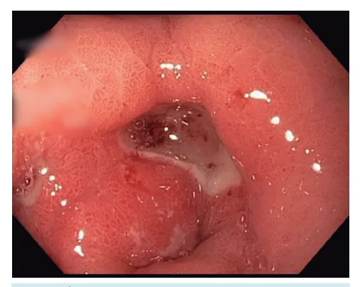
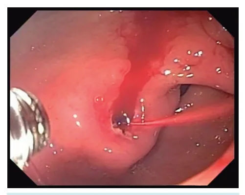
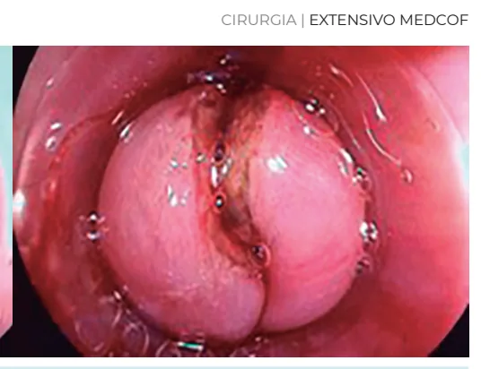
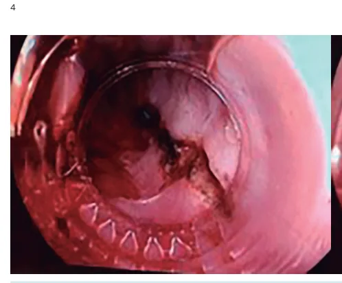

# HDA Não Varicosa

<!-- page:1 -->

Hemorragia digestiva Etiologias:

- 1° Úlceras gastro-duodenais;

- 2° Esofagite;

- 3° Gastrite;

- 4° Duodenites;

- 5° Angiodisplasia;

- 6° Mallory-Weiss.

Úlceras: Pré-endoscópico:

- Ressuscitação hemodinâmica precoce (cristaloides) +

- Hemotransfusão +

- Medicamentos → IBP +

Eritromicina. → Transamin NÃO

- ± IOT.

Endoscópico:

- EDA em 24h.

## DEFINIÇÃO

- Sangramento proximal à papila duodenal maior.

- Antiga definição - proximal ao ângulo de Treitz.

## ETIOLOGIA

- Não varicosa (HDAnv): Úlcera péptica = 80% – 85% dos casos; Etiologias em ordem decrescente de frequência:

úlceras gastroduodenais, gastrite e duodenite severas, esofagite severa, angiodisplasia, MalloryWeiss, lesão em massa (tumores/ pólipos) e causas não identificadas.

- Varicosa (HDA v).

OBS.: A conduta, dependendo da etiologia, é totalmente diferente!

## TRATAMENTO DA HDA NÃO

## VARICOSA

- Tratamento dividido em 3 fases: pré-endoscópico, endoscópico e pós-endoscópico;

Pré-endoscópico:

- Exame físico (ABC): Proteção de Via Aérea → rebaixamento do nível de consciência, hematêmese volumosa = Ressuscitação hemodinâmica → Ringer e transfusão.

Intubação orotraqueal.

- Estratificação de risco → Escore de Baixo risco: 0 – 1 ponto endoscopia ambulatorialmente. alto risco: > 1 ponto - endoscopia com paciente internado. - Forrest Ia e Ib: Injeção de adrenalina + método térmico e/ou mecânico.

Glasgow-Blatchford:

- Forrest IIa: Terapia térmica OU mecânica OU esclerosante - ± adrenalina.

- Forrest IIb: Avaliar coágulo.

- Forrest IIC e III: Tratamento com IBP apenas.

Pós-endoscópico:

- Ressangramento: Realizar nova EDA, se refratário angioembolização e, caso ainda refratário, cirurgia;

- IBP - alto risco: EV de 12/12h por 3d;

- H. pylori - pesquisar e tratar.

Dieulafoy:

- Malformação arterial, muitas vezes com foco não identificado, tratado com métodos mecânicos. alta probabilidade de intervenção endoscópica:

> 7 pontos. Elevada morbimortalidade e risco de ressangramento: > 12 pontos.

- Estratificação de risco → Escore de Rockall: Avaliação clínica e endoscópica:

- Terapia medicamentosa → Objetivos:

reduzir mortalidade, ressangramento, necessidade de hemotransfusão, duração da internação e intervenções.

| Inibidores de bomba de prótons - IBP: sempre. EV na urgência. | De ataque - 80 mg de omeprazol; | Dose de manutenção - 40 mg de omeprazol, 12 em 12 horas.

| Eritromicina: 250 mg, EV. Recomendação alta.

1. 20 – 120 minutos anteriormente a EDA;

2. Contraindicação - alargamento do intervalo

QT, no ECG.

3. Importante mencionar que não demonstrou impacto

no tempo de internação, na mortalidade e na necessidade de cirurgia.

4. Benefício - esvaziamento gástrico - redução

da necessidade de realização de um 2° exame de endoscopia, poupando gastos e novas intervenções desnecessárias.

| Ácido tranexâmico: não tem seu uso recomendado nos quadros de hemorragia digestiva alta; inclusive, apresenta malefício em pacientes com hepatopatia . avançada crônica, aumentando a mortalidade.

| Hemotransfusão → Hb < 7 g/dL; | Estratégia restritiva demonstra melhores desfechos; | Doença cardiovascular associada = Hb 8 – 10 g/dL.

- Plaquetas: HDA + plaquetas < 50.000 céls/mm³.

---

<!-- page:2 -->

Tabela 1: Escore Glasgow-Blatchford. Ureia (mg/dL) Pontuação ≥ 39 - < 48 2 ≥ 48 - < 60 ≥ 60 - < 150 ≥ 150 Hemoglobina (g/dL)

≥ 12 - < Homem ≥ 10 - < < 10 ≥ 10 - < Mulher < 10 PAS (mmHg) 100 - 109 90 - 99 < 90 Outros FC ≥ 100 bpm Melena Síncope Hepatopatia Insuficiência cardíaca

- Antiagregantes e anticoagulantes: Avaliar risco x T benefício para suspender.

- Varfarina: RNI > 2 + HDAnv + instabilidade hemodinâmica = Vit K + complexo protrombínico ou plasma fresco congelado.

- A endoscopia poderá ser realizada quando o valor do

RNI < 2,5.

- Verificar Figura 1

Endoscópico:

- Preconizado EDA precoce → até 24 horas Instabilidade hemodinâmica refratária às medidas iniciais = EDA urgente → até 12 horas (não tem consenso!).

- Etiologia é o principal guia para o tratamento endoscópico!!!

- Métodos: mecânico; térmico; injetor: adrenalina;

tópico: Hemospray® Endoscopic Hemostat.

- NUNCA realizar injeção de adrenalina como monoterapia. 3

Pontuação < 13 1 < 12 3 0 6 < 12 1 0 9 Pontuação Pontuação Tabela 2: Classificação de Forrest.(Decore para a prova)

Sangramento ATIVO Ressangramento Sangramento a 100% arterial em jato Sangramento em b 55% porejamento Sangramento RECENTE a Vaso visível 43% II b Coágulo aderido 22% Base com c 10% hematina Sem sinais de sangramento Base clara ou com III 5% fibrina

---

<!-- page:3 -->

- Úlceras: Forrest Ia e Ib: Injeção de adrenalina + método térmico e/ou mecânico. Forrest IIa: Terapia térmica OU mecânica OU esclerosante - ± adrenalina esclerosante - ± adrenalina Forrest IIb: Avaliar coágulo Forrest IIC e III: Tratamento com IBP apenas. Refratários: Hemospray (sangramento difuso) OU over-the-scope-clips (ex.: OVESCO).

Figura 1: Úlcera Ia – segundo a Classificação de Forrest. Figura 2: Úlcera Ib – segundo a Classificação de Forrest Figura 3: Úlcera IIa – segundo a Classificação de Forrest. Figura 4: Úlcera IIb – segundo a Classificação de Forrest.

Figura 5: Úlcera IIc – segundo a Classificação de Forrest. Figura 6: Úlcera III – segundo a Classificação de Forrest.

Pós-endoscópico:

- Ressangramento: 1° = repetir endoscopia; Utilizar método hemostático diferente do inicial considerar uso de clipe montado - over-the-scope

- também utilizado em sangramentos refratários. Falha na hemostasia após a segunda endoscopia = O procedimento cirúrgico somente é considerado quando houver falha da hemostasia endoscópica, bem como a indisponibilidade de intervenção radiológica.

Considerar embolização transarterial.

---

<!-- page:4 -->

Figura 7: À esquerda, evidenciando a transição esôfago-gástrica. Per laceração com ruptura da camada mucosa e submucosa.

- Second-look: não é recomendado de rotina! É o conceito de uma endoscopia programada. Ou seja, já foi realizado um primeiro exame, com avaliação e tratamento da úlcera anteriormente. Indicações: 1) suspeita de tratamento inadequado ou 2) não identificada a origem do sangramento.

- Tempo de internação: Para os pacientes com úlceras de alto risco (Forrest Ia, Ib, IIa), o tempo é de, no mínimo, 3 dias.

- Supressão ácida: Alto risco de ressangramento = administrar IBP, EV, de 12 em 12 horas, por três dias, seguido de IBP, VO, de 12 em 12 horas, por 14 dias. Baixo risco (Forrest IIc e III) = administrar IBP, VO, 1x por dia em associação com alta precoce. Para os pacientes em uso de antiagregante ou de anticoagulante, e que apresentarem HDAnv por úlcera; administrar IBP em uso contínuo.

- Helicobacter pylori: pesquisar em todos os pacientes. infecção + = planejar tratamento e confirmar a posterior cura; em quadros vigentes de sangramento agudo, caso os testes diagnósticos de H. pylori sejam negativos:

repetir o teste depois.

## MALLORY-WEISS

- Mais comum em pacientes do sexo masculino.

- História clínica: Sangramento digestivo alto após vômitos incoercíveis, induzidos, associados ao uso de álcool.

DICA: nas provas, geralmente, a questão tenta induzir o leitor a perceber a evolução do paciente ao quadro de vômitos, e a partir disso, para a hemorragia digestiva alta! Nesse caso, pensar na síndrome de

- O sangramento apresentado, em geral, não é grave!

- Terapia endoscópica: Recomendado é terapia mecânica; Clipagem; Ligadura elástica.

- Verificar Figura 7 rceba a laceração; à direita, da mesma forma, é evidenciada uma

## DIEULAFOY

- Sangramento de artéria submucosa dilatada após lesão epitelial não ulcerosa. Não há presença de inflamação ou de aneurisma.

- Pode ocorrer em qualquer localização do trato gastrointestinal; Contudo, é mais frequente no estômago! importantes. Contudo, não é infrequente a não identificação do foco do sangramento! Nestes casos, pensar em Dieulafoy!

DICA: em geral, são casos com hemorragias

- Terapia endoscópica: Recomendado é terapia mecânica; Métodos principais: clipagem; ligadura; tatuagem

- útil aos casos de sangramentos recorrentes para futura identificação. Falha endoscópica: proceder com a radiointervenção ou intervenção cirúrgica!

## OUTRAS ETIOLOGIAS

- Neoplasia Sucesso técnico bom, mas muito ressangramento; Biopsiar, mesmo se sangramento agudo; TTO: hemospray (considerar RI e Cx).

- Causas erosivas Normalmente sangramentos autolimitados; TTO: métodos térmicos, adrenalina, clipes, ligaduras;

- Angiectasia (angiodisplasia) Sangramentos ocultos e crônicos; TTO: argônio, clipes, ligaduras.

## PONTOS-CHAVE

- Ressuscitação hemodinâmica = objetivo principal, se houver instabilidade hemodinâmica;

- A endoscopia somente deverá ser realizada após a estratificação de risco, tratamento e estabilização clínica;

---

<!-- page:5 -->

- A transfusão de hemácias em pacientes sem Figura 4: Úlcera IIb – segundo a Classificação de Forrest;

cardiopatia deve ocorrer apenas quando Hb < 7 g/dL; https://endoscopiaterapeutica.com.br/

- Todo paciente com HDAnv ulcerosa deve ser testado para infecção por H. pylori. Figura 5: Úlcera IIc – segundo a Classificação de Forrest;

## REFERÊNCIAS

Figura 1: Úlcera Ia – segundo a Classificação de Forrest; https://endoscopiaterapeutica.com.br/ Figura 2: Úlcera Ib – segundo a Classificação de Forrest https://endoscopiaterapeutica.com.br/ Figura 3: Úlcera IIa – segundo a Classificação de Forrest;

https://endoscopiaterapeutica.com.br/ https://endoscopiaterapeutica.com.br/ Figura 6: Úlcera III – segundo a Classificação de Forrest;

https://endoscopiaterapeutica.com.br/ Figura 7: À esquerda, evidenciando a transição esôfago-gástrica.

Perceba a laceração; À direita, da mesma forma, é evidenciada uma laceração com ruptura da camada mucosa e submucosa.

https://endoscopiaterapeutica.com.br
