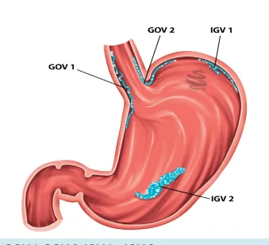

# HDA Varicosa

<!-- page:1 -->

> Resumo esquemático reconstruído a partir de um fluxograma do material original (colunas intercaladas no OCR).

**Pré-endoscópico** (ABC do trauma):

- Atenção à via aérea e **IOT** se necessário / reposição volêmica.
- Hemoderivados: concentrado de hemácias (CH) se **Hb < 7 g/dL** (não há limite mínimo de plaquetas; **RNI não avalia hepatopatia**).
- Drogas vasoativas (2-5 dias): **Terlipressina** / Octreotide / Somatostatina.
- Antibióticos: **Ceftriaxona 1 g, de 24/24h, por 7 dias**.
- Outros: Eritromicina / Lactulose (se encefalopatia hepática) / TC ou RNM de abdome / suspender anticoagulante e/ou antiplaquetário.

**Endoscópico** (EDA em até 12h da admissão hospitalar):

- Varizes esofágicas: **ligadura elástica**.
- Varizes gástricas: **GOV1** – ligadura elástica; **GOV2** e **IGV1** – cianoacrilato / EcoEDA e coil.

**Casos refratários/recorrentes ao tratamento endoscópico** (terapia restritiva):

1. Esofágica: Prótese / Balão de Sengstaken-Blakemore (SB) / TIPS. Se recorrente: nova EDA / TIPS.
2. Gástrica: BRTO / Balão SB / TIPS. Se recorrente: BRTO / TIPS / cianoacrilato + EcoEDA e coil. Cirurgia é a última opção.

**Pós-endoscópico:**

- Extubar o mais precocemente possível.
- Suspender IBP.
- Reintroduzir dieta oral.

---

## Hemorragia Digestiva Alta Varicosa

- O tratamento é dividido em três fases: **pré-endoscópico**, **endoscópico** e **pós-endoscópico**.

### Pré-endoscópico

- Objetivos: controlar o sangramento; evitar ressangramento; prevenir a mortalidade em seis semanas.
- Paciente com HDA varicosa = **paciente crítico!**
- Mnemônico sobre a base terapêutica da HDA varicosa: **H**emoderivado; **D**roga vasoativa; **A**ntibiótico.
- Indicações para uso de hemoderivados: se **Hb < 7 g/dL** (alvo: Hb 7-9 g/dL); a estratégia restritiva apresenta melhores desfechos.

> ⚠️ **Observação:** o paciente com HDA varicosa, em geral, evoluiu a partir de uma hipertensão portal. Por consequência, a transfusão de volume em excesso aumenta a chance de ressangramento!

- **RNI**: não reflete a hemostasia do paciente com doença hepática avançada.
- Transfundir plaquetas se a contagem for menor que **50.000 céls/mm³**.
- Drogas vasoativas → **Terlipressina** (primeira opção); octreotide; somatostatina; vasopressina. O uso deve ser mantido por **2-5 dias**; a vasopressina deve ser mantida por **24 horas**.
- Antibióticos: **Ceftriaxona 1 g, de 24/24 horas, por sete dias**; utilizada de modo profilático, para evitar translocação bacteriana e possível evolução com quadro de PBE (peritonite bacteriana espontânea).
- Informação extra: a eritromicina tem seu uso recomendado 30-120 minutos antes da realização da endoscopia, se não houver contraindicações.
- Sendo confirmada a etiologia varicosa, o **IBP** (inibidor de bomba de prótons) deve ter seu uso suspenso, desde que não haja indicação precisa. O paciente deve ser transferido para UTI; a extubação deve ocorrer do modo mais precoce possível.

### Endoscópico

- Deve ser realizado em até **12 horas** da admissão hospitalar.
- Se instável: EDA assim que for seguramente possível (**BAVENO II**).

**Quanto ao método específico:**

- Varizes esofágicas = ligadura elástica.

**Varizes gástricas – Classificação de Sarin:**

> ⚠️ Dados de tabela ambíguos no OCR original — não foi possível reconstruir com segurança; conteúdo listado em texto corrido.

- **GOV 1**: varizes de esôfago que se estendem pela pequena curvatura do estômago; tratamento: ligadura elástica.
- **GOV 2**: varizes de esôfago que se estendem pela grande curvatura do estômago; tratamento: injeção de cianoacrilato / injeção de coil por EcoEDA / coil + cianoacrilato.
- **IGV 1**: varizes isoladas ao fundo gástrico; tratamento: injeção de cianoacrilato / injeção de coil por EcoEDA / coil + cianoacrilato.
- **IGV 2**: varizes que se apresentam em qualquer outra localização gástrica. O tratamento varia conforme a localização.

*Figura 1: GOV 1, GOV 2, IGV 1 e IGV 2.*

---

<!-- page:2 -->

> ⚠️ **Observação:** atenção especial deve ser direcionada ao risco de sangramento relacionado ao local das varizes. A saber: **IGV 1 > GOV 2 > GOV 1**.

### Falha no tratamento endoscópico

**Balão de Sengstaken-Blakemore:**

- Deve ser mantido por, no máximo, 12-24 horas. A maioria dos consensos preconiza a manutenção do balão por até 12 horas, em virtude de que, após esse prazo, a taxa de complicações associadas é consideravelmente elevada.
- Principais complicações: broncoaspiração; necrose da asa nasal.
- Realizar sob IOT.
- Após 24 horas: nova EDA; se refratário: TIPS.

**Stent esofágico:**

- Os estudos evidenciaram que tal método é melhor em comparação ao balão Sengstaken-Blakemore, em face das menores taxas de complicações associadas, com mesma eficácia.
- Também é considerada terapia de ponte; no entanto, pode ser mantido por até 14 dias.
- Não é útil para tratar varizes de fundo gástrico (IGV1, IGV2).
- Para varizes GOV 2 e IGV 1, a opção é pela injeção de cianoacrilato.

**TIPS (shunt portossistêmico intra-hepático):**

- Indicado nos casos refratários às terapias iniciais para os quadros de HDA varicosa.
- Contraindicações: insuficiência cardíaca; doença policística hepática; hipertensão pulmonar grave; infecção sistêmica não controlada ou sepse; regurgitação tricúspide grave.
- Complicações: obstrução e encefalopatia hepática.

### Cirurgia

- É uma opção nos casos de hipertensão portal secundária à esquistossomose, quando há falha do tratamento endoscópico.
- Procedimento: **DAPE** (derivação ázigo-portal com esplenectomia). É uma terapia de ponte.

### Pós-endoscópico

- Extubar o mais precocemente possível.
- Reintroduzir dieta oral assim que possível.
- Suspender IBP assim que confirmar etiologia varicosa.
- Solicitar TC de abdome com contraste (excluir trombose da veia esplênica, carcinoma hepatocelular e mapear colaterais porto-sistêmicas).

## Ponto-Chave

- A etapa pré-endoscópica é fundamental na redução da mortalidade!!!
- Lembre do mnemônico HDA.
- A classificação de Sarin deve ser utilizada nos casos de varizes gástricas.
- A ligadura elástica é o procedimento de escolha para correção de varizes esofágicas e GOV 1.
