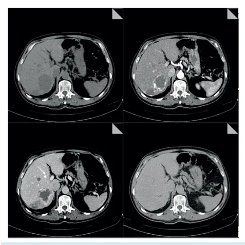
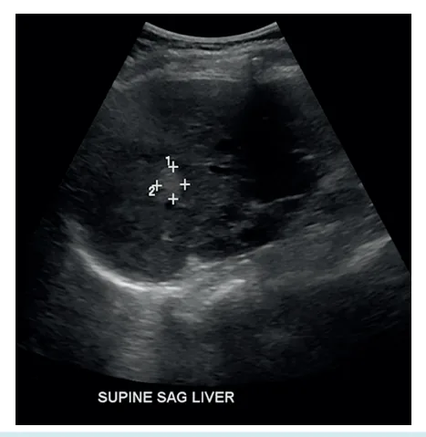
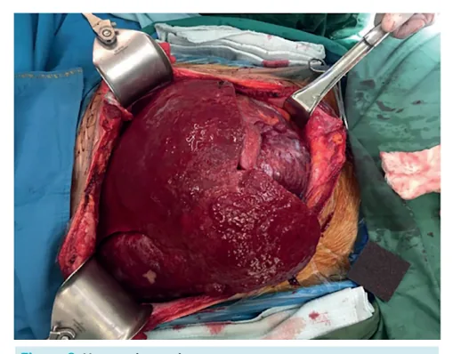

# Hemangioma Hepático

<!-- page:1 -->

## FÍGADO: HEMANGIOMA HEPÁTICO

Fígado (CIR)

- Mais Comum das lesões focais; | Conservador em quase TOTALIDADE dos casos

- Frequentemente incidental; (exceto se muito sintomático ou Síndrome de

- USG: Hiperecogênico (heterogêneo se gigante, mas Kasabach-Merritt → Coagulopatia / predomina hiperecogenicidade); Trombocitopenia associadas ao hemangioma;

- TC/RM: Realce globuliforme + evento RARÍSSIMO).

captação centrípetal;

## CONSIDERAÇÕES INICIAIS

- Tumor hepático mais comum; 0,4 - 20% de toda população; Aprox. 5% em exames de imagem; Até 20% em necropsias.

- Predominância no sexo feminino (varia entre 1,2 a 6:1);

- Pode ser diagnosticado em todas as idades; Ocorre mais comumente entre 30 - 50 anos;

## APRESENTAÇÃO CLÍNICA

- Frequentemente pequenos (< 4 cm) e solitários; Podem, entretanto, atingir até 20 cm de diâmetro;

- Mesmo grandes, a maioria dos pacientes é assintomática;

- Alguns pacientes podem apresentar dor / desconforto quando em lesões maiores que 5 cm;

- Complicações muito raras: Figura 1: Ultrassonografia demonstrando lesão hiperecogênica Ruptura - descrições anedóticas (geralmente bem delimitada, compatível com hemangioma. Síndrome de Kasabach-Merritt: Trombocitopenia,

associada a biópsias inadvertidas);

- Tomografia computadorizada:

coagulopatia de consumo e púrpura associada | Hipodenso na fase pré-contraste; ao hemangioma. | Realce globuliforme com preenchimento centrípeto nas fases contrastadas (arterial, portal e equilíbrio).

## FISIOPATOLOGIA

- Origem ainda incerta, possivelmente junção de alguma alteração congênita com interferências hormonais;

- Macroscopia: Lesão plana; Bem delimitada; Coloração avermelhada a azulada; Fibrose / calcificação e trombose pode ser observada - especialmente em lesões maiores

(possível causa da dor referida pelos pacientes).

## DIAGNÓSTICO

- Ultrassonografia de Abdome Superior Geralmente é o primeiro exame a ser solicitado; Coincide com o momento do “achado” da lesão; Características: Lesão hiperecogênica, bem delimitada e geralmente pequena (< 3 cm).

Figura 2: Aspecto tomográfico dos hemangiomas. Quando a lesão for muito grande ou USG atípico: Note o enchimento centrípeto nas fases contrastadas.

Exame axial com contraste EV (preferencialmente RM).

---

<!-- page:2 -->

## REFERÊNCIAS

- Ressonância Magnética: Hipointensa em T1 (e realce similar ao da TC nas fases contrastadas); Figura 1: Ultrassonografia demonstrando lesão hiperecogênica Hiperintensa em T2. bem delimitada, compatível com hemangioma.

## MANEJO R

- Conservador em quase 100% das situações! Acompanhamento com nova imagem (podendo ser W dos anos.

USG) pelo potencial risco de crescimento ao longo R Indicações Cirúrgicas: E

- Síndrome de Kasabach-Merritt M l Alternativa: embolização + corticoides / vincristina. 0

- Considerar: Sintomas importantes; Crescimento rápido; Dúvida diagnóstica.

OBS.: Gravidez e uso de contraceptivos não são contraindicações.

- Os casos complicados (hemangiomas gigantes, irressecáveis), podem RARAMENTE ser possíveis candidatos ao transplante hepático.

Figura 3: Hemangioma gigante Weerakkody Y, Rasuli B, Le L, et al. Hepatic hemangioma. Reference article, Radiopaedia.org (Accessed on 23 Jun 2025).

Figura 2: Aspecto tomográfico dos hemangiomas. Note o enchimento centrípeto nas fases contrastadas. Weerakkody Y, Rasuli B, Le L, et al. Hepatic hemangioma. Reference article, Radiopaedia.org (Accessed on 23 Jun 2025).

Figura 3: Hemangioma gigante Eghlimi, H., Arasteh, P. & Azade, N. Orthotopic liver transplantation for Management of a Giant Liver Hemangioma: a case report and review of literature. BMC Surg 20, 142 (2020). https://doi.org/10.1186/s12893-02000801-z

