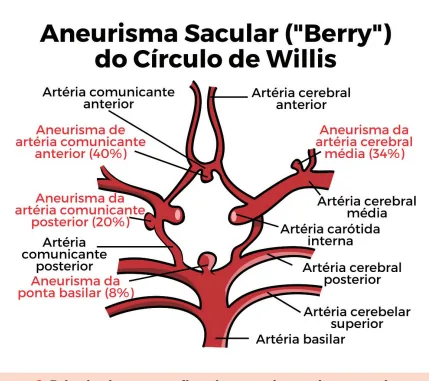
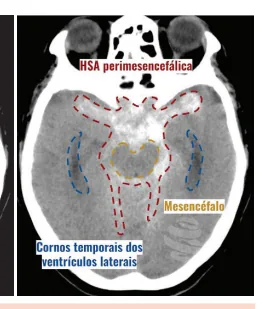
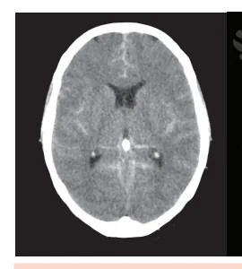

# Hemorragia Subaracnóidea (HSA)

<!-- page:1 -->

## HEMORRAGIA SUBARACNÓIDEA

## (HSA)

## HSA (CM)

## INTRODUÇÃO

- Ruptura de aneurisma sacular é a principal causa não traumática.

- “Perfil” do paciente: mulher, 40-55 anos, tabagista e hipertensa.

## QUADRO CLÍNICO

- Cefaleia em trovoada (“a pior da vida”), rebaixamento do nível de consciência, papiledema se evoluir com hipertensão intracraniana.

- Lembrar das escalas de Hunt-Hess (clínica) e Fisher

(tomográfica) - risco de vasoespasmo.

## DIAGNÓSTICO

- TC de crânio é o primeiro exame no PS. Se normal e suspeita de HSA → coletar liquor.

- Emergência neurológica → altas taxas de mortalidade 2-7% de todos os AVCs;

(aproximadamente 50% dos casos).

- Perfil de acometimento: 49-55 anos, principalmente mulheres,

- Forma mais comum NÃO traumática → ruptura de aneurisma;

Atenção! A forma mais comum de HSA é a traumática (pegadinha)

- Locais mais comuns: Complexo da artéria comunicante anterior (40%); Artéria cerebral média (34%).

Figura 1: Principais topografias de aneurismas intracranianos, de acordo com sua prevalência - Arteriografia: exame padrão-ouro (diagnóstico e terapêutico).

| Mais invasivo e depende de equipe especializada. COMPLICAÇÕES

- Ressangramento, vasoespasmo e isquemia cerebral tardia, hidrocefalia, hiponatremia, arritmias cardíacas/alterações no ECG.

TRATAMENTO r z “Fechar” o aneurisma o mais rápido possível!

## FATORES DE RISCO

- Sexo feminino;

- Aneurismas >7mm;

- História familiar de HSA;

- Tabagismo;

- Hipertensão arterial sistêmica;

- Uso de drogas simpatomiméticas.

- “Regra de Ottawa” - pensar em HSA se houver pelo menos 1 dos seguintes: Idade > 40 anos; Rigidez de nuca; Perda de consciência presenciada; Início da cefaleia durante esforço (físico, sexual); Cefaleia em trovoada (thunderclap); Limitação da flexão cervical ao exame.

## CARACTERÍSTICAS DA CEFALEIA

- Súbita!

- Em “trovoada” (thunderclap);

- Atinge dor máxima em < 1 minuto;

- É descrita pela paciente como “a pior cefaleia da vida”.

- História de “cefaleia sentinela” Cefaleia de menor intensidade, que antecede precede ekmalguns dias, o rompimento do aneurisma;

- Irritação meníngea → rigidez nucal (Kernig, Brudzinski);

- Pode evoluir com hipertensão intracraniana,

---

<!-- page:2 -->

ESCALA DE AVALIAÇÃO Tabela 3: Escala de Fisher Tabela 1: Escala Hunt Hess

## GRAU DESCRIÇÃO

## GRAU ESTADO NEUROLÓGICO

1 Sem hemorragia 1 Assintomático Cefaleia de forte intensidade ou 2 meningismo, sem déficit neurológico, exceto paralisia de nervo craniano 3 Sonolência; déficit neurológico focal 4 Torpor; moderada ou grave hemiparesia Coma profundo; postura de descerebração

## TOMOGRAFIA DE CRÂNIO SEM CONTRASTE

- Exame de escolha no departamento de emergência;

- A sensibilidade nas primeiras 6 horas do ictus é próxima a 100%. Então, quanto mais precocemente for solicitado e realizado o exame, maiores as chances de constatar o sangramento;

- A sensibilidade, após 5 dias do internamento do paciente, é < 60%;

- TC de crânio normal, na vigência de um quadro típico, não exclui o diagnóstico. Coletar LCR.

## COLETA DE LÍQUOR

- Suspeita clínica com tomografia de crânio normal → coletar LCR

Diferenciação entre um acidente de punção e HSA

- Na própria punção pode haver um acidente com punção inadvertida de vaso, obtendo aspecto hemorrágico do LCR.

- Teste dos 3 tubos: Nos pacientes com acidente de punção, ocorrerá o clareamento do conteúdo conforme o líquor preencher do 1o ao 3o tubo;

- Se líquor apresenta aspecto xantocrômico → sugestivo de HSA;

- Hemácias íntegras (acidente de punção) x hemácias degeneradas (HSA). A

- Verificar Tabela 2

- Escala de avaliação

- Escala de Fisher Traduz a seguinte relação → quanto maior o A grau, maior será a chance de vasoespasmo e isquemia cerebral.

- Verificar Tabela 3 primeiro tubo at intraparenquimatosa com ou sem HSA observar uma hiperatenuação (branco) que ocupa os espaços liquóricos perimesencefálicos, sugestivos de sangramento recente.

Tabela 2: Técnicas para diferenciação entre acidente de punção e HS Técnicas Acidente de Ocorre clareamen Teste dos 3 tubos conforme o líquido Centrifugação Límpido, in Aspecto das hemácias Hemácias ín 2 Sangramento difuso < 1mm 3 Sangramento > 1mm Hemoventrículo ou hemorragia Figura 2: Hemorragia subaracnóidea Fisher 3 - Podemos Figura 3: Hemorragia subaracnóidea difusa - Podemos observar uma hiperatenuação (branco) que ocupa os espaços liquóricos da alta convexidade, nos sulcos cerebrais.

Angiotomografia (ou angioressonancia)

- São exames úteis e importantes para estudar a anatomia e localizar o aneurisma.

## ARTERIOGRAFIA/ANGIOGRAFIA DIGITAL

- É o exame considerado padrão ouro → capacidade diagnóstica e terapêutica; Invasivo → maior risco na realização e punção Hemorragia subaracnóidea nto do sangue, o preenche do Não ocorre clareamento té o terceiro ncolor Xantocrômico ntegras

SA Hemácias degeneradas, geralmente >1000

---

<!-- page:3 -->

## TRATAMENTO

- Aneurisma já foi clipado;

- O grande objetivo é “fechar” o aneurisma do modo

- Hipertensão normovolêmica mais precoce possível; | Alvo máximo de PAS 200-220 mmHg, solução salina Preferencialmente até 72 horas. fisiológica + droga vasoativa, se necessário. Preferencialmente até 72 horas.

- Existem basicamente duas terapias, ambas igualmente eficazes: Tratamento endovascular (embolização); Cirúrgico (clipagem).

Atenção! Não é mais recomendado proceder com a conduta dos “3 Hs” (hipertensão, hemodiluição e hipervolemia) → sem evidências de benefícios.

## META PRESSÓRICA

- O último guideline de 2023 não definiu um alvo exato, mas o valor de PAS 160 mmHg é uma meta razoável; Até a clipagem do aneurisma.

## FIBRINOLÍTICOS

- Ácido tranexâmico: não recomendado de rotina. Pode ser considerado caso ocorra atraso para abordagem do aneurisma em alto risco de sangramento.

## COMPLICAÇÕES

## RESSANGRAMENTO

- Ocorre, principalmente, nas primeiras 72 horas;

- Principal fator de risco para ressangrar é a pressão arterial elevada;

- Como evitar: Tratando o aneurisma através da clipagem ou embolização; Controlando a pressão arterial.

## VASOESPASMO E ISQUEMIA CEREBRAL TARDIA

(ICT)

- Vasoespasmo é a redução do lúmen vascular devido à irritação causada pelo sangue na parede do vaso cerebral. Ocorre do 3° ao 14° dia de evolução da doença Isquemia cerebral tardia é uma complicação do vasoespasmo;

(pico: 7° dia);

- Vasoespasmo “sintomático”: déficit neurológico novo e/ou rebaixamento do nível de consciência;

Diagnóstico

- Suspeita clínica ou exames complementares (doppler transcraniano; angiotomografia).

- Critérios de vasoespasmo com doppler transcraniano: Velocidade na artéria cerebral média (ACM) > Índice de lindegaard > 3; Aumento na velocidade de > 50 cm/seg por dia.

120 cm/seg; Profilaxia

- Nimodipina 60mg 4/4h por 21 dias. Útil na prevenção de ICT; Melhor desfecho funcional em 3 meses, porém com a mesma taxa de vasoespasmo; Indicada na HSA aneurismática. fisiológica + droga vasoativa, se necessário.

- Milrinona endovenosa;

- Terapia endovascular (angioplastia).

## HIDROCEFALIA

- Complicação neurológica aguda mais frequente, que pode ocorrer em até 50% dos casos, a depender da casuística.

- Cursa com rebaixamento do nível de consciência

(RNC) e, em geral, acontece até o 7o dia da HSA;

- Fatores de risco: hemoventrículo; sangue difuso pelas cisternas; aneurisma de circulação posterior;

- Tratamento: derivação ventricular externa (DVE) ou

DVP (se ocorrer na fase crônica). CRISES EPILÉPTICAS

- Profilaxia - tema polêmico: pode ser considerado em pacientes de alto risco (ex. aneurisma de ACM, hidrocefalia, hemorragia intraparenquimatosa);

- Evitar fenitoína: aumenta as chances de ocorrência de vasoespasmo, de infartos e tem piores desfechos cognitivos.

## HIPONATREMIA

- Apresenta frequência estimada de 30-50% dos pacientes;

- Dois mecanismos propostos: Síndrome perdedora de sal (paciente apresenta aumento da natriurese e depleção de volume intravascular); SIADH - síndrome da secreção inapropriada de hormônio antidiurético.

## SISTÊMICAS

- Cardiopulmonares: mecanismo se dá por hiperatividade simpática e disfunção miocárdica pela Pode ocorrer infarto agudo do miocárdio, arritmias, miocárdio atordoado e choque cardiogênico.

“tempestade” de catecolaminas.

- Em alguns casos, o quadro ainda pode evoluir para síndrome de desconforto respiratório agudo (SDRA) e edema pulmonar cardiogênico (TEP);

- Síndrome de Takotsubo;

- Febre de origem central: complicação relativamente comum e associada a pior desfecho clínico.

## REFERÊNCIAS

Figura 2: Hemorragia subaracnóidea Fisher 3 radiopaedia.com Figura 3: Hemorragia subaracnóidea difusa radiopaedia.com
