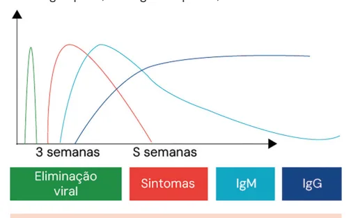
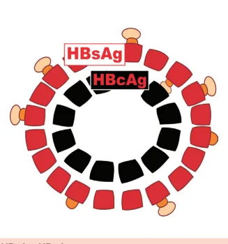

# Hepatites Virais

<!-- page:1 -->

Hepatites Virais (CM)

## Hepatite B — Sorologias

### Marcadores Sorológicos

**Antígenos (Ag)** — parte do vírus:

- **AgHBs**: indica doença.
- **AgHBe**: indica replicação.

**Anticorpos (Anti)** — resposta imune:

- **Anti-HBs**: cura.
- **Anti-HBc**: contato.
- **Anti-HBe**: não replicante — contato sem antígeno como marcador de replicação.

> ⚠️ Tabela reconstruída a partir de OCR — confira contra a fonte original.

| Situação | AgHBs | Anti-HBs | Anti-HBc | AgHBe |
|---|---|---|---|---|
| Doença aguda | + | - | - | +/- |
| Doença replicante | + | - | + | + |
| Não teve cura | + | - | + | -/+ |
| Cura funcional (cura pela doença) | - | + | + | - |
| Imunidade sem contato = vacina | - | + | - | - |

- **Janela imunológica**: somente anti-HBc +. Dosar TGP; se normal, revacina; se alterado, solicitar PCR.
- Evolução para cura funcional por > 6 meses; nunca faz o anti-HBs quando cronifica.
- **Crônica** = AgHBs por > 6 meses.

*Figura: marcadores sorológicos até a cura funcional e até a cronificação (incubação, sintomas, recuperação — 4, 8, 24, 28, 32 semanas).*

### Tratamento HBV — Mind the Gap

Dano hepático sustentado devido à replicação viral: **pacientes com HBV-DNA ≥ 2.000 UI/mL** e ALT elevada (**≥ 52 U/L para homens** e **≥ 37 U/L para mulheres**) em duas medidas consecutivas, com intervalo mínimo de 3 meses, devem ser tratados.

### Outras Condições de Tratamento HBV

Sintomático na fase aguda B — tratamento específico se:

- INR > 1,5
- BT > 3 ou BD > 1,5, por mais de 4 semanas
- Encefalopatia / ascite

---

<!-- page:2 -->

### Indicações de Tratamento por Alto Risco de CHC (Hepatite B)

- Cirrose / fibrose avançada.
- Bx: ≥ F2.
- Elastografia: > 9 kPa (AST normal) / > 12 kPa (AST 1-5x LSN).
- Histórico familiar de CHC.
- Coinfecção HCV/HIV.
- Todo AgHBe + com mais de 30 anos.
- Manifestação extra-hepática (ex.: poliartrite nodosa) — estudos apontam que esses pacientes evoluem pior.
- Uso de rituximab (anti-CD20, esquema R-CHOP) — neoplasias hematológicas (linfomas) e artrite reumatoide.
- Anti-HBc + (anti-HBs não importa — sororreversão).

### Hepatite C

- Tratamos todos que cronificam = PCR + > 6 meses.
- Tratamento atualizado por nota técnica, mas os esquemas preconizados atualmente são pangenotípicos.

## Profilaxia HBV

> ⚠️ Tabela reconstruída a partir de OCR — confira contra a fonte original.

| Fonte | Acidentado | Conduta |
|---|---|---|
| AgHBs+ | Vacinado, anti-HBs > 10 UI | Nenhuma medida adicional |
| AgHBs+ | Não vacinado | Vacina + imunoglobulina (IG) |
| AgHBs+ | Anti-HBs < 10 UI / desconhecido | Vacina + IG |
| AgHBs+ | Sem resposta após segunda série (6 doses) | IG 2x |
| Desconhecido | Não vacinado | Vacina |

## Hepatites Virais Agudas

### Informações Gerais

- Quadro viral agudo é observado principalmente nas hepatites A e B.
- Hepatites B e C se cronificam; a hepatite A nunca cronifica.

### Pródromo Viral

- Os sintomas mais proeminentes são expressos no TGI: náuseas/vômitos, dor abdominal, hepatomegalia dolorosa.
- Presença de mialgia e cefaleia.
- Febre é incomum; se estiver presente, geralmente é uma febre baixa de 37,5°C–37,9°C, não tão intensa como em arboviroses — simula bastante uma GECA.

**Atenção**: transaminases altíssimas → **> 1.000 UI/mL**. Nesses casos, sempre pensar em hepatites virais. Sempre que as transaminases forem mais brandas, na faixa dos 200–300, devemos pensar em outros diagnósticos diferenciais, como dengue, leptospirose e malária.

- Na hepatite A sempre há cura espontânea, nunca cronifica. Na maioria das vezes ocorre na infância e passa de forma oligossintomática. No adulto, mais frequentemente faz caso grave, mas ainda apresenta baixa taxa de complicações.
- Na hepatite B, até 20% dos quadros podem evoluir para a fase ictérica.

### Fase Ictérica

- Estabelecimento da síndrome colestática; aumento de bilirrubina direta.

---

<!-- page:3 -->

- Acolia fecal; colúria.
- Leucopenia com linfocitose acima de 35% — diferentemente de doenças bacterianas como a colangite e a leptospirose, que apresentam leucocitose com desvio à esquerda.

### Tratamento na Fase Ictérica

- **Hepatite A**: tratamento de suporte.
- **Hepatite B**: tratamento de suporte. A cura da hepatite B depende da resposta imunológica.

Para se ter boa resposta, há necessidade de reconhecer o vírus como *non-self*. Desse modo, antivirais, por diminuírem a carga viral, diminuem as chances de o sistema imune fazer esse reconhecimento e aumentam as chances de cronificação.

Tratamento específico com antivirais apenas se houver evidências de que podem vir a fulminar, como:

- Sintomas e icterícia caracterizada por bilirrubina total (BT) superior a 3 mg/dL ou bilirrubina direta (BD) superior a 1,5 mg/dL por mais de quatro semanas.
- Qualquer grau de encefalopatia hepática ou ascite.

## Hepatite B

É uma doença causada por um **DNA vírus**:

- Integra-se ao DNA humano.
- Tem potencial carcinogênico independente da cirrose.
- Forma o **cccDNA**, que fica em latência virológica, ou seja, não há cura microbiológica, apenas funcional (clínica).
- Pode ser reativada, principalmente se o paciente for imunossuprimido — em especial se a imunossupressão for feita com anti-CD20 (rituximab).

## Hepatite A

É uma doença predominantemente da criança:

- 50% têm quadro viral inespecífico, como de uma GECA.
- Apenas 1–2% evoluem para forma mais grave — icterícia.

Em adultos:

- 5% têm apresentação clínica inespecífica.
- 80% evoluem para forma mais grave — icterícia.

A vacina contra a hepatite A dura toda a vida:

- A transmissão acontece por via fecal-oral.
- A hepatite A é um picornavírus com apenas 1 sorotipo, por isso a eficácia da vacina.
- Em imunossuprimidos: 2 doses com 6 meses de intervalo.
- A vacina entrou no PNI em 2014, então nascidos antes desse ano não receberam a vacina rotineiramente.

Indica-se a vacina para adultos em casos de:

- Homem que faz sexo com homem (HSH).
- Hepatopatas.
- Coinfecção: PVHIV, HCV ou HBV.
- Imunossuprimidos em geral.
- Coagulopatia, hemoglobinopatias.

*Figura 1: Curso sorológico da hepatite A.*

### A Transmissão Ocorre por Vias

- **Sexual**: principal forma de transmissão.
- **Percutânea**: é o vírus com maior risco de contágio nesse tipo de acidente.
- **Vertical**.
- **Sanguínea**: lembrar que os screenings em bancos de sangue para hepatites virais surgiram na década de 90.

### A Estrutura Viral da Hepatite B

- **S** = Superfície = AgHBs.
- **C** = Core/Centro = interpretado na sorologia como "Contato" = AgHBc. Não é possível dosar o AgHBc no sangue, porque o vírus não o elimina na circulação. Vê-se apenas o anti-HBc = resposta imune.

*Figura 2: HBsAg, HBcAg.*

### Marcadores Sorológicos

**Antígenos (Ag)**:

- Parte do vírus.
- Aparecem precocemente.
- **AgHBs**: indica doença — antígeno de superfície.
- **AgHBc**: indicaria contato, mas não é liberado pelo vírus no sangue; logo, não conseguimos detectá-lo diretamente.
- **AgHBe**: indica replicação.

**Anticorpos (Anti)**:

- Resposta imune.
- Demoram um pouco para serem sintetizados.

---

<!-- page:4 -->

- **Anti-HBs**: indica cura funcional ou vacinação prévia — anticorpo contra a superfície do vírus.
- **Anti-HBe**: indica não haver replicação.
- **Anti-HBc**: indica contato; ter anticorpo contra a parte central do vírus significa que houve contato com ele.

**Tabela 1: Hepatite B — Marcadores Sorológicos**

> ⚠️ Tabela reconstruída a partir de OCR — confira contra a fonte original.

| Situação | AgHBs | Anti-HBs | Anti-HBc | AgHBe | Anti-HBe |
|---|---|---|---|---|---|
| Doença aguda | + | - | - | + | - |
| Doença replicante | + | - | + | + | - |
| Não teve cura | + | - | + | - | -/+ |
| Cura funcional | - | + | + | - | + |
| Imunidade sem contato = vacina | - | + | - | - | - |

*Figura 3: Marcadores sorológicos até a cura funcional (incubação, sintomas, recuperação — 4, 8, 24, 28, 32 semanas: AgHBs, IgM/IgG anti-HBc, AgHBe, anti-HBs, anti-HBe).*

*Figura 4: Marcadores sorológicos até a cronificação. Nunca faz o anti-HBs. Crônica = AgHBs por > 6 meses.*

---

<!-- page:5 -->

Quanto mais cedo na vida o paciente tiver contato com o vírus, mais imaturo será o sistema imune para fazer o anti-HBs. Por conseguinte, é na transmissão vertical que temos o maior risco de cronificação.

## Sorologias — Pegadinhas

**1º ponto**: teve contato mas não houve cura (conversão em anti-HBs).

**Tabela 2: Marcadores sorológicos quando o paciente não teve cura**

> ⚠️ Tabela reconstruída a partir de OCR — confira contra a fonte original.

| Situação | AgHBs | Anti-HBs | Anti-HBc | AgHBe | Anti-HBe |
|---|---|---|---|---|---|
| Não teve cura | + | - | + | - | -/+ |

No caso acima, há duas possibilidades:

- **Portador inativo**: nunca se curou, mas convive bem com o vírus; não tem dano hepático e tem baixa replicação. Não precisa tratar.
- **Mutante por escape**: deixa de produzir AgHBs ou passa a produzir de outro tipo, para "escapar" do anti-HBs.
- **Mutante pré-core**: cepa capaz de se replicar mesmo na presença do anti-HBe, "se escondendo" do sistema imune exatamente por não ter o AgHBe. Essa é a pegadinha: não é só porque não tem AgHBe que não replica.

Lembrar primeiro que anti-HBc + isolado pode ser apenas janela imunológica — o paciente está evoluindo para cura funcional.

Outro raciocínio possível: o paciente se infectou pela cepa selvagem e pela cepa mutante. Faz anti-HBs contra o HBs da cepa selvagem; a cepa mutante, por não ter o AgHBs ou por ter outro tipo, não tem sua replicação afetada. Inclusive, o paciente pode se infectar com a cepa selvagem (que tem AgHBe) e um pouquinho de mutante pré-core. Ao fazer anti-HBe contra a cepa selvagem, esta morre e abre espaço para o mutante se replicar.

Ao alterar TGP (> 1,5x LSN) e ter PCR elevado (> 2.000 UI), por haver dano hepático, caracteriza-se necessidade de tratamento.

**Anti-HBs negativo significa necessariamente ser suscetível?** Não. Por vezes o sistema imune simplesmente se esquece de fazer anti-HBs, mas a vacinação contra a hepatite B tem uma taxa de soroconversão de 90% com o esquema completo.

**2º ponto**: paciente é somente anti-HBc + ou tem AgHBs e anti-HBs ao mesmo tempo.

### Anti-HBc Isolado

> ⚠️ Fluxograma reconstruído a partir de OCR — confira contra a fonte original.

- Solicitar PCR-HBV.
  - **PCR > 2.000**: hepatite B oculta/mutante por escape.
  - **PCR < 2.000**: solicitar PCR-HDV.
- Verificar ALT: normal ou alterada.
- Verificar anti-HBs: se ≥ 10, protegido; se < 10, considerar uma dose de vacina — se não fez soroconversão (anti-HBs), solicitar PCR.

*Figura 5: Fluxograma — anti-HBc positivo isolado: investigação de hepatite B oculta (mutante por escape).*

## Hepatite D

**Tabela 3: Hepatite D**

- Transmissão: igual à hepatite B — percutânea, materna ou sexual.
- Necessita do AgHBs:
  - Coinfecção simultânea com HBV.
  - Superinfecção com HBV crônico.
- Rápida progressão para cirrose hepática e CHC.
- Quando suspeitar: exacerbação da doença hepática com HBV-DNA suprimido (menor que 2.000 UI/mL), sem outra causa identificada.

---

<!-- page:6 -->

## Indicações de Tratamento na Fase Crônica (Hepatite B)

Independentemente do status do HBeAg, se níveis elevados de ALT (≥ 52 U/L para homens, ≥ 37 U/L para mulheres) em duas medidas consecutivas, com intervalo mínimo de 3 meses, e pacientes com HBV-DNA ≥ 2.000 UI/mL, devem ser tratados — o PCDT é categórico.

Suspende-se o tratamento se, por acaso, o paciente evoluiu com cura e não for cirrótico — mas isso é realmente muito raro. Por causa dessas cepas mutantes, veja bem: não se fala em AgHBe para indicação de tratamento (porque há o mutante pré-core, que se replica sem fazer AgHBe), nem em AgHBs (porque há o mutante por escape, que se replica sem fazer AgHBs ainda que tenha anti-HBe). Fala-se em PCR alto.

### Tratamento

- **Inibidores de nucleosídeos**: usados para tratamento; quase nunca haverá suspensão da medicação.
- **Tenofovir 300 mg/dia**: preferencial.
  - Atentar-se para os efeitos colaterais: causa alteração no metabolismo ósseo e pode desencadear osteoporose. Corrigir para função renal.
  - Realizar densitometria óssea a partir de 5 anos de uso do medicamento.
  - Pode desencadear a síndrome de Fanconi-like.
  - Único possível na gestação.
  - Evitar uso em pacientes com comorbidades e/ou imunossuprimidos.
  - Obs.: opção de TAF (um "novo" tenofovir), se tiver usado lamivudina antes.
- **Entecavir**: preferencial se cirrótico.
  - Child B e C: 1 mg/dia.
  - Child A: 0,5 mg/dia.
- **Interferon peguilado**:
  - É a tentativa de cura no paciente jovem, sem cirrose, com transaminases altas — há muitos efeitos colaterais e muitas interações medicamentosas.
  - Indicação: paciente com HBeAg reagente, alfapeginterferona e ALT ≥ 2x LSN e CV < 2x10⁷ UI/mL, sem contraindicações e disposto a utilizar.
  - Tempo total de 48 semanas.
  - Não pode ter cirrose instalada/hepatite aguda em nenhum grau para utilizar esse tratamento.
  - Na hepatite B, os resultados são ruins tanto em monoterapia quanto em terapia combinada.

### Rastreio de CHC — Quem Tem Alto Risco

- Cirrose ou fibrose avançada ≥ F3; Bx: ≥ F2; Elastografia: ≥ F3 = > 9 kPa (AST normal) / > 12 kPa (AST 1-5x LSN).
- Histórico familiar de Carcinoma Hepatocelular.
- Coinfecção HCV/HIV.
- Manifestação extra-hepática (ex.: poliartrite nodosa).
- Todo AgHBe + com ≥ 30 anos, pois dificilmente soroconvertem.
- Uso de rituximab (anti-CD20) — possui tempo de meia-vida longa. Se o paciente já teve a cura funcional com o rituximab, ele pode passar pela sororreversão, perder o anti-HBs e reativar a hepatite B.
- Se for usar rituximab e for anti-HBc positivo, não importa o anti-HBs, e deve-se fazer a terapia preemptiva.

### Seguimento

Caso não haja cura funcional (pela doença), há necessidade de seguimento, pois, como é um vírus de DNA que se integra ao genoma da célula, ele tem potencial de hepatocarcinoma ainda que sem cirrose.

## Profilaxia

**Tabela 5**: IG — 7 dias após exposições perinatais ou percutâneas / 14 dias após exposição sexual.

> ⚠️ Dados de tabela ambíguos no OCR original — não foi possível reconstruir com segurança; conteúdo listado em texto corrido.

Profilaxia pós-exposição com fonte AgHBs+, conforme situação vacinal do acidentado:

- **Vacinado, anti-HBs > 10 UI**: nenhuma medida adicional (sem vacina, sem IG).
- **Não vacinado**: iniciar esquema vacinal + IG.
- **Anti-HBs < 10 UI ou status desconhecido**: dose de vacina + IG.
- **Sem resposta vacinal após segunda série completa (6 doses)**: IG em 2 doses.

---

<!-- page:7 -->

**Tabela 4: Rastreio de CHC na Hepatite B**

> ⚠️ Tabela reconstruída a partir de OCR — confira contra a fonte original.

O rastreamento de CHC com USG está indicado para os seguintes grupos e deve ser repetido a cada 6 meses:

| Grupo | Critério |
|---|---|
| Infecção por Hepatite B | Homens ≥ 40 anos de idade / Mulheres ≥ 50 anos de idade |
| Fibrose avançada (F3) ou cirrose (F4) | — |
| História familiar de CHC | — |
| Coinfecção HIV, HCV e/ou HDV | — |
| Esteatose hepática não alcoólica ou doença hepática alcoólica | — |
| Escore PAGE-B > 9 | — |

## Hepatite B na Gestação

- Gestante mãe AgHBs+ com PCR > 2.000 UI: tenofovir até 30 dias após o parto. Após isso, a manutenção ou não da medicação segue as mesmas indicações de tratamento da hepatite B no geral.
- A hepatite B não contraindica a amamentação.
- **Imunoglobulina**: se RN de mãe AgHBs positiva.
- A transmissão periparto corresponde a **90–95%** das transmissões verticais.

## Hepatite C

- O único vírus que a gente trata e resolve é o da hepatite C.
- A partir da infecção aguda, o paciente pode evoluir para:
  - **Resolução** (cura espontânea) — 15% dos casos.
  - **Hepatite crônica** — 85% dos casos. Pode manter-se estável ou evoluir para cirrose e carcinoma hepatocelular.

A hepatite crônica é diferenciada da resolução pela manutenção do PCR HCV positivo por ≥ 6 meses, quando se indica elastografia ou biópsia hepática (para avaliar se há e qual o grau da cirrose).

- **APRI < 1**: sem fibrose.
- **PCR HCV+ ≥ 6 meses**: hepatite crônica.

*Figura 6: Hepatite C — curso clínico.*

> ⚠️ Trecho de OCR de duas colunas parcialmente reconstruído — a evolução completa da cirrose/carcinoma pode não refletir a disposição exata da fonte original.

- 80% doença estável → 50% cirrose estável / 20% carcinoma hepatocelular.
- Cirrose → 50% morte.

### Formas de Transmissão

- Sangue e perfurocortantes.
- Existe transmissão sexual, mas é bem menos importante que na hepatite B.
- Não tem vacina e não apresenta sintomatologia até evoluir para cirrose: é um RNA vírus, com 7 subtipos, por isso a dificuldade em ter a vacina.

---

<!-- page:8 -->

## Tratamento (Hepatite C)

- **Resposta virológica sustentada (RVS) = cura**. Consiste na avaliação por PCR-HCV 12 semanas após o término do tratamento (PCR HCV < 12 UI/mL).
- É o único vírus que tratamos e curamos.

### Em Quem Realizar o Seguimento pelo Resto da Vida?

- Cirrose ou fibrose (F3/F4).
- F0/F1: considera-se curado, sem necessidade de seguimento.
- F2: avalia se regride após tratamento. Se sim, pode dar alta; senão, mantém seguimento.

**Esquemas (12 ou 24 semanas conforme Child):**

- Sem cirrose / Child A: Sof + Daclata ou Sof + Velpata (12 semanas).
- Child B / Child C: esquema estendido (24 semanas).

*Figura 7.*
