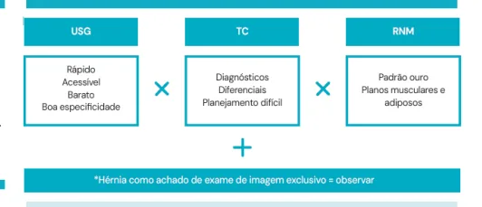

# Hérnia Inguinal

<!-- page:1 -->

## Hernia inguinal

## EPIDEMIOLOGIA

- 25% homens, 5% mulheres

- 96% inguinais, 4% femorais

- Inguinais: 9 homens para 1 mulher

- Femorais: 4 mulheres para 1 homem

- Direita > Esquerda; (processo embriológico e sigmoide)

- Direta Fraqueza de parede Medial aos vasos epigástricos Lateral ao dedo *Por baixo do canal inguinal Encarcera menos

## EPIDEMIOLOGIA E

- 25% homens, 5% mulheres;

- 96% inguinais, 4% femorais;

- Inguinais: 9 homens para 1 mulher;

- Femorais: 4 mulheres para 1 homem;

- Direita > Esquerda; (processo embriológico e sigmoide).

## CLASSIFICAÇÃO DE NYHUS

- Tipo 1: Hérnia inguinal indireta;

- Tipo 2: Hérnia inguinal indireta com anel inguinal interno dilatado;

- Tipo 3: Fraqueza na parede posterior. A: Direta; B: Indireta; C: Femoral.

- Tipo 4: Recorrência: A: Direta; B: Indireta; C: Femoral; D: Mista.

## ANATOMIA

- Direta

- Fraqueza de parede;

- Medial aos vasos;

- Epigástricos;

- Lateral ao dedo; C

- Por baixo do canal inguinal;

- Encarcera menos.

Indireta P

- +comum;

- Patência do conduto;

- Peritônio-vaginal (congênito);

- Fatores de risco → Hérnia;

- Pelo canal-inguinal;

- Lateral aos vasos epigástricos;

- Exame físico → Ponta do dedo. - Indireta + comum Patência do conduto peritôniovaginal (congênito) Fatores de risco → Hérnia Pelo canal inguinal Lateral aos vasos epigástricos Exame físico → Ponta do dedo

- Tratamento cirúrgico é o mesmo Hernioplastia inguinal

EXAMES Figura 1:: Fluxograma: Exames de imagem nas hérnias inguinais

## DIAGNÓSTICO

- Baseado principalmente no exame clínico: Dor em peso, incômodo na região, piora com esforço; Exame físico em pé e deitado, realizando a manobra de Valsalva; Avaliação de direta ou indireta através de palpação do anel inguinal externo;

- Exames laboratoriais são inespecíficos - auxiliam apenas em casos de complicações;

- Imagem: realizar na dúvida diagnóstica: Dificuldade de palpação, obesos, hidrocele, pubeíte, hérnia gigante.

## TRATAMENTO

Cirúrgico Eletivo → Hernioplastia

- Exceções: Complicações agudas; contraindicação ao procedimento.

Porque operar todo mundo?

- Risco de encarcerar sempre existe; cirurgia eletiva tem menor risco de complicar.

- Watchful waiting → aceito em homens assintomáticos com risco cirúrgico muito alto.

- Necessário discutir caso a caso.

---

<!-- page:2 -->

## COMPLICAÇÕES

Colocar tela?

- Sim, sempre na hernioplastia inguinal – exceção se

Encarceramento → cirurgia de urgência pus ou fezes no local da ferida, nesses casos pode

- Hérnia irredutível/permanente; se realizar um damage control e, em uma segunda

- Compressão das estruturas → Diminui retorno abordagem, colocar a tela.

venoso e linfático → Edema → Isquemia →

- E sempre usar fios absorvíveis de longa duração

Necrose (estrangulamento). (vicryl e PDS). Perda de domicílio / hérnia cronicamente habitada: Reduzir e Observar?

- Hérnias crônicas, habitualmente gigantes;

- Pode ser feito para encarceramento recente, onde

- Pacientes obesos, desnutridos; não há comprometimento sistêmico mas é conduta

- Nova cavidade: não está encarcerada, porém de exceção! não reduz.

- Nesses casos é prudente observar o paciente por a princípio, cirurgia de urgência → Inguinotomia conteúdo em sofrimento.

Estrangulamento ou encarceramento → um tempo diante da possibilidade de ter reduzido o ou videolaparoscopia

- Marcar a cirurgia o mais precoce possível.

- Realizar laparotomia apenas se sinais de

- Verificar Tabela 1 comprometimento visceral: peritonite, sepse, paciente muito grave.

Tabela 1:: Hérnia inguinal: urgências Quadro Clínico Encarceramento Estrangulamento Perda de Domicílio Tempo de sintomas Súbito > 6 horas? Crônico Sinais flogísticos Não Pode Lesões de pele Dor Sim Em piora Crônica Sinais sistêmicos Não Sim e em piora Não Obstrução intestinal Não Pode (omento?) Não Pode, ajuda, não muda Imagem? Planejamento conduta
