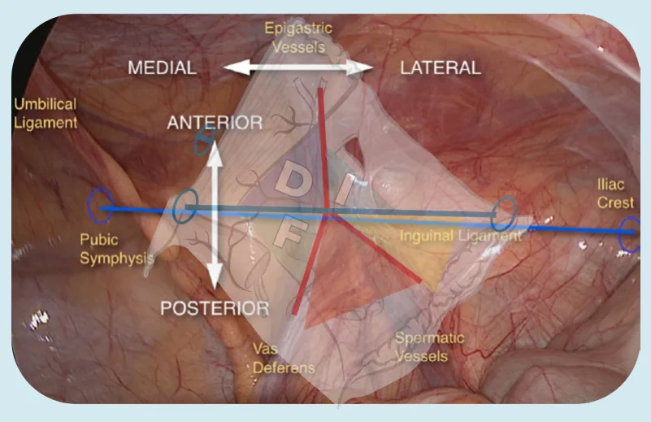
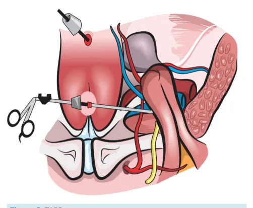
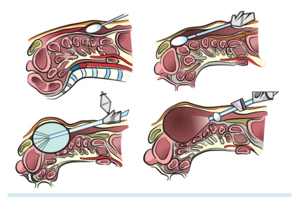

# Hernioplastia inguinal

<!-- page:1 -->

Hérnia Inguinal LICHTENSTEIN

- Técnica aberta, via anterior

- Rápida, fácil reprodução, resolutiva

- Baixo índice de complicações e recidiva

- Passível de realização com raquianestesia e anestesia local

## QUAL É A MELHOR CIRURGIA

PARA HÉRNIA INGUINAL?

- Cirurgia sem tensão;

- Reforço com prótese (colocação de tela).

## CIRURGIAS COM TECIDO

- Métodos possíveis: Shouldice – Bassini –McVay;

- Praticamente abandonada; altas taxas de recidiva;

- Problema = tensão.

## SHOULDICE

A melhor para ser utilizada em casos selecionados:

- Recidiva aceitável;

- Uso em cirurgias contaminadas/infectadas;

- Suturas por camadas; Arco do transverso (tendão conjunto) no trato iliopúbico; Oblíquo interno e aponeuroses no ligamento inguinal; Incisão relaxadora na aponeurose, se necessário. TAPP X TEP

- Videolaparoscopia!

- Colocação de tela pré-peritoneal.

- Menor dor pós operatória, recuperação mais rápida.

- Mais caro, menos disponível.

- Curva de aprendizado maior.

## 5 TRIÂNGULOS

- ‘Y’ Invertido

## BASSINI

- Era a mais utilizada antigamente; Tudo no ligamento inguinal.

## MCVAY

- Para hérnia femoral, ainda pode ser usada;

- Sutura no trato iliopúbico e depois no ligamento de Cooper;

- Requer incisão relaxadora (reto abdominal cobre o defeito);

## CIRURGIA COM PRÓTESE

- Lichtenstein – Stoppa – TAPP X TEP;

- Todas são boas.

LICHTENSTEIN:

- Técnica aberta, via anterior;

- Rápida, fácil reprodução, resolutiva;

- Baixo índice de complicações e recidiva;

- Passível de realização com raquianestesia e anestesia local;

---

<!-- page:2 -->

- Técnica descrita: RIVES: Uso de anestesia local;

- Unilateral; Incisão na pele de +- 6 cm;

- Pré-peritoneal; do tubérculo púbico → espinha

- Anterior;

ilíaca anterossuperior;

- Recidivadas. Dissecção por planos; Identificação da aponeurose do músculo oblíquo TAPP (TRANSABDOMINAL PRE-PERITONEAL) E externo e do anel inguinal externo; Abertura e liberação dos folhetos da aponeurose do TEP (TOTALLY EXTRAPERITONEAL):

músculo oblíquo externo;

- Videolaparoscopia; Isolar músculo cremaster e do funículo espermático

- Colocação de tela pré-peritoneal (com tela, ou ligamento redondo; sem tensão); Identificar e preservar os 3 nervos dentro de suas

- Menor dor pós-operatória, recuperação mais rápida;

fáscias (ilio-hipogástrico, ilioinguinal, ramo genital

- Mais caro e menos disponível;

do genitofemoral);

- Curva de aprendizado maior; Exploração do anel inguinal interno por meio da

- Tela: 10 cm caudal e 15 cm lateral (cobrir todo o orifício abertura do músculo cremaster; miopectíneo de Frouchard); Redução dos sacos herniários encontrados.

- Não precisa fixar a tela; Colocação de tela:

- TAPP (transabdominal pré-peritoneal): Fechamento por planos anatômicos; | Transabdominal; Curativo. | Precisa fechar o peritônio depois; Mais fácil que a TEP; mais utilizada.

Figura 2: TAPP Figura 1: Técnica de Lichtenstein TEP (TOTALLY EXTRAPERITONEAL):

- Total extraperitoneal;

Como fixar a tela na técnica de Lichtenstein?

- Mais difícil que a TAPP;

- Fixada ultrapassando o tubérculo púbico (aprox. 2 cm);

- Dizem que tem ainda mais benefícios.

- Fixada no ligamento inguinal (pontos contínuos);

- Fixada na parte superior e medial (4 cm, pontos separados);

- Manter um discreto abaulamento da tela;

- Criar um novo anel inguinal interno com auxílio da tela.

- Tamanho da tela (12 x 6 cm).

## STOPPA

- Mais difícil, reservada para hérnias inguinais bilaterais e/ou recidivas grandes;

- Tela pré-peritoneal bilateral;

- Acesso posterior (aberto).

Figura 3: TEP

---

<!-- page:3 -->

Anatomia posterior: conceito do Y invertido B. Hérnia inguinal bilateral? → Tanto faz; e dos 5 triângulos. C. Complicações? → Tanto faz;

D. Inguinoescrotal? → Tanto faz. OBS1: Pacientes com hérnias bilaterais ou hérnias em Figura 4: Y invertido e 05 triângulos

- 5 triângulos: Anterior e medial: por onde ocorrem as hérnias inguinais diretas; Anterior e lateral: por onde ocorrem as hérnias inguinais indiretas; Medial e posterior: por onde ocorrem as hérnias femorais; Meio e posterior: triângulo de Doom (da morte), onde correm os vasos ilíacos; Lateral e posterior: triângulo da dor, onde correm os nervos.

## TELA

## OBJETIVOS

- Reduzir recidiva;

- Não aumentar complicações;

- Barreira física e mecânica;

- Efeito biológico → inflamação e deposição de colágeno

- Fechamento sem tensão.

## CARACTERÍSTICAS IDEAIS

- Poros grandes, 75 µm → permitem a infiltração de células;

- Força tênsil de até 16 N/cm2;

- Telas planas → aderem bem ao tecido;

- Telas monofilamentares;

- Sintética → mais barata, disponível, com menores taxas de recorrência; Polipropileno - PP; poliéster - PET;

polivinilideno - PVDF.

- De baixo peso molecular, gramatura entre 30-140 g/ m2 → causa menos dor e sensação de peso.

## ESCOLHA DA TÉCNICA CIRÚRGICA

Quando operar por videolaparoscopia ou por técnica convencional? A. Recidiva? Sim? → Usar técnica diferente da primeira cirurgia;

| Lichtenstein → TAPP, TEP, robótica, Stoppa… | Videolaparoscópica → usar Lichtenstein. Não? → tanto faz! Depende do cirurgião, paciente, local, equipamento. OBS1: Pacientes com hérnias bilaterais ou hérnias em mulheres → ligeira preferência por videolaparoscopia OBS2: Hérnias gigantes, abdome agudo obstrutivo, sepse → Discutir laparotomia OBS3: Atualmente, se não houver contraindicações, VLP é melhor!

## TABELA RESUMO

Qual é a Lichtenstein TAPP/TEP melhor?? Posterior, Via de acesso Anterior, aberta videolaparoscópica Geral, Anestesia raquianestesia, Geral local Nível de dificuldade e + +++ aprendizado Complicações e < 1% < 1% recidiva Especificidade de material + ++++ o e equipe Resultados finais Iguais ;

## PÓS-OPERATÓRIO

s

- Retorno às atividades conforme a dor do paciente;

- Exercícios pesados devem ser evitados por cerca de 60 dias;

- Infiltração anestésica da ferida é recomendada;

- Drenos não são recomendados rotineiramente;

- Não é recomendada retirada rotineira de tela quando dá infecção do sítio cirúrgico;

- Colocação de tela não causa infertilidade Fatores de risco: jovens, história de dor no pré operatório, complicações no pós-operatório, cirurgia aberta, exercícios pesados antes de Tratamento: identificação rotineira dos três principais nervos, evitar excesso de suturas, neurectomia profilática não é recomendada.

DOR CRÔNICA (3 MESES): 60 dias;

---

<!-- page:4 -->

ORQUITE ISQUÊMICA: REFERÊNCIAS | Trombose do plexo pampiniforme | Congestão testicular + edema e dor Figura 1: Orifício miopectíneo de Frouchard.

| 2 a 5 dias de PO - até 12 semanas Fonte: Furtado M, Claus CMP, Cavazzola LT, Malcher F, Bakonyi-Neto A, | Pode evoluir para atrofia testicular Saad-Hossne R. Sistematização do reparo da hérnia inguinal laparoscópica | Pode evoluir para atrofia testicular S ( | Evitar dissecções do funículo espermático t | Tratamento clínico sintomático 6 Saad-Hossne R. Sistematização do reparo da hérnia inguinal laparoscópica (TAPP) baseada em um novo conceito anatômico: Y invertido e cinco triângulos. ABCD Arq Bras Cir Dig. 2019;32(1):e1426. DOI: /10.1590/0102672020180001e1426
