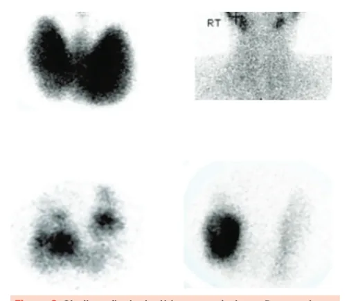

# Hipertireoidismo

<!-- page:1 -->

Hipertireoidismo e Tireotoxicose (CM) Bócio Doença de Nodular Hashitoxic Graves Tóxico Brando e HiperT Franco Brando transitóri Bócio Difuso ± Bócio Evolui co Clínica Oftalmopatia Nodular HipoT ± Dermatopatia TSH supresso TSH ↓ TSH ↓ Labs T4/T3 <1 T4/T3 <1 T4/T3 > TRAb + TRAb - TRAb USG ricamente USG nódulos USG pouc vascularizada Cintilo vasculariza Imagem Cintilo captante Cintilo pou difusamente na área captante hipercaptante dos nódulos Tionamidas Tionamidas e betaRIT Tto bloqueador Beta-blo (preferência)

RIT (preferência) Cirurgia Cirurgia CRISE TIREOTÓXICA

- Paciente já é hipertireoideo (Graves principal causa) e passa por fator de estresse

## Quadro clínico

| Febre, sudorese excessiva, desidratação, arritmias, ICC, disfunção SNC

- Tratamento: betabloqueador IV (se taquicardia sem IC franca), PTU/metimazol, iodeto de potássio/ lugol, corticoesteroides

- Hipertireoidismo: estado de tireotoxicose em que a origem do excesso de hormônio tireoidiano é a própria glândula tireoide.

- Sinais de aceleração do metabolismo Perda de peso; Redução dos níveis de colesterol; Osteoporose; Aumento da frequência cardíaca e palpitações; Taquiarritmias, fibrilação atrial (FA); Pressão divergente; Aumento de PAS e redução da PAD Tireoidite cose Tireotropinoma Factícea (T3) e Franco e io transitório eutireoidismo ± Exame físico om hipoT posterior da tireoide sem alterações importantes dolorosa

Subaguda Brando Franco Evolui com Exame físico ± sem alterações Tireoide importantes TSH ↓ TSH ↓ TSH normal/↑ T4 ↑ e T3 ↓ >1 T4/T3 >1 T4/T3 <1 TG suprimida

- TRAb - TRAb TRAb USG co USG pouco vascularização vascularização ada vascularizada diminuída aumentada uco Cintilo pouco Cintilo e captante captação aumentada diminuída

USG Cintilo captação Tionamidas Beta- e beta- Betaoq bloqueador bloqueador bloqueador Corticoide Cirurgia Suspensão T3 (preferência)

## TIREOTOXICOSE INDUZIDA POR AMIODARONA )

- Há dois fenótipos clínicos Tipo 1: hipertireoidismo-like Tionamidas Tireoidectomia total Tipo 2: tireoidite-like Prednisona Betabloqueadores Insuficiência cardíaca congestiva (ICC) de alto débito; Aumento de eventos tromboembólicos; Sudorese, intolerância ao calor; Tremores de extremidades; Fraqueza muscular proximal, hiperreflexia; Dermopatia infiltrativa; Ansiedade, agitação, irritabilidade, labilidade emocional; Hiperdefecação; Hipermenorragia ou irregularidade menstrual.

- Em idosos, quadro é atípico, não têm sinais de hiperativação adrenérgica Observa-se astenia, fraqueza, prostração, depressão grave, FA e/ou ICC refratárias ao tratamento usual.

---

<!-- page:2 -->

## ETIOLOGIAS

| Sinal de Lid Lag | Movimento retardado da pálpebra superior

- Primária ao olhar para baixo, em comparação com o Autoimune: Doença de Graves (80% das causas movimento do globo ocular.

de hipertireoidismo)

- Típicos de hipertireoidismo) Bócio Nodular Tóxico Uninodular/Doença de Plummer (um único nódulo) Multinodular (2 ou mais nódulos produtores); Hashitoxicose Tireoidite de Hashimoto (inflamação e consequente destruição de folículos e coloides, então ocorre a liberação na corrente sanguínea de hormônios pré-formados) Isso irá ocorrer apenas na fase inicial da doença; Tireoidites subagudas Inflamação e consequente destruição de folículos e coloides de uma região da tireoide, com liberação na corrente sanguínea de hormônios pré-formados Hipertireoidismo costuma ser transitório evoluindo para eutireoidismo e depois para hipotireoidismo OU manutenção do eutireoidismo;

- Secundária/Terciária (Central) Tireotropinomas: Tumores hipofisários produtores de TSH;

- Produção ectópica Struma ovarii: Tumor ovariano que sintetiza T4;

- Factícia Ingestão exógena de hormônios P.E: medicamentos para perda ponderal

## DOENÇA DE GRAVES

- Principal causa de hipertireoidismo (80% dos casos) Doença autoimune (TRAb - Anticorpo antireceptor de TSH) Esse anticorpo atua na glândula (onde o TSH atuaria) e acelera as funções do TSH de síntese e secreção de hormônios Inclusive, aumenta a conversão de T4 em T3)

Quadro clínico

- Hipertireoidismo + bócio

- Em idosos, o bócio pode ser discreto

- Podendo haver frêmito e sopro na topografia da tireoide;

Oftalmopatia de Graves

- O TRAb se liga aos receptores dos fibroblastos D presentes na região posterior dos olhos, provocando inflamação local, resultando em proptose e hiperemia ocular.

- Presente em 50% dos casos de Doença de Graves.

- Em relação ao hipertireoidismo em si, pode: Precedê-lo em 20% dos casos Surgir concomitantemente em 40% dos casos Sucedê-lo em 40% dos casos

- A oftalmopatia pode ser transitória ou permanente

- Hiperatividade adrenérgica Retração palpebral; Olhar fixo; - Típicos Edema periorbital; Exoftalmia.

- Lesão de musculatura extrínseca – devido à inflamação retro-ocular importante Diplopia; Oftalmoplegia; Ptose palpebral;

- Casos graves Disfunção do nervo óptico; Defeitos nos campos visuais.

- A gravidade do acometimento é feito através do Cada uma das variáveis presentes pontua 1 Se CAS ≥ 3, configura doença ativa, sendo contraindicação à radioiodoterapia

Escore CAS (Clinical Activity Score)

- Verificar Tabela 1 sintomas movimentação dos olhos conjuntival

Tabela 1: Estratificação da oftalmopatia de Graves - Escore CAS Sinais e Escores 1 Dor retrobulbar espontânea. 2 Dor à Dor 3 Hiperemia palpebral. 4 Injeção Hiperemia 5 Edema palpebral. 6 Quemose. 7 Edema Edema de carúncula

- Tratamento Corticoterapia; Radioterapia ocular; Imunoterapia; Cirurgia.

Dermatopatia de Graves

- O TRAb reage com os fibroblastos presentes no subcutâneo da pele, principalmente em região pré-tibial;

- 5-10% dos casos;

- Costuma estar associado à oftalmopatia e níveis elevados de TRAb;

- Espessamento da pele (área pré-tibial) devido ao acúmulo de glicosaminoglicanos;

- Também pode ocorrer edema periférico (pé), devido ao prejuízo ao retorno venoso.

- Verificar Figura 1 na próxima página

---

<!-- page:3 -->

- Indicações para solicitar o TRAb Gestantes Com antecedente de DG (risco de tireotoxicose fetal) Diferenciação do hipertireoidismo fisiológico do

Figura 1: Edema periférico e espessamento da pele na área prétibial BÓCIO UNI OU MULTINODULAR

- Quadro clínico mais brando e arrastado Diferente do Graves, a produção hormonal é reduzida (apenas no local do(s) nódulo(s))

- Uninodular (Doença de Plummer) Em torno dos 40 anos Hipertireoidismo quando bócio ≥ 3cm Indolente

- Multinodular Acomete pessoas de idade mais avançada Hipertiroidismo: produção folicular maior que da glândula Indolente

(60 anos)

## EXAMES COMPLEMENTARES

## DICAS DIAGNÓSTICAS

- Relação T3/T4 > 20 Hipertireoidismo por produção aumentada de hormônios tireoidianos;

- Relação T3/T4 < 20 Tireoidites com liberação de hormônios pré-formados

- Tireoglobulina diminuída: tireotoxicose factícia.

Tabela 2: Relação TSH e T4L nas diversas afecções de tireoide TSH T4 livre Doença de Graves ↓ ↑ Bócio Nodular Tóxico ↓ ↑ Hipertireoidismo subclínico ↓ Normal Tireotropinoma ↑ ↑ Tireoidites subagudas ↓ ↑ Tireotoxicose factícea ↓ ↓ Struma ovarii ↓ ↑

## DOSAGEM DO TRAB

- Presente em 95% casos de doença de Graves (DG);

- Hipertireoidismo clínico + Bócio + oftalmopatia: Não há necessidade de pedir TRAb para confirmar;

Doença de Graves

- O TRAb é importante para monitorização da doença | Diferenciação do hipertireoidismo fisiológico do Pacientes eutireoideos com suspeita de oftalmopatia de Graves;

1º trimestre

- Anti-TPO (anti-tireoperoxidase) e Anti-TG população normal. Comumente associado à Tireoidite de Hashimoto Mas podem estar aumentados na Doença de Graves;

(anti tireoglobulina) podem estar presentes na

## EXAMES DE IMAGEM

- USG de tireoide Ecotextura heterogênea – infiltração crônica, comum em tireoidites; Aumento de vascularização – hiperfunção da glândula, comum na DG.

- Cintilografia da tireoide O iodo é precursor na formação de hormônios tireoidianos, assim, locais onde tem maior produção de T3 e T4, tem maior captação desse elemento. Administra-se iodo radioativo e, onde houver maior produção de hormônios tireoidianos, a imagem ficará mais captante (preta). Esse exame é útil para diferenciar as causas de hipertireoidismo. Doença de Graves – captação de iodo de forma bem exacerbada e difusa Tireoidites – supressão (diminuição) da captação de iodo Mecanismo por destruição de folículos préformados e não por hiperprodução; Bócio Uni e Multinodular Tóxico Áreas nodulares específicas na tireoide que estão captando.

Figura 2: Cintilografia da tireóide compatível com Doença de Graves (superior esquerda), tireoidites (superior direita), bócio multinodular (inferior esquerda), bócio uninodular (inferior direita).

---

<!-- page:4 -->

## TRATAMENTO

| Bócios muito volumosos | Oftalmopatia grave; TIONAMIDAS

- Evolução natural após RIT

- Drogas antitireoidianas, reduzem síntese de | 30-50% dos casos culminam no hormônio tireoidiano hipotireoidismo permanente

- Úteis quando a causa do hipertireoidismo é devido a | 4-8 semanas: eutireoidismo uma produção excessiva de hormônio tireoidiano | 2-6 meses: hipotireoidismo

- Metimazol (MMI): é a droga de escolha; | < 6 meses: avaliar transitoriedade Efeito imunomodulador sobre o TRAb | > 1 ano: definitivo Induz remissão em 30-50% dos casos de DG. Tireoidectomia

- Propiltiouracil (PTU): segunda linha de tratamento

- É a remoção da glândula Causa mais efeitos colaterais e não tem

- Indicações efeito imunomodulador; | Hipertireoidismo + câncer de tireoide ou suspeita; É a escolha para uso até 16 semanas de gestação | Casos refratários a droga e RIT ou contraindicações ou nos casos de intolerância/alergia ao metimazol. | Bócio volumoso + sintomas compressivos;

- Efeitos colaterais | Nem sempre é realizada a cirurgia, pelo risco São dose-dependentes; de hipoparatireoidismo devido à vascularização Graves: como hepatotoxicidade e agranulocitose; aumentada da glândula e lesão de nervo Leves: como rash cutâneo e urticária. laríngeo recorrente.

## SEGUIMENTO CRISE TIREOTÓXICA

- Quando se inicia uma tionamida é necessário aguardar

4-6 semanas de tratamento para avaliar a eficácia;

- Emergência médica de alta mortalidade; Através do T4L e T3 total.

- Principal causa é Doença de Graves (DG);

- Tempo de tratamento

- Incidência 0,2 casos/100.000 pacientes/ano; Doença de Graves: 12-18 meses;

- Mortalidade 16-30%. Avaliar tratamento definitivo quando não há remissão com metimazol. FATORES PRECIPITANTES Bócio Nodular Tóxico: indeterminado;

- Paciente já é hipertireoideo e passa por fator de Pode-se manter tionamidas por toda a vida ou estresse ao organismo;

avaliar tratamento definitivo.

- Infecção (principal)

- Cirurgias

## TRATAMENTO ADJUVANTE

- Oferta excessiva de iodo

## (BETABLOQUEADORES)

- Radioiodoterapia

- Propranolol 40-120 mg/dia, 2-3x/dia (melhor opção)

- Interrupção abrupta de anti-tireoidianos exógenos

- Atenolol 50-100 mg/dia.

- Uso de amiodarona

- Drogas com rápido efeito para alívio de

- Condições clínicas de base sintomas adrenérgicos | Cetoacidose diabética

- Indicações: | Insuficiência cardíaca Sintomas adrenérgicos | Edema pulmonar Idosos sintomáticos; | AVC FC de repouso > 90 bpm ou doença | Isquemia mesentérica cardiovascular coexistente | Transtorno bipolar e psicóticos

- Contraindicações: asma, DPOC, bloqueio cardíaco;

- Toxemia gravídica

- Quando suspender: início do efeito das tionamidas.

- Parto

- Alternativas: Diltiazem ou verapamil

- Trauma

## TRATAMENTO DEFINITIVO QUADRO CLÍNICO

Radioiodoterapia (RIT)

- Febre e sudorese excessiva

- 1ª escolha nos casos de:

- Desidratação e IRA pré-renal Bócio nodular tóxico

- Arritmias Idosos, comorbidades cardiovasculares e pacientes | Taquicardia sinusal, taquicardia supraventricular muito sintomáticos (TSV) e fibrilação atrial (FA) Recidiva de DG após tionamidas

- Insuficiência cardíaca congestiva (ICC)

- Resolução em 80-90% dos casos;

- Disfunção do SNC

- Contraindicações | Agitação, delirium, labilidade emocional, confusão, Gestantes psicose e coma Lactantes

- Sinais e sintomas do TGI Mulheres que desejam engravidar em 1 ano | Náuseas, vômitos, diarreia, obstrução intestinal Lesão hepática e icterícia

---

<!-- page:5 -->

## DIAGNÓSTICO TRATAMENTO

Critérios de Burch-Wartofsky

- Verificar Tabela 3

- Disfunção termorregulatória (37,2-40ºC)

## TIREOTOXICOSE INDUZIDA POR

| 5-30 pontos;

- Efeitos no SNC – agitação, delírio, psicose, letargia, AMIODARONA convulsões e coma 0-30 pontos; AMIODARONA

- Disfunção TGI e hepática – diarreia, náuseas, vômitos,

- É uma medicação que contém átomos de iodo; 0-20 pontos; função tireoidiana

dor abdominal e icterícia | Excesso de iodo pode levar ao aumento da

- Taquicardia – 99bpm a > 140bpm | Ação tóxica da droga pode levar a dano ao 5-25 pontos; tecido glandular;

- Insuficiência cardíaca – leve, moderada e grave

- A droga sofre depósito no organismo, tendo meia- 0-15 pontos;

(edema agudo pulmonar) vida longa (40-100 dias);

- Sempre monitorar função tireoidiana

- Fibrilação atrial | Tempo 0, 1, 3 e 6 meses do início do tratamento; 10 pontos; | A cada 3-6 meses durante seguimento;

- Fator precipitante

- Há dois fenótipos clínicos 10 pontos; | Tipo 1: hipertireoidismo-like

- Interpretação: | Tipo 2: tireoidite-like ≥ 45 pontos: crise tireotóxica;

- Verificar Tabela 4 25-40 pontos: crise iminente; <25 pontos: pouco provável.

Tabela 3: Tratamento de crise tireotóxica

## INTERVENÇÃO OBJETIVO EFEITO

Beta-bloqueador EV Bloquear conversar Reduzir FC, tremores e melhorar Se taquicardia sem IC franca periférica enchimento cardíaco PTU/Metimazol Inibição da síntese e conversão Parar produção Controle na produção hormonal periférica (PTU)

Iodeto de potássio/Lugol Controle hormonal Inibir liberação hormonal Inibe secreção 2h após PTU/MMI Lítio se alérgicos Corticosteroides Bloquear conversão Hidrocortisona Inibe conversão periférica IA relativa Dexametasona Tabela 4: Tireotoxicose induzida por amiodarona

## TIPO 1 TIPO 2

(hipertireoidismo-like) (tireoidite-like) Ação tóxica da medicação Excesso de oferta de iodo Aumento da FISIOPATOLOGIA Tireoidite produção de HT Hipertireoidismo → hipotireoidismo USG de tireoide: ↑ vascularização USG de tireoide: ↓ vascularização EXAMES Cintilografia da tireoide: ↓ captação Cintilografia da tireoide: ↓ captação Tionamidas Prednisona TRATAMENTO Tireoidectomia total Betabloqueadores

## REFERÊNCIAS

Figura 1: Edema periférico e espessamento da pela na área pré-tibial. Vilar, Lucio [et al] . Endocrinologia Clínica. 6ª edição. Rio de Janeiro:

Guanabara Koogan, 2016. Figura 2: Cintilografia de tireóide. Arquivo Pessoal.
