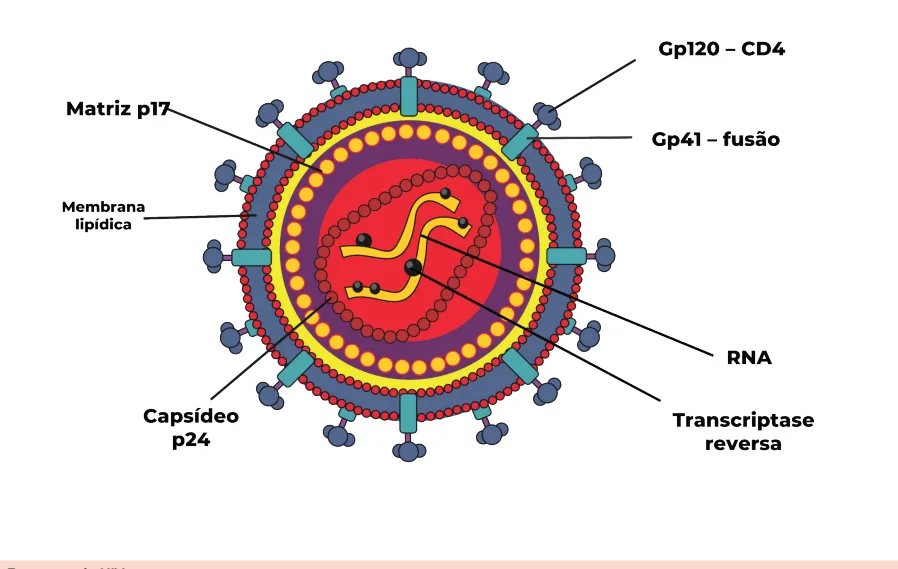
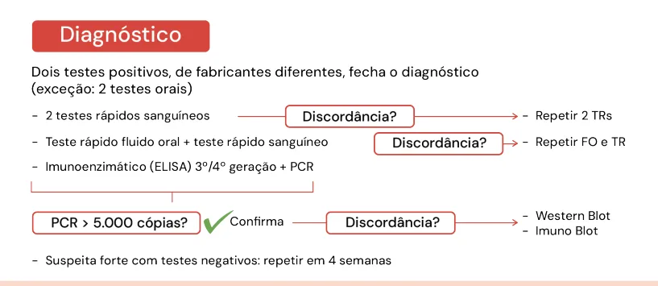
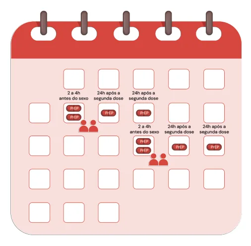

# HIV Diagnóstico e Tratamento

<!-- page:1 -->

## Contágio e Diagnóstico — Visão Geral

- **Contágio**: sexual, acidentes com perfurocortantes, transmissão vertical (incluindo amamentação).
- **Curso clínico**: contágio → eclipse viral (nenhum teste positivo) → síndrome retroviral aguda (2 semanas de infecção, quadro mononucleose-like — somente PCR positivo) → latência clínica (sorologias positivam) → AIDS.
- **Diagnóstico**: 2 testes positivos, de fabricantes diferentes (exceção: 2 testes orais não fecham diagnóstico); 2 testes rápidos sanguíneos (se discordância, repetir ambos os TRs); teste rápido oral + teste rápido sanguíneo (se discordância, repetir ambos os TRs); ELISA 3ª geração (positiva em 30 dias) ou 4ª geração (positiva em 20 dias) + PCR > 5.000 cópias (se discordância: Western blot ou Imunoblot).
- **Vacinação**: HPV (9-45 anos), hepatite A, hepatite B 2x, meningo C, Pneumo 13 e Pneumo 23. Vacinas vivas (SCR, varicela, dengue e febre amarela): CD4 > 350 = ok; **CD4 < 200 = não administrar**.

### Tratamento

- **TARV padrão**: dolutegravir + lamivudina + tenofovir. Iniciar ao diagnóstico, em até 7 dias.
- **Falha virológica**: CV > 200, repetida e confirmada.
- **Terapia dupla** (lamivudina + dolutegravir, sem tenofovir): indicada quando não há falha prévia, carga viral indetectável há > 12 meses, com última CV < 6 meses de intervalo; não pode ter tuberculose, não pode ser gestante, não pode ter hepatite B; Clcr > 30.
- **Blip viral**: escape de CV, em geral < 200, transitório, sem correlação com infectividade.

### PrEP e PEP

- **PrEP**: TDF + entricitabina; indicada para > 15 anos / > 35 kg, Clcr > 60; não ter tuberculose, não ser gestante, não ter hepatite B; reavaliação a cada 4-6 meses; rastreio de sífilis e hepatites, clamídia e gonococo anuais.
- **PEP**: TARV por 28 dias — teste rápido antes e iniciar em até 72h.

### Efeitos Colaterais de Antirretrovirais

- **Tenofovir**: alteração do metabolismo ósseo, fosfatúria (por si só já aumenta o clearance de creatinina).
- **Zidovudina**: anemia megaloblástica e lipodistrofia.
- **Abacavir**: reação de hipersensibilidade — realizar teste **HLA-B5701** antes de prescrever.

> ⚠️ Dados de tabela ambíguos no OCR original — o gráfico "Queda viral prevista após início da TARV" (eixo de cópias virais de 1.000.000 a 0, eixo de tempo de 3 a 33 meses, com curvas de "blip viral", "baixa viremia persistente", "viremia muito baixa" e "viremia residual") não pôde ser reconstruído como tabela ou gráfico — conteúdo é apenas ilustrativo da queda de carga viral ao longo do tempo após início do tratamento, sem valores numéricos confiáveis extraíveis do texto.

---

<!-- page:2 -->

## Conceitos Iniciais

### Estrutura do HIV

*Figura 1: Estrutura do HIV*

*Figura 2: História natural da doença — marcadores no plasma (RNA viral, antígeno p24, IgM, IgG total) ao longo das semanas de infecção, atravessando as fases de eclipse viral, síndrome retroviral aguda (SRA) e latência clínica (queda de aproximadamente 50 células de CD4/ano). Eixos e curvas exatas do gráfico original não puderam ser reconstruídos com segurança pelo OCR.*

### Contágio

- **Contato sexual**: todas as modalidades, inclusive sexo oral.
- **Transfusão de hemocomponentes**: hemácias, plaquetas e leucócitos.
- **Transmissão vertical**: gestação (23-30%), parto (65%), amamentação (12-27%). A amamentação é **contraindicada, mesmo se carga viral negativa**.
- **Transmissão percutânea**: acidente com materiais biológicos.

## Clínica e Diagnóstico

### História Natural da Doença

*Ver Figura 2.*

### Síndrome Retroviral Aguda (SRA)

- É a manifestação aguda, com média de 2 semanas de duração, presente em apenas 50% das pessoas infectadas pelo HIV.
- Até esse momento ainda não houve reconhecimento do vírus pelo sistema imune — sorologias negativas.

---

<!-- page:3 -->

## Tratamento e Seguimento

- Sorologia negativa nesta fase = diagnóstico é feito por **PCR**.
- **Clínica de síndrome mono-like**: febre; fadiga; adenomegalia generalizada; rash cutâneo maculopapular (exantema); anorexia/perda ponderal > 10% inexplicável; faringite; cefaleia; depressão maior; úlceras orais e genitais; plaquetopenia isolada.
- **Latência clínica**: queda anual de cerca de **50 células de CD4/ano**.

### Diagnóstico na Latência Clínica / Imunossupressão Avançada

Passada a fase de síndrome retroviral aguda, o diagnóstico sorológico é possível, a partir de 3-4 semanas do contágio (latência clínica).

- **Testes sorológicos**: teste rápido (sangue ou fluido oral) — demora 1-3 meses para positivar. Imunoensaios ELISA de 4ª geração (anticorpos + p24) demoram 20 dias para positivar; a 3ª geração demora 24-28 dias, pois não identifica o p24.
- **Testes confirmatórios**: Western blot/imunoblot — demoram 30 dias para positivar; demonstram as bandas de positivação de acordo com o antígeno. Se houver dúvida sobre o diagnóstico de HIV, indica-se repetir um teste confirmatório 4 semanas após.
- **Confirmação do diagnóstico**: quaisquer dois testes positivos, de fabricantes diferentes, fecham o diagnóstico (exceto se forem 2 testes orais): 2 testes rápidos sanguíneos; teste rápido de fluido oral + teste rápido sanguíneo; imunoenzimáticos de 3ª/4ª geração + PCR.
- O PCR confirma quando **> 5.000 cópias**. Caso CV < 5.000 cópias, repetir com 2-4 semanas ou fazer teste confirmatório.

*Figura 3: Resumo diagnóstico HIV*

### Alvo Molecular: Terapia Combinada

*Figura 4: Fluxograma de alvo molecular*

- **Nucleosídeos (análogos)**: tenofovir (TDF), lamivudina (3TC), abacavir (ABC), zidovudina (AZT).
- **Não nucleosídeos (não análogos)**: nevirapina (NVP), efavirenz (EFZ), etravirina (ETR).
- **Inibidores da protease**: darunavir, atazanavir, lopinavir (associados a booster de ritonavir).
- **Inibidores da integrase**: raltegravir, dolutegravir, cabotegravir.

---

<!-- page:4 -->

## Esquemas e Indicações

- Indicações de início/priorização de esquema incluem: coinfecção com TB no momento do diagnóstico; paciente que se infectou de parceiro em uso de TARV (casais sorodiscordantes); pessoas em uso de PrEP.

**TARV padrão**: tenofovir + dolutegravir + lamivudina.

- **Grávidas**: esquema mantido.
- **Coinfectados com TB**: dobrar a dose de dolutegravir.

### Efeitos Colaterais

**Análogos de nucleosídeos:**

- **Tenofovir**: altera o clearance de creatinina sem perda de função renal; a alteração renal é avaliada com fosfatúria, pois causa uma síndrome Fanconi-like (hipofosfatemia com fosfatúria); desmineralização óssea (por isso, realizar densitometria óssea a cada 5 anos, em geral). O TAF (tenofovir alafenamida) tem melhor perfil de efeitos colaterais.
- **Lamivudina**: excreção renal (cuidado em paciente com doença renal crônica).
- **Abacavir**: risco de hipersensibilidade — indica-se realizar o teste **HLA-B5701** para verificar se o paciente irá desenvolver hipersensibilidade.
- **Zidovudina**: anemia megaloblástica, lipodistrofia, esteatose hepática.

**Não análogos de nucleosídeos:**

- **Efavirenz**: efeitos neuropsiquiátricos; meia-vida longa de 13 dias (relacionada à alta taxa de resistência primária ao efavirenz).

**Inibidores de protease:**

- **Atazanavir**: icterícia e aumento de bilirrubina; nefrolitíase.
- **Darunavir**: penetra melhor no SNC; alta barreira genética (muito utilizado no paciente que já teve falha prévia, pois mesmo que o vírus adquira resistência, não fica resistente ao darunavir).

**Inibidores de integrase:**

- **Dolutegravir**: em geral poucos efeitos colaterais — TGI e insônia.

### Genotipagem Pré-Tratamento

- Indicada em: crianças/adolescentes e gestantes.

### Terapia Dupla: Conceito Novo no Tratamento do HIV

- **Lamivudina (3TC) + dolutegravir (DTG)**, sem tenofovir — justamente porque o tenofovir tem muitos efeitos adversos.
- **Condições**: não pode ter hepatite B; não pode ter tuberculose; não pode ser gestante; não pode ter tido falha prévia; não pode ter DRC (Clcr > 30); carga viral indetectável há > 12 meses, com 2 CVs indetectáveis com intervalo de 6 meses.

> ⚠️ Atenção: esquema sujeito a constante atualização por nota técnica.

### Quando Iniciar

- Em até **7 dias** do diagnóstico, para todos — pode-se dar um tempo para o paciente entender que terá que fazer uso diário de medicação e lidar com seu autoestigma.
- **Imediatamente** para gestantes.
- **Personalizações em neuroinfecções**: neurocriptococose — 4-6 semanas se cultura de LCR negativa; neuro-TB — 4-6 semanas via de regra, 2 semanas se CD4 < 50 células.

### Exames Iniciais

**CD4:**

- Ao diagnóstico.
- Repetir conforme alvo: CD4 < 200 — a cada 3 meses; CD4 350-500 — anual; CD4 > 500 — não solicitar; CD4 < 350 — a cada 6 meses; se presença de infecção oportunista (IO) — a cada 3 meses.

**Labs gerais**: hemograma, função renal, perfil lipídico, T3/T4 livre, vitamina D, glicemia de jejum e screening de DSTs.

### Screening de ILTB

- IGRA/PPD se CD4 > 350.
- **CD4 < 350**: indicado tratamento de ILTB (rifapentina + isoniazida, 1x/semana, por 12 semanas) — uma vez tratada, só se retrata se o paciente for contactante domiciliar de paciente bacilífero ou já teve TB doença.
- **Pesquisa de TB subclínica** (atenção: é diferente de ILTB): **LF-LAM** — teste urinário à beira-leito que detecta antígenos da tuberculose antes mesmo de o paciente manifestar clínica. Indicado em: ambulatório com CD4 < 200; internação com CD4 < 100; paciente gravemente doente.

---

<!-- page:5 -->

### Pesquisa de Neurocriptococose Subclínica

- **LF-Crag** — teste sanguíneo à beira-leito que detecta antígenos antes mesmo de o paciente manifestar clínica. Indicado em: CD4 < 200; paciente gravemente doente.
- O princípio de realizar o LF-LAM e o LF-Crag em pacientes com CD4 baixo é detectar antígenos antes de iniciar a TARV, pois nesses casos há maior risco de síndrome de reconstituição imune (SIRI).

### Vacinação

- **Todos**: HPV (9-45 anos), influenza, Pneumo 23 e Pneumo 13, COVID, hepatite B (4 doses, dose dobrada), meningo C (ACWY), dT (3 doses) e hepatite A.
- **Vacinas vivas** (SCR, varicela e dengue conforme faixa etária, febre amarela): CD4 > 350 → liberadas; CD4 200-350 → conforme risco epidemiológico (no geral, não administrar); **CD4 < 200 → contraindicadas** (risco de falha vacinal).
- A vacina viva simula uma infecção; em caso de imunidade celular deprimida, a simulação da infecção pode não ser efetiva para gerar imunidade.

### Blip e Falha Virológica

*Ver Figura 5.*

- **Blip viral**: escape de CV positiva em paciente em uso de TARV, no geral até 200 cópias, mas com limite mais flexível. Repete-se a CV em 4 semanas; quando é apenas um blip, a positividade não se sustenta.
- **CV > 200 cópias, repetida e confirmada** após um período de supressão = **falha virológica**.
- Blip viral não se correlaciona com infectividade.
- Paciente soropositivo bem aderente ao tratamento, com carga viral indetectável há pelo menos 6 meses, não transmite HIV — ainda que apresente uma medida de CV positiva (em geral < 200, mas pode ser maior); caso isso não se confirme em exame subsequente, será considerado um escape/blip viral.

*Figura 5: Blip viral — CV > 200 cópias persistente após início da TARV*

> ⚠️ O gráfico "Queda viral prevista após início" (Figura 5, com eixo de cópias 1.000.000 a 0 e eixo de tempo 0 a 33 meses) apresenta o mesmo padrão de blip viral descrito no texto acima; os valores numéricos exatos do gráfico não puderam ser reconstruídos com segurança pelo OCR.

### PrEP e PEP

- **PrEP — Profilaxia Pré-Exposição**: tenofovir + entricitabina; indicada para > 15 anos, > 35 kg; duração indeterminada (enquanto o paciente estiver em comportamento de risco); não autorizado se Clcr < 60.
  - Pacientes em uso de PrEP têm indicação de vacina de HPV e hepatite A.
  - Em avaliação: cabotegravir injetável bimensal.
  - Dispensação até semestral; teste rápido ou sorologia com até 7 dias; pesquisa de sífilis e hepatite B a cada 4-6 meses; PCR de gonococo e clamídia anual; possibilidade de uso sob demanda ("PrEP sob demanda").
  - **Doxy-PEP** (foco: sífilis, clamídia e gonorreia) — possivelmente entrará nas diretrizes do Ministério da Saúde.

---

<!-- page:6 -->

- **PEP — Profilaxia Pós-Exposição**: TARV com tenofovir + lamivudina + dolutegravir; iniciar em até **72h** da exposição; duração de **28 dias**; testagem inicial e repetição em 1-2 meses após o término.

## Referências

- Figura 5: Blip viral — adaptado de Dahl, 2021 e Palmer, 2008.
- Figura 6: Esquema da PrEP oral sob demanda — adaptado de Dahl/SVSA/MS.

