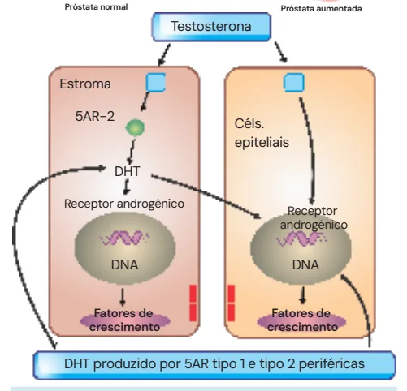
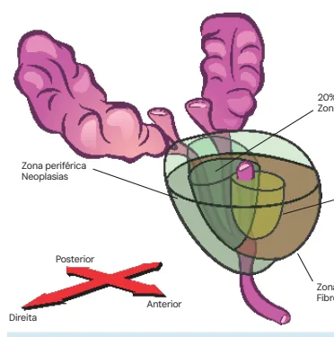
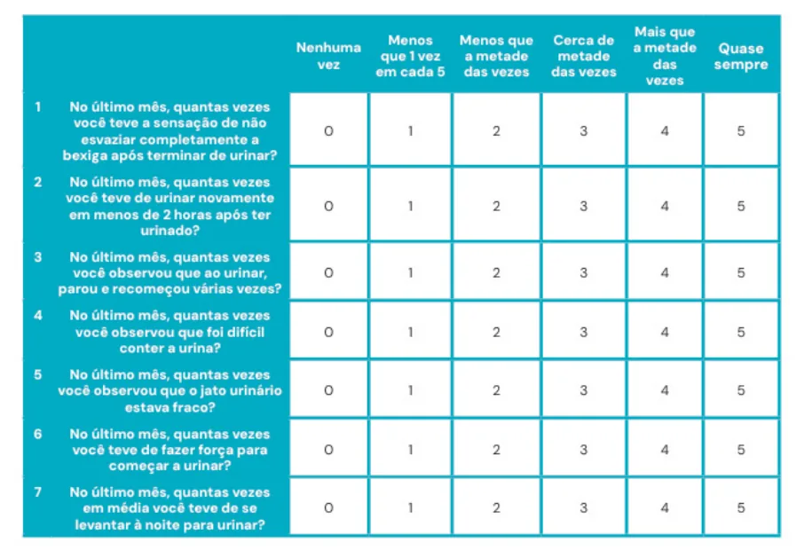
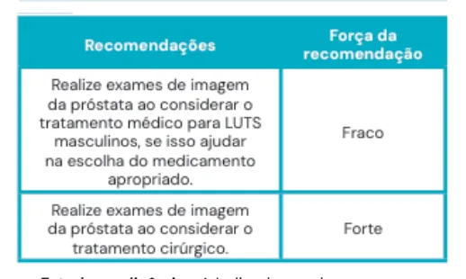
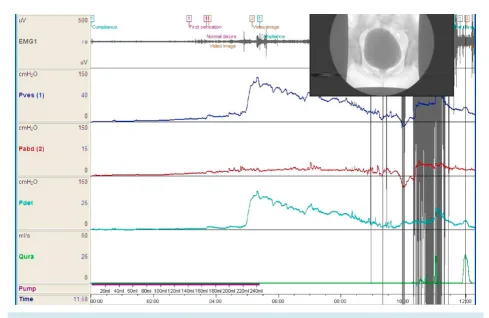
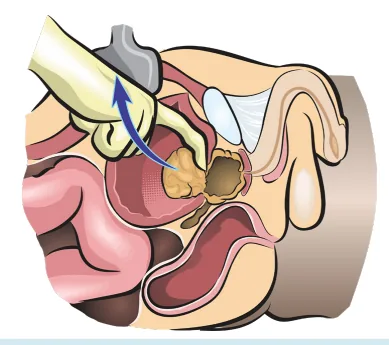

# HPB (Hiperplasia Prostática Benigna)

<!-- page:1 -->

## HPB (Hiperplasia Prostática Benigna)

**Tópicos**: Definição; Epidemiologia; Sintomas e sinais; Exames complementares; Diagnóstico; Diferenciais; Tratamento; Seguimento.

## Zona Prostática de McNeal

- **Zona central** (20% do parênquima de uma próstata normal);
- **Zona periférica** (grande volume do parênquima): muito associada a neoplasias;
- **Zona anterior** (ou fibromuscular);
- **Zona de transição** (10% do parênquima) → principal zona afetada pela HPB, que cresce com o estímulo da testosterona.

*Figura 1: Zona prostática de McNeal (zona central 20%; zona periférica – neoplasias; zona de transição 10% – HPB; zona anterior/fibromuscular).*

## Fisiopatologia

- Papel importante da testosterona em sua forma ativa (di-hidrotestosterona - DHT), que age nas células do estroma e epiteliais:
  - Nas células do estroma prostático, leva ao estímulo agonista da proliferação celular, levando ao crescimento prostático;
  - Na célula epitelial, a enzima 5-alfa-redutase age na conversão da testosterona para DHT, permitindo o estímulo de proliferação celular. Crescimento da zona de transição.
- **Principal fator é a idade**;
- Acomete: 50% dos homens com > 50 anos; 90% dos homens com > 80 anos;
- Não encontrada abaixo dos 30 anos → investigar outras etiologias diante de sintomas.

*Figura 2: Fisiopatologia — testosterona convertida por 5AR-2 nas células epiteliais em DHT (também produzido por 5AR tipo 1 e 2 periféricas), atuando no receptor androgênico/DNA e em fatores de crescimento do estroma, levando à proliferação celular e ao aumento da próstata (agonistas x antagonistas de fatores de crescimento, TGFβ).*

---

<!-- page:2 -->

## LUTS (Lower Urinary Tract Symptoms — Sintomas do Trato Urinário Inferior)

Pode ser dividido entre sintomas de:
- **Armazenamento** (refere-se à capacidade da bexiga de acomodar a urina): aumento da frequência; urgência; urgeincontinência; noctúria;
- **Esvaziamento** (relacionado ao jato urinário): hesitação; esforço; jato fraco; intermitência.

*Verificar Tabela 1.*

### Tabela 1: Escala IPSS (Índice de Sintomas Prostáticos)

> ⚠️ Tabela reconstruída a partir de OCR — confira contra a fonte original.

Escala de sintomas prostáticos (IPSS), com pontuação para sintomas de armazenamento e esvaziamento urinário.

### Mnemônico para os Critérios Avaliados no IPSS

- **F**requência;
- **U**rgência;
- **N**octúria;
- **W**eak (jato fraco);
- **I**ntermitência;
- **S**training (esforço);
- **E**svaziamento (hesitação).

## Exames Complementares

- **PSA** → possui relação direta com o tamanho da próstata, útil para estimar o volume prostático e afastar suspeita de neoplasia;
- **Urina I/urocultura** → afastar ITU;
- **Urofluxometria** → < 12 mL/segundo é considerado um fluxo reduzido para homens;
- **Exames de imagem**: USG → avalia todo o trato urinário, inclusive o volume da próstata e suas características, e outros componentes, como sinais de bexiga de esforço (espessada), dilatação das vias (traduz grau de gravidade). Avaliar resíduo pós-miccional (resíduo > 100-150 mL indica repercussão da obstrução infravesical).
- Recomendações para utilização da USG (guideline europeu). *Verificar Tabela 2*.
- **Estudo urodinâmico** → indicado em alguns casos: sintomas importantes de LUTS, mas urofluxometria com fluxo máximo normal (Qmáx > 15); início precoce ou tardio dos sintomas (< 50 ou > 80 anos);

---

<!-- page:3 -->

- Resíduo pós-miccional (RPM) grande (> 300 mL);
- Fator de risco para bexiga neurogênica (BN);
- Sintomas com próstatas pequenas (< 30 g);
- Dúvida diagnóstica.

*Figura 3: Estudo urodinâmico.*

## Diagnóstico

- Diagnóstico é **clínico**;
- Exame apenas com indicações claras;
- Seguimento com PSA → neoplasia.

## Diagnósticos Diferenciais

- Questionar se há hipocontratilidade vesical ou obstrução infravesical;
- Na dúvida, fazer o estudo urodinâmico (UDN): diante da constatação de obstrução infravesical, pode ser HPB ou estenose de uretra, que são diferenciados pela uretrocistografia (UCM).

## Tratamento

### Monoterapia Medicamentosa (Inicialmente)

- **Alfa-1 bloqueadores (1ª linha)**: diminui a resistência uretral; ação rápida (dias); diminui IPSS; aumenta o Qmáx (fluxo máximo). Exemplos: tansulosina e doxazosina;
  - **Efeitos colaterais** (pode causar falha terapêutica): ejaculação retrógrada; hipotensão postural (orientar tomar à noite).

### Terapia Combinada

- **Indicações**: sintomas moderados/severos de LUTS; próstata > 40 g; ausência de melhora em 1 mês de monoterapia;
- Associar alfa-1 bloqueadores ao inibidor de 5-alfa-redutase;
- **Inibidores da 5-alfa-redutase**: 2ª linha — monoterapia ou combinada; ação lenta (semanas); diminui IPSS e aumenta Qmáx. Exemplos: finasterida e dutasterida;
  - **Efeitos colaterais** (30% dos pacientes apresentam): perda de libido; disfunção erétil.

### Medicamentos Alternativos para Controle de Sintomatologia

- **Antimuscarínicos**: oxibutinina; útil diante de muitas queixas de armazenamento; diminui IPSS; não fazer se resíduo > 150 mL → maior risco de retenção; não melhoram Qmáx;
- **Inibidor de PDE-5**: tadalafila; relação com disfunção erétil; diminui IPSS; não pode ser usado junto com nitrato; não melhoram Qmáx.

## Tratamento Cirúrgico

- **Quando operar?**: refratariedade ao tratamento medicamentoso; RUA (retenção urinária aguda); cálculos vesicais; ITUs de repetição (estase urinária); IRA/hidronefrose;
- **Como operar?**: baseado no volume da próstata:
  - **< 30 g**: RTUp (ressecção transuretral da próstata); ITUp (incisão transuretral da próstata);
  - **30 – 80 g**: RTUp; HoLEP (Enucleação Endoscópica da Próstata com Laser Holmium); vaporização;
  - **> 80 g**: HoLEP; PTV (prostatectomia transvesical).

*Figura 4: RTU.*

*Figura 5: Prostatectomia transvesical.*

---

<!-- page:4 -->

## Casos Especiais

- **Alto risco cirúrgico**: pode utilizar a técnica de embolização da próstata para redução do volume da próstata e melhora dos sintomas;
- **Desejo reprodutivo**: lift uretral (preserva ejaculação);
- **Maior risco de sangramento**: preferir HoLEP ou vaporização.

## Seguimento

- IPSS;
- Fluxometria + PSA;
- Se piora sintomática, questionar estenose ou recidiva.

## Complicações

- Sangramento;
- Anejaculação;
- Incontinência;
- **Intoxicação hídrica**: RTU com energia monopolar utiliza líquido hiposmolar → absorção de líquido hiposmolar → hiponatremia → alterações neurológicas. Conduta: finalizar a RTU e manejar com solução hipertônica 3%;
- Se piora sintomática, questionar estenose ou recidiva.

## Referências

Figura 3: Estudo urodinâmico. EAU Guidelines. Edn. presented at the EAU Annual Congress Amsterdam, 2020. ISBN 978-94-92671-07-3.
