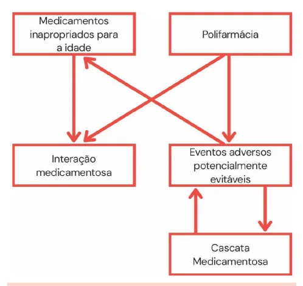
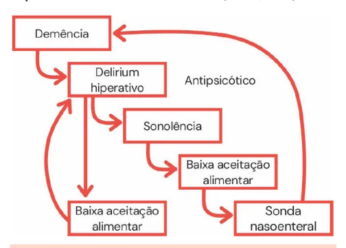

# Iatrogenia no Idoso

<!-- page:1 -->

Escalas Geriátricas, Avaliação Global, fragilidade e Iatrogenias (CM)

- Toda doença ou estado mórbido decorrente da intervenção do médico ou da equipe multidisciplinar, da qual resultem consequências prejudiciais à saúde do paciente. Diferente de “erro médico” ou infração

(imperícia, imprudência, negligência).

- Divide-se em: Ocorrência: úlceras de pressão, quedas, infecções nosocomiais Diagnóstica: colonoscopia, uso de contraste iodado Terapêutica: a mais frequente, especialmente medicamentosa

## IATROGENIA TERAPÊUTICA

- Polifarmácia Uso de 5 ou mais medicamentos OU Uso de pelo menos um medicamento potencialmente inapropriado (MPI) OU Mais medicamentos usados do que clinicamente indicados.

- Cascata Iatrogênica: “Situação em que o efeito adverso de um fármaco é interpretado incorretamente como nova condição médica que exige outra prescrição, sendo o paciente exposto ao risco de desenvolver efeitos prejudiciais adicionais relacionados ao tratamento potencialmente desnecessário”

## DEFINIÇÃO

- “Toda doença ou estado mórbido decorrente da intervenção do médico ou da equipe multidisciplinar, da qual resultem consequências prejudiciais à saúde do paciente” (Kikuchi, 2009)

- Iatros (médico) + genia (criação);

- Diferente de “erro médico” ou infração (imperícia, imprudência, negligência); No caso da iatrogenia, procedimento, medicação e internação estão bem indicados. Contudo, ainda assim, o paciente evolui com complicações.

## CLASSIFICAÇÃO

## OCORRÊNCIA

- Lesões por pressão

- Quedas;

- Infecções hospitalares.

## DIAGNÓSTICA

- Colonoscopia Desidratação; Hipotensão; Insuficiência renal. - Critérios de Beer Lista de MPI, seus potenciais efeitos colaterais e recomendações na população idosa. Destaque para Anticolinérgicos e anti-histamínicos Antiespasmódicos (escopolamina) Alfabloqueadores (doxazosina) e alfaagonistas centrais (clonidina) Antiarrítmicos (amiodarona e digoxina) Antidepressivos (tricíclicos), antipsicóticos, benzodiazepínicos, drogas Z (zolpidem) Insulina em escala móvel e sulfonilureias Metoclopramida e inibidor de bomba de prótons (IBP) Anti-inflamatórios não esteroidais (AINEs)

## PREVENÇÃO

- Avaliar interação medicamentosa

- Diagnóstico correto

- Indicação adequada da medicação

- Avaliação do estado nutricional;

- Avaliação da função hepática e renal;

- Medidas não farmacológicas.

- Ao iniciar alguma medicação, prezar por doses baixas e incremento paulatino

- Contraste endovenoso (tomografia, cateterismo) Insuficiência renal Anafilaxia;

## TERAPÊUTICA

- Cateter venoso, resultando em pneumotórax

- Medicação irritante, resultando em flebite

- Complicações perioperatórias Delirium IAM Deiscência de ferida operatória

## REAÇÃO ADVERSA AOS

## MEDICAMENTOS (RAM)

- “Qualquer efeito prejudicial ou indesejado que se manifeste após a administração do medicamento, em doses normalmente utilizadas no homem para profilaxia, diagnóstico ou tratamento de uma enfermidade.” (Kawano et al 2006)

- O subtipo mais comum de iatrogenia no idoso geriátricas/sintomas

ATENÇÃO: RAM podem se apresentar como síndromes

---

<!-- page:2 -->

Tabela 1: Iatrogenia terapêutica medicamentosa | Alfabloqueadores (doxazosina) e alfa-agonistas centrais (clonidina)

Medicamento Eventos adversos comuns | Antiarrítmicos (amiodarona e digoxina) | Antidepressivos (tricíclicos), antipsicóticos, benzodiazepínicos, drogas Z (zolpidem)

Insulina Hipoglicemia Boca seca Constipação Opioides Retenção urinária Delirium

- Desidratação Hiponatremia

Diuréticos P Hipocalemia Incontinência urinária Delirium

- Antipsicóticos Sedação Hipotensão Movimentos extrapiramidais em sistema nervoso central

Sedação excessiva Delirium Benzodiazepínicos Quedas Sangramento gastrointestinal e Varfarina

## POLIFARMÁCIA

- Uso de 5 ou mais medicamentos OU

- Uso de pelo menos um medicamento potencialmente inapropriado (MPI) OU

- Mais medicamentos usados do que clinicamente indicados.

Cascata iatrogênica

- “Situação em que o efeito adverso de um fármaco é interpretado incorretamente como nova condição médica que exige outra prescrição, sendo o paciente exposto ao risco de desenvolver efeitos prejudiciais adicionais relacionados ao tratamento potencialmente desnecessário.” (Secoli, 2010).

- - - - - Figura 1: Exemplo de cascata iatrogênica em um paciente com delirium

Medicamentos inapropriados para o idoso:

- Critérios de Beers: Lista de medicamentos, seus potenciais efeitos colaterais e recomendações na população idosa. Destaque para Anticolinérgicos e anti-histamínicos Antiespasmódicos (escopolamina) benzodiazepínicos, drogas Z (zolpidem) Insulina em escala móvel e sulfonilureias Metoclopramida e inibidor de bomba de prótons (IBP) Anti-inflamatórios não esteroidais (AINEs)

- Verificar Tabela 2 na próxima página

- Através da profilaxia desejamos evitar a prescrição de MPI, a consequente interação medicamentosa (desnecessária), a polifarmácia e a cascata iatrogênica

Figura 2: Fluxograma de iatrogenia medicamentosa no idoso

## MEDIDAS GERAIS

- Avaliar interação medicamentosa Micromedex, ePocrates, Medscape, UpToDate.

- Diagnóstico correto Reavaliar diagnósticos antigos; Atenção com inércia terapêutica.

- Indicação adequada da medicação Sempre avaliando o binômio risco x benefício

- Avaliação do estado nutricional;

- Avaliação da função hepática e renal; Contraindicações e correção de dose

- Medidas não farmacológicas.

- Ao iniciar alguma medicação, prezar por doses baixas e incremento paulatino “Start low, go slow, but go!”

---

<!-- page:3 -->

Tabela 2: Critérios de Beers Substância Racional Recomendação Anticolinérgicos Risco de confusão, boca seca, constipação Anticolinérgicos Risco de co e Anti-histamínicos (1ª geração) cleara Não recom Antiparkinsonianos sintomas ext (Triexifenidil, benzatropina)

Antiespasmódicos (Atropina, beladona, M hiosciamina, escopolamina) Antitrombóticos Hipotensão o (Dipiridamol)

Cardio Não recomen Alfabloqueadores de HAS: risc (terazosina, doxazosina, prazosina) Não recom Alfa-agonistas centrais rotina de HA (clonidina, metildopa, reserpina)

bradica Piores desf Dronedarona fibrilação atr car Hipotensã Nifedipino de ação imediata Antiar Apresent Amiodarona antiarr Digoxina > 0,125 mg/dia Po Antidepressivos (amitriptilina, clomipramina, doxepina Muito antico

> 6 mg/dia, imipramina, nortriptilina, paroxetina) dos aumento d abs p benzodiazep maior hospita intestinal, Evitar ance reduzido com a idade mendados para o tratamento de trapiramidais e para doenças de Evitar efetividade incerta ortostática e alternativas são mais seguras ovascular ndados para tratamento de rotina hipertensivo quedas mendados para tratamento de Evitar uso como antiAS: alto risco de efeitos no SNC, hipertensivo de primeira ardia, hipotensão ortostática escolha fechos se o paciente apresenta atrial permanente ou rial permanente ou insuficiência insuficiência cardíaca rdíaca descompensada descompensada ão e precipitação de isquemia miocárdica rrítmicos ta mais toxicidade que outros fibrilação atrial, exceto rítmicos na fibrilação atrial para pacientes com ICC ou hipertrofia ventricular primeira linha de otencial de toxicidade fibrilação atrial e ICC.

Antipsicóticos Aumentam r (típicos e atípicos) mortalida Dependência Barbitúricos Muita sens (delirium), Benzodiazepínicos Podem ser efe Even Drogas Z (eszopiclona, zolpidem) onfusão, boca seca, constipação Parkinson Muito anticolinérgicos, Evitar Evitar Evitar uso como antico de hipotensão ortostática e Evitar em fibrilação Evitar Evitar como 1ª linha para Evitar o uso como Evitar dose > 0,125mg/dia

## SNC

olinérgicos, sedativos, hipotensão Evitar ortostática Evitar exceto em esquizofrenia, doença risco de AVE, declínio cognitivo e bipolar ou como ade em idosos com demência antiemético de curta ação em quimioterapia física, superdosagem com baixas Evitar ses e grande tolerância sibilidade a benzodiazepínicos, do risco de declínio cognitivo , quedas, fraturas e acidentes.

Evitar etivos para epilepsia, síndrome de stinência por álcool ou por benzodiazepínicos ntos adversos similares a pínicos, delirium, quedas, fraturas, alização, sem melhora na latência Evitar e duração do sono

---

<!-- page:4 -->

Substância Racional Recomendação Sistema endocrinológico Evitar, exceto para Problemas cardíacos, contraindicados em Andrógenos (testosterona) hipogonadismo com Andrógenos (testosterona) Problemas card cân Estrógenos com ou sem Potencial carcino progesterona (oral) sem benefício Edema, artralgia, GH intol Insulina Grande risco de (escala móvel)

Mínimo efeito no Megestrol eventos tromb Sulfonilureias (clorpropamida, glimepirida, Risco de hipoglic glibenclamida)

Gastrointe Efeito Metoclopramida di Óleo mineral Broncoaspir Risco de infecç

## IBP

oste Dor Meperidina Neurot

## AINEs

(AAS, diclofenaco, etodolaco, ibuprofeno, Risco de sangram cetoprofeno, ácido mefenâmico, péptica, aument meloxicam, naproxeno, piroxicam, fenoprofeno, indometacina, cetorolaco)

Relaxantes musculares São mal tole (carisoprodol, clorzoxazona, anticolinérgicos ciclobenzaprina, orfenadrina)

Genitouri Desmopressina Alto ris díacos, contraindicados em hipogonadismo com ncer de próstata sintomas clínicos ogênico (mama e endométrio) Evitar uso oral ou tópico.

o cardio ou neuroprotetor Creme é aceitável Evitar, exceto para pacientes com túnel do carpo, ginecomastia, diagnóstico de lerância à glicose deficiência de GH de etiologia conhecida hipoglicemia sem melhora no Evitar controle o peso e aumenta o risco de Evitar bóticos e morte em idosos cemia prolongada em idosos Evitar estinal Evitar, exceto para os extrapiramidais, gastroparesia por iscinesia tardia menos de 12 semanas ração e efeitos adversos Evitar Evitar uso >8 semanas exceto em casos de alto ção por Clostridium difficile, risco (uso crônico de eopenia e fraturas corticosteroides e antiinflamatórios), esofagite erosiva, Barrett r toxicidade, delirium Evitar mento gastrointestinal, úlcera to de pressão arterial e lesão Evitar uso crônico renal erados em idosos: muito Evitar s, sedação, risco de fraturas inário Evitar uso para noctúria sco de hiponatremia e poliúria noturna
