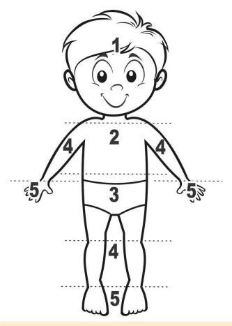
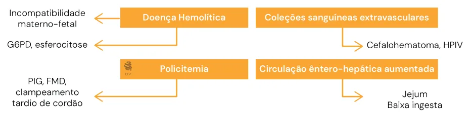
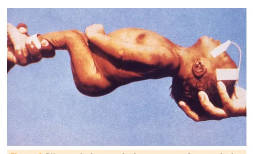
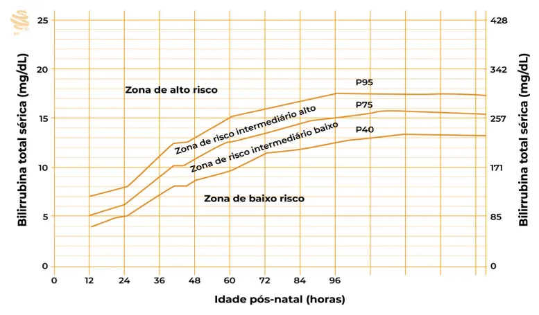
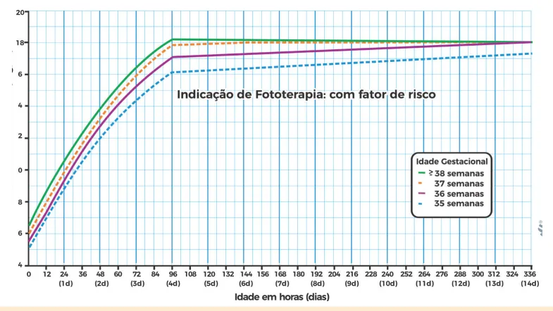
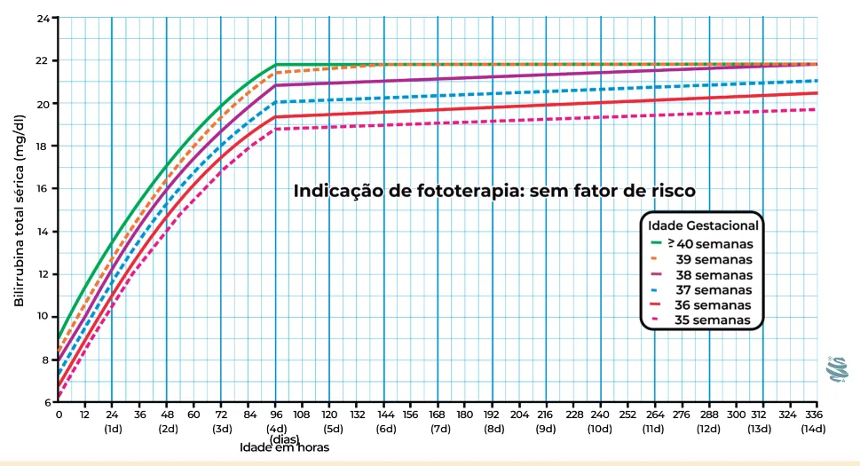
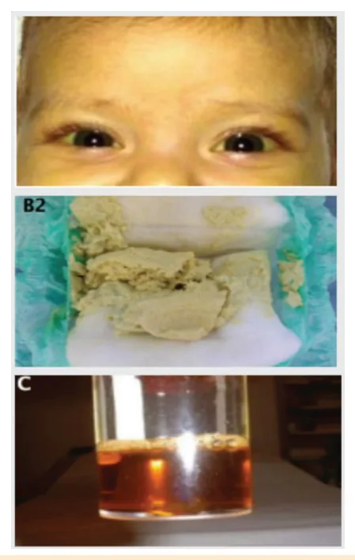

# Icterícia e Colestase Neonatal

<!-- page:1 -->

Icterícia Neonatal (PED) Colestase Neonatal (PED) ICTERÍCIA NEONATAL Fisiológica X Patológica

- Fisiológica: frequente, surge entre 2° e 3°dia, pico entre 3° e 5° dia, não ultrapassa 12 mg/dL, aumento de bilirrubina indireta, resolve em até 14 dias

- Patológica: precoce (<24h), níveis elevados, prolongada (> 14 dias), aumento de bilirrubina direta

Causas:

- Precoce (primeiras 24h): Incompatibilidade materno-fetal – HEMÓLISE (anemia, reticulocitose, coombs +) Rh (mãe Rh - e CI + / RN Rh + CD +) ABO (mãe O / RN A ou B, Coombs e Eluato

+/-, esferócitos)

- Outras causas: oferta inadequada de LM, coleção extravascular, policitemia (filho de mãe diabética, pequeno para a idade gestacional, clampeamento tardio de cordão)

Encefalopatia Bilirrubínica:

- Fase aguda: hipotonia, sucção débil, evolui com hipertonia (opistótono), choro agudo, convulsão, óbito

- Fase crônica (Kernicterus): paralisia cerebral espástica, atetoide (distonia, coreia), surdez, deficiência intelectual

Conduta:

- Nomograma de Bhutani: avalia risco de fototerapia Alto risco: avaliar iniciar fototerapia Intermediário Alto: avaliar fototerapia, manter internação (reavaliar bilirrubina total em 12-24 h Intermediário Baixo e Baixo: avaliar alta e reavaliação ambulatorial

## CONCEITOS

## METABOLISMO DA BILIRRUBINA

Degradação da Hb Mais Eritrócitos e menor meia-vida Fígado: Captação e Conjugação Glicuronil-transferase Fígado imaturo Intestino:

Desconjugação Betaglicuronidase + betaglicuronidase,

- bactérias

Figura 1: Metabolismo da bilirrubina e fatores causadores da icter - Curvas AAP (Academia Americana de Pediatria):

para indicação de fototerapia | <24h: BT > 8-10 mg/dL - iniciar fototerapia | Fatores de risco para Encefalopatia Bilirrubínica:

Doença hemolítica, deficiência de G6PD, asfixia, instabilidade térmica, sepse, acidose, a albumina < 3g/dL

- Exsanguineotransfusão (EST): se sinais de muito alta, sem resposta à fototerapia.

Encefalopatia bilirrubínica aguda ou bilirrubina total

- Imunoglobulina: se BT muito elevada, antes da EST se incompatibilidade.

Icterícia Prolongada (≥ 14 dias): solicitar bilirrubina total e frações Colestase Neonatal (BD > 1 mg/dL): avaliar colúria e hipocolia fecal; solicitar USG de abdome

- Principal causa: Atresia de Vias Biliares USG: Cordão triangular, Vesícula hipoplásica e pouco contrátil Biópsia hepática: proliferação de canalículos biliares, plugs biliares, fibrose portal Diagnóstico Padrão-ouro: Colangiografia intra-operatória Tratamento cirúrgico: Portoenterostomia de

Kasai (idealmente até 60 dias) Bilirrubina indireta Lipossolúvel Bilirrubina direta: Circulação Hidrossolúvel êntero-hepática Intestino e Rins:

Excreção rícia fisiológica

---

<!-- page:2 -->

## DEFINIÇÃO DE HIPERBILIRRUBINEMIA: ICTERÍCIA NÃO FISIOLÓGICA

- Bilirrubina indireta (BI) ≥ 2 mg/dL Investigar fatores de risco e etiologia se:

- Bilirrubina direta (BD) > 1 mg/dL

- Icterícia Precoce (<24h)

- 1ª semana: acomete 60% dos RN termo, 80% dos RN

- Outras manifestações clínicas pré-termo

- BT ≥ 12 mg/dL ou necessidade de FT pré-termo

- Classificação: Significante: requer fototerapia (FT) Grave/severa: próxima a níveis de exsanguineotransfusão (EST) (≥20 mg/dL) ou sinais de encefalopatia bilirrubínica aguda fase inicial Extrema: nível de EST, ≥25 mg/dL, sinais de I encefalopatia bilirrubínica S

- ZONAS DE KRAMER:

- Icterícia é visível clinicamente a partir de 5 mg/dL

- Progressão cefalocaudal: I

1. Cabeça e Pescoço (4-8 mg/dL)

- 2. Atinge umbigo (5-12 mg/dL)

3. Atinge joelhos (~15 mg/dL)

- 4. Atinge tornozelos

- 5. Atinge mãos e pés

- I

- - - I i

- O

- Figura 2: Zonas de Kramer - avaliação clínica da icterícia

- A partir de zona 2 (quando atinge o umbigo): realizar I bilirrubina transcutânea (BTC) como triagem ou sérica a

(padrão-ouro)!

## ICTERÍCIA FISIOLÓGICA E

## NÃO FISIOLÓGICA

- ICTERÍCIA FISIOLÓGICA: AUMENTO DE S

## BILIRRUBINA INDIRETA

- Recém-nascido (RN) 35-36 semanas e Termo:

- Surge entre 2º- 3º dia de vida

- Pico 3º- 4/5º dia (~12 mg/dL)

- Se resolve em 7-14 dias

- RN Pré-termo (<35 semanas):

- Mais lenta e tardia

- Pico 5º - 6° dia

- Atinge níveis mais elevados

- Demora mais para resolver - BT ≥ 12 mg/dL ou necessidade de FT

- Icterícia prolongada

- Aumento de BD – COLESTASE!

## ETIOLOGIAS DA ICTERÍCIA

ICTERÍCIA PRECOCE Surge nas primeiras 24 horas de vida: aumento de BI

- Hemolítica – por incompatibilidade materno-fetal

- Anemia, reticulocitose

- Coombs: marca anticorpo; Mãe: indireto; RN: direto.

Incompatibilidade Rh

- Mãe: Rh negativo, Coombs indireto positivo

(sensibilização prévia)

- RN: Rh positivo, Coombs direto positivo

- Anticorpos maternos anti-D

- Mais grave e intenso

- Prevenção: imunoglobulina anti-D na gestante/puérpera

Incompatibilidade ABO

- Mãe: O (não requer sensibilização prévia)

- RN: A ou B, Coombs direto +/-, Eluato +/- (anticorpos maternos anti-A ou anti-B), esferócitos

- Mais comum, menos grave

- Na primeiras 24h de vida irregulares/ atípicos

Incompatibilidade por antígenos eritrocitários

- Se coombs direto positivo e tipagem sem incompatibilidade ABO ou Rh Fazer painel de hemácias do RN

Outras causas

- Deficiência de G6PD: genética, hemólise desencadeada por agentes oxidantes (naftalina, antimalárico). Hemólise grave aguda OU hemólise leve sem anemia

- Esferocitose: defeito de membrana

## ICTERÍCIA ASSOCIADA AO ALEITAMENTO

Icterícia por oferta inadequada de leite materno: “do aleitamento”

- 1ª semana de vida

- Dificuldade de aleitamento materno (AM) baixa ingesta

- Perda de peso > 7-8%

- Aumento da circulação êntero-hepática

Síndrome da Icterícia do Leite Materno (LM):

- Prolongada (até 12ª semana)

- RN em AM, bom ganho ponderal e exame físico normal

- LM: substâncias que reduzem a ação da glicuroniltransferase (reduzindo a conjugação) e aumentam da betaglicuronidase

(aumentando a desconjugação).

- Manter AM

---

<!-- page:3 -->

## ORGANIZANDO O RACIOCÍNIO!

Figura 3: Etiologias possíveis da Icterícia Neonatal

## ENCEFALOPATIA BILIRRUBÍNICA

- Deposição da BI nos gânglios da base

- Aumenta o risco de lesão neuronal: doença hemolítica, deficiência de G6PD, asfixia, letargia, instabilidade térmica, sepse, acidose e hipoalbuminemia

- Fase aguda: hipotonia, sucção débil, evolui com hipertonia (opistótono), choro agudo, convulsão, óbito

Figura 4: RN em opistótono, achado presente na fase aguda da

- Fase crônica - Kernicterus: paralisia cerebral espástica, atetoide (distonia, coreia), surdez, deficiência intelectual

- Risco: incompatibilidade materno-fetal, RN com alta precoce <48h

## AVALIAÇÃO

ALOJAMENTO CONJUNTO: AVALIAR ICTERÍCIA A CADA 8-12 HORAS E FATORES DE RISCO RN ictérico:

1. Coletar exames: bilirrubina transcutânea (BTC)

ou bilirrubina total e frações sérica (BTF), Hb/Ht, reticulócitos, tipagem sanguínea, dosagem de G6PD

2. Fisiológica ou não fisiológica? Não é fisiológica se:

| Precoce | BT ≥ 12 ou requer FT | Outras manifestações | Prolongada | Aumento de BD

3. Fatores de risco para Hiperbilirrubinemia Significante:

- Icterícia precoce

- Incompatibilidade materno-fetal - Idade gestacional (IG) de 35, 36 e 37 semanas

- Policitemia: clampeamento tardio de cordão, filho de mãe diabética

- Baixa ingesta de LM: perda de peso >7%

- Sexo masculino

- Coleção sanguínea extravascular

- Irmão tratado com fototerapia ou descendência asiática

- Bhutani: zona de alto risco ou intermediária superior antes da alta

4. Pesquisar qual é a etiologia

5. Decidir conduta.

## NOMOGRAMA DE BHUTANI

- RN ≥ 35 semanas e peso ao nascer ≥ 2000g

- Avalia risco de atingir BT > 17,5 mg/dL (se em zona de alto risco - 40% atingem BT > 17,5 mg/dL; em intermediária alto - 13%). Alto risco: avaliar iniciar FT Risco Intermediário Alto: avaliar FT, manter internação (reavaliar BT em 12-24h) Risco Intermediário Baixo e Baixo Risco: avaliar alta e reavaliação ambulatorial.

- Verificar Figura 5 na próxima página

## MANEJO

## FOTOTERAPIA

- Fotoisomerização: BI depositada na pele é transformada em hidrossolúvel e excretada sem conjugação hepática

- Padrão (irradiância 8-10 μW/cm2/nm)

- Alta intensidade/irradiância (> 30 μW/cm2/nm): se níveis muito elevados de BT

- Luz azul/verde: maior absorção - comprimento de onda 460 nm

Indicação de Fototerapia – Academia Americana de Pediatria (AAP):

- Leva em conta: horas de vida, nível de BT, idade gestacional e fatores de risco (FR)

- FR para encefalopatia: doença hemolítica, deficiência de G6PD, asfixia, instabilidade térmica, sepse, acidose, albumina < 3g/dL

- Curva de 2004:

---

<!-- page:4 -->

Figura 5: Nomograma de Bhutani )Ld / gm( latot aniburriliB 25 428 20 342 10 171 5 85 0 0 Nascimento 24 h 48 h 72 h 96 h 5 Dias 6 Dias 7 Dias / lomμ Baixo risco (≥ 38 semanas sem fator de risco)

Médio risco (≥ 38 semanas com fator de risco ou 35 - 37 sem e 6 d sem fator de risco) Alto risco (35 - 37 sem e 6 d com fator de risco)

Idade Figura 6: Curva da AAP para indicação de fototerapia em RN ≥ 35 semanas (2004)

- Curva de 2022 - com fator de risco:

Figura 7: Curva da AAP para indicação de fototerapia em RN ≥35 semanas com fator de risco (2022)

---

<!-- page:5 -->

- Curva de 2022 - sem fator de risco:

Figura 8: Curva da AAP para indicação de fototerapia em RN ≥35 Indicação de Fototerapia em Pré-termo < 35 semanas

- De acordo com IG e nível de BT

- Quanto menor a idade gestacional, menor BT que indica fototerapia

Acompanhamento:

- Após iniciar a fototerapia, recoletar BT em 4-8h Queda dos valores de BT (~ ≤ 10 mg/dL) ou < 2 mg/ dL do valor que indicaria FT Reavaliação ambulatorial (48h)

Suspensão: EXSANGUINEOTRANSFUSÃO:

- Na doença hemolítica grave Ação: remoção das hemácias com anticorpos ligados e/ou circulantes, redução da bilirrubina e correção da anemia

- Indicação: Sinais de encefalopatia bilirrubínica aguda Falha da FT Coleta de cordão umbilical: BT > 4 mg/dL e/ou hemoglobina < 12 g/dL

- Iniciar fototerapia de alta intensidade, enquanto prepara EST, reavaliar BT em 2-3h

## IMUNOGLOBULINA PADRÃO

- Doença hemolítica imune com aumento da BT apesar de FT intensiva, ou próxima do nível de EST semanas sem fator de risco (2022)

## PREVENÇÃO DA

## HIPERBILIRRUBINEMIA

## SIGNIFICANTE

- Iniciar AM em sala de parto, suporte ao AM

- Alta hospitalar após 48 horas de vida

- Retorno ambulatorial em 48 - 72 horas.

## COLESTASE NEONATAL

## ICTERÍCIA PROLONGADA

Todo bebê ≥ 14 dias ictérico: coletar bilirrubina total e frações

- Outros exames iniciais: checar teste do pezinho e tipagens, solicitar urina 1, urocultura, hemograma,

G6PD, TSH e T4 livre. Se aumento de BI:

- Síndrome da Icterícia do Leite Materno

- Deficiência G6PD

- Coleção extravascular

- Hipotireoidismo congênito (pode aumentar

BD também)

- Sepse

Se BD > 1,0 mg/dl – Investigar. COLESTASE NEONATAL - URGÊNCIA: BD > 1,0 MG/DL

- Diminuição da secreção biliar (doença hepatocelular ou biliar) – sempre patológica Avaliar diurese: colúria Avaliar evacuação: hipocolia/acolia fecal

- Verificar Figura 9 na próxima página

---

<!-- page:6 -->

Outras Causas:

- Sepse, infecção congênita, infecção de trato urinário

- Uso de nutrição parenteral prolongada

- Cisto de colédoco

- Fibrose cística, Pan-hipopituitarismo

- - R g

Figura 9: Icterícia colestática, hipocolia fecal e colúria

- Exames iniciais: hemograma, reticulócitos, AST, ALT, p h sorologias se suspeita.

FA, GGT, coagulograma, glicose, albumina, TSH, T4 livre, 1

- Ultrassonografia (USG) de Abdome.

Atresia de Vias Biliares: A

- Principal causa cirúrgica de colestase H i

- Obliteração dos ductos biliares extra-hepáticos 2

- USG: cordão triangular, vesícula hipoplásica e pouco contrátil

- Biópsia hepática: proliferação de canalículos biliares, A plugs biliares, fibrose portal M

- Diagnóstico padrão-ouro: Colangiografia 1 intra-operatória

- Tratamento cirúrgico: Portoenterostomia de Kasai S

(idealmente até 60 dias de vida) d

- Principal causa de transplante hepático em Pediatria! - Fibrose cística, Pan-hipopituitarismo

- Deficiência de alfa-1-antitripsina: doença pulmonar + doença hepática. Dosar Alfa-1-antitripsina sérica

- Erros inatos de metabolismo - Galactosemia: Deficiência de galactose-1-fosfato uridil transferase Icterícia colestática, catarata, inapetência, ascite/ cirrose, hepatoesplenomegalia, evoluindo com insuficiência hepática e óbito, maior risco de sepse por E. coli Triagem - teste do pezinho ampliado Diagnóstico: concentração de galactose-1-fosfato nos eritrócitos e da redução eritrocitária da atividade da GALT Conduta: Exclusão definitiva da galactose da dieta.

(GALT) - acúmulo de galactose Devem receber fórmula de soja.

## REFERÊNCIAS

Figura 4: - RN em opistótono por encefalopatia bilirrubínica. Centers for Disease Control And Prevention (CDC). Public Health Image Library (PHIL): imagem 6374. Atlanta: CDC. Disponível em: https://phil.cdc.

gov/details.aspx?pid=6374. Acesso em: 12 maio 2025. Figura 5: - Nomograma de Bhutani. Adaptado de Bhutani VK, Johnson L, Sivieri EM. Predictive ability of a predischarge hour-specific serum bilirubin for subsequent significant hyperbilirubinemia in healthy term and near-term newborns. Pediatrics.

1999 Jan;103(1):6-14. doi: 10.1542/peds.103.1.6. PMID: 9917432. Figura 6: - Curva da AAP para indicação de fototerapia em RN ≥ 35 semanas (2004)

AMERICAN ACADEMY OF PEDIATRICS. Subcommittee on Hyperbilirubinemia. Management of hyperbilirubinemia in the newborn infant 35 or more weeks of gestation. Pediatrics, v. 150, n. 3, e2022058859,

2022. 7. Disponível em: https://doi.org/10.1542/peds.114.1.297

Figuras 7 e 8: Curva de Indicação de fototerapia sem fator de risco (AAP, 2022) Adaptado de Kemper, Alex et al. Clinical Practice Guideline Revision:

Management of Hyperbilirubinemia in the Newborn Infant 35 or More Weeks of Gestation. Pediatrics August 2022; 150 (3): e2022058859.

10.1542/peds.2022-058859 Figura 9: Icterícia colestática, hipocolia fecal e colúria Sociedade Brasileira de Pediatria. Colestase em lactentes: um tema do pediatra. Departamento Científico de Hepatologia. Guia Prático de Atualização, n. 1, mar. 2017.

