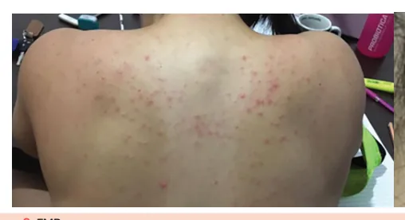
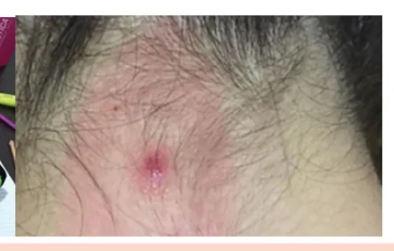
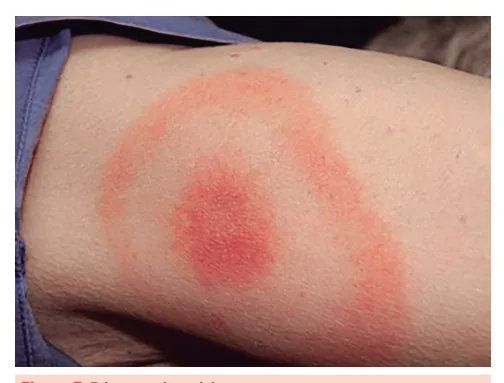

# Icterícias Febris e Febre Maculosa

<!-- page:1 -->

Icterícias Febris — FMB (CM)

> ⚠️ Trecho de abertura (quadro-resumo de diagnósticos diferenciais) reconstruído a partir de OCR de duas colunas fortemente intercalado — confira contra a fonte original.

### Diagnósticos Diferenciais de Icterícias Febris

- **Malária**: febre paroxística, área de risco, descorado (anemia). Injúria renal proeminente com K normal ou baixo.
- **Leptospirose**: transaminases em torno de 100, CPK aumentado.

## Exames Confirmatórios

- Fase leptospirêmica: PCR no sangue.

## Leptospirose

- **Fase febril aguda**: mialgia + exposição, sem icterícia nem injúria renal (com aumento de CPK). Diagnóstico na fase febril: PCR no sangue.
- **Fase imunológica**: meningite asséptica / uveíte (anterior), icterícia rubínica com sufusões hemorrágicas. Diagnóstico na fase imunológica: PCR na urina ou sorologia.
  - IRA não oligúrica e hipocalêmica + EAP.
  - Aumento do título em 2 semanas ou título > 1:800 (muito alto para ser antigo).
  - Transaminases > 1.000 na febre amarela; nas hepatites virais, transaminases mais baixas com BD 0-300, período de remissão, sintomas em TGI, injúria renal e INR alargado, RNC.

- **Tratamento**:
  - Precoce: amoxicilina / doxiciclina.
  - Injúria renal: diálise precoce + ceftriaxone (penicilina cristalina, ampicilina).
  - **Notifique em até 24h!**

---

<!-- page:2 -->

### Síndrome Febril Aguda — Avaliação Clínica

> ⚠️ Fluxograma reconstruído a partir de OCR — confira contra a fonte original.

**Contato físico com áreas alagadas, lama ou esgoto nos últimos 30 dias + febre, cefaleia e mialgia.**

- **Sinais de alerta**:
  1. Dispneia, tosse e taquipneia.
  2. Fenômenos hemorrágicos, incluindo escarros hemoptoicos.
  3. Hipotensão.
  4. Alterações do nível de consciência.
  5. Vômitos frequentes.
  6. Arritmias.
- **Presença de sinais de alerta**: encaminhar para unidade hospitalar de referência; doxiciclina.
- **Ausência de sinais de alerta**:
  - Leucócitos normais: amoxicilina.
  - Leucocitose > 10.000/mm²: doxiciclina.
  - Leucopenia < 4.000/mm²: investigar outras doenças.

## Febre Amarela

- Picada do mosquito Aedes → período de infecção → fase imunológica (em até 20% dos casos, com 80% evoluindo para cura). Diagnóstico: sorologia (PCR/ELISA/MAC-ELISA).
- **Fase febril inespecífica**: remissão parcial dos sintomas antes da fase imunológica.
- **Sinal de Faget**: febre sem taquicardia — não é específico, mas sugestivo.
- **Falência hepática**: tratamento suportivo.
- **Notifique em até 24h!** — vigilância em primatas não humanos.

## Malária

- Febre em acessos, com muito calafrio. Sem indicação de quimioprofilaxia e sorologia!
- Diagnóstico: gota espessa.
- **P. falciparum**: derivado de artemisinina (ACT) — artesunato + mefloquina ou artemeter + lumefantrina. Primaquina aqui sempre em dose única.
- **P. vivax**: cloroquina + primaquina por 7 dias — atinge hipnozoítas — controle de cura até 63 dias.
- **Forma grave**: artesunato IV. Critérios de gravidade: grávidas, SDRA, hiperlactatemia, hipoglicemias recorrentes, dor abdominal intensa, icterícia clínica, IRA, acidose metabólica.

## História Natural da Doença Febril

- Leptospirose, febre amarela e dengue apresentam uma história natural semelhante, resumida na Figura 1.

### Evolução Clínica e Diagnóstico (Leptospirose)

- Mais de 80 sorotipos → *L. icterohaemorrhagiae*.
- Contato com urina de roedores (pele íntegra e via inalatória inclusive) → período de incubação (4-30 dias, com média de 7) → fase leptospirêmica (3-5 dias), inespecífica → evolução para cura (80%) ou para fase imunológica (20%).

Sintomas do período inicial:

- Febre, mal-estar.
- Náuseas, vômitos.
- Mialgia, cefaleia.
- Sinal de Faget.

Notificação: amazônica — semanal (nível endêmico); extra-amazônica — 24h.

## Febre Maculosa

- Espectro clínico: exantemática febril / íctero-hemorrágica / sufusões petequiais (semelhante à meningococcemia).
- Exantema centrípeto (pode não estar presente em formas graves): de punhos e tornozelos para o tronco.
- Não espere relato de carrapato — área de risco nos últimos 14 dias: interior da região Sudeste.
- Diagnóstico definitivo: sorologia (imunofluorescência indireta) — repete em 14-21 dias, com aumento de 4x o título.
- Doxiciclina empírica e notificação de caso suspeito em 24h.

## Fase Leptospirêmica

- Nessa fase, 80% das pessoas se curam.
- Sintomas inespecíficos: febre, mal-estar, náuseas, vômitos, mialgia em panturrilhas e dorso.
- PCR detectado no sangue.
- Exames laboratoriais: aumento de CPK, TGO > TGP (ambas < 200 UI/L), leucocitose com desvio à esquerda.
- **Obs.**: nesta fase, em geral, ainda não há desenvolvimento de injúria renal e icterícia.

---

<!-- page:3 -->

*Figura 1: Evolução clínica geral de doenças infecciosas — leptospirose, dengue, febre amarela e hepatites virais.* Incubação de poucos dias → fase aguda (contágio, PCR/antígeno) → fase imunológica indefinida (complicações, sorologia em ascensão, IgM/IgG).

*Figura 2: Fluxograma de leptospirose — exames confirmatórios.* Fase leptospirêmica: PCR no sangue.

### Fase Imunológica — Síndrome de Weil (a Clássica)

- **Icterícia rubínica (alaranjada)**: devido ao desenvolvimento de uma vasculite sistêmica (sufusões hemorrágicas), confere tonalidade mais alaranjada. Não há necrose hepatocelular intensa — TGO/TGP com valores em torno de 200-300, ocorrendo colestase intra-hepática, com BD elevada.
- **Dano alveolar**: EAP e hemorragia alveolar, principal causa de morte. Rx: 25% com infiltrado bilateral reticular (a maior parte dos pacientes tem Rx normal). Taquipneia, mesmo sem dessaturação.
- **Injúria renal**: não oligúrica e normo/hipocalêmica — principal mecanismo: nefrite tubulointersticial e NTA. Indicação clássica de terapia de substituição renal precocemente; pode ocorrer oligúria, indicando maior mortalidade. Evolução tardia: poliúria.

### Outras Manifestações da Fase Imunológica

- **Meningite asséptica**: pleocitose até 500 células/mm³ com predomínio linfocítico, proteinorraquia de 50-100 mg/mL, glicose normal, culturas negativas.
- **Acometimento cardíaco**: miocardite — ECG seriado + marcadores de necrose miocárdica (MNM); alteração de repolarização e arritmias, BAV 1º grau, arritmias por hipocalemia.

### Sorologia (ELISA)

- A sorologia antes de 7 dias não descarta caso suspeito, mas sempre deve ser coletada na suspeita diagnóstica.
- Detecta anticorpo, não o antígeno (demora um tempo para positivar).
- Alta endemicidade: pode ser apenas contato prévio (sorologia sem ascensão).
- Estabelece diagnóstico se: titulação > 1:800 (muito alto para ser platô); ou comparação de duas titulações, com intervalo de 2 semanas e aumento de 4x da titulação.
- < 7 dias → sangue.
- > 7 dias → urina.

---

<!-- page:4 -->

## Tratamento (Leptospirose)

### Medicamentoso

*Figura 3: Tratamento da leptospirose.*

**Tabela 1: Antibioticoterapia na leptospirose**

> ⚠️ Tabela reconstruída a partir de OCR (doses fortemente fragmentadas) — confira contra a fonte original.

| Fase | Antibiótico | Dose |
|---|---|---|
| Fase leptospirêmica | Doxiciclina | 100 mg, via oral, de 12 em 12 horas, por 5 a 7 dias |
| Fase leptospirêmica | Amoxicilina | 500 mg, via oral, de 8 em 8 horas, por 5 a 7 dias |
| Fase precoce/tardia | Penicilina G Cristalina | 1.500.000 UI, intravenosa, de 6 em 6 horas |
| Fase tardia | Ampicilina | 1 g, intravenosa, de 6 em 6 horas |
| Fase tardia | Ceftriaxona | 1 a 2 g, intravenosa, de 24 em 24 horas |
| Fase tardia | Cefotaxima | 1 g, intravenosa, de 6 em 6 horas |

- Fase leptospirêmica: doxiciclina, azitromicina, amoxicilina.
- Fase imunológica: ceftriaxona, penicilina G cristalina.

### Prevenção

- Doxiciclina 200 mg/semana (pós-exposição): não é indicada de rotina em caso de exposição única; tem baixa efetividade.
- Indicação de profilaxia para profissionais com alto risco de exposição e de forma constante, como equipe de saneamento básico.
- Notificação imediata → saneamento básico e controle de vetores.

## Febre Amarela

- Transmitida pela picada do mosquito Aedes (cidade) ou Haemagogus (mata), endêmica na região amazônica.
- Picada do mosquito → incubação de 3-5 dias → período de infecção (3-5 dias) → 85% evoluem para cura e 15% evoluem para o período toxêmico (90% de letalidade), após um período de 24-48h de remissão dos sintomas.

### Sintomas do Período de Infecção

- Febre.
- Mal-estar.
- Náuseas e vômitos.
- Mialgia.
- Cefaleia.
- **Sinal de Faget**: a distensão hepática faz uma compressão vagal, levando à bradicardia/normocardia, a despeito da febre alta.

### Falência Hepática Aguda

- Clínica: rebaixamento do nível de consciência, sangramento do trato gastrointestinal e icterícia (sinais de falência hepática).
- Classicamente, antes de piorar, o paciente pode ter 12-24h de remissão, como se fosse apresentar melhora.
- Transaminases > 1.000 UI.
- Alargamento de coagulograma.
- Aumento de bilirrubina direta.
- Plaquetopenia.
- Coagulação intravascular disseminada (CIVD).
- Necrose tubular aguda (NTA).
- Miocardite.
- Leucopenia com linfocitose (linfócitos > 35%).

### Diagnóstico

- Fase virêmica: PCR sérico.
- Fase imunológica: sorologia (ELISA/MAC-ELISA).

### Tratamento

- Suporte.
- Se necessário, transplante hepático.
- Prevenção: lembrar da vacinação!

**Dica**: na prova, se tivermos transaminases (TGP/TGO) acima de 1.000, sempre pensar em duas etiologias: febre amarela e hepatites virais agudas.

---

<!-- page:5 -->

## Malária

**Tabela 2: Comparação Falciparum x Vivax**

> ⚠️ Tabela reconstruída a partir de OCR — confira contra a fonte original.

| | *P. falciparum* (incubação de 1-2 semanas) | *P. vivax* (incubação de 1 semana) |
|---|---|---|
| Característica | Maiores parasitemias; forma cerebral | Hipnozoítas; recaídas; reticulócitos |
| Tratamento | Artesunato + mefloquina ou artemeter/lumefantrina. Forma grave: artesunato EV/12h (mínimo 24h) | Cloroquina/3 dias + primaquina/7 dias. Recorrência: esquema de falciparum + primaquina 14 dias |

### Introdução

- Epidemiologicamente, no Brasil, é endêmica da região amazônica.

Dois principais gêneros:

- **Falciparum**: responsável por cerca de 3% das malárias em território nacional. Mais frequentemente causa malária grave, maior parasitemia, infecta hemácias em todos os estágios evolutivos (reticulócitos) e tem citoaderência pelo tecido neurológico.
- **Vivax**: de principal ocorrência no território nacional. Hipnozoítas: formas hepáticas quiescentes → recorrências → primaquina → atenção à DG6PD.

### Ciclo Evolutivo

- Picada do mosquito Anopheles → inoculação de esporozoítos.
- Esquizontes teciduais no fígado; Vivax libera hipnozoítas, que causam recorrência do quadro clínico.
- Rompimento dos hepatócitos e liberação de merozoítos na corrente sanguínea.
- Merozoítos infectam hemácias e transformam-se em esquizontes novamente.
- Lise da hemácia → libera trofozoítos que se transformam em gametas livres (gametócitos) no sangue → aumento de bilirrubina indireta por hemólise.

### Clínica

- Mal-estar, dor no corpo e nas articulações, fadiga e falta de apetite.
- Síndrome febril hematogênica.
- Síndrome febril ictérica.
- Síndrome febril neurológica.
- Síndrome febril respiratória.
- Síndrome febril com forte dor abdominal, que pode ser ruptura do baço.
- Febre alta, paroxística ou não — não espere febre em períodos de tempo bem demarcados para pensar em malária! Espere paroxismo, mas não periodicidade!
- Mal-estar, calafrios, sudorese, mialgia, cefaleia, náuseas, vômitos.

### Malária Grave (Tratar com Artesunato)

- Falciparum e alta parasitemia (≥ 3+) — nem toda vez, mas muito frequentemente.
- Grávidas.
- SARA (falta de ar fora do acesso febril).
- Injúria renal.
- Diurese < 400 mL/24h.
- Acidose metabólica.
- Dor abdominal intensa (iminência de rotura esplênica — mais comum em vivax). Há alteração de transaminases com menor intensidade.
- Sangramento de qualquer natureza.
- Icterícia.
- Hipoglicemias recorrentes.
- Hiperlactatemia.
- Hipotensão / hemorragia / CIVD.
- RNC/convulsão = forma cerebral.

### Diagnóstico

- **Padrão-ouro**: gota espessa (examinador-dependente e, em regiões não endêmicas, fica mais comprometido). Permite identificar a espécie, a parasitemia e realizar o controle de cura.
- Malária é a principal causa de febre em viajantes!
- Gota espessa falsa-negativa: podem ter parasitemia mais baixa ou negativa no momento da realização do exame.
- Teste rápido imunocromatográfico → ruim para vivax.
- Sorologia → ruim para diagnóstico; tem maior utilidade para o diagnóstico de esplenomegalia tropical (rara, com baço, anemia, sem febre, e gota espessa negativa — exposição recorrente à malária).

### Síndromes Clínicas e Gravidade

- Causa mais frequente de febre no viajante. Malária é uma síndrome mimetizadora e inespecífica.
- O diagnóstico de malária, em pessoas procedentes de área de transmissão, deve ser pensado nas seguintes situações: presença de febre de qualquer intensidade, duração e frequência.

---

<!-- page:6 -->

### Tratamento (Malária)

- **Falciparum**: artesunato + mefloquina ou artemeter + lumefantrina → primaquina dose única (gametócitos).
- **Vivax**: cloroquina por 3 dias + primaquina por 7 dias.
- Se recorrência, tratar como falciparum (derivados de artemisinina VO) e estender a primaquina para 14 dias.

**Observações sobre a medicação:**

- Cloroquina: alarga QT; 20% dos pacientes têm prurido (benigno, não precisa interromper).
- Primaquina: hemólise em deficiência de G6PD (DG6PD), costuma surgir após o 5º dia de uso. No caso de um paciente com atividade enzimática abaixo de 30%, o regime de primaquina com dose semanal por oito semanas (0,75 mg/kg/semana) é recomendado, desde que realizado sob supervisão médica — colúria, mal-estar, fadiga, icterícia e possível febre.

**Notificação**: semanal na região amazônica e imediata na região extra-amazônica.

**Quimioprofilaxia**: não recomendada rotineiramente pelo MS em território nacional, pois *P. vivax* não costuma fazer forma grave, e há ampla disponibilidade de diagnóstico e tratamento. Diretrizes internacionais falam em cloroquina/doxiciclina. Considerar se viagem para áreas remotas, com difícil acesso a tratamento por tempo prolongado.

**Controle de cura**: prolongado e com gota espessa:

- *P. falciparum* → em 3, 7, 14, 21, 28 e 42 dias.
- *P. vivax* ou mista → 3, 7, 14, 21, 28, 42 e 63 dias (por causa dos hipnozoítas).

## Febre Maculosa Brasileira (FMB)

### Agente Etiológico

- Rickettsia → *Rickettsia rickettsii*.
- Período de incubação: 7 dias em média (2-14 dias).
- Carrapato-estrela (contato por 4-6 horas): *Amblyomma aureolatum* — espécie mais comum na região metropolitana de São Paulo; *Amblyomma sculptum* — espécie de carrapato associado à transmissão de rickettsia na região Sudeste, presente no surto recente.

**Atenção**: a maior parte dos pacientes não relata ter percebido contato com carrapato!

### Fisiopatologia

- Ativação exacerbada de prostaglandinas. Evolui com:
  - Permeabilidade vascular aumentada.
  - CIVD.
  - Lesões teciduais múltiplas.
  - Hipoalbuminemia.
  - Edema subcutâneo, cerebral, pulmonar.
  - Derrames cavitários.
  - Hipovolemia.
  - Micro-oclusões vasculares e lesões teciduais difusas (incluindo necrose de extremidades).
  - Miocardite, pneumonite, lesões glomerulares e tubulares renais, necrose tecidual.

> ⚠️ Trecho reconstruído a partir de OCR de duas colunas (quadro comparativo de diagnósticos diferenciais de exantema febril/icterícia) fortemente intercalado — confira contra a fonte original.

*Figura 4: Fluxograma de diagnósticos diferenciais — arboviroses + icterícias febris.*

Diagnósticos diferenciais mencionados: sarampo (febre alta + conjuntivite + rash craniocaudal), sífilis secundária (acometimento de palmas e plantas), mononucleose-like (EBV, CMV, Toxoplasmose), hepatites virais agudas (icterícia + rash), dengue, Zika, Chikungunya (febre, mal-estar, mialgia, cefaleia — TGI, febre baixa), leptospirose, febre amarela, FMB e malária (febre + icterícia + rash).

## Clínica (FMB)

- Espectro: doença exantemática / forma íctero-hemorrágica / semelhante à meningococcemia.
- Exantema característico: início em extremidades e evolução centrípeta, surgimento no 3º-5º dia de doença; pode não aparecer em casos fulminantes.
- Caso suspeito: febre / mialgia / cefaleia / exantema, com estada em área de risco nos últimos 15 dias.
- Os testes laboratoriais atualmente disponíveis ainda não proporcionam resultados específicos de modo ágil e oportuno, capazes de subsidiar as decisões iniciais acerca da indicação do tratamento específico.

### Definição de Caso Suspeito

- Indivíduo que apresente febre de início súbito, cefaleia, mialgia e que tenha relatado picada de carrapatos e/ou contato com animais domésticos e/ou silvestres e/ou ter frequentado área sabidamente de transmissão de febre maculosa nos últimos 15 dias.
- Indivíduo que apresente febre de início súbito, cefaleia e mialgia, seguidas de aparecimento de exantema maculopapular, entre o segundo e o quinto dias de evolução, e/ou manifestações hemorrágicas.

---

<!-- page:7 -->

*Figura 5: Imagens de febre maculosa — Manual do MS.*

*Figura 6: FMB.*

### Diagnóstico Confirmatório

Sorologia (imunofluorescência indireta) — 2 diluições / aumento de 4x nos títulos (1/64 – 1/128 – 1/256):

- Preferencial.
- Coleta na suspeita diagnóstica: pode ser negativa se < 7 dias de sintomas.
- Verificar o aumento de título em 14-21 dias.
- Se não houver esse aumento em 14-21 dias, mas houver suspeita clínico-epidemiológica, verificar o aumento tardio, com coleta de 3ª sorologia, 14 dias após a segunda.

**Tabela 3: Sorologia FMB e Interpretação**

> ⚠️ Tabela reconstruída a partir de OCR — confira contra a fonte original.

| Primeira amostra | Segunda amostra | Interpretação e comentário |
|---|---|---|
| Não reagente | Não reagente | Descartado |
| Não reagente | 64 | Verificar possibilidade de surgimento/aumento tardio de anticorpo |
| Não reagente | 128 | Confirmado |
| 64 | 64 | Verificar possibilidade de surgimento/aumento tardio de anticorpos |
| 128 | 256 | Verificar possibilidade de surgimento/aumento tardio de anticorpos |
| 128 | 512 | Confirmado |
| 256 | 512 | Verificar possibilidade de surgimento/aumento tardio de anticorpo |
| 512 | 512 | Verificar possibilidade de surgimento/aumento tardio de anticorpo |
| 256 | 1024 | Confirmado |

---

<!-- page:8 -->

## Notificação

- **PCR**: somente casos graves. Quanto ao diagnóstico molecular por RT-qPCR, é importante ressaltar que, por apresentar baixa sensibilidade para a detecção do agente na fase aguda, em virtude da baixa carga bacteriana no sangue, a técnica é indicada para investigação de casos graves, quando há lesão endotelial, via de regra para pacientes internados ou para investigação de óbitos suspeitos.
- **Febre amarela**: imediata (até 24 horas) para MS, SES e SMS — possui um sistema separado, o Sistema de Vigilância de Epizootias em PNH.
- **Leptospirose**: imediata (até 24 horas) para SMS.
- **Malária na região amazônica**: semanal.
- **Malária na região extra-amazônica**: imediata (até 24 horas) para MS, SES e SMS.
- **Febre maculosa**: imediata (até 24 horas) para MS, SES e SMS.

## Tratamento (FMB)

- Doxiciclina; 7 dias totais ou 3 dias após término da febre.
- Profilaxia: sem indicação.
- Notificação imediata.

## Doença de Lyme

- Lyme símile brasileira ou síndrome de Baggio-Yoshinari.
- Carrapatos: *Ixodes ricinus*, *Amblyomma cajennense*.
- Agente: *Borrelia burgdorferi*.
- Lesão típica: eritema migratório — alvo, expande lentamente, círculos vermelhos concêntricos e áreas esbranquiçadas.

### Evolução em Fases

- **Precoce localizada**.
- **Disseminação precoce**: rigidez de nuca (meningoencefalite linfocítica) + dores articulares + eritema migratório.
- **Crônica**: disfunção cognitiva, cardíacos, paralisia de Bell.

*Figura 7: Eritema migratório.*

## Referências

Figura 5: Imagens de febre maculosa — manual do MS. BRASIL. Ministério da Saúde. Secretaria de Vigilância em Saúde. Departamento de Imunizações e Doenças Transmissíveis. *Febre maculosa: aspectos epidemiológicos, clínicos e ambientais*. Brasília: Ministério da Saúde, 2022. 160 p. ISBN 978-65-5993-255-9.

Figura 6: FMB. Arquivo próprio.

Figura 7: Eritema migratório. Prova HSL 2021.

