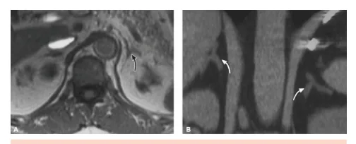
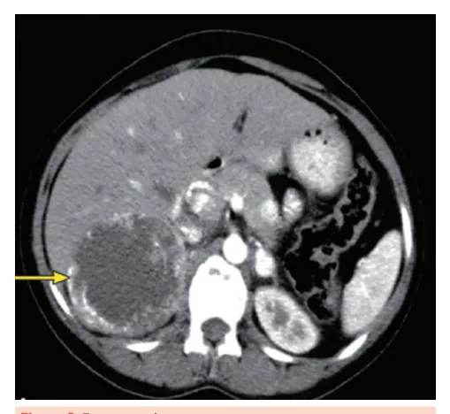
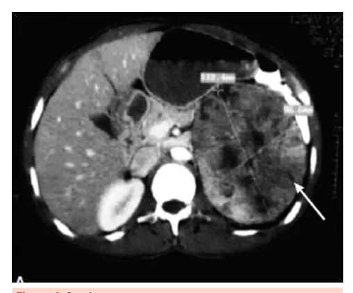

# Incidentaloma Adrenal

<!-- page:1 -->

## Definição

**Incidentaloma** (do termo "incidente" — sem querer): lesão na glândula adrenal **≥ 1 cm**, descoberta acidental durante exame de imagem solicitado por outro motivo.

**Exemplo**: paciente que chega com falta de ar, realiza TC de tórax e, como é possível visualizar o abdome superior, observa-se incidentalmente (não era o objetivo) uma lesão > 1 cm na adrenal.

**Deve-se avaliar**:

1. **Risco de malignidade**.
2. Se há **produção hormonal**.

### Composição dos Incidentalomas

- **Adenomas corticais não funcionantes**: 70–80%.
- **Feocromocitoma**: 1,1–11%.
- **Hipercortisolismo subclínico**: 5–20%.
- **Hiperaldosteronismo primário**: 1–2%.
- **Carcinomas adrenocorticais**: < 5%.
- **Metástases**: 0–18%.

### Características Gerais

- Mais comum: **unilateral**, adenomas.
- **Lesões bilaterais**: podem estar relacionadas com doenças infiltrativas, metástases, hiperplasia adrenal.
- **Adrenal normal**: formato de "Y invertido".

*Figura 1: Adrenal normal.*

---

## Avaliação de Risco de Malignidade

A TC com **cortes finos de suprarrenal com contraste** (lembrar de especificar que é de suprarrenal) deve ser solicitada para avaliar:

- Tamanho.
- Formato.
- Atenuação (em Unidades Hounsfield — UH).
- Washout (velocidade de eliminação do contraste).
- Outras características.

**OBS.**: mesmo no paciente em que o nódulo foi flagrado em TC de tórax, por exemplo, deve ser solicitada a TC com cortes finos de suprarrenal para melhor avaliação.

### Estratificação por TC de Abdome Sem Contraste

Lesões **≥ 1 cm** classificam-se em:

1. **Benignas** → sem necessidade de exame adicional ou seguimento.
2. **Indeterminadas** → exame adicional (PET-CT / TC com contraste / RM) em 6–12 meses OU cirurgia.
3. **Potencialmente malignas** → rastrear com PET-FDG OU cirurgia.

### Critérios de Benignidade

- **Homogêneas**.
- **Atenuação ≤ 10 UH**.
- **Ricas em gordura**.

### Critérios de Potencial Malignidade

- **Heterogênea**.
- **Atenuação > 20 UH**.
- **Tamanho ≥ 4 cm**.
- **Indicação**: cirurgia ou rastreamento com PET-FDG.

### Critérios de Indeterminação

- **Tamanho ≥ 4 cm + atenuação 11–20 UH**.
- **Tamanho < 4 cm + atenuação > 20 UH**.
- **Indicação**: exame adicional (PET-CT/TC com contraste/RM) em 6–12 meses OU cirurgia/seguimento com TC sem contraste/RM.

---

<!-- page:2 -->

## Características das Lesões Adrenais

### Adenomas

- **Tamanho**: ≤ 3 cm.
- **Formato**: ovalado, bem delimitado.
- **Atenuação**: ≤ 10 UH.
- **Washout**: **rápido (> 50%)**; lesões benignas têm washout rápido.
- **Textura**: homogênea, sem degeneração cística ou calcificação.

*Figura 2: Adenoma de adrenal.*

### Feocromocitoma

- **Tamanho**: ≥ 3 cm.
- **Formato**: ovalado, bem delimitado.
- **Atenuação**: ≥ 10 UH.
- **Washout**: **lento (< 50%)**.
- **Textura**: heterogênea, unilateral.
- **Crescimento**: > 1 cm/ano.
- **Degeneração**: cística com pontos de calcificações.
- **Risco de malignidade**: câncer em 10–20% dos casos.

*Figura 3: Feocromocitoma.*

### Carcinoma Adrenocortical (Câncer de Adrenal)

- **Tamanho**: ≥ 4 cm.
- **Formato**: irregular, mal delimitado.
- **Atenuação**: ≥ 10 UH (muitas vezes > 25 UH).
- **Washout**: **lento (< 50%)**.
- **Crescimento**: > 0,8 cm em 3–12 meses.
- **Textura**: heterogênea, unilateral.
- **Degeneração**: necrose hemorrágica e calcificações.

*Figura 4: Carcinoma.*

### Metástases Adrenais

- **Tamanho**: variável.
- **Principais tumores primários**: pulmão e mama.
- **Formato**: irregular, mal delimitado.
- **Atenuação**: ≥ 10 UH.
- **Washout**: **lento (< 50%)**.
- **Textura**: heterogênea, **bilateral**.
- **Degeneração**: cística com calcificações.

*Figura 5: Metástase adrenal.*

### Tabela Comparativa — Características Radiológicas

> ⚠️ Dados de tabela ambíguos no OCR original — não foi possível reconstruir com segurança; conteúdo listado em texto corrido.

**Tabela 1 — Resumo das características:**

**Adenoma:**

- Tamanho: < 3 cm
- Forma: redondo/ovalado
- Margens: bem definidas
- Textura: homogênea
- Lateralidade: unilateral
- Atenuação: ≤ 10 UH
- Vascularização: pouca
- Washout: rápido (> 50–60%)
- Necrose/calcificações: rara

**Carcinoma:**

- Tamanho: > 4 cm
- Forma: irregular
- Margens: mal definidas
- Textura: heterogênea com densidades mistas
- Lateralidade: unilateral
- Atenuação: > 10 UH
- Vascularização: vascularizado
- Washout: lento (< 50–60%)
- Necrose/calcificações: comum

**Feocromocitoma:**

- Tamanho: > 3 cm
- Forma: ovalado
- Margens: bem definidas
- Textura: heterogênea com áreas císticas
- Lateralidade: unilateral
- Atenuação: > 10 UH
- Vascularização: vascularizado
- Washout: lento (< 50–60%)
- Necrose/calcificações: variável

**Metástases:**

- Tamanho: variável
- Forma: irregular
- Margens: mal definidas
- Textura: heterogênea com densidades mistas
- Lateralidade: bilateral
- Atenuação: > 10 UH
- Vascularização: vascularizado
- Washout: lento (< 50–60%)
- Necrose/calcificações: variável

---

<!-- page:3 -->

## Avaliação Hormonal

**Todos os incidentalomas devem ser avaliados** para produção de hormônios:

### Testes Obrigatórios (Todos)

- **Cortisol pós-1 mg de Dexametasona (DMS)** → detectar hipercortisolismo subclínico.

### Se Lesão Indeterminada / Potencialmente Maligna

- **Metanefrinas séricas** OU
- **Metanefrinas e catecolaminas urinárias de 24 horas**.

### Se HAS ou Hipocalemia

- **Aldosterona / atividade de renina plasmática (Aldo/APR)**.

### Se Potencialmente Maligna

- **Esteróides sexuais** (DHEA, androstenediona, testosterona).

### Fluxograma de Avaliação Hormonal

*Figura 6: Fluxograma de incidentaloma de adrenal.*

**Teste de supressão com 1 mg de Dexametasona:**

- **Cortisol sérico (CS) > 5,0 µg/dL**: excluído hipercortisolismo.
- **CS ≤ 1,8 µg/dL**: confirmado hipercortisolismo subclínico.
- **CS > 1,8 µg/dL**: necessário ACTH e UFC (cortisol livre urinário).

**Para hipercortisolismo subclínico confirmado:**

- **CS no 1 mg-DST > 3 µg/dL + ACTH < 10 pg/mL** OU **UFC (ou CSFN — cortisol salivar à meia-noite) elevado** → HCSC confirmado.

**Para metanefrinas (rastreamento de feocromocitoma):**

- Metanefrinas normais → feocromocitoma excluído.
- Metanefrinas elevadas → feocromocitoma confirmado.

**Para aldosteronismo primário (se HAS ou hipocalemia):**

- **AP (aldosterona plasmática) < 12 ng/dL**: aldosteronismo excluído.
- **AP > 12 ng/dL + RAR (relação AP/atividade de renina) > 27**: suspeita de aldosteronismo.
- **AU (aldosterona urinária) > 14 µg/24 h**: aldosteronismo confirmado.

---

## Indicações Cirúrgicas

### Funcionantes (Produtores)

- **Feocromocitomas**.
- **Aldosteronomas**.
- **Produtores de cortisol** → se paciente < 50 anos OU comorbidades.

### Não Funcionantes

- **Tamanho ≥ 4 cm**.
- **Tamanho ≤ 4 cm** + atenuação > 10 UH + washout lento (indicativo de malignidade).
- **Crescimento > 1 cm em 3–12 meses**.

---

<!-- page:4 -->

## Fluxograma de Manejo Geral

*Figura 7: Fluxograma — Incidentaloma adrenal (IA).*

**Incidentaloma adrenal (IA) ≥ 1 cm:**

1. **Avaliação endócrina** (testes hormonais).
2. **Secreção autônoma de cortisol OU feocromocitoma OU aldosteronoma?**
   - **Sim**: cirurgia.
   - **Não**: prosseguir.

3. **Tamanho ≥ 4 cm?**
   - **Sim**: suspeita de malignidade → TC ou RM; considerar BAAF ou PET-FDG-CT → cirurgia.
   - **Não**: prosseguir.

4. **Tamanho < 4 cm?**
   - **Sim**: suspeita de CA adrenocortical ou linfoma na TC?
     - **Sim**: considerar BAAF OU PET-FDG-CT → cirurgia.
     - **Não**: prosseguir.

5. **Suspeita de infecção ou metástase na TC?**
   - **Sim**: considerar BAAF ou investigação específica.
   - **Não**: seguimento clínico.

6. **Surgimento de hipersecreção endócrina OU crescimento da lesão > 1 cm?**
   - **Sim**: cirurgia.
   - **Não**: continuar seguimento por até **2–3 anos** (TC ou RM).

---

## Resumo de Conduta

- **IA não funcionante < 4 cm**: seguimento clínico por até 3 anos (TC sem contraste ou RM por até 2 anos).
- **IA funcionante ou potencialmente maligna**: cirurgia.
- **Crescimento ou surgimento de secreção hormonal**: cirurgia.

---

## Referências

Figura 1: Adrenal em radiologia. Vilar et al. *Endocrinologia Clínica*. Guanabara Koogan, 7 ed. 2021.

Figura 2: Adenoma de adrenal. Vilar et al. *Endocrinologia Clínica*. Guanabara Koogan, 7 ed. 2021.

Figura 3: Feocromocitoma. Vilar et al. *Endocrinologia Clínica*. Guanabara Koogan, 7 ed. 2021.

Figura 4: Carcinoma. Vilar et al. *Endocrinologia Clínica*. Guanabara Koogan, 7 ed. 2021.

Figura 5: Metástase adrenal. Vilar et al. *Endocrinologia Clínica*. Guanabara Koogan, 7 ed. 2021.

Figura 6: Fluxograma de incidentaloma de adrenal. Adaptado de Vilar et al. 2021.

Figura 7: Fluxograma — Incidentaloma adrenal (IA). Adaptado de Vilar et al. 2021.
