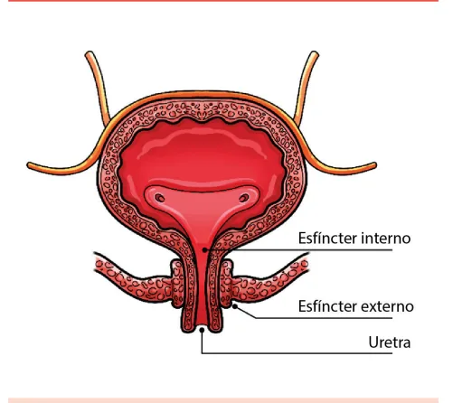
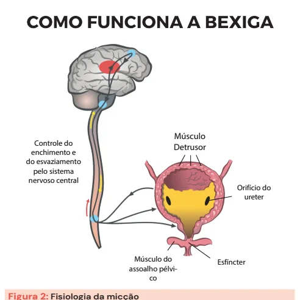

# Incontinência Urinária no Idoso

<!-- page:1 -->

Incontinência Urinária no Idoso (CM)

- É a perda involuntária de urina, de qualquer origem e em qualquer quantidade, presente em até 50% das idosas

- Fatores de risco: idade, obesidade, multiparidade, história familiar, tabagismo

- Causas reversíveis: delirium, infecções do trato urinário, uretrite e vaginites atróficas, restrição de mobilidade, aumento do débito urinário, medicamentos, impactação fecal.

Tipos Incontinência Definição Incapacidade de adiar o Urgência esvaziamento após sensação plenitude vesical Perda involuntária pelo aumen Esforço pressão intra-abdominal (ao t espirrar e outros)

Incontinência em bexiga Transbordamento hiperdistendida devido a (overflow) mecanismos de obstrução (fecaloma, HPB, estenose de u Perda por incapacidade Funcional psicológica, cognitiva ou ambi Mais de uma característica ou Mista predisponente

## DEFINIÇÃO

- É a perda involuntária de urina, de qualquer origem e em qualquer quantidade.

- 50% das idosas possuem incontinência urinária

- É um problema que afeta diversos domínios do indivíduo: Transtornos psíquicos; Isolamento social, depressão/ansiedade. Disfunção sexual; Pelo receito de escape urinário durante a relação sexual. Morbidade clínica; Dermatite de contato; Candidíase perineal pelas fissuras geradas; Quedas: urgência e ambiente úmido Tratamento

- Tratamento geral: perda de peso, treinamento vesical, não ingerir líquidos de forma abundante;

- Evitar cafeína, álcool e tabaco, tratar constipação, eliminar barreiras físicas de acesso ao banheiro;

- Incontinência urinária de esforço: cones vaginais, pessário, fisioterapia, sling.

- Incontinência urinária de urgência: fisioterapia pélvica, anti muscarínico ou beta 3 agonista, perda obstrução infravesical, o de Variável síndrome genitourinária da pós menopausa nto de tossir, Pequeno a Fecaloma o Prolapso vaginal uretra) Neuropatias iental u fator genitourinária do climatério prostática benigna (HPB)

TENS, botox. Volume de Causas Doenças neurológicas, Hipermobilidade da uretra Deficiência esfincteriana HPB/Ca próstata Pequeno Demências Grande Transtornos de humor Ambientais Variável Variável Tabela 1: Fatores de risco da incontinência urinária no idoso Mulheres: síndrome Idade Homens: hiperplasia Multiparidade (parto normal)

Obesidade História familiar Tabagismo

---

<!-- page:2 -->

## FISIOPATOLOGIA

| SNA simpático – Noradrenalina → Relaxa detrusor + contrai EIU;

- Aumento nas fibras de colágeno na bexiga | “Faz o sinergismo detrusor-esfíncter”. Redução da sua elasticidade;

- Arco reflexo da micção:

- Os receptores de pressão se alteram | SNA parassimpático - ACh → Contrai

- Os receptores de pressão se alteram Contrações involuntárias;

- Resultando em um períneo fragilizado, por múltiplos fatores: Envelhecimento muscular; Carências hormonais (estrógeno) Partos; Gravidez; Sequelas de intervenções uroginecológicas ou radioterapia pélvica.

## FISIOLOGIA DA MICÇÃO

- - Figura 1: Anatomia do sistema urinário - esfíncter interno, externo e uretra

- Sistema simpático (noradrenalina - NA) Detrusor: noradrenégico – relaxa; Esfíncter uretral interno (EUI): “Nora para Não urinar”

noradrenérgico – contrai.

- Sistema parassimpático (acetilcolina - ACh) Detrusor: acetilcolina - contrai Esfíncter uretral interno (EUI): oxido nítrico – relaxa. “Acetilcolina para urinar” demonstra influência por ser de caráter somático sistema autônomo.)

ATENÇÃO: O esfíncter uretral externo, a princípio, não (isto é, depende da vontade), não sendo inervado pelo

- Verificar Figura 2 na próxima página

- Córtex cerebral: Inibe o arco reflexo da micção; SNA simpático - noradrenalina → relaxa detrusor + contrai EIU; “Quer que você segure a urina”.

- Centro pontino da micção: | SNA parassimpático - ACh → Contrai detrusor + relaxa EIU; “Quer que você urine a todo momento”.

## ETIOLOGIAS

- Para uma boa abordagem, e pelo grande impacto na qualidade de vida do paciente, é essencial revisar todas essas causas a fim de reverter à sua continência normal;

- As principais causas reversíveis são: Delirium; Infecções do trato urinário; Uretrite e vaginites atróficas; Restrição de mobilidade; Aumento do débito urinário; Medicamentos; Impactação fecal.

## CLASSIFICAÇÃO

## INCONTINÊNCIA DE URGÊNCIA

- Incapacidade de adiar o esvaziamento após sensação de plenitude vesical;

- Volume de perda variável.

- Causas: Doenças neurológicas; Por comprometimento do primeiro compartimento, há déficit no envio das informações noradrenérgicas a fim de impedir a micção. Doença do SNA (parassimpático), músculo liso da bexiga (receptores muscarínicos) ou anticolinérgicos; Obstrução infravesical; Ex. Hiperplasia Prostática Benigna; Estenose de uretra. Inicialmente sintoma de esvaziamento, por aumento do esforço para vencer o ponto obstrutivo; Posteriormente, evolui com sintomas de armazenamento. Síndrome gênito-urinária da pós-menopausa; Pós-menopausa, ocorre redução dos hormônios, principalmente o estrôgeno. Tal hormônio é responsável pela nutrição da parede da uretra, mantendo a musculatura tônica. A deficiência hormonal estrogênica altera a musculatura da bexiga, contribuindo para atrofia e inflamação da bexiga e uretra. Outros: Cistite intersticial; Idiopática.

- Quadro clínico Urgência miccional; Polaciúria; Noctúria; Requer exclusão de infecção do trato urinário.

---

<!-- page:3 -->

## INCONTINÊNCIA FUNCIONAL

- Perda por incapacidade psicológica, cognitiva ou ambiental;

- Grandes volumes.

- Causas enchimento e do esvaziamento pelo sistema nervoso central ureter assoalho pélvico

Músculo Controle do Detrusor Orifício do Músculo do Esfíncter Figura 2: Fisiologia da micção INCONTINÊNCIA DE ESFORÇO

- Conhecida como “bexiga caída”

- Perda involuntária pelo aumento de pressão intraabdominal (ao tossir, espirrar e outros);

- Pequenos volumes.

- Causas: Hipermobilidade da uretra (musculatura pélvica e tecido conectivo vaginal flácidos); Os esfíncteres externo e interno funcionam, mas um frágil anteparo permite o escape urinário; Deficiência esfincteriana Dano neuromuscular com disfunção de esfíncter, após cirurgias abdominais e lesão direta de nervo ou de músculo.

## INCONTINÊNCIA POR TRANSBORDAMENTO (OVERFLOW)

- Incontinência em bexiga hiperdistendida devido a mecanismos de obstrução (fecaloma, HPB, estenose de uretra); Assim, em uma bexiga em sua capacidade máxima, a ocorrência de qualquer aumento de pressão favorece a incontinência.

- Pequenos volumes.

- Risco de hidronefrose, LRA pós-renal

- Causas: HPB / CA próstata; Fecaloma; Prolapso vaginal; Neuropatia periférica avançada (DM2, p.e); A lesão nervosa prejudica o envio do estímulo para contração; Lesão de plexo sacral S2 - S4 (pós-operatório); Lesão medular com neuropatia e disfunção da bexiga. - Causas Demência Transtornos de humor Ambientais Deficiência visual Acessibilidade ao banheiro

## INCONTINÊNCIA MISTA

- Quadro com mais de uma característica ou fator predisponente.

- Volumes variáveis

## TRATAMENTO

## ABORDAGEM INICIAL

- Avaliar o tipo da incontinência urinária;

- Avaliar medicações;

- Montar diário urinário (frequência, fluxo, quantidade e perdas);

- Toque retal; Afastar a constipação e a impactação fecal.

- Teste do estresse; Com bexiga cheia, é exercida pressão abdominal para avaliar perdas urinárias.

- Urina tipo 1; Pesquisa de infecção.

- USG com resíduo pós-miccional;

- Estudo urodinâmico.

## , CONDUTA GERAL

- Perda de peso;

- Não ingerir líquidos de forma abundante;

- Evitar cafeína, álcool e tabaco; São substâncias irritativas da via urinária.

- Tratar constipação;

- Eliminar barreiras físicas de acesso ao banheiro;

- Exercícios pélvicos (Kegel) e Cones Vaginais (mais efetivo para incontinência urinária de esforço);

- Treinamento vesical Programação de esvaziamento vesical; 15 minutos sem ida ao banheiro; Programar aumento de tempo para dessensibilizar a bexiga, no intuito de conter maiores volumes.

- Eletroestimulação TENS; Eletrodos de estimulação posicionados na perna, que geram estímulo que regula o plexo sacral, auxiliando no controle das contrações involuntárias.

- Estrogênio vaginal

---

<!-- page:4 -->

INCONTINÊNCIA DE ESFORÇO Segunda linha Pessário

- Antimuscarínicos (oxibutinina, solifenacina,

- Colocado pelo urologista/ginecologista, como darifenacina, trospium);

adjuvante para fisioterapia;

- Atenção aos efeitos colaterais da

- Mantém a uretra em posição verticalizada, alterando classe anticolinérgica.

o posicionamento dos esfíncteres, reduzindo a

- Beta-3-agonistas (mirabegrona).

hipermobilidade da uretra. Terceira linha Cirurgia (sling)

- Toxina botulínica.

- Útil na refratariedade com medidas ambientais + Outros fisioterapia pélvica ou pessário (específico para IUE).

- Neuromodulação sacral (TENS).

Primeira linha

- Fisioterapia pélvica.
