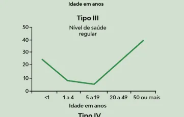
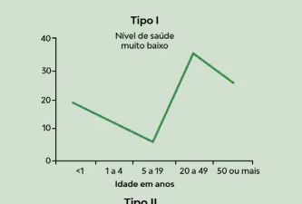
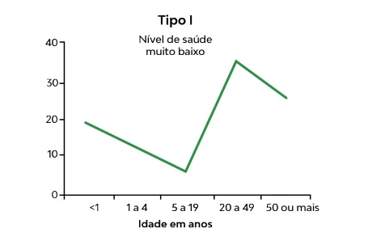
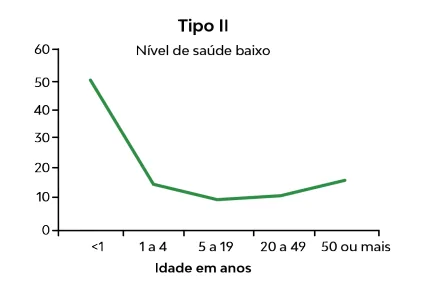

# Indicadores de Saúde Parte (2)

<!-- page:1 -->

Indicadores e Medidas de Saúde PRINCIPAIS ÍNDICES

- Mortalidade Proporcional por Causa: (Número de óbitos por determinada causa /número total de óbitos) x 100.

- Mortalidade por Faixa Etária: (Número de óbitos em uma faixa etária específica / número total de óbitos) x 100.

- Mortalidade Infantil (proporcional): (Número de óbitos em menores de 1 ano / número total de óbitos [todas as idades]) x 100. Não confundir com Coeficiente de Mortalidade

Infantil: (Número de óbitos em menores de 1 ano / Número de Nascidos Vivos) x 1.000 Indicador de Swaroop-Uemura (Razão de Mortalidade Proporcional)

- Cálculo = (Número de óbitos em pessoas com 50 anos ou mais / número total de óbitos) x 100.

- 1º Nível > 75%

- 2º Nível: 50 a 74%

- 3º Nível > 25 a 49%

- 4º Nível < 25%

Curvas de Nelson de Morais Figura 1: Curvas de Nelson de Morais. OUTROS INDICADORES IMPORTANTES

- Taxa de Natalidade: Número de nascidos vivos dividido pela população total residente, multiplicado por 1.000.

- Taxa de Fecundidade Geral: Número de nascidos vivos de mães com idade entre 15 e 49 anos dividido pela população feminina residente nesta mesma faixa etária, multiplicado por 1.000.

- Expectativa de Vida ao Nascer: Estimativa do número médio de anos que um recém-nascido pode esperar viver, com base nas taxas de mortalidade vigentes no momento do nascimento.

(Não tem fórmula numérica direta simples.)

- Anos Potenciais de Vida Perdidos (APVP):

Diferença entre a idade padrão de expectativa de vida (por exemplo, 70 anos) e a idade em que ocorreu o óbito, somada para todos os óbitos prematuros.

- Anos Vividos com Incapacidade (AVI): Prevalência de uma condição incapacitante multiplicada pelo peso de incapacidade (de 0 a 1), correspondente à gravidade da condição.

- DALY (Disability-Adjusted Life Years): Soma dos

Anos Potenciais de Vida Perdidos (APVP) com os Anos Vividos com Incapacidade (AVI). Em texto: DALY é igual ao APVP mais o AVI.

(Ou seja, DALY = APVP + AVI.)

---

<!-- page:2 -->

## PRINCIPAIS ÍNDICES

## ÍNDICE DE MORTALIDADE POR CAUSA

- Proporção entre óbitos por causa e total de óbitos

- Também chamado de Mortalidade Proporcional

- Também chamado de Mortalidade Proporcional por Causa

- (Número de óbitos por uma causa específica / Número total de óbitos) x 100.

## ÍNDICE DE MORTALIDADE POR IDADE

- Proporção entre óbitos por faixa etária e total de óbitos

- (Número de óbitos em uma faixa etária específica /

Número total de óbitos) x 100.

## MORTALIDADE INFANTIL PROPORCIONAL

- Proporção entre óbitos abaixo de 1 ano de idade e total de óbitos

- (Número de óbitos em menores de 1 ano / Número total de óbitos (todas as idades)) x 100.

## INDICADOR DE SWAROOP-UEMURA

- Razão de Mortalidade Proporcional (RMP) 1º Nível > 75% I 2º Nível: 50 a 74% 3º Nível > 25 a 49% T 4º Nível < 25%

- Nº de óbitos ≥ 50 anos

RMP =

- Nº total de óbitos

## CURVAS DE NELSON DE MORAES

- Também chamadas de Curvas de

Mortalidade Proporcional

- Tipo I – Nível de saúde muito baixo

- Tipo II – Nível de saúde baixo

- Tipo III – Nível de saúde regular T

- Tipo IV – Nível de saúde elevado

- - - - Figura 1: Curvas de Nelson de Morais.

## OUTROS INDICADORES

## IMPORTANTES TAXA DE NATALIDADE

- Total de nascidos vivos em relação à população total

- Expressa a frequência anual de nascidos vivos.

- A taxa bruta de natalidade é influenciada pela estrutura da população, quanto a idade e sexo.

- Taxas elevadas estão em geral associadas a baixas condições socioeconômicas e culturais da população.

- Fórmula: (Número total de nascidos vivos de residentes / população total residente) X 1000

## TAXA DE FECUNDIDADE

- Número médio de filhos nascidos vivos, por faixa etária específica do período reprodutivo, na população residente no ano considerado

- Taxa de fecundidade = (Número de nascidos vivos de mães residentes e na faixa etária/ População total feminina residente e na mesma faixa etária) X 1000

- Taxa de Fecundidade Total (TFT)

- A TFT estima o número médio de filhos que uma mulher teria ao longo de toda a vida reprodutiva (15 a

49 anos), mantidos os padrões atuais de fecundidade.

- A taxa de fecundidade total é obtida pelo somatório das taxas específicas de fecundidade para cada idade das mulheres residentes de 15 a 49 anos.

- As taxas específicas de fecundidade expressam o número de filhos nascidos vivos tidos por mulher, por ano, das faixas etárias de 15-19, 20-24, 25-29, 30-34,

35-39, 40-44 e 45-49 anos.

---

<!-- page:3 -->

## EXPECTATIVA DE VIDA AO NASCER ANOS POTENCIAIS DE VIDA PERDIDOS (APVP)

- Número médio de anos de vida esperados para um

- Anos de vida perdidos devido à recém-nascido, mantido o padrão de mortalidade mortalidade prematura existente na população residente, em determinado

- Diferença entre a expectativa de vida e a idade no espaço geográfico, no ano considerado momento da morte espaço geográfico, no ano considerado

- Usa-se a tábua de vida, construída a partir de dados de mortalidade por idade.

- Considera-se uma coorte hipotética de recémnascidos (geralmente l = 100.000).

- Calcula-se o total de anos que essa geração viveria até a última idade.

- Fórmula: EVN = T /l ao Nascer.

0 0 Tabela 1: Componentes da fórmula da Expectativa de Vida Símbolo Significado Explicação prática Número médio de anos que um recém-nascido Esperança de EVN deve viver, se o padrão vida ao nascer de mortalidade atual se mantiver.

É a soma de todos os anos vividos (mesmo Soma de todos que incompletos) por os anos vividos uma geração hipotética 0 pela coorte até o de recém-nascidos até fim da vida a última idade possível (normalmente 100 anos ou mais).

Em geral, assume-se Número de que 100.000 pessoas l nascidos vivos na nasceram ao mesmo coorte hipotética tempo para fazer os cálculos da tábua de vida.

momento da morte

- O APVP quantifica o impacto da mortalidade precoce, atribuindo maior peso a óbitos que ocorrem em idades mais jovens.

## ANOS VIVIDOS COM INCAPACIDADE (AVI)

- Produto da prevalência de determinada condição e do peso da deficiência para essa condição

## DALY – ANOS DE VIDA PERDIDOS AJUSTADOS POR INCAPACIDADE

- Soma dos Anos Potenciais de Vida Perdidos (APVP) e dos Anos Vividos com Incapacidade (AVI)

- 1 DALY = 1 ano perdido de vida saudável

- Utilizado para estimar a carga global de doenças

(Global Burden of Disease) REFERÊNCIAS Figura 1: UNIVERSIDADE FEDERAL DE SANTA CATARINA. Indicadores de saúde: conceitos e tipos. Florianópolis: UNA-SUS/ UFSC, 2020.

Tabela 1: BRASIL. Ministério da Saúde. DATASUS. Indicadores de saúde: esperança de vida ao nascer. Brasília: Ministério da Saúde, [s.d.].
