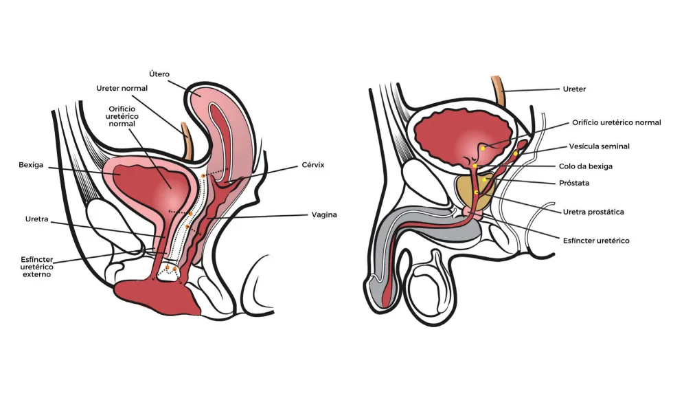

# Infecção de Trato Urinário (ITU)

<!-- page:1 -->

## Infecção do Trato Urinário (ITU)

### Infecção Urinária Não Complicada (Cistite)

- Mais comum em mulheres em idade fértil. Uretra feminina propicia ascensão de bactérias (E. coli);
- **Sintomas**: disúria, polaciúria, urgência miccional, dor suprapúbica;
- **Diagnóstico**: em mulheres, clínico; nos demais, urina 1 e urocultura (URC);
- **Tratamento**:
  - Ambulatorial: amoxicilina + clavulanato, cefuroxima, ciprofloxacino;
  - Hospitalar: ceftriaxona;
  - Fosfomicina 3g dose única; nitrofurantoína 100 mg 6/6h por 5 dias.
- **Imagem**: solicitar se suspeita de complicações (dor refratária, refratariedade ao tratamento, sepse).

### Bacteriúria Assintomática

- ≥ 10⁵ UFC em cultura de urina — sem sintomas;
- **Tratar em**: gestantes; cirurgia urológica; transplante renal recente.

### Infecção Urinária Complicada (Pielonefrite)

- Sintomas urinários + sistêmicos (febre, calafrios, dor lombar);
- **Diagnóstico**: urina 1 + urocultura para todos;
- **Tratamento**: seguir o antibiograma.

## Epidemiologia

- Prevalência muito maior no sexo feminino: menor comprimento da uretra; via ascendente é facilitada no intercurso sexual;
- No sexo masculino (lembrar dos extremos de idade):
  - < 1 ano: malformação do trato urinário;
  - > 60 anos: doenças da próstata.

*Figura 1: Anatomia e diferenças entre o trato urinário masculino e feminino.*

---

<!-- page:2 -->

## Cistite

### Infecção Não Complicada

- Infecção restrita à bexiga;
- Ausência de sinais e sintomas sistêmicos;
- Disúria, polaciúria, urgência, dor suprapúbica;
- Diagnóstico é clínico (em mulheres em idade fértil);
- Agente mais comum: E. coli.

### Diagnóstico

- Urina tipo 1 + urocultura;
- **Imagem**: para avaliação de complicações (febre persistente, gravidade ou disfunção renal).

### Exames Complementares

- Solicitar urina 1 + urocultura em situações especiais:
  - Internação hospitalar recente;
  - Urocultura prévia com germe multirresistente;
  - Antibiótico nos últimos 3 meses.

### Tratamento

- Preferência a antibióticos que agem exclusivamente na via urinária: fosfomicina 3g dose única; nitrofurantoína 100 mg 6/6h;
- Pode ser considerado sulfametoxazol + trimetoprim ou norfloxacino.

## Infecção de Trato Urinário Complicada — Pielonefrite e Afins

- Presença de sintomas sistêmicos em episódio de infecção urinária: febre e calafrios; dorsalgia ou lombalgia; dor pélvica em homens;
- Diagnóstico diferencial em homens: prostatite;
- Gravidade ou disfunção renal.

### Tratamento

- Pacientes sem sinais de gravidade: ambulatorial — ciprofloxacino; amoxicilina + clavulanato;
- Pacientes com complicações ou gestantes: parenteral — ceftriaxona;
- Sempre checar a urocultura e perfil de sensibilidade.

## Bacteriúria Assintomática

- Presença da bactéria, porém sem infecção (doença);
- Não tem impacto na população geral; tratar apenas nessas situações: gestantes; transplante renal; procedimento urológico.

### Diagnóstico

- Laboratorial: cultura com mais que 10⁵ UFC;
- Sexo feminino: 2 culturas positivas;
- Sexo masculino: cultura única;
- Sonda vesical: uma cultura única.
