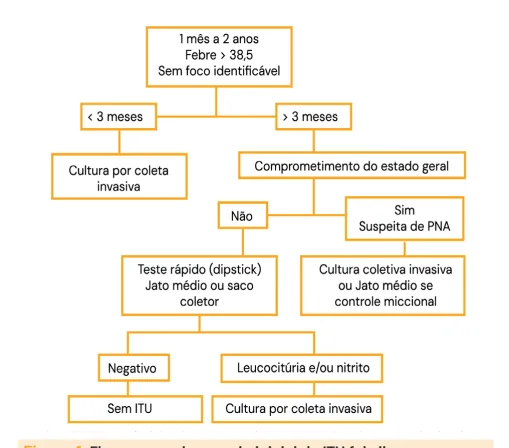

# Infecção do Trato Urinário (ITU)

<!-- page:1 -->

## Infecção de Trato Urinário (Pediatria)

### Apresentações Clínicas

- Cistite;
- Pielonefrite;
- Bacteriúria assintomática.

> Atenção: meninas com FSSL de 3 a 24 meses; meninos com FSSL < 1 ano e não circuncidados.

### Agente Etiológico

- **E. coli** em 80 a 90% dos episódios; **Proteus** em meninos com > 6 meses.

### Diagnóstico

**Urina 1 (EAS):**

- Leucócitos ≥ 5-10 ou ≥ 10.000/ml;
- Esterase > 1+ (presença de neutrófilos);
- Nitrito → sugere bacilo gram-negativo (BGN);
- Bacterioscopia (Gram).

**Cultura — identificação e contagem:**

- Jato médio: ≥ 10⁵ UFC/ml;
- Cateter: ≥ 10⁴ UFC/ml;
- PSP: qualquer contagem.

> Atenção: há divergências na literatura em relação aos pontos de corte de UFC/ml considerados como positivo, entre os métodos. Esses critérios acima são os mais atualizados, conforme Tratado da Sociedade Brasileira de Pediatria, 2024.

## Introdução

### Definição

- Presença de germes patogênicos no sistema urinário juntamente a um processo inflamatório sintomático.

### Epidemiologia

- As infecções do trato urinário estão entre as infecções bacterianas mais comuns em crianças (até 8% têm um episódio entre 1 mês e 11 anos);
- É a segunda infecção bacteriana mais prevalente na pediatria, acometendo 8,4% das meninas e 1,7% dos meninos, dentre os menores de 7 anos;
- Tem alto risco de recorrência no primeiro ano após o evento;
- No primeiro ano de vida, acomete igualmente meninos e meninas;
- Picos de incidência: lactente; segunda infância; adolescência.

### Fatores de Risco

- Refluxo vesicoureteral (RVU) (20%);
- Outras malformações do trato geniturinário (TGU): válvula de uretra posterior (VUP), estenose de junção ureteropiélica (JUP), hipodisplasia renal, hidronefrose antenatal, bexiga neurogênica;
- Cateterismo;
- Ausência de circuncisão;
- Constipação;
- Imunossupressão;
- Atividade sexual;
- Uso prévio de antibiótico (ATB).

### Quadro Clínico

**Recém-nascidos e lactentes:**

- FSSL (incidência de 7-15%);
- Vômitos;
- Diarreia;
- Icterícia persistente;
- Inapetência;
- Irritabilidade;
- Sepse;
- Febre costuma ser alta (> 39ºC).

**Pré-escolares:**

- Febre;
- Urina fétida;
- Dor abdominal;
- Disúria;
- Polaciúria;
- Urgência miccional;
- Incontinência.

**Escolares:**

- Predominam os sintomas miccionais;
- Enurese secundária;
- Dor lombar;
- Febre nos casos de pielonefrite.

**Adolescentes:**

- Disúria;
- Polaciúria;
- Urgência miccional;
- Nos casos de pielonefrite: dor lombar e febre.

---

<!-- page:2 -->

> ⚠️ Tabela reconstruída a partir de OCR — confira contra a fonte original.

**Tabela 1: Pontos de corte de UFC/ml conforme método de coleta de urina**

| Método (UFC/ml) | SBP - documento científico 2023 | SBP - Tratado 6ª edição (2024) | Nelson - 2019 | Nelson - 2024 |
|---|---|---|---|---|
| PSP | 0 | 0 | Qualquer contagem | Qualquer contagem |
| Cateterismo | 1.000 a 50.000 | > 50.000 | ≥ 10.000 (melhor S e E) | ≥ 10.000 |
| Jato médio | > 100.000 (1 patógeno) | > 100.000 | Não específica método (1 patógeno, Ur1 alterada) | ≥ 50.000 (Ur1 alterada, URC ≥ 50.000) |
| Saco coletor | - | > 100.000 (1 patógeno) | - | Dependendo do contexto |

> Legenda: ausência de consenso em relação aos pontos de corte considerados referência conforme fonte bibliográfica.

### Apresentações Clínicas

- **Cistite** — infecção urinária baixa;
- **Pielonefrite** — infecção urinária alta;
- **Bacteriúria assintomática** — bacteriúria na ausência de sintomas compatíveis com ITU; indicação de tratamento antes de procedimentos urológicos ou implantação de próteses, gestação, alto risco de complicações infecciosas como transplantados renais e crianças com RVU.

### Outras Classificações

**Classificação por gravidade:**

- **ITU simples:** febre baixa, boa ingesta hídrica, desidratação leve, boa evolução;
- **ITU grave:** febre > 39,5ºC, vômitos, desidratação moderada ou grave, evolução ruim.

**Classificação por fator complicador:**

- **ITU não complicada:** sem malformação, função renal normal, imunocompetente;
- **ITU complicada:** evidência de pielonefrite, obstrução mecânica ou funcional do TU, imunossuprimidos, ITU em neonato.

**ITU atípica:**

- Agente não E. coli;
- Paciente gravemente doente;
- Baixo fluxo urinário;
- Creatinina elevada;
- Massa abdominal ou vesical;
- Falha com 48h de tratamento adequado.

### Etiologia

- 80 a 90% dos episódios agudos de pielonefrite adquirida na comunidade, principalmente em crianças, são por E. coli;
- Em meninos maiores de 6 meses de vida, predomina Proteus mirabilis;
- Uropatógenos menos comuns: Enterococcus spp (RN e lactente); Klebsiella spp; Staphylococcus saprophyticus; Pseudomonas; Streptococcus agalactiae; Enterobacter spp.

### Fisiopatologia

Existem 2 vias de disseminação:

1. **Hematogênica** — quadro de sepse, alta mortalidade (10%), bacteremia frequente, mais comum em RN;
2. **Ascendente** — migração, fixação e proliferação de bactérias uropatogênicas no trato urinário, mais comum no período pós-neonatal.

### Diagnóstico

**Sedimento urinário (UR1/EAS):**

- Leucócitos — ≥ 5-10/campo de grande aumento ou ≥ 10.000/ml;
- Esterase leucocitária (> 1+): sugere presença de neutrófilos: ITU bacteriana; piúria estéril; outros processos inflamatórios (febre, infecções virais, vulvovaginites, glomerulopatias, nefrites intersticiais, urolitíase, etc.);
- Nitrito: altamente sugestivo de presença de bacilos gram-negativos;
- Presença de bactérias.

**Urocultura (URC): critérios da SBP (2024):**

- Punção suprapúbica (PSP): qualquer contagem de colônias;
- Cateterismo vesical: acima de 10.000 UFC/ml;
- Jato intermediário: acima de 50 a 100 mil UFC/ml;
- Saco coletor: taxa de contaminação de 46%;
- Há divergências desses pontos de corte na literatura.

Verificar Tabela 1.

---

<!-- page:3 -->

- UpToDate: 10 dias em crianças febris, 3-5 dias em crianças afebris;
- Cochrane: necessários novos estudos para definir tempo de terapia;
- SBP: febril por 10 dias.

Figura 1: Fluxograma de manejo inicial da ITU febril em menores de 2 anos.

## Tratamento

### Escolha do Antibiótico

- Escolha empírica: maioria por E. coli; avaliação do Gram, considerar oscilação do nível de resistência antimicrobiana e verificar com regularidade a sensibilidade bacteriana local;
- **Parenterais:** cefuroxima, ceftriaxona, gentamicina, amicacina, piperacilina-tazobactam;
- **Orais:** axetil-cefuroxima, cefaclor, amoxicilina-clavulanato, nitrofurantoína (não tem boa penetração no parênquima renal, usar só para cistite e não pielonefrite), sulfametoxazol-trimetoprim;
- **Antibióticos preferidos para o tratamento de pielonefrite e infecções complicadas do trato urinário causadas por bactérias com beta-lactamase de espectro estendido (ESBL):**
  - Ertapenem, meropenem, imipenem-cilastatina;
  - Ciprofloxacino, levofloxacino;
  - Trimetoprima-sulfametoxazol.

> Obs.: se um carbapenem for iniciado e a susceptibilidade à ciprofloxacina, levofloxacina ou trimetoprima-sulfametoxazol for demonstrada, a transição para esses agentes é preferível para evitar resistência.

- Em recém-nascidos:
  - Bacteremia, meningite: manifestação dependente de gravidade;
  - Cobrir GBS e enterococo e lembrar de Candida sp. nos RNPT;
  - Ampicilina + Gentamicina.
- Em < 3 meses, o tratamento parenteral é obrigatório;
- Sempre ponderar parenteral em lactentes jovens;
- Acima de 3 meses a via de administração preferencial é a oral (VO).

### Tempo de Tratamento

- NICE: 7-10 dias;
- AAP (americana): 7-14 dias;
- SBP: febril por 10 dias.

### Critérios de Internação

- Menores de 2 meses;
- Urosepse;
- Imunossuprimidos;
- Vômitos ou intolerância VO;
- Falha no tratamento ambulatorial;
- Impossibilidade de seguimento ambulatorial.

### Avaliação de Melhora

- Espera-se melhora clínica em 24h para cistites e 48-96h para pielonefrites;
- Avaliar tratamento em 48 a 72h, avaliando resultado do antibiograma para possibilidade de descalonamento do antibiótico;
- Em quadros arrastados é necessário investigar complicações;
- Não é recomendada urocultura de controle em quadros não complicados. Se quadro arrastado, é indicada para prosseguir investigação.

## Investigação Pós-Diagnóstico

- Em 30% das crianças com anomalias congênitas do rim e trato urinário, a ITU pode ser o primeiro sinal.

### Indicações

- Infecções recorrentes;
- ITU com bacteremia ou sepse;
- Etiologia atípica;
- Curso clínico prolongado com falha de resposta ao tratamento com ATB após 48-72h;
- Apresentação atípica (como em meninos mais velhos);
- Alteração conhecida em US pré-natal.

### Ultrassonografia (US) de Rins e Vias Urinárias

- Avaliação anatômica dos rins, dilatação da pelve renal ou ureter;
- Avalia também esvaziamento vesical e espessura da parede da bexiga;
- **Quando realizar:** após resolução dos sintomas agudos ou na fase aguda se a febre persistir por mais de 72 horas;
  - AAP e SBP: fazer em todos os menores de 2 anos com ITU febril;
  - NICE: fazer em todos os < 6 meses.

### Uretrocistografia Miccional (UCM)

- Permite a visualização de alterações da uretra e da bexiga, como, por exemplo, a presença de divertículo e de RVU.

---

<!-- page:4 -->

## Profilaxia

- Existe uma efetividade limitada de profilaxia antibiótica para redução de cicatriz renal, que seria a principal justificativa para sua realização.

**Indicação:**

- AAP: realizar após o segundo episódio de ITU febril em crianças de 2 a 24 meses ou US alterado;
- NICE: < 3 anos após ITU atípica ou ITUs recorrentes;
- SBP: realizar nas crianças < 2 anos com US de rins e vias urinárias alterado.

### Cintilografia Renal com DMSA

- Usado para detectar cicatrizes renais;
- Precoce: em 2 semanas de uma ITU;
- Tardia: ≥ 4 meses após uma ITU;
- Não usado de rotina para avaliar ITU (AAP e NICE): NICE recomenda em < 3 anos se ITU atípica ou ITU recorrente.

Figura 2: Fluxograma de investigação complementar após episódio de ITU em menores de 2 anos de idade — considera menores de 2 anos com US de trato urinário evidenciando ou não RVU, controle de tratamento com uroterapia e investigação de constipação, e seguimento com uretrocistografia miccional e quimioprofilaxia conforme evidência de RVU.

**Indicações de quimioprofilaxia (SBP 2023):**

- Profilaxia até o término da investigação;
- Crianças com alterações na ultrassonografia;
- RVU graus 4 ou 5;
- Uropatias obstrutivas;
- ITU febril com PCR positivo;
- ITU recorrente (dois ou mais episódios de pielonefrite, um episódio de cistite e um de pielonefrite, 3 ou mais episódios de cistite).

**Escolha:**

- Nitrofurantoína;
- Sulfametoxazol e trimetoprima (> 6 semanas);
- Cefalexina (< 6 semanas de vida);
- Dose: 1/3 ou 1/2 da dose terapêutica, uma vez ao dia.
