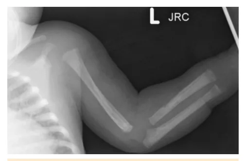
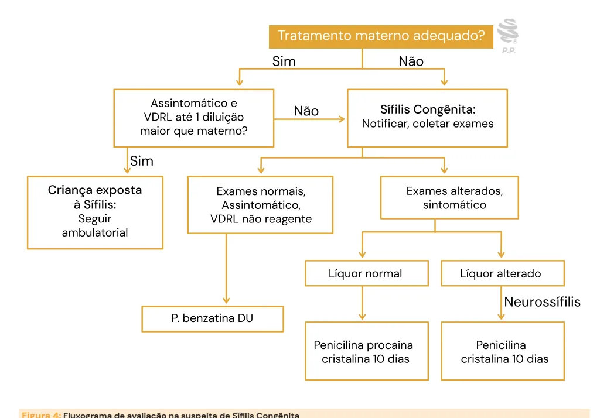
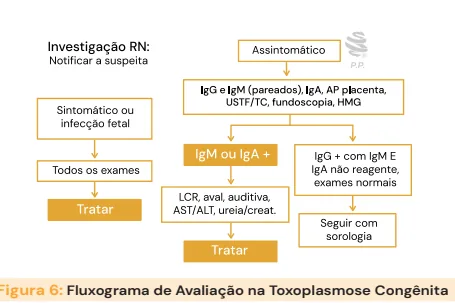
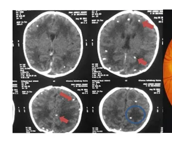
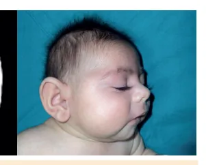
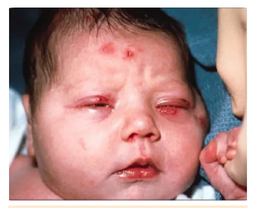
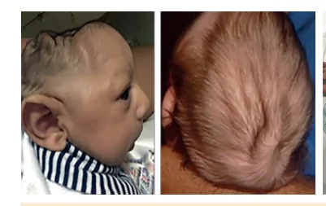

# Infecções Congênitas

<!-- page:1 -->

Infecções congênitas (PED)

## SÍFILIS CONGÊNITA

1. Avaliar tratamento materno, sintomas do RN e

- VDRL pareado:

- Tratamento materno adequado: iniciado 30 dias antes do parto, com penicilina benzatina, posologia adequada para o estágio R

2. Classificar:

- Criança Exposta (tratamento materno adequado apenas seguimento ambulatorial

+ RN assintomático + VDRL até 1 diluição maior): H

- Sífilis Congênita: notificar, coletar demais exames

(HMG, RX ossos longos e LCR) e tratar.

- Toxoplasmose Congênita: Z

- Infecção na gestante: ≤ 16 sem: IgG e IgM positivos, com avidez baixa. >16 sem: IgG e IgM positivos.

- Quadro clínico: hidrocefalia, coriorretinite e E calcificações cerebrais. I

- Exames iniciais: IgG e IgM pareados, IgA,

- USTF, FO, HMG Se alterados (IgM ou IgA+) ou sintomático: Se normais e assintomático:

coletar LCR, avaliação auditiva e tratar seguimento sorológico

- Tratamento: Sulfadiazina + Pirimetamina + AF 12 meses. Pred se SNC ou ocular

Citomegalovirose Congênita: E

- Quadro clínico: calcificações periventriculares, microcefalia, surdez neurossensorial, PIG, icterícia,

## CONCEITOS

- - Definição: Infecções adquiridas intra útero ou durante o trabalho de parto (perinatais).

- Significativa morbidade e mortalidade.

- SToRCHZ.

- Sífilis.

- Toxoplasmose. M

- Rubéola. A

- Citomegalovírus.

- Herpes Simples.

- Zika.

- Algumas delas possuem o rastreio sorológico pelo pré-natal (sífilis, toxoplasmose, HIV, hepatite B e C) .

- Lembrar:

- IgG atravessa a placenta – G de gestação.

IgM - fetal/neonatal!

- As infecções congênitas são mais graves quando adquiridas no primeiro trimestre da gestação.

Alterações suspeitas:

- Hidropsia fetal E

- Microcefalia

- Convulsões hepatoespleno, petéquias, plaquetopenia

- Diagnóstico: PCR ou isolamento viral urina ou saliva até 3ª semana

- Tratamento: se sintomas (valganciclovir VO ou ganciclovir EV)

Rubéola:

- Ocular: catarata, glaucoma; cardiopatia congênita;

perda auditiva. Herpes:

- Mucocutânea: vesículas, ceratoconjuntivite; SNC:

convulsão, meningoencefalite. Disseminada.

- Tratamento: aciclovir

Zika:

- Microcefalia, desproporção craniofacial, artrogripose

Exposição Vertical ao HIV: Iniciar profilaxia nas primeiras 4h:

- Baixo risco: Mãe iniciou TARV na 1ª metade E CV indetectável 3º trimestre E sem falha de adesão:

Zidovudina (AZT) 28 dias.

- Alto risco: ≥37 sem: AZT + 3TC + RAL por 28 dias ≥34 - <37 sem: AZT + 3TC + nevirapina por 28 dias <34 sem: AZT por 28 dias

Exposição Vertical à Hepatite B:

- Banho em água corrente, vacina (até 12h) +

Imunoglobulina (IGHAHB até 24h)

- Catarata

- Perda auditiva

- Cardiopatia congênita

- Hepatoesplenomegalia

- Icterícia

- Alterações cutâneas

- Trombocitopenia

Maioria é assintomática ao nascimento. Avaliação inicial:

- História materna

- Exame físico e neurológico do recém-nascido (RN)

- Hemograma

- AST/ALT

- Punção lombar

- Radiografia de ossos longos

- Neuroimagem (ultrassonografia transfontanela ou tomografia)

- Fundoscopia

- Avaliação auditiva.

## ETIOLOGIA

- Treponema pallidum – espiroqueta

---

<!-- page:2 -->

## TRANSMISSÃO

- Transplacentária ou contato direto – lesão canal de parto

- Qualquer IG e qualquer estágio de doença materna

## EXAMES COMPLEMENTARES

Testes treponêmicos (FTA-ABS, TR, TPHA)

- Teste rápido

- Reagente/não reagente. Normalmente se mantém positivo mesmo após o tratamento.

Não treponêmicos (VDRL):

- Título que decai Serve como controle de tratamento.

## APRESENTAÇÃO CLÍNICA

Precoce < 2 anos. Figura 1: Exantema maculopapular, pênfigo palmoplantar, rinite sifilítica.

- Mucocutâneo – Rinite sifilítica (serossanguinolenta), exantema maculopapular, pênfigo palmoplantar, condiloma.

LEMBRAR QUE SÃO LESÕES RICAS EM TREPONEMA – PRECAUÇÃO DE CONTATO! Figura 2: Lesões ósseas na sífilis congênita precoce (periostite em úmero, rádio e ulna).

- Musculoesquelético – pseudoparalisia de Parrot em úmero), osteocondrite, periostite.

(redução do movimento para evitar dor, normalmente

- Outras: Hepatoesplenomegalia, icterícia, síndrome nefrótica, pneumonia alba.

Tardia > 2 anos Evolução das manifestações precoces: Figura 3: Tíbia em sabre, articulações de Clutton, nariz em sela e fronte olímpica, perfuração de palato e dentes de Hutchinson na Sífilis Congênita Tardia.

- Fronte olímpica, nariz em sela, dentes de Hutchinson, perfuração do palato duro.

- Tíbia em sabre, articulações de Clutton (artrite).

- Outros: Atraso do desenvolvimento, convulsão, perda auditiva

## AVALIAÇÃO INICIAL

Todo RN de mãe com sífilis (inclusive cicatriz sorológica) necessita de 3 avaliações: Tratamento Materno

- Completo de acordo com estágio.

- Penicilina benzatina – Sífilis recente: Peni benzatina 2,4 milhões IM, DU; Sífilis tardia: Peni benzatina 2,4 milhões,

IM, 1x/sem, 3 sem.

- Iniciado até 30 dias antes do parto.

- Esperado: VDRL – diminuir 2 diluições em 3 meses ou

4 diluições em 6 meses. Clínica do RN

- Sífilis Precoce.

VDRL pareado

- VDRL RN (sangue periférico) e mãe.

- Pode ser até 1 diluição maior que o materno se mãe adequadamente tratada (exemplo: mãe 1:2 e RN 1:4).

Com essas 3 avaliações acima conseguimos diferenciar o RN em duas situações:

- Criança exposta a sífilis – precisa ter os 3 (mãe adequadamente tratada; E RN assintomático; E teste não treponêmico do RN até 1 diluição maior que o materno) = não tratar, seguimento ambulatorial.

- Sífilis congênita – quando 1 ou mais dos anteriores alterado (mãe inadequadamente tratada e/ou RN sintomático e/ou teste não treponêmico do RN maior que o materno em 2 ou mais diluições) = notificar, coletar todos os exames, tratar e seguimento ambulatorial.

Se SÍFILIS CONGÊNITA (SC):

- Solicitar exames na maternidade (além do VDRL em sangue periférico): Hemograma (HMG) - anemia hemolítica, plaquetopenia Glicemia Líquido cefalorraquidiano (LCR) - VDRL reagente, pleocitose > 25 células, proteína aumentada > Radiografia (RX) de ossos longos RX de tórax, transaminasas e bilirrubina.

150 mg/dL

---

<!-- page:3 -->

- Exames alterados ou VDRL reagente ou SEGUIMENTO sintomas = notificar Todos (expostos e com sífilis congênita). LCR alterado (>25 cels, >150 proteínas ou VDRL reagente no líquor) = SC com neurossífilis: LCR normal: SC sem neurossífilis = Benzilpenicilina procaína ou cristalina por 10 dias.

Benzilpenicilina cristalina por 10 dias;

- Exames normais e VDRL não reagente e RN assintomático – Benzilpenicilina benzatina dose única

(DU) intramuscular (IM) – acompanhar na rede básica.

## TRATAMENTO

- Benzilpenicilina potássica/cristalina: 50.000 UI/kg/ dose, endovenosa (EV) 12/12h na 1ª semana, 8/8h após

1ª semana, por 10 dias.

- Benzilpenicilina procaína: 50.000 UI/kg/dose, IM, uma vez ao dia, por 10 dias.

- Benzilpenicilina benzatina: 50.000 UI/kg IM DU.

Obs: reiniciar o tratamento se atraso > 24 horas na dose.

- Se impossibilidade de coleta de LCR tratar neurossífilis

- Se criança diagnosticada após o primeiro mês de vida:

tratamento obrigatoriamente com penicilina cristalina.

- Figura 4: Fluxograma de avaliação na suspeita de Sífilis Congênita Tabela 1: Tabela de Seguimento Ambulatorial na sífilis congênita e expostos a sífilis congênita após 2 testes não reagentes consecutivos

Frequência Avaliação 1ª sem, 1, 2, 4, 6, Consulta - AB Avaliar sinais de SC 9, 12 e 18 meses Interromper 1, 3, 6, 12 ↓ 3 meses, não

## VDRL

e 18 meses reagente com 6 meses Se ↑ (2 diluições) ou não ↓: investigar SC

- Verificar Figura 4

- Não fazer teste treponêmico.

---

<!-- page:4 -->

Sífilis congênita INVESTIGAÇÃO Tabela 2: Seguimento do Paciente Exposto à Sífilis ou Ultrassonografia (USG) pré-natal com Sífilis Congênita

- Hidrocefalia, calcificações cerebrais, hepatomegalia.

Frequência Consulta oftalmo audiológica e Semestral, por 2 anos neurológica Líquor (se A cada 6 meses até neurossífilis) normalização TOXOPLASMOSE CONGÊNITA

- Toxoplasma gondii – Protozoário intracelular

- Transplacentária (infecção materna primária, reativação).

- Qualquer fase gestacional

- Mais grave se a transmissão ocorre no 1º trimestre

- Quanto mais perto do termo = menor gravidade e maior risco de transmissão.

## QUADRO CLÍNICO

Ao nascimento, primeiros meses:

- Tríade: coriorretinite + hidrocefalia + calcificações cerebrais difusas.

- Outras: alteração LCR (proteinorraquia na Toxoplasmose Congênita

>1g), convulsões. Figura 5: Calcificações cerebrais difusas e Coriorretinite

- Subclínica: ~70%: diagnóstico mais tardio, quando ocorrem as sequelas neurológicas e oculares:

coriorretinite, perda de visão, microcefalia, atraso do DNPM, convulsões.

- Toxoplasmose congênita faz parte da Triagem Neonatal

- Teste do Pezinho Ampliado (IgM para Toxo).

## INFECÇÃO AGUDA NA GESTANTE

## SOROCONVERSÃO

- ≤16 sem: IgG + e IgM +, com avidez baixa (IgG).

- >16 sem: IgG+ e IgM+.

- Avidez: marca anticorpo “velho”. Quanto mais velho, mais experiente, mais alta avidez. Deve ser coletado até 16 semanas: se alta avidez, infecção prévia à gestação, sem risco de toxoplasmose congênita. Amniocentese

- PCR para toxoplasma no líquido amniótico (LA).

Tratamento materno

- Com infecção fetal: esquema tríplice até o parto –

Sulfadiazina + Pirimetamina + Ácido Folínico.

- Sem infecção fetal: Espiramicina até o parto.

## INVESTIGAÇÃO DO RN: AVALIAR SINTOMAS

## DE INFECÇÃO

- Teste do pezinho ampliado: IgM para Toxoplasmose Se positivo – coletar IgG e IgM pareados.

- IgM ou IgA: marcam infecção congênita

(produzidos pelo RN).

- IgM e IgG pareado (mãe e RN).

- Ultrassonografia transfontanela (USTF) para avaliar calcificações difusas.

- Fundoscopia: coriorretinite.

Outros:

- LCR: aumento de proteínas

- HMG

- Avaliação auditiva

- AST/ALT

- Creatinina/ureia.

Assintomático:

- Coletar IgG e IgM pareado, IgA, anátomo-patológico fundoscopia e HMG.

(AP) da placenta, USTF/tomografia de crânio (TC),

- Se IgM ou IgA positivo = LCR, função hepática e renal, avaliação auditiva - emissões otoacústicas (EOA)

E potencial evocado auditivo de tronco encefálico (PEATE) → tratar.

- Se IgG reagente, IgM e IgA não reagente e exames normais = controle sorológico.

Sintomático:

- Todos os exames

- Tratamento por 1 ano.

## INFECÇÃO CONFIRMADA NO RN

- DNA T. gondii em LA/placenta.

- IgG reagente e IgM ou IgA reagente

- IgG em ascensão ou se mantém reagente com

12 meses.

- RN sintomático e IgG reagente, de mãe com toxoplasmose confirmada.

l

- Tratamento por 1 ano.

Figura 6: Fluxograma de Avaliação na Toxoplasmose Congênita

---

<!-- page:5 -->

## TRATAMENTO DO RN

Sulfadiazina (S) + pirimetamina (P) + ácido folínico (AF): por 12 meses.

- 6 meses: S+P diário, AF três vezes por semana.

- Próximos 6 meses: S diária, P + AF três vezes por semana.

- Controle com hemograma - Pirimetamina pode causar supressão medular. Se neutropenia, aumentar AF.

Prednisona: por 4 semanas se houver comprometimento do sistema nervoso central (SNC) ou ocular.

## SEGUIMENTO DO RN

- Oftalmologista e Neurologista: trimestral no primeiro ano, semestral até 6 anos A

- Infectologista pediátrico, fonoaudiologia, fisioterapia.

## CITOMEGALOVIROSE CONGÊNITA

## CITOMEGALOVÍRUS

- Infecção congênita comum no mundo

## TRANSMISSÃO T

- Infecção primária, reativação ou reinfecção materna

- Congênita: pré-natal (intrauterina)

- Perinatal: periparto, pós-natal precoce - via leite materno (LM)

- Sequelas mais graves se a infecção ocorre no primeiro trimestre. C

## QUADRO CLÍNICO: E

- 90% são assintomáticos ao nascimento.

- 10% demonstram calcificações periventriculares, microcefalia, pequeno para a idade gestacional T petéquias/trombocitopenia, icterícia

(PIG), perda auditiva neurossensorial, (colestática), hepatoesplenomegalia. Q

- Perinatal em recém-nascido pré-termo (RNPT):

sepse viral.

- DICA: CMV = “Contorna Meu Ventrículo”

(calcificações periventriculares)

- Figura 7: Calcificações Periventriculares e Microcefalia na Citomegalovirose Congênita Figura 8: Icterícia Colestática e Petéquias em Face na

## AVALIAÇÃO DO RN

- Fundoscopia, avaliação auditiva, HMG, bilirrubinas, transaminases, USTF/TC.

## DIAGNÓSTICO

- PCR ou isolamento viral na saliva ou urina até

3ª semana TRATAMENTO

- Tratar se doença moderada ou grave Ganciclovir: EV, quadros graves. Valganciclovir: via oral (VO), estável.

## SÍNDROME DA RUBÉOLA

## CONGÊNITA ETIOLOGIA

- Vírus da Rubéola

- Maior no 1º trimestre, cursa com mais malformações

- Perda auditiva neurossensorial (+ bilateral).

- Cardiopatia congênita: mais comum – persistência do canal arterial (PCA) e Estenose Pulmonar.

- Alterações oculares: catarata, glaucoma.

- Outros: lesões em “muffin de mirtilo”.

- Tardias: perda auditiva e risco de doenças endocrinológicas (diabetes, disfunção tireoidiana) sugestiva de catarata congênita

Figura 9: Lesões em muffin de mirtilo e opacidade ocular

---

<!-- page:6 -->

## AVALIAÇÃO

- HMG, função hepática, RX de ossos longos, fundoscopia, audiometria, neuroimagem,

LCR, ecocardiograma.

- IgM, PCR ou isolamento viral.

- Não tem tratamento específico – seguimento com especialistas (otorrinolaringologia, oftalmologia, cardiologia).

## PREVENÇÃO

- Vacinação materna pré gestação (tríplice viral).

## HERPES SIMPLES CONGÊNITO

- HSV 1 e HSV 2.

## TRANSMISSÃO PERINATAL

- Mais comum: lesões em canal de parto.

## APRESENTAÇÕES

- Doença mucocutânea: Lesões cutâneas, orais, vesiculares, conjuntivite.

- Acometimento do SNC: Meningoencefalite, convulsões, letargia, irritabilidade, má sucção.

- Doença disseminada: Sepse, acometimento visceral, hepatite, colestase, plaquetopenia, coagulação intravascular disseminada (CIVD), meningoencefalite. Mais grave.

## INVESTIGAÇÃO

Mãe com lesão ativa por herpes genital, coletar do RN entre 12-24 horas de vida.

- Swab de conjuntiva, boca, nasofaringe e ânus (PCR e cultura viral).

- PCR viral sangue.

- LCR (se HSV detectado em amostras anteriores ou infecção materna primária).

Aciclovir

- Se doença mucocutânea - 14 dias;

- Se acometimento de SNC ou doença disseminada 21 dias. Figura 10: - RN com lesões vesiculares em face e periocular pelo acometimento mucocutâneo pelo Herpes

## SÍNDROME CONGÊNITA PELO

## ZIKA VÍRUS

## TRANSMISSÃO MATERNA

- Picada de A. aegypti ou via sexual

## TRANSMISSÃO TRANSPLACENTÁRIA

- Mais sequelas no primeiro trimestre

- Microcefalia, desproporção facial

- Artrogripose - articulações rígidas, não móveis

- Hipertonia, hiperreflexia

- Calcificações intracranianas difusas, ventriculomegalia

- Alteração ocular e perda auditiva.

Figura 11: Microcefalia e desproporção craniofacial, excesso de pele por microcefalia acentuada, artrogripose.

---

<!-- page:7 -->

## AVALIAÇÃO DO RN: REFERÊNCIAS

- Controle de perímetro cefálico (PC) em até 48 horas de vida: microcefalia se Z score < -2 desvio-padrão Figura 1: Exantema maculopapular, pênfigo palmoplantar,

(DP) (curvas da Intergrowth, OMS).

- Exame neurológico completo C

- Notificar a suspeita. r

## EXAMES

- Imagem: USTF, TC.

- Fundoscopia. C

- Teste rápido, sorologia, ELISA IgM e IgG e RT-qPCR s

(padrão ouro) no sangue e urina. C EXPOSIÇÃO VERTICAL AO HIV g

## AO NASCER

- Clampeamento imediato do cordão B

- Banho em sala de parto com água corrente R

- Aspirar vias aéreas se necessário e com cautela M

- Vacinas (hepatite B e BCG) e demais condutas P

- Contraindicação ao AM o

- Notificar exposição vertical ao HIV K

- Carga viral (CV) do HIV - coletar no sangue periférico. 2

## PROFILAXIA: AVALIAR RISCO

- Iniciar nas primeiras 4 horas.

Baixo Risco C Mãe iniciou TARV na 1ª metade da gestação E CV a indetectável 3º trimestre E sem falha de adesão T ao tratamento – se houver todos os 3 critérios o R tratamento é apenas com:

- Zidovudina (AZT) 28 dias.

Alto Risco Qualquer um dos critérios acima não preenchidos. Tratar C conforme idade gestacional: d c

- ≥37 semanas: AZT + lamivudina (3TC) + raltegravir

(RAL) por 28 dias

- ≥ 34-37 semanas: AZT + 3TC + nevirapina (NVP) por 28 dias C

- <34 semanas: AZT por 28 dias. r a

## EXPOSIÇÃO VERTICAL ÀS

## HEPATITES

- Banho em sala de parto com água corrente.

- Aspirar secreção gástrica. M

## HEPATITE B

- Vacina (até 12 horas de vida) + imunoglobulina (IGHAHB até 24h) - aplicação em membros diferentes.

## HEPATITE C

- Cuidado com fissuras sangrantes – suspender temporariamente o AM. rinite sifilítica report. Clin Exp Pediatr. 2011;54(12):512-514. Published online December

CDC Early congenital syphilis presenting with skin eruption alone: a case 31, 2011 Figura 2: Lesões ósseas na sífilis congênita precoce (periostite em úmero, rádio e ulna).

Caso clínico de Roy Waknin, Radiopaedia.org, rID: 64947 Figura 3: Tíbia em sabre, articulações de Clutton, nariz em sela e fronte olímpica, perfuração de palato e dentes de Hutchinson na Sífilis Congênita Tardia.

CENTERS FOR DISEASE CONTROL AND PREVENTION (CDC). Congenital syphilis, 2021. Disponível em: https://www.cdc.gov/std/treatmentguidelines/congenital-syphilis.htm.

Figura 5: Calcificações cerebrais difusas e Coriorretinite na Toxoplasmose Congênita BAHIA-OLIVEIRA, L.; GOMEZ-MARIN, J.; SHAPIRO, K. Toxoplasma gondii. In:

ROSE, J.B.; JIMÉNEZ-CISNEROS, B. (eds.). Water and Sanitation for the 21st Century: Health and Microbiological Aspects of Excreta and Wastewater Management (Global Water Pathogen Project). Part 3: Specific Excreted Pathogens: Environmental and Epidemiology Aspects - Section 3: Protists.

Michigan State University, E. Lansing, MI: UNESCO, 2017. https://doi. org/10.14321/wawterpathogens.37.

KOTA, A.S.; SHABBIR, N. Congenital Toxoplasmosis. [Atualizado em 26 jun. 2023]. In: STATPEARLS [Internet]. Treasure Island (FL): StatPearls Publishing,

2023. Disponível em: https://www.ncbi.nlm.nih.gov/books/NBK545228/.

Figura 7: Calcificações Periventriculares e Microcefalia no Citomegalovirose Congênita CDC - Işikay S, Yilmaz K. Congenital cytomegalovirus infection and finger anomaly. Case Reports. 2013;2013:bcr2013009486.

Teaching NeuroImages: CT scan of congenital cytomegalovirus infection. R. Dhamija, G. Keating. Neurology Jan 2011, 76 (3) e13; DOI: 10.1212/ WNL.0b013e3182074a7d Figura 8: Icterícia Colestática e Petéquias em Face na Citomegalovirose Congênita CENTERS FOR DISEASE CONTROL AND PREVENTION (CDC). Acerca del citomegalovirus. 17 jan. 2025. Disponível em: https://www.cdc.gov/ cytomegalovirus/es/about/acerca-del-citomegalovirus.html.

Figura 9: Lesões em muffin de mirtilo, opacidade ocular sugestiva de catarata congênita CENTERS FOR DISEASE CONTROL AND PREVENTION (CDC). Acerca de la rubéola. 5 jun. 2024. Disponível em: https://www.cdc.gov/rubella/es/about/ acerca-de-la-rubeola.html.

Figura 10: RN com lesões vesiculares em face e periocular pelo acometimento mucocutâneo pelo Herpes Prova de residência médica- Unifesp 2023.

Figura 11: Microcefalia e desproporção craniofacial, excesso de pele por microcefalia acentuada, artrogripose Moore CA, Staples JE, Dobyns WB, et al. Characterizing the Pattern of Anomalies in Congenital Zika Syndrome for Pediatric Clinicians. JAMA Pediatr. 2017;171(3):288–295. doi:10.1001/jamapediatrics.2016.3982
