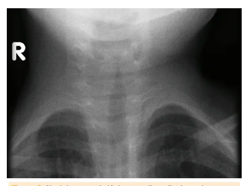
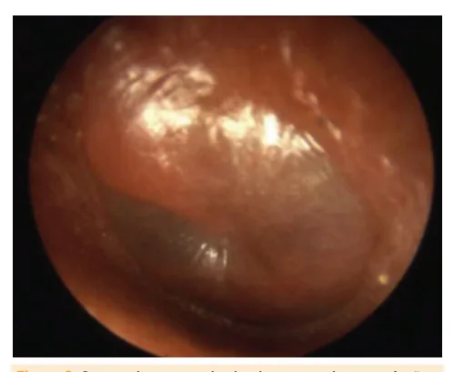

# Infecções de Vias Aéreas Superiores (IVAS)

<!-- page:1 -->

## Infecções de Vias Aéreas Superiores (IVAS)

> Crupe (PED) · Faringoamigdalite (PED) · Gripe (influenza) · Síndrome gripal (PED) · Otite (PED) · Resfriado (PED) · Sinusite (PED)

- **Resfriado comum**: rinovírus, duração de 10–14 dias, quadro agudo e autolimitado, tratamento com sintomáticos
- **Síndrome gripal**: vírus influenza; febre + comprometimento de vias aéreas superiores + comprometimento sistêmico (mialgia, cefaleia, artralgia, fadiga)
- **Síndrome Respiratória Aguda Grave (SRAG)**: síndrome gripal + critérios de gravidade
- **Crupe viral**: parainfluenza; rouquidão, tosse ladrante, estridor; tratamento com dexametasona, inalação com adrenalina em casos moderados a graves
- **Otite média aguda (OMA)**: viral ou bacteriana (pneumococo, hemófilos); efusão + sinais de inflamação em orelha média; tratamento: antibiótico (amoxicilina) para < 6 meses, otorreia, OMA bilateral em < 24 meses, sintomas severos (toxemia, otalgia > 48h, T > 39ºC, incerteza da reavaliação)
- **Sinusite bacteriana**: diagnóstico clínico! Complicação de IVAS. Sinais de quadro bacteriano: dupla piora dos sintomas respiratórios após 5º dia de evolução; evolução com > 10 dias de um quadro viral sem melhora; rinorreia purulenta; dor à palpação dos seios da face; febre ≥ 38ºC, ou retorno da febre após quadro viral; elevação de PCR ou VHS. Tratamento: antibioticoterapia (amoxicilina)
- **Amigdalite bacteriana**: *S. pyogenes*; padrão-ouro de diagnóstico é cultura de orofaringe; teste rápido pode ajudar. Tratamento com amoxicilina por 10 dias

## Resfriado Comum (Rinofaringite Aguda)

### Conceitos Gerais

- **Agente etiológico**: inúmeros vírus — rinovírus em 50%, coronavírus, influenza, VSR, parainfluenza
- **Transmissão**: gotículas e contato
- **Contágio**: em escolas, domicílio; transmite de horas antes até 2 dias do início dos sintomas
- **Incubação**: 1 a 4 dias
- **Sinais e sintomas**: odinofagia, coriza, obstrução nasal, espirros, tosse seca; febre de intensidade variável; pico: 2–3 dias; duração: 10–14 dias; quadro agudo e autolimitado
- **Diagnóstico**: clínico
- **Tratamento**:
  - Repouso no período febril
  - Hidratação e dieta conforme aceitação
  - Higiene e desobstrução nasal
  - Antitérmico e analgésico
- **Complicações**: OMA; sinusite bacteriana; exacerbação de asma; infecção de via aérea inferior

## Gripe

### Conceitos Gerais

- **Agente etiológico**: vírus influenza A (sazonal e pandêmico) e B (contínuo)
- **Transmissão**: gotículas e contato
- **Contágio**: em escolas, domicílio; transmite de horas antes até 7–10 dias do início dos sintomas
- **Incubação**: 2 a 5 dias
- **Sazonalidade**: inverno

Quatro subtipos do vírus influenza circulam em humanos: dois do tipo A (H1N1 e H3N2) e dois do tipo B.

**Mecanismos de mutação**

- **Drift antigênico**: alterações antigênicas que impedem o reconhecimento do vírus pelos anticorpos do hospedeiro; faz com que seja necessária a vacina da gripe anual
- **Shift antigênico**: alteração abrupta e importante em um vírus influenza A; menos frequente que o drift, resultando em novas proteínas (HA e NA)

---

<!-- page:2 -->

### Tratamento

- Suporte
- Hidratação
- Repouso e sintomáticos: analgésicos e antitérmicos, com exceção do AAS pelo risco de síndrome de Reye

Figura 1: Hemaglutinina (entrada do vírus na célula) e neuraminidase (saída do vírus da célula).

## Síndrome Gripal (SG)

- Febre + comprometimento de vias aéreas superiores + comprometimento sistêmico (mialgia, cefaleia, artralgia, fadiga...)
- Idade < 2 anos: febre súbita + sintomas respiratórios (tosse, coriza e obstrução nasal)

**Testes diagnósticos**

- Moleculares, antigênicos ou cultura de vírus
- Indicação: < 5 anos, especialmente para os < 2 anos de idade; paciente de alto risco; imunocomprometidos; exacerbação de patologias de base; complicações da gripe

### Complicações

- Síndrome respiratória aguda grave
- Infecção bacteriana secundária (OMA, sinusite, pneumonia)
- Miocardite
- Encefalite
- Polirradiculoneurite (Guillain-Barré)
- Miosite, rabdomiólise

**Risco de complicações**

- Idade: < 2 anos, > 60 anos
- Doenças crônicas: respiratórias (asma), neurológicas, cardiovasculares, renais, hepáticas, hematológicas (ex.: anemia falciforme), diabetes mellitus
- Imunodeficiências
- Obesidade

## Síndrome Respiratória Aguda Grave (SRAG)

- Síndrome gripal + critérios de gravidade. Ou indivíduo de qualquer idade com quadro de insuficiência respiratória aguda, durante período sazonal
- **Manifestações clínicas**: dispneia; saturação < 95%; desconforto respiratório ou aumento da FR de acordo com a idade; piora de doença de base; hipotensão arterial
- **Internação**: desconforto respiratório; desidratação ou incapacidade de hidratação oral; descompensação de doença de base; complicações graves

**Antivirais**

- Oseltamivir (VO) e zanamivir (inalatório): inibidores da neuraminidase
- Indicações de tratamento: hospitalizados (sempre); doença grave ou progressiva; alto risco de complicação; menores de 2 anos

## Crupe Viral

### Definição

Síndrome do crupe: obstrução de via aérea superior!

- Rouquidão
- Tosse ladrante
- Estridor inspiratório
- Desconforto respiratório

> Pode ser classificada como laringite, laringotraqueíte ou laringotraqueobronquite, de acordo com a localização anatômica do acometimento.

**Vias Aéreas**

- **Vias supraglóticas**: mucosa nasal até cordas vocais; muito colapsável
- **Vias glóticas e infraglóticas**: cordas vocais até porção cervical da traqueia; têm anéis cartilaginosos e são menos colapsáveis

> Em lactentes, 1 mm de edema subglótico causa 50% de redução no calibre da traqueia.

### Etiologia

- Parainfluenza (1, 2 e 3)
- Influenza
- VSR
- Adenovírus
- SARS-CoV-2
- Exceção: *Mycoplasma pneumoniae* em > 5 anos

### Epidemiologia

- Mais frequente nas crianças de 1 a 6 anos de idade, com pico em 18 meses
- Maior incidência em outubro/inverno, mas acontece durante todo o ano

---

<!-- page:3 -->

## Quadro Clínico (Crupe)

- Inicialmente: febre, tosse, coriza e rinorreia
- Após 12 a 48h: obstrução de via aérea superior
- Rouquidão, estridor, desconforto respiratório; a maioria não progride para obstrução completa
- Resolução em 3 a 7 dias

## Diagnóstico (Crupe)

- Clínico!
- Radiografia cervical indicada somente para excluir outras causas: sinal da Igreja ou da Ponta de Lápis

Figura 2: Sinal da ponta do lápis em radiografia de paciente com crupe.

**Classificação da gravidade — Escore Clínico**

- Divide-se em leve, moderada e grave
- O estridor é um sinal de gravidade
- Interpretação: leve < 6; moderada 7–8; grave > 8

> ⚠️ Tabela reconstruída a partir de OCR — confira contra a fonte original.

**Tabela 1: Classificação da gravidade do crupe (Escore de Westley)**

| Item | 0 | 1 | 2 | 3 |
|---|---|---|---|---|
| Estridor | Ausente | Se agitação | Em repouso | — |
| Retração | Ausente | Leve | Moderada | Grave |
| Entrada de ar | Normal | Reduzida | Muito reduzida | — |
| Cor | Normal | — | Cianótico com agitação | Cianótico em repouso |
| Nível de consciência | Normal | — | Agitado | Letárgico |

**Diagnóstico diferencial**

- **Crupe espasmódico**: início abrupto, sem pródromos; sintomas autolimitados e recorrentes; sem necessidade de tratamento
- **Traqueíte bacteriana**: febre alta, toxemia intensa; secreção purulenta em faringe; intubação e UTI, antibiótico parenteral

### Tratamento (Crupe)

- **Crupe leve**: dexametasona (0,15–0,3 mg/kg); opções: budesonida inalatório 2 mg ou prednisona 1 mg/kg; alta hospitalar
- **Crupe moderado**: nebulização com epinefrina 0,5 mL/kg (máx. 5 mL); dexametasona 0,3–0,6 mg/kg (opções: budesonida inalatório 2 mg ou prednisona 1 mg/kg); observação por 3–4 horas; alta ou admissão hospitalar
- **Crupe severo**: nebulização com epinefrina 0,5 mL/kg (máx. 5 mL); dexametasona 0,6 mg/kg parenteral; admissão na unidade de terapia intensiva (risco de insuficiência respiratória)

## Otite Média Aguda (OMA)

- Inflamação da membrana timpânica em associação com uma efusão em orelha média
- Maior incidência em lactentes e pré-escolares

### Etiologia

**Vírus**

- VSR
- Rinovírus
- Adenovírus
- Influenza

**Bactérias**

- *Streptococcus pneumoniae*
- *Haemophilus influenzae* não tipável
- *Moraxella catarrhalis*

**Patogênese**

- Maioria dos casos é precedida de IVAS
- Acúmulo de secreção em orelha média e redução da ação mucociliar
- Crescimento de bactérias na secreção

### Fatores de Risco

- IVAS de repetição
- Idade
- Creche
- Falta de aleitamento materno
- Uso de chupetas entre 6 e 12 meses de idade
- Exposição a tabaco e poluição
- Malformações craniofaciais

---

<!-- page:4 -->

## Quadro Clínico (OMA)

- Febre
- Otalgia (interpretação difícil)
- Redução da acuidade auditiva
- Irritabilidade
- Anorexia
- Cefaleia
- Vômitos
- Otorreia

### Diagnóstico (OMA)

- Clínico!
- Efusão + sinais de inflamação em orelha média: abaulamento da membrana timpânica (maior sensibilidade); perfuração da membrana timpânica com otorreia purulenta; início súbito de otalgia e febre

Figura 3: Otoscopia mostrando abaulamento, eritema e efusão na membrana timpânica, em um caso de otite média aguda.

### Tratamento (OMA)

- Indicações de tratamento com antibiótico: idade < 6 meses; otorreia; OMA bilateral em < 24 meses; sintomas severos (toxemia, otalgia > 48h, T > 39ºC, incerteza da reavaliação)
- **Amoxicilina**: tratamento inicial! Dose dobrada e prolongar tratamento para 10 dias se uso de antibiótico no último mês
- **Amoxicilina + clavulanato**, se suspeita de *H. influenzae* (principalmente se OMA bilateral ou associação com conjuntivite homolateral)
- Casos complicados: cefalosporinas de terceira geração (EV ou IM)
- Macrolídeos para alérgicos às primeiras escolhas

**Tempo de tratamento**: < 2 anos: 10 dias; > 2 anos: 7–10 dias

**Complicações**: mastoidite; OMA recorrente; meningite

### Otomastoidite

- Mastoide: parte do osso temporal, composta por células aeradas que se comunicam com a orelha média; adjacente às meninges, cérebro e seios venosos
- Pneumococo é o principal agente! Outros: *S. pyogenes*, *S. aureus*, *Pseudomonas*, hemófilos
- **Quadro clínico**: OMA do mesmo lado; protrusão do pavilhão auditivo; edema e eritema retroauricular; febre e toxemia
- **Diagnóstico**: clínico; TC para avaliar extensão e presença de complicações — desmineralização óssea e perda de septações na cavidade da mastoide
- **Tratamento**: antibioticoterapia parenteral (betalactâmico + betalactamase; cefalosporina de terceira geração); completar tratamento via oral após melhora clínica; pode ser necessária abordagem cirúrgica se houver abscessos ou mastoidite coalescente
- **Complicações**: abscesso subperiosteal; paralisia de nervo facial; perda auditiva; osteomielite; abscesso cervical; meningite; trombose de seio venoso

## Rinossinusite Aguda

- É a inflamação da mucosa que reveste os seios paranasais; faz parte do quadro de nasofaringite
- **Patogênese**: inflamação viral; diminuição da motilidade mucociliar; acúmulo de secreção; infecção por bactérias colonizadoras da mucosa
- **Fatores de risco**: IVAS e rinite alérgica
- **Quadro clínico**: tosse, obstrução nasal e coriza, febre, halitose, cefaleia, dor facial; sintomas mais intensos que na IVAS

**Diagnóstico**: dado por sintomas de inflamação nos seios da face (tosse, sintomas nasais) + 1 dos critérios a seguir:

- Dupla piora dos sintomas respiratórios após 5º dia de evolução
- Evolução com > 10 dias de um quadro viral sem melhora
- Rinorreia purulenta
- Dor à palpação dos seios da face
- Febre ≥ 38ºC, ou retorno da febre após quadro viral
- Elevação de PCR ou VHS

---

<!-- page:5 -->

### Imagem (Rinossinusite)

- Radiografia de seios da face: **NÃO** é recomendado
- TC de seios da face na suspeita de outras complicações: em órbitas, abscessos, etc.
- Nasofibroscopia pode ser interessante para encontrar fatores predisponentes (ex.: pólipos)

### Etiologia (Rinossinusite)

**Agentes etiológicos virais**

- Rinovírus
- Coronavírus
- VSR
- Influenza
- Adenovírus

**Agentes etiológicos bacterianos**

- *Streptococcus pneumoniae*
- *Haemophilus influenzae* (não tipável)
- *Moraxella catarrhalis*

### Tratamento (Rinossinusite)

- Sintomáticos: lavagem nasal, analgésicos e antitérmicos
- Não há benefício do uso recorrente de corticoide
- Não usar descongestionantes nasais (risco de intoxicação por nafazolina)
- Antibióticos semelhantes à OMA: amoxicilina (primeira opção); amoxicilina + clavulanato; cefalosporina de segunda geração
- Casos graves: cefalosporinas de terceira geração EV/IM

**Complicações**: envolvimento da órbita (celulite orbitária); trombose de seio cavernoso; meningite; abscessos (subperiosteal, epidural, subdural, cerebral)

## Amigdalite

### Etiologia

- Vírus são os agentes mais comuns: EBV, CMV, adenovírus, herpes, influenza, enterovírus
- Outros, como parte de uma nasofaringite: rinovírus, coronavírus, VSR, parainfluenza, SARS-CoV-2
- Nos casos bacterianos: *Streptococcus pyogenes* (grupo A); raramente *Mycoplasma pneumoniae*, estreptococos de outros grupos, *Corynebacterium diphtheriae*

> Difícil diferenciar etiologia pelo quadro clínico, especialmente bacteriana x viral.

**Pistas para quadros bacterianos**

- Crianças > 5 anos
- Febre, odinofagia, cefaleia, vômitos e dor abdominal
- Adenopatia cervical anterior dolorosa
- Petéquias em palato
- Sem outros sintomas de IVAS (sem tosse, coriza, obstrução de via aérea, diarreia)

**Diagnóstico**

- Cultura de orofaringe: padrão-ouro; sensibilidade de 90–95%; desvantagem: resultado em 24h a 48h
- Teste rápido de antígenos do estreptococo do grupo A: menos sensível que a cultura, mas resultado mais rápido; falsos negativos podem acontecer, levando à realização de cultura

- A doença tem curso autolimitado: resolução do quadro clínico em até 10 dias. Porém, a transmissão do estreptococo do grupo A continua por até 20 dias

**Antibioticoterapia**

- Diminui o tempo de doença e suas morbidades
- Previne a transmissão do estreptococo (a transmissão cessa 24 horas após início do antibiótico)
- Previne complicações supurativas: abscessos, mastoidites, linfadenites supurativas, OMA, sinusite
- Previne complicações não supurativas: febre reumática
- Antibioticoterapia **não** previne glomerulonefrite pós-estreptocócica

**Opções**

- 1ª escolha: penicilina e seus derivados (aminopenicilinas). Amoxicilina pode ser feita com uma dose ao dia! Duração de 10 dias para garantir a erradicação do estreptococo. Opção: penicilina G benzatina, dose única
- 2ª linha: cefalosporinas, clindamicina e macrolídeos. Macrolídeos são alternativa para alérgicos a betalactâmicos

## Referências

Figura 1: Hemaglutinina (entrada do vírus na célula) e neuraminidase (saída do vírus da célula). Adaptado de: https://www.ncbi.nlm.nih.gov/books/NBK562893/figure/F3/. Acesso em 25/11/2023.

Figura 2: Sinal da ponta do lápis em radiografia de paciente com crupe. SARGENT, M. Croup - steeple sign. Case study, Radiopaedia.org. Acesso em 17 jun. 2025. https://doi.org/10.53347/rID-6086.

Figura 3: Otoscopia mostrando abaulamento, eritema e efusão na membrana timpânica, em um caso de otite média aguda. https://www.ncbi.nlm.nih.gov/books/NBK538293/figure/article-26425.image.f1/. Acesso em 25/11/2023.
