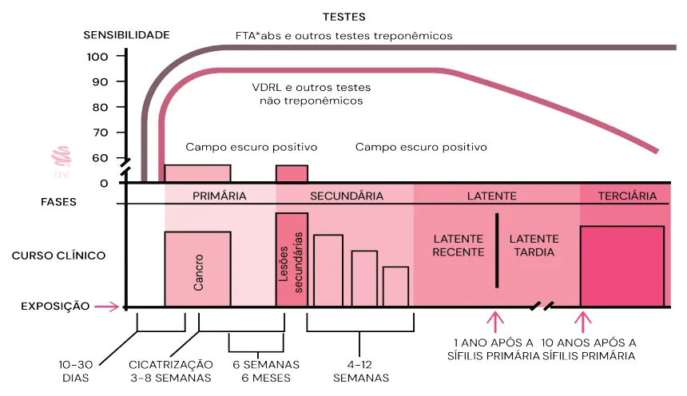
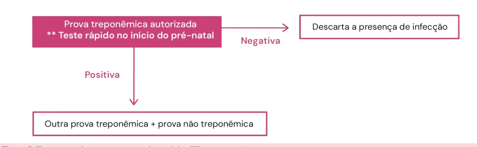
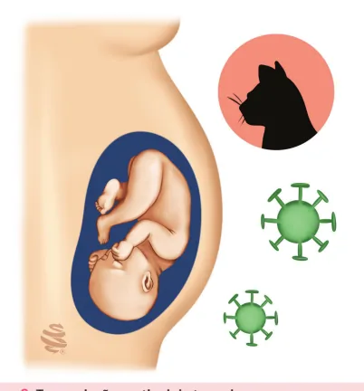
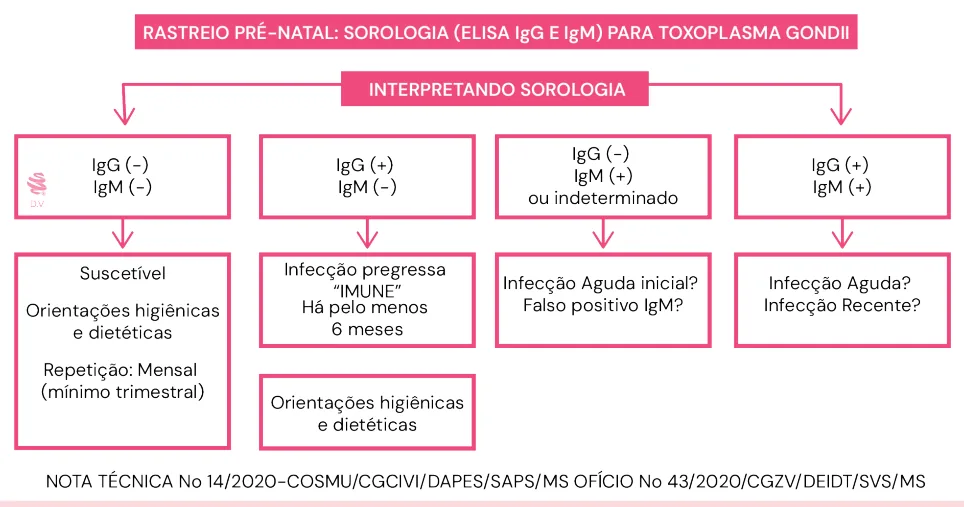
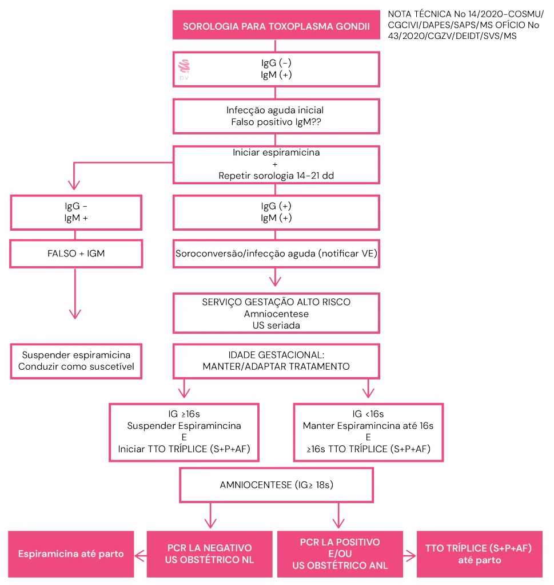
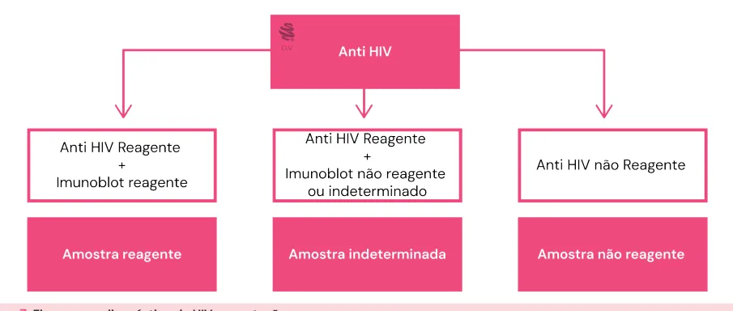

# Infecções e Gravidez

<!-- page:1 -->

Infecções congênitas na gravidez Outras doenças infecciosas na gravidez SÍFILIS - Tratamento:

- Infecção recente (até um ano de duração):

Penicilina benzatina 2,4 miUI, divididas em duas injeções de 1,2 miUI em cada um dos glúteos, em uma única tomada;

- Infecção tardia: Penicilina benzatina 7,2 miUI divididas em três aplicações semanais de

2.400.000 UI;

- Neurossífilis: Penicilina G cristalina 4.000.000 UI, por via endovenosa, a cada 4 horas, por 10 a 14 dias.

HIV - Manejo obstétrico:

- CV > 1000 cópias/mL na 34a semana ou não fez uso de TARV = cesárea eletiva com 38 semanas;

- Em uso de TARV e CV < 1000 cópias = via obstétrica. Se CV indetectável = sem necessidade de AZT intraparto.

## SÍFILIS

- É uma infecção sistêmica crônica causada por uma bactéria espiroqueta: Treponema pallidum.

TRANSMISSÃO:

- Contato sexual;

- Transmissão vertical: transplacentária (via hematogênica) ou por contato na região genital contaminada (intraparto);

- Ocorre mais facilmente nas lesões primárias, secundárias e na fase latente recente, devido à intensa replicação e disseminação do agente.

CLASSIFICAÇÃO Sífilis recente (primária, secundária e latente recente): até um ano após a infecção; Sífilis tardia (latente tardia e terciária): mais de um ano após a infecção.

Sífilis Primária

- Tempo de incubação: 10 a 90 dias (média de três semanas);

- Cancro duro: úlcera de bordas elevadas, fundo limpo e indolor, geralmente na área de inoculação do agente, pode durar de três a seis semanas e cicatriza espontaneamente.

Sífilis secundária

- Surgimento: entre 6 semanas e 6 meses após a cicatrização do cancro duro;

- Rash maculopapular (roséola): inclusive em palma da mão e planta do pé; TOXOPLASMOSE - SOROLOGIAS

- IgG - / IgM + → infecção aguda ou falso positivo: Inicia-se espiramicina + encaminha para alto risco + nova sorologia em 2-3 (observar soroconversão de IgG), caso seja confirmada: <16 semanas = mantém espiramicina; ≥16 semanas = troca pelo esquema tríplice. IgG - / IgM - → não ocorreu soroconversão rastreamento pré-natal para toxoplasmose.

(falso-positivo). Mantém-se a conduta do

- IgG + / IgM + → infecção aguda ou antiga: < 16 semanas: Espiramicina + Teste de Avidez: Alta avidez = infecção antiga / Avidez baixa = infecção aguda, logo, encaminha-se ao pré-natal de alto risco (PNAR). ≥ 16 semanas: esquema tríplice + PNAR.

- Clínica: febre baixa, cefaleia, linfadenopatia generalizada, lesões mucosas em região oral e genital;

condiloma plano, alopécia. Toda erupção cutânea sem causa determinada deve ser investigada com testes para sífilis.

Sífilis latente

- Período em que não se observa nenhum sinal ou sintoma;

- Dividida em latente recente (até 1 ano de infecção) e a tardia (doença com mais de 1 ano de duração).

Sífilis terciária

- É o último estágio de desenvolvimento da sífilis e apresenta diversos sintomas;

- Tempo para surgimento: entre 1 e 40 anos depois do início da infecção;

- Lesões cutâneas: lesões gomosas e nodulares, de caráter destrutivo;

- Lesões ósseas: periostite, osteíte gomosa ou esclerosane, artrites, sinovites;

- Lesões cardiovasculares: estenose de coronárias, aortite e aneurisma de aorta;

- Lesões neurológicas: meningite, gomas do cérebro ou da medula, atrofia de nervo óptico, lesão do sétimo par craniano, manifestações psiquiátricas, tabes dorsalis e quadros de demência.

EXAMES DIAGNÓSTICOS O exame padrão-ouro é pesquisa microscópica em campo escuro (principalmente na sífilis primária).

---

<!-- page:2 -->

Testes treponêmicos TRATAMENTO

- FTA-Abs e Testes rápidos;

- Droga de escolha = Penicilina;

- Detectam anticorpos específicos produzidos contra

- Não existe evidência que nenhuma outra droga seja antígenos de T. pallidum; efetiva para o feto;

- São os primeiros a se tornarem positivos;

- Se paciente alérgica, deve-se internar para

- São os primeiros a se tornarem positivos;

- São mais sensíveis e específicos;

- Possuem menos resultados falsos-positivos;

- Permanecem como marca sorológica da infecção (em

85% dos casos). Testes não treponêmicos

- VDRL;

- Detectam anticorpos anticardiolipina não específicos para os antígenos do T. pallidum;

- São quantificáveis;

- Podem apresentar resultados falsos-positivos:

infecções por outros tipos de treponemas, doenças do colágeno, neoplasias, uso de drogas e a própria gestação;

- Tornam-se reagentes entre 1 a 3 semanas após o cancro duro;

- Utilizado para acompanhamento do paciente com sífilis.

- MANIFESTAÇÕES FETAIS

- Alteração hepática, hepatomegalia, trombocitopenia, anemia, ascite; C

- Acometimento neonatal inclui: pneumonia, cirrose hipertrófica, osteocondrite em ossos longos, exantema bolhoso, hepatoesplenomegalia, anemia hemolítica, icterícia, tíbia em sabre e dentes de Hutchinson.

## RASTREAMENTO E DIAGNÓSTICO DA SÍFILIS NA GESTANTE

- Recomenda-se o rastreamento na primeira consulta de pré-natal, no início do terceiro trimestre e na admissão para parto ou aborto;

- Verificar Figura 2 na próxima página.

Figura 1: Curso da Sífilis não tratada. - Se paciente alérgica, deve-se internar para fazer dessensibilização;

Tabela 1: Tratamento da sífilis conforme cada estágio da infecção. Infecção recente Primária, Infecção tardia Neurossífilis Secundária e Latente recente Penicilina Penicilina G cristalina Penicilina benzatina 2,4 miUI 4miUI, por via benzatina 2,4 miUl a cada 7 dias por endovenosa, de em dose única 3 semanas 4/4h, por 10 a 14dias

- Algumas referências citam que, após o tratamento com penicilina cristalina, deve-se prosseguir o tratamento com penicilina G benzatina 2.400.000 UI, semanalmente, por 3 semanas (USP SP - ZUGAIB).

Considerações Especiais

- Recomenda-se o tratamento imediato com benzilpenicilina benzatina após somente um teste reagente para sífilis (teste treponêmico ou teste não treponêmico) para os seguintes grupos (com ou sem sinais e/ou sintomas de sífilis): Gestantes; Vítimas de violência sexual; Pessoas com chance de perda de seguimento; Pessoas com sinais/sintomas de sífilis primária ou secundária; Pessoas sem diagnóstico prévio de sífilis.

---

<!-- page:3 -->

Figura 2: Fluxograma de rastreamento pré-natal de sífilis na gestação. Para esses grupos, não se exclui a necessidade Critérios para Retratamento de realização do segundo teste (melhor análise

- Sem redução da titulação em duas diluições no diagnóstica), do monitoramento laboratorial (controle intervalo de 6 meses (sífilis recente) ou 12 meses (sífilis de cura) e do tratamento de parcerias sexuais. tardia) após o tratamento adequado;

- Aumento da titulação em duas diluições (ex: 1:16 para

Nota Técnica nº 14/2023 — Ministério da Saúde 1:64) em qualquer momento do seguimento;

- Para gestantes, o intervalo entre as doses de

- Persistência ou recorrência de sinais e sintomas em benzilpenicilina benzatina é de 7 (sete) dias; qualquer momento do seguimento.

- Em gestantes que apresentarem atraso entre as Tratamento Adequado doses superior a 9 (nove) dias, em qualquer esquema

- Administração de penicilina;

de tratamento prescrito, é necessário repetir o

- Início do tratamento até 30 dias antes do parto;

esquema terapêutico completo;

- Esquema terapêutico de acordo com o estágio clínico;

- Considera-se tratamento adequado da gestante

- Respeito ao intervalo entre as doses;

quando o intervalo entre as doses estiver entre sete

- Avaliação quanto ao risco de reinfecção.

a nove dias;

## TOXOPLASMOSE

- Qualquer esquema com intervalos superiores a nove dias ou inferiores a sete dias entre as doses deve ser considerado tratamento inadequado; DEFINIÇÃO

- Em caso de alergia à penicilina, a recomendação É uma infecção causada pelo Toxoplasma gondii, cujo clássica é dessensibilização e tratamento com hospedeiro definitivo é o gato.

penicilina em ambiente hospitalar. Reação de Jarisch Herxheimer TRANSMISSÃO VERTICAL

- Resulta da morte rápida das espiroquetas → intensa

- Transmissão ocorre mais facilmente no terceiro resposta inflamatória aguda; trimestre quando comparada ao primeiro;

- Sintomas: febre, taquicardia, artralgia, faringite, cefaleia

- O risco de comprometimento fetal é menor quanto e piora das lesões cutâneas; mais avançada for a gestação.

- Fatores de risco: tratamento em doença recente;

- Complicações: trabalho de parto prematuro, anormalidades na cardiotocografia e óbito fetal.

Seguimento Pós-Tratamento

- Teste não treponêmico mensal e, sempre que possível, com o mesmo método diagnóstico;

- Resposta adequada (após a última dose): Queda de 2 diluições em até 3 meses (ex: 1:64 para 1:16) ou Queda de 4 diluições em 6 meses (ex: 1:64 para 1:4), com evolução para soroconversão; Queda de 2 diluições em até 6 meses para sífilis recente ou até 12 meses para sífilis tardia.

Persistência de resultados reagentes em testes não treponêmicos com títulos baixos (1:1 a 1:4) durante um ano após o tratamento, quando descartada nova exposição de risco, é chamada de cicatriz sorológica. Figura 3: Transmissão vertical da toxoplasmose.

---

<!-- page:4 -->

## MANIFESTAÇÕES FETAIS E NEONATAIS DIAGNÓSTICO

- Lesões oculares: retinocoroidite, atrofia do nervo

- Baseia-se na sorologia com detecção de anticorpos óptico, catarata e estrabismo; específicos das classes IgM e IgG.

- Alterações neurológicas: ventriculomegalia, Teste de avidez (realizado até a 16ª semana de gestação) encefalomalácia, surdez neurossensorial e

- Alta avidez = exclui infecção aguda na gestação, já que encefalomalácia, surdez neurossensorial e calcificações cerebrais;

- Alterações sistêmicas: hepatoesplenomegalia, trombocitopenia ou insuficiência cardíaca;

- Abortamento, natimortalidade e prematuridade.

- lg lgA atingem platô em 1 mês indica que os anticorpos foram produzidos há mais de

0 1 2 3 MES SOPROCITNA ED SOLUTÍT Títu Títulos lgM Cinética da produção de M, A e G na infecção Figura 4: Cinética da produção de anticorpos das classes M, A e G na Figura 5: Interpretação de sorologias no rastreamento de toxoplasmo - Alta avidez = exclui infecção aguda na gestação, já que 12 a 16 semanas;

- Baixa avidez = indica infecção adquirida na gestação;

- Após 16 semanas não se pede teste de avidez.

- Verificar Figura 4 .

ulos lgG atingem platô em 2 a 3 meses (sem tratamento) lgG (ELISA) D.V lgG (dye_test, IFAT) gM 4 5 6 10 SES e anticorpos das classes o por toxoplasmose.

a toxoplasmose. ose na assistência pré-natal.

---

<!-- page:5 -->

Figura 6: Algoritmo para investigação de gestante com IgM+ e IgG não reagente para toxoplasmose. CONDUTA Orientações à Gestante (profilaxia primária)

Infecção aguda <16 semanas

- Não comer carne crua ou mal passada;

- Iniciar espiramicina.

- Não comer ovos crus ou mal cozidos;

Infecção aguda ≥16 semanas

- Beber água filtrada ou fervida;

- Trocar espiramicina pelo esquema tríplice +

- Lavar bem as frutas, verduras e legumes (não se investigação fetal com PCR do líquido amniótico: >18 recomenda a ingestão de verduras cruas);

semanas e após 4 semanas da infecção materna;

- Evitar contato com gatos desconhecidos e com tudo PCR positivo: esquema tríplice até o parto; que possa estar contaminado com suas fezes; PCR negativo: retorna à espiramicina.

- Usar luvas e máscara para manusear terra.

Esquema tríplice: sulfadiazina 3g/d + Pirimetamina MANUAL DO MINISTÉRIO DA SAÚDE — 2022 50mg/d + Ácido Folínico 10 a 20mg 3x semana.

- Na suspeita de infecção materna, já se inicia a espiramicina;

- Se a infecção ocorrer no terceiro trimestre, deve-

- Além disso, inicia-se, ainda, o esquema tríplice mesmo se manter esquema tríplice, sem necessidade de antes da confirmação do acometimento fetal, nos realização de amniocentese. casos de IgM+ e IgG +, em gestações ≥ 16 semanas.

---

<!-- page:6 -->

## VÍRUS DA IMUNODEFICIÊNCIA TRATAMENTO HUMANA — HIV

- A terapia antirretroviral (TARV) está recomendada para toda gestante vivendo com HIV;

- O principal fator determinante da transmissão vertical

- Para a escolha de tratamento:

é a carga viral; Início da TARV durante a gestação é a carga viral; I

- Outros fatores associados são: ausência de tratamento com terapia antirretroviral, vaginose, sífilis, uso de drogas ilícitas, relações sexuais sem preservativo, bolsa rota por mais de 4 horas, trabalho de parto prolongado e parto vaginal operatório.

- ABORDAGEM DIAGNÓSTICA

- Solicitar sorologia Anti-HIV: Primeiro trimestre; P Terceiro trimestre; Admissão para parto ou aborto.

- Verificar Figura 7 .

## ROTINA PRÉ-NATAL

Para as gestantes que diagnosticam HIV na gestação ou P para aquelas que já sabem ser portadoras do vírus, deve- se solicitar na primeira consulta:

- Se carga viral (CV) detectável → CV,

Genotipagem e CD4;

- Se CV indetectável→ CV e CD4.

A solicitação de carga viral deve ser feita a cada 4 semanas até negativação e, depois disso, próximo ao parto (até 4 a 5 semanas antes do parto).

Outros exames: C

- Provas de função renal e hepática; a

- Repetir trimestralmente: hemograma, provas de função renal e hepática, toxoplasmose, urina 1 e urocultura;

- Sorologia para hepatite A;

- Adicionar vacinas: pneumococo, meningococo e, E para as mulheres menores de 19 anos não vacinadas previamente, Haemophilus;

- Pesquisa de tuberculose para pacientes sintomáticas respiratórias e em situação de risco.

- Figura 7: Fluxograma diagnóstico de HIV na gestação. Início da TARV durante a gestação

- Tenofovir + Lamivudina (TDF + 3TC) + Iniciar DTG após 12 semanas de gestação.

Dolutegravir (DTG);

- Em caso de contraindicação ao TDF → zidovudina (AZT);

- Contraindicação ao TDF e AZT: Abacavir;

- Não usar o Dolutegravir se uso concomitante de:

Oxicarbamazepina, dofetilda e pilsicainida. Pacientes que engravidam em uso de TARV

- Pacientes estáveis, com boa tolerância ao esquema e bons controles virológicos, avaliadas pelas dosagens de CV e CD4 devem manter, preferencialmente, o esquema já iniciado antes da gestação.

## PROFILAXIA DE INFECÇÕES OPORTUNISTAS

- Sulfametoxazol-trimetoprim: profilaxia de Se CD4 < 200 células/mm3.

Pneumocistose e Toxoplasmose:

- Isoniazida + Piridoxina: tratamento para tuberculose Se CD4 < 350 células/mm3.

(TB) latente, desde que excluída TB ativa:

- Azitromicina: Mycobacterium avium: Se CD4 < 50 células/mm3.

## MANEJO OBSTÉTRICO

CV > 1000 cópias/mL na 34ª semana ou não fez uso adequado de TARV

- Parto: Cesárea eletiva com 38 semanas;

- AZT EV administrado, pelo menos, por 3 horas antes da cesárea.

Em uso de TARV e CV < 1000 cópias

- Parto: por via obstétrica;

- CV < 1.000 cópial/mL, porém detectável → AZT EV mg/kg de hora em hora, em infusão contínua, até o clampeamento do cordão;

2mg/kg no início do trabalho de parto e, depois, 1

- CV indetectável: não necessita de AZT.

---

<!-- page:7 -->

Em casos de má adesão à TARV, a equipe Figura 2: Fluxograma de rastreamento pré-natal de sífilis de assistência pode eleger ou não o uso do na gestação.

AZT intraparto EV. Adaptado de: BRASIL. Ministério da Saúde. Secretaria de Atenção Primária à Saúde. Departamento de Ações Programáticas. Manual de gestação de alto risco [recurso eletrônico] / Ministério da Saúde, Secretaria de Atenção Situações Especiais Situações Especiais

- Se previsão de parto demorado ou distócico, mesmo que CV menor que 1000 cópias/mL, pode-se considerar a resolução por cesariana;

- Trabalho de parto pré-termo: tocólise antes das 34 semanas com atenção ao uso de AZT EV concomitante à inibição se CV > 1000 cópias/mL.

## REFERÊNCIAS

Figura 1: Curso da sífilis não tratada. Adaptado de: BRASIL. Ministério da Saúde, Secretaria de Vigilância em Saúde, Departamento de Doenças de Condições Crônicas e Infecções Sexualmente Transmissíveis. Protocolo Clínico e Diretrizes Terapêuticas para Atenção Integral às Pessoas com Infecções Sexualmente Transmissíveis – IST [recurso eletrônico]. Brasília: Ministério da Saúde, 2022. Primária à Saúde. Departamento de Ações Programáticas. – Brasília:

Ministério da Saúde, 2022. Figura 5: Interpretação de sorologias no rastreamento de toxoplasmose na assistência pré-natal.

Adaptado de: BRASIL. Ministério da Saúde. Secretaria de Atenção Primária e à Saúde. Departamento de Ações Programáticas. Manual de gestação de alto risco [recurso eletrônico] / Ministério da Saúde, Secretaria de Atenção Primária à Saúde. Departamento de Ações Programáticas. – Brasília:

Ministério da Saúde, 2022. Figura 6: Algoritmo para investigação de gestante com IgM+ e IgG não reagente para toxoplasmose.

Adaptado de: BRASIL. Ministério da Saúde. Secretaria de Atenção Primária à Saúde. Departamento de Ações Programáticas. Manual de gestação de alto risco [recurso eletrônico] / Ministério da Saúde, Secretaria de Atenção Primária à Saúde. Departamento de Ações Programáticas. – Brasília:

Ministério da Saúde, 2022.
