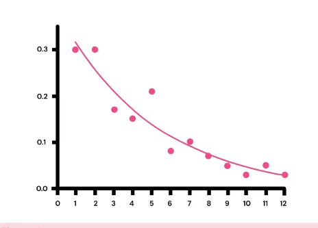
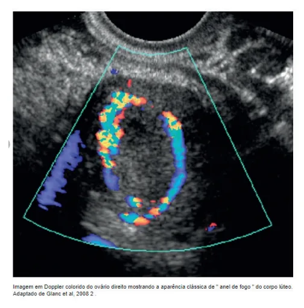
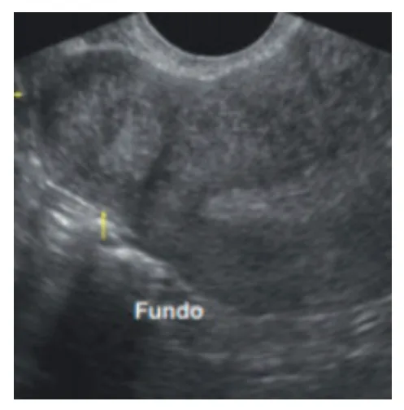
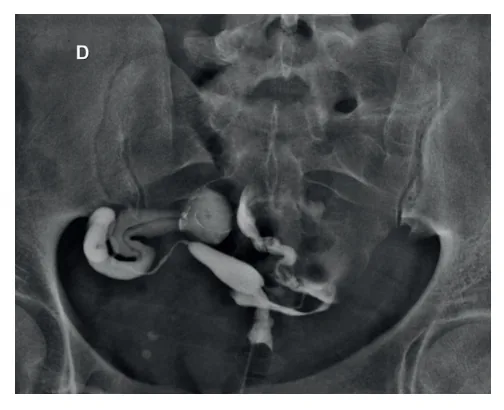
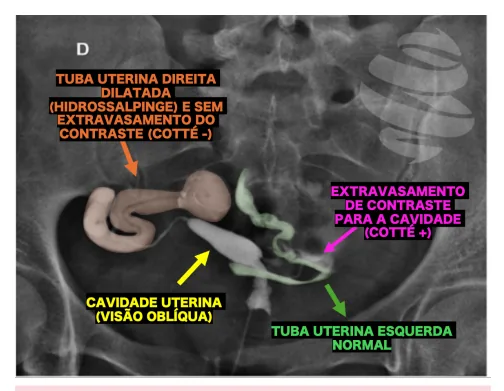
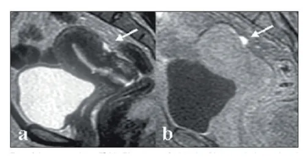
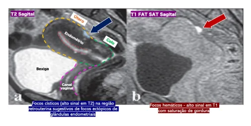

# Infertilidade

<!-- page:1 -->

## Definição de Infertilidade

- **Infertilidade**: ausência de gestação após **12 meses** de relações desprotegidas.
  - Se a paciente tiver mais de 35 anos, investigar após **6 meses**.
  - Se houver causa clássica de infertilidade já conhecida, iniciar a investigação imediatamente.
- Prevalência aumenta conforme a idade da mulher.

### Infertilidade Conjugal

- Definição da Organização Mundial da Saúde (OMS): falha na obtenção de gestação após **12 meses** de relações sexuais regulares e desprotegidas.
- Definição da Sociedade Americana de Medicina Reprodutiva (ASRM, 2023): doença caracterizada por qualquer uma das seguintes condições:
  - Incapacidade de atingir uma gestação bem-sucedida;
  - Necessidade de intervenção médica para ter chance de engravidar.
- Em pacientes com relações sexuais regulares, a investigação deve ser iniciada após **12 meses** se a paciente tiver **< 35 anos** e **6 meses** se tiver **> 35 anos**.

**Classificação:**

- **Primária** – nunca engravidaram (como casal);
- **Secundária** – pelo menos uma gestação prévia do casal, mesmo que não tenha resultado em um nascido vivo.

### Outros Termos

- **Fecundabilidade** – capacidade de engravidar em um ciclo menstrual;
- **Fecundidade** – capacidade de ter uma gestação evolutiva em um ciclo menstrual;
- **Esterilidade** – condição irreversível;
- **Subfertilidade** – condição transitória ou tratável.

### Taxa de Gravidez por Ciclo Menstrual

- No primeiro ciclo com relações sexuais, a paciente apresenta em média **30%** de chance de engravidar.
- Investigação sempre do **CASAL**: anamnese/exame físico; USG-TV + histerossalpingografia + espermograma.
- Espermograma: concentração 15 mi/mL; motilidade 32%; Kruger 4%.
- Outros exames: pedir na suspeita clínica de comorbidades ou para tratamento.
- Já na primeira consulta: orientar sobre período fértil, suplementar ácido fólico e orientar mudanças de estilo de vida. Na paciente com SOP, prescrever metformina.

*Figura 1: Representação gráfica da taxa de gravidez por ciclo menstrual.*

### Epidemiologia

- Afeta aproximadamente **15%** dos casais em idade reprodutiva.
- Prevalência aumenta conforme aumenta a idade da mulher.

**Fatores envolvidos:**

- Eficácia dos contraceptivos, postergação da maternidade, vida profissional, desejo de menor número de filhos e hábitos de vida atuais;
- Diferentes causas podem levar à infertilidade;
- Estima-se um aumento na incidência de **5% a 10%** nas próximas décadas.

### Causas de Infertilidade

- 1/3 por fator feminino, sendo mais frequentes: anovulação (SOP) e fator tuboperitoneal (endometriose e tubário);
- 1/3 por fator masculino;
- 1/6 por causa mista;
- 1/6 por causa inexplicada.

**Fatores femininos:**

- Ovulatório (35%);
- Tubário (35%);
- Endometriose (20%);
- Uterino (1%);
- Múltiplos (9%).

---

<!-- page:2 -->

## Fatores Ovulatórios

- **Síndrome dos ovários policísticos**: quadro de anovulação crônica; diagnóstico de exclusão.
- **Hipogonadismo hipogonadotrófico**:
  - Síndrome de Kallmann: caracterizada por anosmia e anovulação crônica;
  - Síndrome de Sheehan: relação com história de sangramento excessivo em parto anterior ou outro tipo de sangramento importante em gestação prévia.
- **Hipogonadismo hipergonadotrófico**: insuficiência ovariana prematura (IOP).
- São fatores de risco importantes conhecidos: atletas; anorexia; hiperprolactinemia; disfunções tireoidianas.

## Fator Tubário

- **Doença inflamatória pélvica**: Clamídia pode ser assintomática; Síndrome de Fitz-Hugh-Curtis: doença das aderências em "cordas de violino" próximo ao fígado.
- **Infecções e doenças inflamatórias abdominais**: apendicite supurada; doença de Crohn.
- **Cirurgias prévias**: gravidez ectópica; salpingectomia; aderências pélvicas.

## Fatores Masculinos

- **Genéticos**: Síndrome de Klinefelter, fibrose cística, microdeleção do SRY;
- **Funcionais**: infecciosos, ocupacionais, doenças crônicas, causas imunológicas e disfunções sexuais;
- **Anatômicos**: varicocele, obstruções congênitas e iatrogênicas;
- **Endocrinológicos**: doenças hipotalâmicas, hipofisárias, diabetes;
- **Causas funcionais**: fibrose cística; discinesia ciliar primária (síndrome de Kartagener): também cursa com *situs inversus* e pansinusite crônica.

## Endometriose

- Processo inflamatório crônico;
- Fator tuboperitoneal: pode acometer o ovário (endometriomas);
- Cerca de **20%** das pacientes inférteis apresentam endometriose e **30%** das pacientes com endometriose têm infertilidade (fibrose das tubas e prejuízo da mobilidade são algumas das causas);
- Alguns casos são oligo ou assintomáticos.

## Fator Uterino

- **Miomatose uterina**: a infertilidade está mais relacionada com miomas submucosos ou intramurais grandes (**> 4-5 cm**);
- **Pólipos uterinos**;
- **Sinéquias**: pensar principalmente após procedimentos cirúrgicos, como curetagem uterina (síndrome de Asherman);
- **Malformações müllerianas**: importante saber diferenciar útero uni/bicorno (um único colo uterino), didelfo (dois colos) e septado.

---

## Abordagem do Casal Infértil

- A abordagem inicia após o diagnóstico de infertilidade, isto é, após **12 meses** de tentativas. Porém, se idade **> 35 anos**, iniciar após **6 meses**.
- Endometriose, alteração seminal e anovulação crônica podem indicar início imediato da abordagem/investigação.

### Anamnese

- **Fator feminino**: idade, tempo de infertilidade e antecedentes obstétricos; ciclos menstruais, dismenorreia, dispareunia, frequência de relações sexuais; antecedentes cirúrgicos, comorbidades, uso de medicamentos; exposições ocupacionais e hábitos de vida.
- **Fator masculino**: infecções e traumas prévios; criptorquidia; hábitos de vida; exposição a toxinas e medicações (gerais e uso exógeno de andrógenos).

### Exame Físico

- Pressão arterial e IMC;
- Desenvolvimento puberal do casal;
- Hirsutismo e sinais de resistência insulínica;
- Exame ginecológico minucioso.

## Exames Iniciais

- **Fator ovulatório**:
  - LH e FSH no terceiro dia do ciclo menstrual: paciente com ciclos regulares provavelmente ovula normalmente e não precisa de exames;
  - Dosagem do AMH e contagem de folículos antrais: avaliação da reserva ovariana;
  - Não recomendados: progesterona de fase lútea, curva de temperatura basal e muco cervical.
- **Ultrassonografia transvaginal**:
  - Avaliação do fator uterino;
  - Avaliação ovariana: contagem de folículos antrais (CFA) e estrutura ovariana.
- **Histerossalpingografia**:
  - Avaliação do fator tubário;
  - Pode fornecer informações sobre a cavidade uterina.

---

<!-- page:3 -->

*Figura 3: Ultrassonografia com doppler realizada por via transvaginal evidenciando ovário com formação cística com vascularização periférica — aparência clássica de "anel de fogo" do corpo lúteo.*

- Ultrassonografia pélvica: objetiva a avaliação da reserva ovariana.

*Figura 2: Ultrassonografia realizada por via transvaginal evidenciando mioma com maior componente subseroso (FIGO 6), que não justificaria a infertilidade dessa paciente. Restante do miométrio homogêneo e endométrio também homogêneo, sem leiomiomas.*

*Figura 4: Ultrassonografia realizada por via transvaginal apresentando ovário com dimensões aumentadas, apresentando múltiplas formações císticas, menores que 0,9 cm, de localização predominantemente periférica, com aumento do estroma central, com aspecto policístico.*

- **Histerossalpingografia** — principal exame para avaliar o fator uterino: principal exame para permeabilidade tubária e avaliação anatômica; pode ajudar em alterações estruturais uterinas; prova de Cotté → visualização do extravasamento tubário (Cotté positivo = tuba pérvia).

---

<!-- page:4 -->

## Exames Complementares

### Laboratoriais

- Hormonais: TSH; prolactina e exames para diagnóstico diferencial de SOP.

*Figura 5: Histerossalpingografia: tuba uterina direita dilatada, principalmente na sua porção distal (segmentos ampular e infundibular), com persistência de contraste nas fases tardias do exame e sem extravasamento para a cavidade abdominal (Cotté negativo). Tuba uterina esquerda normal, com extravasamento de contraste para a cavidade (Cotté positivo).*

### Fator Masculino

- **Espermograma**: é o exame mais importante, sendo o único exame inicial a ser solicitado para o parceiro.

**Tabela 1: Valores de referência para avaliação dos parâmetros seminais**

| Parâmetro seminal | Valor de referência de normalidade |
|---|---|
| Volume total | ≥ 1,5 mL |
| Número total de espermatozoides | > 39 milhões |
| Concentração por mL | > 15 milhões/mL |
| Vitalidade | ≥ 58% |
| Motilidade progressiva | ≥ 32% |
| Motilidade total | ≥ 40% |
| Morfologia (Kruger) | ≥ 4% |

- Sorologias: hepatites B e C, HIV, HTLV e sífilis; pesquisa para clamídia e gonococo.

### Imagem

- **Ressonância magnética**: indicada na suspeita de endometriose ou malformações müllerianas, por exemplo.
- **Histerossonografia e ultrassonografia 3D**: indicadas de forma complementar à RNM diante de pólipos ou malformação mülleriana, por exemplo.
- **Métodos diagnósticos e terapêuticos**:
  - Histeroscopia: interessante para pólipos e miomas pequenos, especialmente se submucoso;
  - Laparoscopia: reservada para casos de endometriose, mais utilizada no tratamento de pacientes sintomáticos.

*Figura 6: Ultrassonografia transvaginal com reconstrução 3D (coronal): útero bicorno — caracterizado por indentação da serosa uterina em > 1 cm.*

---

<!-- page:5 -->

- Abstinência não melhora a qualidade seminal; se abstinência maior que 10 dias, pode piorar.
- Orientar mudança de estilo de vida (MEV).
- Se SOP: prescrever metformina **1.500 a 2.000 mg/dia**.

*Figura 7: Ultrassonografia transvaginal 3D (coronal): útero septado, caracterizado pela presença de septo endometrial > 1 cm (medido a partir da linha bicornual) e ângulo da indentação < 90 graus.*

*Figura 8: (A) RM pelve — sequência ponderada em T2 em corte sagital, demonstrando focos císticos (glandulares) em lesão endometriótica retrouterina. (B) Focos hemáticos de permeio a esta lesão, que aumentam a especificidade para o diagnóstico de endometriose.*

## Tratamentos

### Orientações Gerais para Todos os Casais

- Orientações sobre a janela concepcional: de 5 dias antes até o dia após a ovulação; maior nos dois dias que antecedem a ovulação; relações a cada 1-2 dias na janela.

### Baixa Complexidade

- Como? Inseminação intrauterina; coito programado.
- Indução de ovulação: Letrozol 5 mg/dia por 5 dias; Clomifeno 50 a 150 mg/dia por 5 dias; Gonadotrofinas em doses baixas.
- Por quanto tempo? 3 a 6 meses.

### Alta Complexidade

- Quem? Fator tubário bilateral; tempo de infertilidade maior que 3 anos; fator masculino grave (ICSI); falha no tratamento de baixa complexidade.

## Referências

Figura 1: Representação gráfica da taxa de gravidez por ciclo menstrual. Adaptado de ZINAMAN, M. J. et al. Estimates of human fertility and pregnancy loss. Fertility and Sterility, v. 65, n. 3, p. 503-509, 1996.

Figura 2: Mioma subseroso: não justificaria a infertilidade dessa paciente. HOFFMAN, Barbara L. et al. Ginecologia de Williams. 2. ed. Porto Alegre: Artmed, 2014.

Figura 3: Imagem em doppler colorido do ovário direito mostrando a aparência clássica de "anel de fogo" do corpo lúteo. GLANC, P.; SALEM, S.; FARINE, D. Adnexal masses in the pregnant patient: a diagnostic and management challenge. Ultrasound Quarterly, v. 24, n. 4, p. 225-240, dez. 2008. DOI: 10.1097/RUQ.0b013e31819032f. PMID: 19060689.

Figura 4: Ovário com distribuição policística, ou "colar de pérolas". BALLINGER, J. Ray. Case courtesy of J. Ray Ballinger. Radiopaedia.org, rID: 23638. Disponível em: https://radiopaedia.org/cases/23638.

Figura 5: Trompa uterina direita dilatada, principalmente em sua porção distal (segmentos ampular e infundibular), com persistência de contraste nas fases tardias do exame e sem extravasamento para a cavidade abdominal (Cotté negativo). DR. PIXEL. Hidrossalpinge unilateral. Campinas: Dr Pixel, 2018.

Figuras 6 e 7: Ultrassonografia transvaginal 3D: útero bicorno à esquerda e útero septado à direita. FERREIRA, Adilson Cunha et al. Three-dimensional ultrasound in gynecology: uterine malformations. Radiologia Brasileira, v. 40, n. 2, p. 131-136, 2007.

Figura 8: Imagens pesadas em T2 (a) e T1 com supressão de gordura (b) mostram implante peritoneal hemorrágico na serosa uterina (setas). Ressonância magnética: foco de endometriose (seta branca). JUNIOR, A. C. C. et al. Ressonância magnética na endometriose pélvica profunda: ensaio iconográfico. Radiologia Brasileira, publicação oficial do CBR, 2008.

