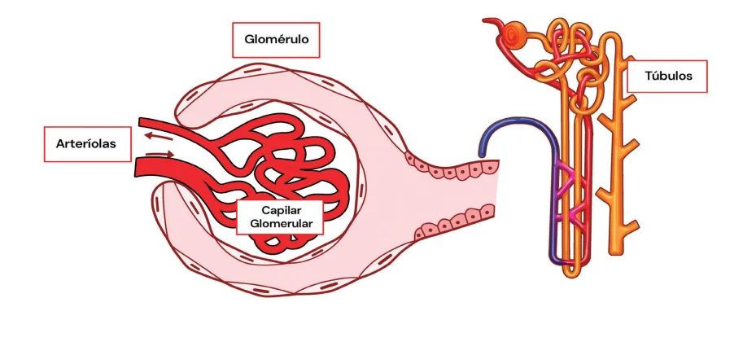
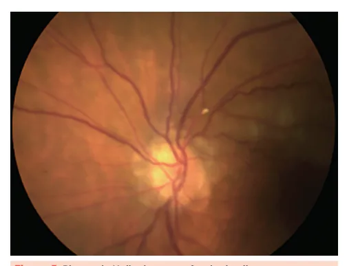
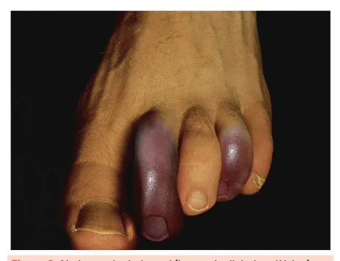
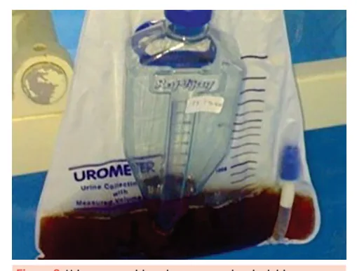
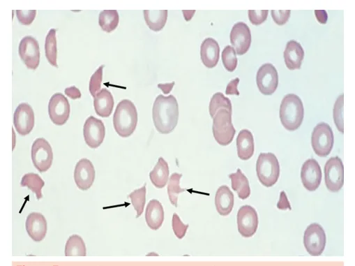

# Injúria Renal Aguda (IRA) Parte (2)

<!-- page:1 -->

Injúria Renal Aguda (CM)

## IRA INTRÍNSECA

- Infecção por E. coli enteropatogênica estruturas renais:

IRA intrínseca acontece quando há dano direto às sorotipo O157:H7;

- Anemia hemolítica, plaquetopenia, esquizócitos;

- Necrose tubular aguda (lesão aos túbulos renais);

- Causas alternativas: PTT, hipertensão maligna, crise

- Glomerulopatias (lesão ao glomérulo); renal esclerodérmica, SHU atípica.

- Nefrite intersticial (lesão ao interstício); Ateroembolismo

- Vasculites, tromboses, embolias (lesão aos vasos).

- Embolia de cristais de colesterol;

Nefrotoxicidade por drogas

- Após procedimento endovascular (ex.: cateterismo);

Gentamicina/amicacina;

- Livedo reticular e dedo azul;

Renina/angiotensina/aldosterona: iECA/BRA;

- Placas de Hollenhorst no fundo de olho, eosinofilia,

Aciclovir; fendas biconvexas à biópsia. Vancomicina; Rabdomiólise AINEs;

- IRA induzida por pigmento (mioglobina);

Tenofovir;

- Lise de musculatura estriada (trauma, exercícios,

Anfotericina B. hipocalemia, álcool); Nefrite intersticial aguda (NIA)

- Aumento de CPK, mioglobinúria (urina escurecida);

- IRA após introdução de nova droga (AINE,

- Dipstick positivo para sangue, mas sem hemácias antibiótico, omeprazol); no sedimento.

- Rash, febre, eosinofilia, eosinofilúria;

- Tratamento: suspensão da droga ± corticoide.

Síndrome hemolítico urêmica (SHU)

- Lesão endotelial por toxina Shiga-like;

Figura 1: Os componentes do néfron (glomérulo, cápsula de Bowman e túbulos renais).

IMPORTANTE lembrar do interstício, tecido que envolve os néfrons e vasos sanguíneos, atuando no CONSIDERAÇÕES GERAIS suporte estrutural, equilíbrio hidroeletrolítico e

- O néfron é a unidade funcional do rim, composto por: mediação de respostas inflamatórias. Glomérulo: estrutura capilar responsável pela filtração do plasma sanguíneo;

- Por sua vez, a IRA intrínseca acontece quando há dano Cápsula de Bowman: recebe o direto a essas estruturas renais: Túbulos renais: responsáveis por reabsorção e túbulos renais);

ultrafiltrado glomerular; | Necrose tubular aguda (NTA) (lesão aos secreção tubular, refinando o filtrado e formando a | Glomerulopatias (lesão ao glomérulo);

urina final. | Nefrite intersticial (lesão ao interstício); | Vasculites, tromboses, embolias (lesão aos vasos).

---

<!-- page:2 -->

NEFROTOXICIDADE POR DROGAS A tríade clássica da NIA está presente em apenas

- É a principal causa de injúria renal aguda 10 a 15% dos casos! intrínseca, após a necrose tubular aguda isquêmica

(por hipoperfusão); Diagnóstico e tratamento

- O diagnóstico definitivo é feito por biópsia renal;

- Algumas drogas causam diretamente necrose tubular aguda, outras podem lesar o interstício ou promover vasoconstrição intrarrenal.

- Em um paciente com IRA, após descartar causas pós-renais (obstrução) e pré-renais nefrotoxicidade medicamentosa;

(hipoperfusão), deve-se sempre investigar

- Para isso, deve-se utilizar o mnemônico “GRAVATA”.

- Verificar Tabela 1

- A formulação lipossomal da anfotericina B é menos nefrotóxica!

## NEFRITE INTERSTICIAL AGUDA (NIA)

- A nefrite intersticial aguda (NIA) é causada por A inflamação imunomediada no interstício renal;

- Geralmente associada à exposição prévia a medicamentos;

- As drogas mais frequentemente associadas a sua ocorrência incluem: AINEs; Penicilinas e outros beta-lactâmicos; Inibidores da bomba de prótons;

Manifestações clínicas e laboratoriais

- Tríade clássica inclui: Febre; Rash cutâneo; Eosinofilia.

- Verificar Figura 2 na próxima página

- Também pode haver eosinofilúria na urina I: Achado laboratorial sugestivo, mas pouco sensível; Requer coloração de Hansel para identificação.

Tabela 1: Drogas associadas à nefrotoxicidade (“GRAVATA”). Fármaco NTA G Gentamicina/amicacina mitoco Renina/angiotensina/aldosterona (iECA/ Reduz p BRA)

A Aciclovir Cristaliz V Vancomicina Reduz p

## A AINEs

Toxicid T Tenofovir NTA A Anfotericina B - O diagnóstico definitivo é feito por biópsia renal;

- No entanto, a biópsia nem sempre é necessária, especialmente se: Início bem documentado de disfunção renal após a introdução de droga sabidamente causadora de NIA; Melhora clínica/laboratorial rápida após a suspensão do agente causador.

- O tratamento inclui: Suspensão imediata da droga causadora; Considerar o uso de corticoides nos casos com disfunção renal persistente ou grave, especialmente quando há falha na recuperação após a retirada da droga causadora.

## ATEROEMBOLISMO

- Causa de IRA intrínseca secundária a êmbolos de colesterol oriundos de placas ateroscleróticas instáveis;

- Tipicamente ocorre após procedimentos arteriais invasivos (ex: cateterismo cardíaco, angioplastia, cirurgia vascular);

- A conduta é de suporte (não há tratamento específico para remover os êmbolos);

- Estatinas podem ajudar a estabilizar as placas ateroscleróticas.

Mecanismo A por acúmulo nos túbulos proximais, com disfunção ondrial, estresse oxidativo e apoptose celular. Cursa com hipocalemia.

pressão de filtração no glomérulo, por vasodilatação da arteríola eferente. zação intratubular, obstrução tubular e inflamação local.

NTA por estresse oxidativo e lesão mitocondrial; Nefrite intersticial aguda. pressão de filtração no glomérulo, por vasoconstrição da arteríola aferente;

Nefrite intersticial aguda; Lesão glomerular mínima (rara). dade túbulo-intersticial, com disfunção mitocondrial e síndrome de Fanconi.

A e vasoconstrição da arteríola aferente. Cursa com hipocalemia.

---

<!-- page:3 -->

Figura 2: Rash cutâneo em paciente com NIA. Manifestações clínicas e laboratoriais

- Síndrome do dedo azul: isquemia digital periférica, com mudança da coloração do dedo e dor intensa;

- Livedo reticular;

- Mais raramente febre, mialgia e perda de peso.

Figura 3: Síndrome do dedo azul (isquemia digital periférica). Figura 4: Livedo reticular.

- Disfunção renal aguda;

- Eosinofilia;

- Placas de Hollenhorst ao exame de fundo de olho;

- A biópsia renal mostra fendas biconvexas, correspondendo a embolia por colesterol. Figura 5: Placas de Hollenhorst em fundo de olho.

Figura 6: Fendas biconvexas em arteríola renal secundárias a ateroembolia.

## SÍNDROME HEMOLÍTICO-URÊMICA (SHU)

- É o protótipo de uma microangiopatia trombótica;

- Decorre de lesão do endotélio vascular, secundária à ação da toxina Shiga-like, geralmente associada a infecções gastrointestinais causadas pela Escherichia coli sorotipo O157:H7;

- Esse dano vascular leva a agregação de plaquetas, formando microtrombos na microcirculação renal;

- Ao atravessar os microtrombos, as hemácias se rompem, cursando com hemólise intravascular e formação de esquizócitos.

Manifestações clínicas e laboratoriais

- Tríade clássica da SHU: Plaquetopenia; Anemia hemolítica microangiopática; Injúria renal aguda (IRA intrínseca).

- Provas de hemólise positivas: Haptoglobina reduzida; LDH aumentada; Bilirrubina indireta aumentada; Reticulocitose periférica.

- Esquizócitos em sangue periférico.

- Verificar Figura 7 na próxima página

---

<!-- page:4 -->

Figura 7: Esquizócitos em sangue periférico. Observe diversos fragmentos irregulares de hemácias, “cortados”.

A SHU atípica também é uma microangiopatia trombótica. No entanto, é secundária à disfunção da via alternativa do complemento. Quando ativado de forma descontrolada, o sistema complemento lesa o endotélio vascular, favorecendo a formação de microtrombos.

## IRA POR PIGMENTOS R

- Induzida por pigmentos livres tóxicos ao túbulo renal, principalmente: Mioglobina: liberada na rabdomiólise (mais comum); M Hemoglobina: liberada na hemólise intravascular Y maciça, como em reações transfusionais por h incompatibilidade ABO e em próteses mecânicas m cardíacas disfuncionais. o túbulos renais e causam obstrução tubular e lesão p oxidativa direta! b j

A mioglobina e a hemoglobina precipitam-se nos P Rabdomiólise

- Lesão muscular com liberação de A mioglobina, secundária a: s j Exercício físico intenso; Trauma; Síndrome compartimental; M Drogas (ex.: álcool); 5 Convulsões prolongadas; p Hipocalemia grave.

- Cursa com: Elevação de CPK (geralmente >5000 U/L); M Urina escurecida (pela mioglobinúria); d Pode haver hipercalemia, hiperfosfatemia, hipocalcemia e acidose metabólica. A

- O tratamento envolve hidratação vigorosa. e h e sangue na urina. No entanto, essa positividade é dada pela presença de mioglobina. Isso ocorre porque a fita detecta a atividade peroxidase comum à hemoglobina e à mioglobina. A confirmação de que se trata de mioglobina — e não hemácias — é feita pela ausência de hemácias na análise microscópica do sedimento urinário.

D Figura 8: Urina escurecida pela presença de mioglobina (mioglobinúria). A fita (dipstick) é reagente para a presença de

## REFERÊNCIAS

Figura 2: Rash cutâneo em paciente com NIA. MRABET, S.; ROMDHANE, W.; FRADI, A.; BOUKADIDA, R.; AZZABI, A.; GUEDRI, Y.; SAHTOUT, W.; BEN AICHA, N.; ABDESSAYED, N.; MOKNI, M.; ZELLAMA, D.; ACHOUR, A. Severe acute interstitial nephritis, dermatitis, and hemolytic anemia due to polyparasitic infection in an immunocompetent male patient. American Journal of Men’s Health, [S.l.], v. 16, p. 1–6,

2022. DOI: 10.1177/15579883221139914. Disponível em: https://doi.

org/10.1177/15579883221139914. Acesso em: 8 jun. 2025. Figura 3: Síndrome do dedo azul (isquemia digital periférica).

PRADHAN, P.; BHANDARI, R.; SHRESTHA, S.; et al. Thrombosis in COVID-19 patients: a meta-analysis. Thrombosis Journal, [S.l.], v. 18, n. 13, 2020. DOI:

10.1186/s12959-020-00239-9. Disponível em: https://thrombosisjournal. biomedcentral.com/articles/10.1186/s12959-020-00239-9. Acesso em: 8 jun. 2025.

Figura 4: Livedo reticular. ABC MED. Livedo reticular. Disponível em: https://www.abc.med.br/p/ sinais.-sintomas-e-doencas/1358113/livedo-reticular.htm. Acesso em: 9 jun. 2025.

Figura 5: Placas de Hollenhorst em fundo de olho. MAIER, Steven; STEIGLEMAN, Allan. Hollenhorst plaque. Consultant360, v.

53, n. 9, p. [ilustração de placa refratária na artéria retiniana], set. 2013. Disponível em: https://www.consultant360.com/articles/hollenhorstplaque. Acesso em: 9 jun. 2025.

Figura 6: Fendas biconvexas em arteríola renal secundárias a ateroembolia. McGREGOR, J. G.; DEREBAIL, V. K.; KSHIRSAGAR, A. V.; FALK, R. J. Vascular diseases of the kidney. ACP Medicine, p. 1–16, 2007.

Figura 7: Esquizócitos em sangue periférico. ASOCIAÇÃO COSTARRICENSE DE HEMATOLOGIA – ACH. Cuadros con esquizocitos. Facebook, publicado em data não informada. Disponível em:

https://www.facebook.com/hematologiacr.asociacion/posts/cuadros-conesquizocitos/1209066775919419/. Acesso em: 9 jun. 2025.

Figura 8: Urina escurecida pela presença de mioglobina (mioglobinúria). GANESHRAM, Prasanthi; GOUNDAN, Poorani Nallam; JEYACHANDRAN, Vijay;

ARTHUR, Preetham. Five factors contributing to severe rhabdomyolysis in a 21 yr old IV drug abuser: a case report. Cases Journal, v. 2, art. 6479, 2009.

DOI: 10.4076/1757-1626-2-6479. Acesso em: 8 jun. 2025.

