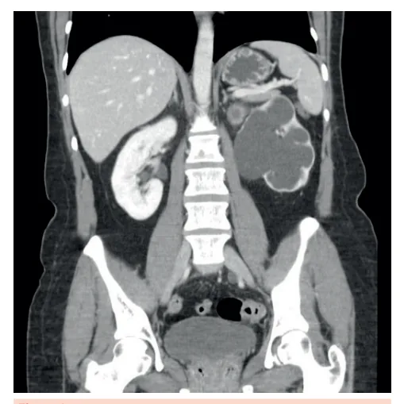
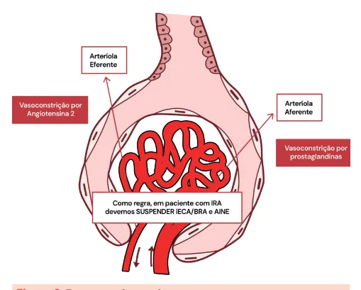

# Injúria Renal Aguda (IRA) Parte 1

<!-- page:1 -->

## Injúria Renal Aguda (IRA): Parte 1

### Definição de IRA

- Aumento de creatinina em 0,3 mg/dL em 48h;
- Débito urinário < 0,5 mL/kg/h por ≥ 6h.

### Tabela 1: Classificação KDIGO

> ⚠️ Tabela reconstruída a partir de OCR — confira contra a fonte original.

| Classificação | Creatinina sérica | Débito urinário |
|---|---|---|
| **KDIGO I** | Aumento de 0,3 mg/dL em 48 horas ou 1,5x em 7 dias | < 0,5 mL/kg/h em 6 horas |
| **KDIGO II** | Aumento de 2x em 12 horas | < 0,5 mL/kg/h em 12 horas |
| **KDIGO III** | Aumento de 3x ou creatinina > 4, ou em 24 horas, ou necessidade de diálise | < 0,3 mL/kg/h |

### IRA Pós-Renal

- Causa obstrutiva:
  - Litíase;
  - Hiperplasia prostática;
  - Coágulo;
  - Bexiga neurogênica;
  - Malformação.

## Considerações Gerais

A injúria renal aguda (IRA) pode ser definida por aumento na creatinina ou por redução da diurese:

- Aumento da creatinina: aumento absoluto de 0,3 mg/dL nas últimas 48 horas, ou aumento de 1,5x o valor basal;
- Redução da diurese: débito urinário < 0,5 mL/kg/min por ≥ 6 horas.

A depender do grau de aumento da creatinina ou de redução do débito urinário, o KDIGO (Kidney Disease: Improving Global Outcomes) classifica a injúria renal aguda em 3 estágios.

### Tabela 1: KDIGO (Kidney Disease: Improving Global Outcomes)

> ⚠️ Tabela reconstruída a partir de OCR — confira contra a fonte original.

| | KDIGO 1 | KDIGO 2 | KDIGO 3 |
|---|---|---|---|
| **Creatinina** | Aumento de 0,3 mg/dL em 48 horas OU aumento de 1,5x o valor basal em 7 dias | Aumento de 2x o valor basal | Aumento de 3x o valor basal OU creatinina sérica > 4 mg/dL OU necessidade de diálise |
| **Débito urinário** | < 0,5 mL/kg/h em 6 horas | < 0,5 mL/kg/h em 12 horas | < 0,3 mL/kg/h em 24 horas |

- Pode haver hidronefrose à imagem;
- Tratamento é a desobstrução:
  - Sonda vesical;
  - Duplo J;
  - Nefrostomia.

## IRA Pré-Renal e Necrose Tubular Aguda (NTA)

### Tabela: IRA Pré-Renal x NTA

| | IRA Pré-renal | NTA |
|---|---|---|
| Mecanismo | Hipoperfusão renal inicial | Lesão tubular após hipoperfusão mantida |
| Cilindros | Cilindros hialinos | Cilindros granulosos |
| Osmolalidade urinária | > 500 mOsm/kg | ~300 mOsm/kg |
| Na+ urinário | < 20 mEq/L | > 40 mEq/L |
| FeNa | < 1% | > 2% |

### Fração de Excreção de Sódio (FeNa)

**FeNa = [Sódio (Urina) × Creatinina (sérica)] / [Sódio (Sérica) × Creatinina (Urina)] × 100**

- FeNa < 1%: túbulo reabsorve sódio, IRA pré-renal;
- FeNa > 2%: túbulo não reabsorve sódio, NTA.

Além disso, a IRA pode ser classificada de acordo com sua etiologia em:

- Pós-renal;
- Pré-renal;
- Intrínseca.

- A injúria renal aguda pós-renal é causada por obstrução do fluxo urinário em qualquer ponto do trato urinário, desde os cálices renais até a uretra;
- A obstrução precisa ser bilateral (em rins funcionantes) ou ocorrer em rim único para provocar IRA;
- Um achado estrutural frequente em exames de imagem de pacientes com IRA pós-renal é a hidronefrose (dilatação da pelve renal e dos cálices renais);
- No entanto, a hidronefrose não é condição indispensável para o diagnóstico de IRA pós-renal!
- Pacientes com quadros de IRA pós-renal inicial ou pacientes com IRA pós-renal e fibrose do retroperitônio não apresentam hidronefrose em exames de imagem.

---

<!-- page:2 -->

- Não há lesão estrutural inicial, portanto é uma condição reversível se corrigida precocemente;
- Na fase inicial, os túbulos estão funcionantes e respondem tentando reter sódio e água (urina concentrada e com pouco sódio).

Figura 1: Tomografia de abdome e pelve mostrando hidronefrose à esquerda. Observe a dilatação da pelve e dos cálices renais.

## Etiologias

- Litíase urinária (cálculo ureteral bilateral ou em rim único);
- Hiperplasia prostática benigna (principal causa em homens idosos);
- Coágulos uretrais ou ureterais;
- Bexiga neurogênica;
- Malformações congênitas (ex.: válvula de uretra posterior, estenoses).

A obstrução urinária é uma causa potencialmente reversível de IRA se tratada precocemente!

## Abordagem Inicial

- Não confie apenas no débito urinário para o diagnóstico, uma vez que pacientes com obstrução podem fazer diurese por transbordamento;
- Verifique se há bexigoma e, na dúvida, em caso de IRA sem etiologia definida, solicite um exame de imagem (USG é o mais disponível). A conduta terapêutica inicial é a desobstrução!
- Se obstrução em nível vesical (bexiga neurogênica) ou uretra: sondagem vesical (de alívio ou de demora);
- Se obstrução a nível ureteral: cateter duplo J (inserido via cistoscopia); nefrostomia (principalmente se o duplo J não for viável ou em urgências com infecção e dilatação importante).

## IRA Pré-Renal

- Causada por redução da perfusão renal, com consequente diminuição da filtração glomerular (urina concentrada e com pouco sódio);
- Nos casos em que a hipoperfusão demora para ser corrigida, ocorre evolução para a necrose tubular aguda (NTA).

Na IRA pré-renal, a ureia sérica eleva-se de forma desproporcional ao aumento de creatinina sérica e a relação ureia/creatinina costuma ser > 40!

### Hipovolemia Absoluta

- Hemorragias;
- Desidratação;
- Diarreia, vômitos;
- Hipotensão arterial.

### Hipovolemia Relativa ou Redistribuição

- Insuficiência cardíaca (queda no débito cardíaco);
- Síndrome hepatorrenal (vasodilatação esplâncnica, com vasoconstrição renal reflexa);
- Alterações da autorregulação glomerular:
  - Uso de AINEs (diminuem prostaglandinas, induzindo vasoconstrição da arteríola aferente);
  - Uso de iECA/BRA (vasodilatação da arteríola eferente, reduz a pressão de filtração glomerular).

Como regra, na injúria renal aguda, devemos suspender AINEs, iECA/BRA!

Figura 2: Estrutura glomerular.

## IRA Intrínseca

### Necrose Tubular Aguda (NTA)

- Se o estado de hipoperfusão for mantido por muito tempo, se inicia o processo de morte das células tubulares;
- Agora há lesão estrutural renal, portanto enquadra-se como IRA intrínseca;
- Mesmo que a perfusão melhore, a função renal não se recupera imediatamente.

---

<!-- page:3 -->

Quando há evolução para a necrose tubular aguda, o rim perde a capacidade de reabsorção do sódio, apresentando sódio urinário alto.

### Fração de Excreção de Sódio

A fração de excreção de sódio (FeNa) é determinada pela fórmula a seguir. O cálculo da fração de excreção de sódio pode auxiliar na diferenciação de IRA pré-renal e necrose tubular aguda.

### Tabela 2: Comparação entre IRA Pré-Renal e Necrose Tubular Aguda (NTA)

> ⚠️ Tabela reconstruída a partir de OCR — confira contra a fonte original.

| | Pré-renal | NTA |
|---|---|---|
| Cilindros | Cilindros hialinos (proteína de Tamm-Horsfall) | Cilindro granuloso (muddy brown) |
| Densidade urinária (urina tipo I) | Alta (> 1020) | Normal/baixa (~1010) |
| Osmolalidade urinária | > 500 mOsm/kg (concentrada) | ~300 mOsm/kg |
| Fração de excreção de Na+ | < 1% | > 2% |
| Sódio urinário | < 20 mEq/L | > 40 mEq/L |

**FeNa = [Sódio (Urina) × Creatinina (sérica)] / [Sódio (Sérica) × Creatinina (Urina)] × 100**

Figura 3: Fórmula da fração de excreção de sódio.

**Interpretação**:

- FeNa < 1%: o túbulo renal reabsorve sódio, indicando IRA pré-renal;
- FeNa > 2%: o túbulo renal não reabsorve sódio, indicando evolução para necrose tubular aguda.

O uso de diuréticos pode falsear a fração de excreção de sódio!

## Referências

Tabela 1: KDIGO (Kidney Disease: Improving Global Outcomes). Adaptado de KIDNEY DISEASE: Improving Global Outcomes (KDIGO). KDIGO clinical practice guideline for acute kidney injury. 2012. Disponível em: https://kdigo.org/wp-content/uploads/2016/10/KDIGO-2012-AKIGuideline-English.pdf. Acesso em: 8 jun. 2025.

Figura 1: Tomografia de abdome e pelve mostrando hidronefrose à esquerda. PACS. Ureterohydronephrosis. Disponível em: https://pacs.de/term/ureterohydronephrosis. Acesso em: 8 jun. 2025.

Figura 2: Estrutura glomerular. Acervo Medcof.

Figura 3: Fórmula da fração de excreção de sódio. Acervo Medcof.

Tabela 2: Cilindros hialinos e cilindros granulosos. UNIVERSIDADE FEDERAL DE SÃO JOÃO DEL-REI. Atlas de urinálise. Coordenação: Caroline Pereira Domingueti. Ligantes: Ariane Silva Máximo; Raquel Salviano da Silva. Divinópolis: UFSJ, Campus Centro-Oeste Dona Lindu — Curso de Farmácia, Liga Acadêmica de Análises Clínicas e Toxicológicas, 2020.
